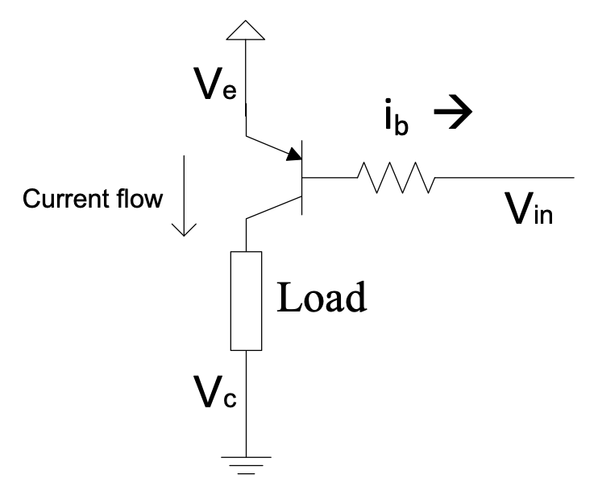

# Chapter 1: Transistors

Transistors serve as the fundamental building blocks of modern analogue electronics. In mechatronic systems, they function primarily as amplifiers—boosting weak sensor signals to usable levels—or as electronic switches, controlling power to actuators, motors, and other loads. Understanding how to design with transistors is essential for any engineer working at the interface between electronics and mechanical systems.

## Bipolar Junction Transistors

The Bipolar Junction Transistor (BJT) remains one of the most widely used transistor types in analogue applications. It operates as a current-controlled device: a small current flowing into the base terminal ($i_b$) regulates a much larger current flowing from the collector to the emitter ($i_c$). The relationship between these currents is governed by the transistor's current gain, denoted as $\beta$ or $H_{fe}$:

{: .note }
$i_c = \beta \times i_b$, valid when the transistor operates in its _linear (active) region_.

When operated in _saturation mode_, effectively using the transistor as a switch rather than an amplifier, the collector current becomes limited by external circuit elements such as supply voltage and load resistance, rather than by the transistor's intrinsic gain. This mode of operation will be explored in detail throughout the following sections.

BJTs are manufactured in an enormous variety of physical packages, each suited to different power dissipation requirements. As a general principle, larger packages can dissipate more heat without damage. When additional heat sinking is provided, even higher power levels can be managed safely. Figure 1.1 illustrates several common package types found in engineering practice.

_Figure 1.1: Different types of BJT packages showing various sizes and mounting styles_

The SOT-23 package shown is typical of surface-mount devices, with its small footprint and flat-mounted leads suitable for automated assembly. The choice between through-hole packages (such as the TO-92) and surface-mount alternatives depends on manufacturing requirements, thermal considerations, and accessibility for prototyping.

BJTs are categorised into two complementary types: NPN and PNP. In the NPN transistor, conventional current flows into the collector and base, and out through the emitter. The direction of current flow is indicated by the arrow on the emitter in circuit symbols, pointing from base to emitter for NPN devices. For PNP transistors, this arrow reverses, pointing from emitter to base, indicating that current flows out of the collector and base, and into the emitter. Throughout this chapter, we begin with NPN transistors before examining their PNP counterparts.

## NPN Transistor: The Saturated Switch Circuit

In switching applications, the transistor operates in saturation mode—fully conducting when the input voltage $V_{in}$ is HIGH, and completely off when $V_{in}$ is LOW. The circuit design must ensure that sufficient base current is provided to drive the transistor into saturation, rather than leaving it in the linear region where it would dissipate excessive power.

When saturated, the voltage across the transistor from collector to emitter drops to a small value, and the collector current is determined primarily by the supply voltage and load resistance, not by $\beta \times i_b$.

_Figure 1.2: Saturated switch circuit with an NPN transistor_

For silicon BJTs, the base-emitter junction exhibits a forward voltage drop of approximately:

{: .note }
$V_b - V_e \approx 0.7\ \text{V}$, provided $V_{in} > V_e + 0.7\ \text{V}$.

This 0.7 V value is characteristic of silicon PN junctions, though it varies slightly with temperature, base current, and the specific transistor type. For most engineering calculations, treating it as a constant introduces negligible error. Applying Kirchhoff's Current Law at the emitter node gives:

{: .note }
$i_e = i_c + i_b$, since it obeys Kirchhoff's Current Law.

The fundamental amplification property of the BJT is evident here: a small base current controls a much larger collector current. The ratio $i_c / i_b$ defines the current gain $\beta$. For a common general-purpose transistor such as the 2N3904, the datasheet typically specifies $\beta \approx 100$ for linear operation. However, in saturation mode, the effective gain is always lower than the specified value because the transistor is deliberately driven beyond the conditions where the simple $i_c = \beta i_b$ relationship holds.

To understand why saturation mode is desirable for switching, consider the following illustration:

#### **Example 1.1**

Suppose we have a $12\ \Omega$ load connected to a 12 V supply:

_Figure 1.3a: Current flowing through a resistor_

By Ohm's Law:

$$i = \frac{V}{R} = \frac{12\ \text{V}}{12\ \Omega} = 1\ \text{A}$$

Now consider the same load placed in a transistor switch circuit, with the supply voltage remaining at 12 V:

_Figure 1.3b: Current flowing through a transistor switch circuit_

The base resistor must be chosen to supply enough base current to allow at least 1 A through the collector. If the base current is insufficient—specifically, if $\beta \times i_b < 1\ \text{A}$—the transistor remains in the linear region. For instance, if the effective collector current is limited to 0.8 A, then by Ohm's Law, the voltage across the load is $0.8 \times 12 = 9.6\ \text{V}$, leaving $V_{ce} = 12 - 9.6 = 2.4\ \text{V}$ across the transistor. The effective gain in this case would be $\beta_{\text{eff}} = 0.8 / i_b$.

{: .note }
Depending on transistor specifications, the minimum achievable collector-emitter voltage in saturation ($V_{CE(\text{sat})}$) typically ranges from 0.2 V to 0.5 V. If the transistor is not saturated, $V_{ce}$ will be significantly higher, indicating linear-mode operation with consequent power dissipation.

When a transistor operates in saturation:

1. $V_{ce}$ settles between approximately 0.2 V and 0.5 V; and
2. The effective $\beta$ falls below the manufacturer's specified value for linear operation.

#### **Example 1.2**

Consider the circuit above using a TIP31C power transistor to handle the 1 A load current. The TIP31C datasheet specifies a minimum $\beta$ of 25 and a maximum $V_{CE(\text{sat})}$ of 0.2 V.

The input $V_{in}$ comes from a microcontroller guaranteed to provide at least 2.4 V when HIGH (and no more than 0.5 V when LOW). We wish to switch the load fully on when the microcontroller output is HIGH. Determine the required base resistor value and calculate the effective gain.

**Solution:**

To ensure saturation, the base current must satisfy:

$$i_b > \frac{i_c}{\beta} \therefore i_b > \frac{1.0}{25} = 0.04\ \text{A}$$

Applying Kirchhoff's Voltage Law to the base circuit and Ohm's Law:

$$i_b = \frac{V_{in} - 0.7}{R_b} = \frac{2.4 - 0.7}{R_b} > 0.04$$

$$\therefore R_b < \frac{1.7}{0.04} = 42.5\ \Omega$$

The closest standard E12 series resistor value below 42.5 $\Omega$ is 39 $\Omega$, so we select $R_b = 39\ \Omega$.

With this resistor, the actual base current is:

$$i_b = \frac{2.4 - 0.7}{39} = 0.0436\ \text{A}$$

The collector current is limited by the load:

$$i_c = \frac{12 - 0.2}{12} = 0.983\ \text{A}$$

Therefore, the effective gain is:

$$\beta_{\text{eff}} = \frac{i_c}{i_b} = \frac{0.983}{0.0436} \approx 22.6$$

Note that the effective $\beta$ in saturation (22.6) is lower than even the minimum specified linear gain (25). This is expected and correct: saturation occurs precisely when the external circuit limits the collector current to less than $\beta \times i_b$.

What happens if we replace the $12\ \Omega$ load with a higher resistance, say $22\ \Omega$, without changing $R_b$? The collector current demand decreases, while the available base current remains fixed. The transistor remains saturated, but now with an even lower effective $\beta$ because $V_{ce}$ cannot drop below $V_{CE(\text{sat})}$. This demonstrates an important principle: the specified minimum $\beta$ applies to linear operation, whereas saturation mode can yield effective gains below this value.

{: .note }
A practical test for saturation: if the measured effective $\beta$ is less than the manufacturer's minimum specified $\beta$, the transistor is saturated. Alternatively, if $V_{ce}$ is at or near $V_{CE(\text{sat})}$, saturation is confirmed.

> #### **Question 1.1:**
>
> Assuming $V_{CE(\text{sat})} = 0.2\ \text{V}$ and specified $\beta = 25$, calculate the effective $\beta$ when $R_{\text{load}} = 22\ \Omega$ and $R_b = 33\ \Omega$, with a 12 V supply.

> #### **Question 1.2:**
>
> Assuming $V_{CE(\text{sat})} = 0.2\ \text{V}$ and specified $\beta = 25$, calculate the effective $\beta$ and $V_{ce}$ when $R_{\text{load}} = 5\ \Omega$ and $R_b = 33\ \Omega$, with a 12 V supply.

These two questions address fundamentally different operating regimes: Question 1.1 explores deep saturation with a light load, while Question 1.2 examines the boundary where insufficient base current may leave the transistor in linear mode.

A practical limitation emerges from the preceding example: the required base current of approximately 40 mA exceeds what most microcontroller GPIO pins can safely source. Standard microcontroller outputs typically provide only a few milliamperes. This constraint motivates the Darlington configuration, which offers dramatically increased current gain.

The Darlington transistor pairs two BJTs such that the emitter current of the first transistor feeds the base of the second:

_Figure 1.4: Darlington transistor_

When current enters the base of T1, it produces an amplified current at T1's emitter. This current becomes the base current for T2, which provides further amplification. The overall current gain approximates the product of the individual gains: $\beta_{\text{total}} \approx \beta_1 \times \beta_2$. T1 can be a small-signal transistor, while T2 handles the power requirements. The Darlington configuration exhibits one notable characteristic: two base-emitter junctions in series result in approximately 1.4 V drop (rather than 0.7 V) from base to emitter.

{: .note }
$\therefore V_b - V_e \approx 1.4\ \text{V}$, provided $V_{in} > V_e + 1.4\ \text{V}$.

> #### **Question 1.3:**
>
> Prove that $\beta = \beta_1(\beta_2 + 1) + \beta_2 \cong \beta_1\beta_2$ for a Darlington pair operating in linear mode.

Some integrated Darlington devices incorporate base-emitter resistors to improve switching speed by providing a discharge path for stored charge.

> #### **Question 1.4:**
>
> Redesign the previous example with the $12\ \Omega$ load using a TIP122 Darlington transistor with $\beta > 1000$. The supply is 12 V and $V_{in} = 2.4\ \text{V}$. Determine $R_b$ (select from the E12 series) and calculate the effective $\beta$.

_Figure 1.5: BJT transistor replaced by a Darlington transistor_

{: .note }
$\beta$ is inherently a variable parameter. It varies between devices of the same type, changes with temperature, and depends on operating conditions. Therefore, robust designs always employ the worst-case (minimum) $\beta$ value. This variability also explains why saturated switching is generally preferred over linear operation for digital control applications—the load is either fully on or fully off, minimizing sensitivity to gain variations.

## NPN Transistor: Linear Mode Current Amplification — The Emitter Follower

Many mechatronic applications require continuous, linear variation of voltage or current rather than simple on-off control. The emitter follower configuration (also called a common-collector amplifier) provides this capability. Unlike the saturated switch where the load connects to the collector, the emitter follower places the load between the emitter and ground.

The key characteristic of the emitter follower is that the output voltage at the emitter tracks the input voltage at the base, minus the base-emitter drop, while providing substantial current gain. This makes it ideal for controlling high-power loads from low-power signals.

_Figure 1.6: Emitter follower circuit_

As before, the base-emitter relationship holds:

$$V_e \approx V_b - 0.7\ \text{V}$$

The emitter current relates to base and collector currents through:

{: .note }
$i_e = i_c + i_b$ and $i_c = \beta i_b$

$$\therefore i_e = (\beta + 1)i_b = \frac{\beta + 1}{\beta}i_c$$

The emitter follower enables linear control of load voltage by varying the base voltage. Only a small base current is required to control a significantly larger emitter current. Applying Kirchhoff's Voltage Law reveals that $V_{ce}$ must vary as the load voltage changes, since $V_{\text{supply}} = V_{ce} + V_{\text{load}}$ remains constant.

The power dissipated in the transistor is the product of the voltage across it and the current through it. Since the load current equals the emitter current:

$$P_T = V_{ce} \times i_e$$

A more precise expression accounting for both junctions is:

{: .note }
$$P_T = (V_{be} \times i_b) + (V_{ce} \times i_c)$$

This can be derived by considering power conservation: the total power supplied to the transistor (from the base signal and the collector supply) minus the power delivered to the load:

$$P_T = (V_b \times i_b) + (V_c \times i_c) - (i_b + i_c) \times V_e$$

$$= (V_b - V_e) \times i_b + (V_c - V_e) \times i_c$$

$$= (V_{be} \times i_b) + (V_{ce} \times i_c)$$

#### **Example 1.3**

An emitter follower circuit uses a 10 $\Omega$ load, a TIP31 transistor (minimum $\beta = 25$), a 12 V supply, and a 5 V control signal applied to the base.

1. What voltage appears across the load?
2. What current flows through the load?
3. What current must the control signal provide?
4. How much power does the transistor dissipate?

**Solution:**

1. $V_{\text{load}} = V_b - 0.7\ \text{V} = 5 - 0.7 = 4.3\ \text{V}$

2. $i_{\text{load}} = \frac{V}{R} = \frac{4.3}{10} = 430\ \text{mA}$

3. Using the minimum $\beta = 25$: $i_b = \frac{i_e}{\beta + 1} = \frac{0.43}{26} \approx 16.5\ \text{mA}$

4. $P_T = V_{ce} \times i_e = (12 - 4.3) \times 0.43 = 7.7 \times 0.43 \approx 3.31\ \text{W}$

   Or using the more accurate formula:
   $P_T = (0.7 \times 0.0165) + (7.7 \times 0.4135) \approx 0.012 + 3.18 = 3.19\ \text{W}$

As a practical guideline, TIP31 transistors in TO-220 packages should not dissipate more than approximately 1 W continuously without a heat sink. The calculated 3.3 W would require proper thermal management to prevent device failure.

## PNP Transistors

PNP transistors complement NPN devices by allowing current flow in the opposite direction. While NPN transistors switch current sinking to ground, PNP transistors switch current sourcing from the positive supply.

_Figure 1.7: PNP transistor symbol_

In PNP circuits, the emitter connects to the highest voltage in the circuit. Current flows in the direction of the emitter arrow—out of the emitter, and out of both the collector and base terminals. This complementary behaviour enables PNP transistors to switch loads connected to ground, with the control signal also referenced to ground.

_Figure 1.8: Saturated switch circuit with a PNP transistor_

For PNP transistors, the base must be approximately 0.7 V below the emitter for conduction:

**Requirement:** $V_{in} < V_e - 0.7\ \text{V}$ for current to flow in the load.

This configuration enables digital control of loads that must be connected to the positive supply rail, with both the load and control signal sharing a common ground reference.

A base-emitter resistor can be added to modify the turn-on threshold or ensure reliable turn-off when the control signal is in a high-impedance state.

PNP transistors can also be configured as emitter followers and in Darlington pairs (such as the TIP127). In the PNP emitter follower, the load connects between the emitter and the positive supply:

_Figure 1.9a: PNP emitter follower circuit_

_Figure 1.9b: PNP Darlington transistor_

> #### **Question 1.5:**
>
> Explain why a base resistor is required when driving a ground-connected load with a PNP switch, but may be omitted in certain supply-connected load configurations.

## Bi-Directional Operation, Including H-Bridges

The single-transistor emitter follower, whether NPN or PNP, can only actively drive current in one direction. For loads such as DC motors that require reversible operation, we need circuits capable of sourcing or sinking current as required.

Combining complementary NPN and PNP emitter followers creates a half-bridge configuration capable of linear bi-directional operation:

_Figure 1.10: The Half-bridge: bi-directional operation with NPN and PNP emitter followers_

This circuit exhibits a deadband when the input voltage lies between $-0.7\ \text{V}$ and $+0.7\ \text{V}$, as neither transistor has sufficient base-emitter voltage to conduct. Note that dual power supplies are required for this configuration.

For single-supply operation, two half-bridges can be combined to form an H-bridge:

_Figure 1.11: The Full-bridge: bi-directional operation with NPN and PNP emitter followers_

Drive Signal 1 and Drive Signal 2 are typically operated in anti-phase—when one is high, the other is low, and vice versa. Their voltage levels usually span the range from $V^{+}$ to $V^{-}$, where $V^{-}$ may be ground. In single-supply systems, the drive signals must be centred around $V^{+}/2$.

A significant limitation of the emitter-follower H-bridge is the voltage drop across the conducting transistors. The maximum voltage available to the load is reduced by two base-emitter drops:

- For single transistors: approximately $V^{+} - V^{-} - 2 \times 0.7\ \text{V}$
- For Darlington pairs: approximately $V^{+} - V^{-} - 2 \times 1.4\ \text{V}$

It is important to understand why the drop is based on the base-emitter voltage (0.7 V) rather than the saturation voltage (0.2 V): in the emitter follower configuration, the base must be driven above (for NPN) or below (for PNP) the emitter by one junction drop. Increasing the drive signal amplitude beyond the supply rails is generally impractical, as it would require additional power supplies.

The deadband issue also persists in linear operation. However, if the H-bridge is operated only in saturation—where Drive Signals are always at or near the supply rails—this becomes less problematic.

An alternative H-bridge configuration, better suited to saturated switching, swaps the transistor positions and adds base resistors:

_Figure 1.12: The PNP driven H-bridge configuration_

> #### **Question 1.6:**
>
> Explain why the drive signals cannot be connected directly to the transistor bases in this configuration, unlike the emitter follower H-bridge.

While the emitter follower H-bridge supports both linear and saturated operation, this alternative design is optimised for saturated switching, such as with PWM control.

Additional base-emitter resistors are essential in this configuration to prevent destructive currents flowing through series-connected transistors during switching transitions or when drive signals are disconnected. These resistors must be dimensioned such that:

1. When drive signals are at mid-rail ($\frac{V^{+} + V^{-}}{2}$), the base-emitter voltage remains below the turn-on threshold (below 0.7 V for single transistors, below 1.4 V for Darlingtons—design targets of 0.5 V and 1.0 V respectively provide margin).

2. When Drive Signal = $V^{-}$, only the upper transistors conduct; when Drive Signal = $V^{+}$, only the lower transistors conduct.

3. Sufficient base current is available to support the required load current.

The maximum load voltage in this configuration is approximately $V^{+} - V^{-} - 2 \times 0.5\ \text{V}$ (assuming $V_{CE(\text{sat})} = 0.5\ \text{V}$), which represents an improvement over the emitter follower topology.

> #### **Question 1.7:**
>
> Given $V^{+} = 12.0\ \text{V}$, $V^{-} = 0.0\ \text{V}$, Darlington transistors with $\beta = 1000$, and drive signals at supply rails, demonstrate that four $180\ \Omega$ resistors ($R_1$) and four $1.0\ \text{k}\Omega$ resistors ($R_2$) provide a functional design. Show that this configuration can drive a $5\ \Omega$ load.

Note that resistor values must be recalculated if the supply voltage changes or if lower load resistances must be accommodated. The design is tolerant of higher load resistances.

## PWM (Pulse Width Modulation)

In analogue circuits, PWM signals may be generated by comparing a control signal against a high-frequency triangular waveform. When the signal exceeds the triangular wave, the PWM output is HIGH; otherwise, it is LOW.

The fundamental benefit of PWM is reduced power dissipation in the switching transistors. Since the transistors in an H-Bridge operate only in fully-on or fully-off states:

- When ON: voltage across the transistor is low ($V_{CE(\text{sat})}$), so although current is high, power dissipation ($P = iV$) remains low.
- When OFF: current through the transistor is negligible, so although voltage is high, power dissipation is again low.

The triangular wave frequency is typically much higher than the bandwidth of the control signal being modulated.

_Figure 1.13: Example PWM signal_

After low-pass filtering—or when applied to an inductive load such as a motor—the average voltage equals the original control signal value.

{: .note }
The **duty cycle** of a PWM signal is the ratio of HIGH time to the total period. For constant duty cycle, the PWM period matches the triangular wave period. This relationship is important because the triangular wave may not be explicitly visible in digital implementations.

In the example shown, duty cycle varies from nearly 100% to nearly 0%. A 50% duty cycle produces an average value midway between the PWM HIGH and LOW levels.

**H-bridges may be driven with two PWM schemes:**

**Scheme 1:** Drive Signals 1 and 2 are operated in anti-phase. One carries the PWM signal (with appropriate level translation), the other carries the inverse. In this scheme:
- 50% duty cycle produces 0 V average across the load
- 0% duty cycle produces maximum negative voltage
- 100% duty cycle produces maximum positive voltage

_Figure 1.14: The first PWM scheme: DS1 and DS2 out of phase_

**Scheme 2:** One Drive Signal carries the PWM signal (or its inverse), while the other acts as a direction control, held at either the positive or negative rail. In this scheme:
- 50% duty cycle produces half the maximum voltage in the direction determined by the fixed signal
- Changing direction requires signal inversion to maintain consistent scaling

_Figure 1.15: The second PWM scheme: DS1 (or DS2) driven by a PWM signal with the other acting as a direction signal_

The second scheme requires more complex software if implemented in a microcontroller, but offers double the effective PWM resolution since both edges of the PWM period contribute to the output. Dedicated motor driver ICs implement these schemes internally, but understanding their operation is essential for proper application.

## Current Sources

Certain loads produce effects proportional to the current through them rather than the voltage across them:

1. **LEDs:** Light output correlates with forward current
2. **DC Motors:** Developed torque is proportional to armature current
3. **Heating Elements:** Some applications require precise current control

A circuit that maintains constant current through the load, independent of load resistance (within bounds), is termed a **constant current source** (or **current sink** if current flows into the circuit).

  
_Figure 1.16: Simple current source circuit_

In this circuit, the emitter voltage is set by the base voltage minus the base-emitter drop:

$$V_e = V_b - 0.7\ \text{V}$$

The current through the emitter resistor is:

$$i_1 = \frac{V_e}{R_1} = \frac{V_b - 0.7}{R_1}$$

For transistors with high $\beta$, $i_1 \approx i_2$ since $i_1 = \frac{\beta + 1}{\beta} i_2$. Therefore:

$$\therefore i_2 \approx \frac{V_b - 0.7}{R_1}$$

The load current $i_2$ remains constant regardless of load resistance. As load resistance changes, the voltage across it adjusts automatically to maintain the current.

This regulation has limits: the sum of the voltage across the emitter resistor, the voltage across the load, and the transistor saturation voltage cannot exceed the supply voltage. The maximum voltage the current source can sustain across the load is called its **compliance voltage**.

If the supply voltage varies, the load current remains constant (assuming sufficient compliance), though the available voltage range changes accordingly.

This configuration is a **voltage-controlled current source**, as the load current is determined by the control voltage $V_b$.

> #### **Question 1.8:**
>
> Derive the exact expression for $i_2$ as a function of $V_b$, $R_1$, and $\beta$ (without assuming $\beta$ is necessarily large).
>
> **Follow-up:**
>
> 1. Derive the accurate formula for $i_2$ if $R_1$ is moved from the emitter to the base circuit.
> 2. Explain why this modified configuration provides inferior current regulation.

## Voltage Amplification

The current gain of a BJT can be exploited to achieve voltage amplification. Consider the common-emitter configuration:

_Figure 1.17: Voltage amplification circuit_

For $V_b = 1.7\ \text{V}$: $V_e = 1.0\ \text{V}$ and $i_e = 1\ \text{mA}$, making $i_c \approx 1\ \text{mA}$.

The voltage across the collector resistor is then $10\ \text{k}\Omega \times 1\ \text{mA} = 10\ \text{V}$.

If $V_b$ increases by 1 V to 2.7 V, the emitter voltage rises to 2.0 V, giving $i_e = 2\ \text{mA}$. The voltage across the collector resistor becomes 20 V.

The collector voltage changes by 10 V in response to a 1 V change at the input, suggesting a voltage gain of 10. In practice, this gain is determined by the ratio of collector to emitter resistances, though transistor non-idealities typically reduce the actual gain.

As with previous circuits, the combination of supply voltage and transistor saturation voltage limits the operating range.

Significantly improved accuracy and performance are achieved with Operational Amplifiers—the subject of Chapter 2.

> #### **Question 1.9:**
>
> Given $V_s$ as the supply voltage, $V_b$ and $V_c$ as base and collector voltages, and $R_c$ and $R_e$ as the collector and emitter resistors:
>
> 1. Derive $\frac{V_s - V_c}{V_b - 0.7}$ in terms of $R_c$, $R_e$, and $\beta$.
> 2. Determine the minimum and maximum values of $V_b$ for which this expression remains valid, in terms of $V_s$, $R_c$, $R_e$, and $\beta$, assuming $V_{CE(\text{sat})} = 0.2\ \text{V}$.

Answer for part (b):
$$0.7 < V_b < 0.7 + \frac{V_s - 0.2}{1 + \frac{\beta}{\beta + 1} \cdot \frac{R_c}{R_e}}$$

## Field Effect Transistors

### N-Channel, P-Channel, Enhancement Mode, Depletion Mode

Field Effect Transistors (FETs) provide voltage-controlled alternatives to the current-controlled BJT. Rather than collector, base, and emitter, FETs have drain, gate, and source terminals. A voltage applied between gate and source ($V_{GS}$) controls the current flowing between drain and source ($i_D$).

The relationship between gate voltage and drain current is characterised by the forward transconductance $g_{FS}$ (measured in Siemens, S), with units of A/V:

{: .note }
$i_D = (V_{GS} - V_{GS(\text{th})}) \times g_{FS}$, valid in the linear (triode) region of operation.

The gate-source voltage must exceed a threshold $V_{GS(\text{th})}$ before significant drain current flows. When operated in saturation mode, the drain current is limited by external circuit elements.

The Junction FET (JFET) was the first field-effect device developed, but has been largely superseded by the Metal-Oxide-Semiconductor FET (MOSFET) for power applications. Numerous FET variants exist, though we focus on the most commonly used types.

A defining characteristic of MOSFETs is their extremely high input impedance at the gate—the gate current is negligible for most practical purposes.

{: .note }
$\therefore i_S = i_D$ is a valid approximation for MOSFETs.

Similar to the NPN/PNP distinction in BJTs, FETs come in N-channel and P-channel varieties, with opposite current flow directions. The N-channel device conducts electrons from source to drain, while the P-channel conducts holes from drain to source.

MOSFETs are further classified by their conduction mode:

**Enhancement Mode N-channel:** $V_{GS(\text{th})}$ is positive. The device is off with $V_{GS} = 0\ \text{V}$; applying $V_{GS} > V_{GS(\text{th})}$ turns it on.

**Enhancement Mode P-channel:** $V_{GS(\text{th})}$ is negative. The device is off with $V_{GS} = 0\ \text{V}$; applying $V_{GS} < V_{GS(\text{th})}$ turns it on.

**Depletion Mode N-channel:** $V_{GS(\text{th})}$ is approximately 0 V. The device conducts with $V_{GS} = 0\ \text{V}$; applying $V_{GS} < 0\ \text{V}$ turns it off.

**Depletion Mode P-channel:** $V_{GS(\text{th})}$ is approximately 0 V. The device conducts with $V_{GS} = 0\ \text{V}$; applying $V_{GS} > 0\ \text{V}$ turns it off.

_Figure 1.18: N-channel and P-channel enhancement mode MOSFETs_

In schematic symbols, the P-channel arrow points outward, and depletion mode devices are distinguished by solid rather than dashed channel lines.

{: .note }
Although conventional current is shown flowing from drain to source for P-channel devices in schematic symbols, datasheet specifications typically treat this current as negative, reflecting the actual electron flow from source to drain. For P-channel MOSFETs in switching applications, the source connects to the positive supply and the load connects between drain and ground.

_Figure 1.19: N-channel and P-channel depletion mode MOSFETs_

As noted, $i_D$ for P-channel devices is conventionally negative.

#### **Example 1.4**

Consider an N-channel enhancement mode MOSFET with threshold voltage between 2 V and 4 V, used as a saturated switch with the load connected between a positive supply and the drain, and the source grounded.

To ensure reliable operation:
- $V_{GS} < 1.0\ \text{V}$ ensures the device is fully off (well below the minimum threshold)
- $V_{GS} = 10\ \text{V}$ ensures the device is fully on (providing adequate overdrive)

For an N-channel depletion mode MOSFET in the same circuit:
- $V_{GS} < -2.0\ \text{V}$ typically switches the device off
- $V_{GS} = 5\ \text{V}$ ensures the device is fully on

_Figure 1.20: MOSFETs in a saturated switch circuit_

_These simplified FET symbols are acceptable for hand-drawn schematics._

### FETs in an H-Bridge

H-bridge circuits can also be constructed using MOSFETs, with enhancement mode devices being particularly well-suited to this application:

Parts list for the example circuit:
- Q2, Q4: P-channel MOSFET IRF9630 (6.5 A, 200 V)
- Q1, Q3: N-channel MOSFET IRF630 (9 A, 200 V)
- Q5, Q6: 2N2222A NPN bipolar transistors (level shifters)

_Figure 1.21: MOSFET H-bridge circuit using enhancement mode MOSFETs_

Gate resistor design is simplified because the gate current is essentially zero (except during switching transients when charging or discharging gate capacitance). Consequently, much higher resistor values can be used, reducing quiescent power consumption. However, if rapid switching is required, lower resistance values or dedicated gate driver circuits become necessary.

This gate drive scheme—connecting complementary MOSFET gates together through resistors—cannot be directly applied to BJT or Darlington H-bridges. In those technologies, connecting bases together would result in both transistors on one side conducting simultaneously, causing shoot-through currents.

Practical designs often face difficulty in sourcing perfectly complementary N-channel and P-channel MOSFETs with matched characteristics. Fortunately, exact matching is not always necessary for functional motor drive applications, as demonstrated by the IRF630/IRF9630 pairing shown.

A potential concern with this circuit is the brief interval during switching when the collector of Q5 or Q6 sits at approximately half the supply voltage, potentially turning on both the upper and lower MOSFETs on one side simultaneously. This would create a short-circuit path from 12 V to ground. In practice, this is rarely problematic because the switching transitions occur rapidly enough that the resulting current spikes remain within acceptable limits.

Level translation between control logic and power stages will be discussed in greater detail in Chapter 2. In this circuit, each NPN transistor with its associated resistors forms a simple level shifter. Compared to saturated-mode Darlington H-bridges requiring more elaborate level translation, this MOSFET implementation offers several advantages:

1. Wider usable range of supply voltages
2. Greater flexibility in load current capability
3. Lower voltage drop across switching devices, reducing heat generation
4. Faster switching speeds, enabling higher PWM frequencies
5. Reduced component count
