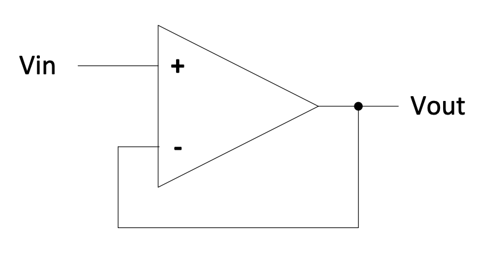
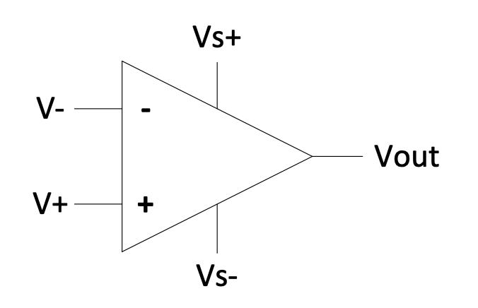
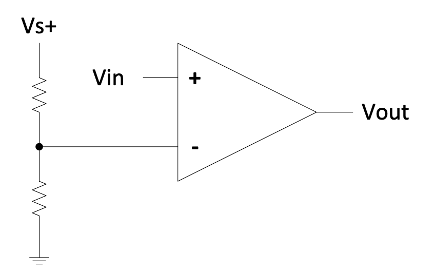
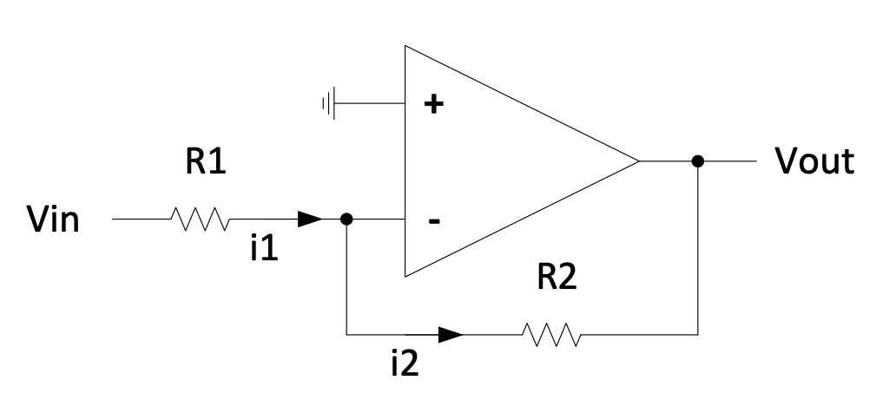
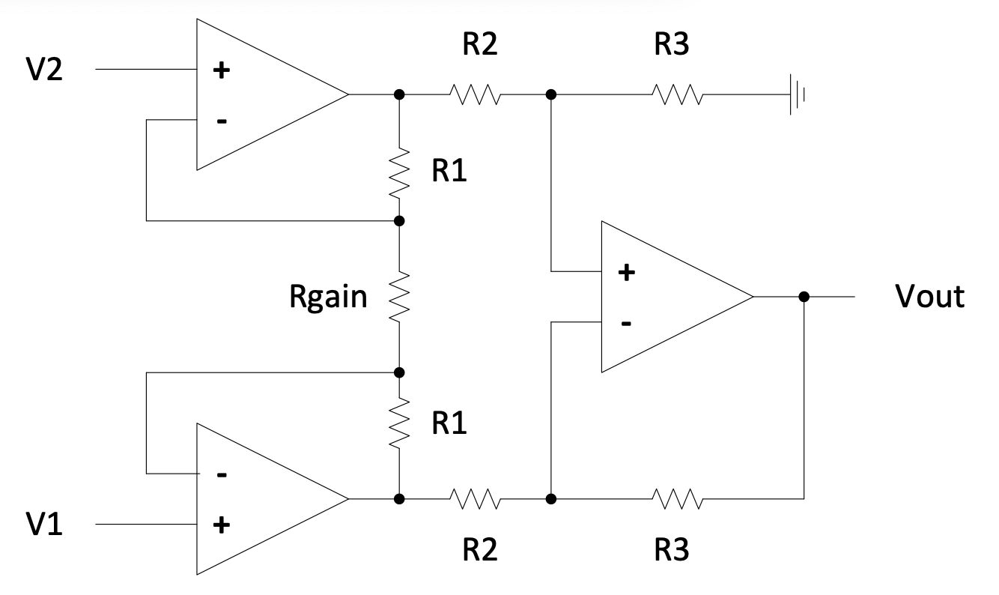
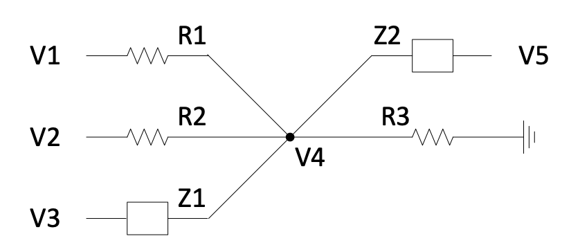
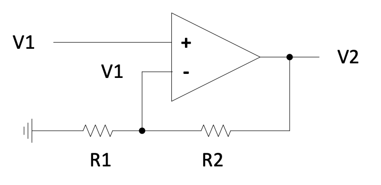
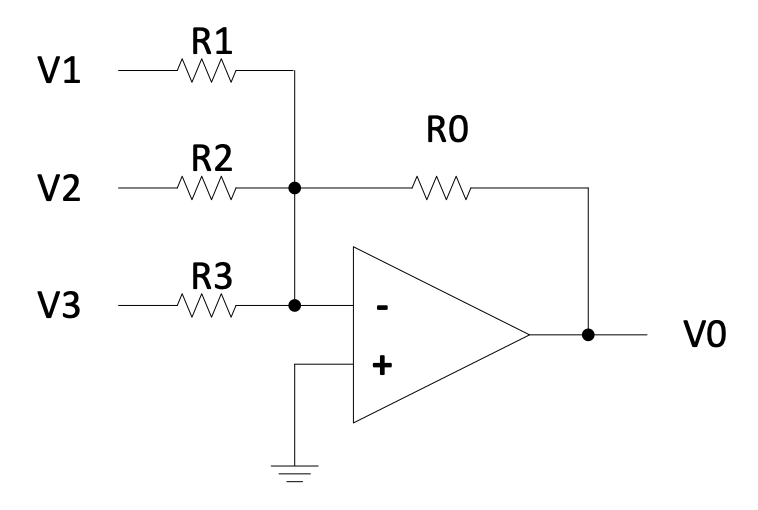

# Chapter 2: Operational Amplifiers 

An operational amplifier (or op-amp for short) is a differential amplifier and essential building block of modern circuitry. The diagram below shows the typical symbol used to represent an op-amp, along with the pins.

_Figure 2.1: Op-amp schematic_

The inputs to an op-amp are the following:

* $V_{-}$ or '-' input $\rightarrow$ inverting input
* $V_{+}$ or '+' input $\rightarrow$ non-inverting input
* $+V_{CC}$ and $-V_{CC}$ $\rightarrow$ positive and negative supply rails
* $V_{out}$ $\rightarrow$ op-amp output

## The Ideal Op-Amp

A hypothetical ideal op-amp would be governed by the following op-amp equation:

{: .note}
- $V_{out}=A_v(V_+-V_-)$

$A_v$ is called the "open loop gain" of the op-amp. Ideally $A_v = \infin$, however in practice $A_v$ is typically
between 100 000 and 1 000 000. As the gain is so high, and as the output of the op-amp cannot exceed the range of $+V_{CC}$ to $-V_{CC}$, $V_{out} is typically limited by the supply voltages to the op-amp.

Additionally for an ideal op-amp no current flows into either of the inputs, but in reality this is not quite the case. This will be discussed later.

Critically from the op-amp equation above, the following behaviour is found:

{: .note }
- If $V_+ > V_-$ : $V_{out} = +V_{CC}$ (as high as possible but limited by the positive supply voltage), unless $V_+-V_-$ is very, very small.
- If $V_- > V_+$ : $V_{out} = -V_{CC}$ (as low as possible but limited by the negative supply voltage), unless $V_--V_+$ is very, very small.

## Closed Loop (Feedback)
Closed loop feedback is when the the output of an op-amp (or anything else) is fed back into its own input. This means the current output influences the input which influences the output which influences the input...
round and round in a loop!

There are two types of feedback and they behave very differently:
* _Negative feedback_ - stable, settles on a specific value
* _Positive feedback_ - unstable, oscillates or goes to infinity

We will mostly deal with negative feedback.

## Negative feedback

To start with negative feedback let's look at a buffer circuit. A buffer is an example of _negative feedback_:

_Figure 2.2: Buffer circuit_

If we arrange our circuit so that $V_{out}$ affects $V_-$ such that when
$V_{out}$ increases so does $V_-$, then we find that the output
counteracts itself: The bigger $V_{out}$, the bigger $V_-$, causing
$V_{out}$ to decrease. This is called negative feedback.

In practice, if a negative feedback loop exists then the inputs of the op-amp will be driven extremely close to equality, which then satisfies the op-amp equation, provided that the output is not saturated (driven to its extremes). In other words
$V_{+}= V_{-}$ because $A_{v}$ is very large. This can directly be seen
for the circuit above because $(V_+-V_-)\times A_v=V_{out}$ and
$V_{out}$ is given to be not up to its limits. This can only be true
with $A_{v}$ very big when $V_+-V_-$ is very small, thus $V_+$ must be
about equal to $V_-$ .

#### **Example 2.1**

For example, if $V_{in}=10.0$ V, and $A_v=100000$ then the following
will be the outcome:

1.  $V_{out}=10.0\times {100000}/{(1+100000)}=9.9999$ V

(This follows from the equation
$V_{out}=(V_{in}-V_{out})\times A_v  => V_{out}=V_{in}\frac{A_v}{1+A_v}$)

1.  $V_+-V_-=V_{in}-V_{out}=0.0001$ V

(If it bothers you that 10.0 -- 9.9999 = 0.0001, and 0.0001 x 100 000 =
10.0 which is not equal to 9.9999; this inconsistency is simply because
the calculations above are not done to infinite accuracy. The precise
answers would have been:

1.  $V_{out}=10.0\times {100\ 000}/{(1+100\ 000)}=9.99990000099999000009999900000999990\dots \ V$
    

2.  $V_+-V_-=V_{in}-V_{out}=0.00009999900000999990000099999000009\dots \ V$

In most cases, it will be good enough to simply work with $V_-=V_+$ in the case of negative feedback, therefore $V_{out}=V_{in}=$ 10.0 V in this example.

Another property of the ideal op-amp is that the inputs draw no current, implying that a real op-amp has very high input impedances.

The ideal op-amp has zero output impedance, implying a very low output impedance for a real op-amp.

These rules allow us to analyse just about any op-amp circuit.

The last circuit above is called a _buffer_ or a _voltage follower_.

It is used to change a high impedance point to a low impedance output,
for example when a _regulated voltage_ is required. Anyone of the following circuits will do this:

_Figure 2.3: Buffer or voltage follower circuit_

In the first example the ratio of the resistors will determine the
regulated voltage.

In the $2^{nd}$ example the voltage of the Zener diode will determine
the regulated voltage provided that $V_{s+}$ (the positive supply
voltage to the op-amp) is higher than the Zener voltage. The resistor
must be chosen that the current through the Zener is adequate --
typically in the order of 10 mA (but always check the datasheet for your
component).

Why is the point connected to the non-inverting input a high impedance
point while the output of the op-amp is low impedance? The difference
lies in what will happen with the voltage of a point when a load is
connected to it. If you connect a load of even relatively high
resistance to the non-inverting input in these cases, the voltage there
will change. The output of the op-amp is designed to have small
impedance -- it is actually a small amplifier sitting there. So if you
connect a load to the output of the op-amp, the voltage will change only
a little bit.

## Analysis of some Circuits

### The Comparator

In a comparator, two signals are compared, and the output indicates
which one is bigger. An op-amp can be used as a comparator, although it
is possible to find better comparators (e.g. faster switching).

_Figure 2.4: Powered op-amp comparator circuit_

If $V_+ > V_-:   V_{out}$ is high If $V_- > V_+:  V_{out}$ is low

'High' means "a voltage close to $V_{s+}$" and 'low' means "a voltage
close to $V_{s-}$".

Consider the following circuit:

_Figure 2.5: Comparator circuit with voltage divider_

If the voltage at $V_+$ is larger then the voltage at $V_-$ , which is
generated by the resistor divider, then the output will go high. Else
the output will go low.

### The Window Comparator

The function of the Window Comparator is to indicate when a signal
($V_{in}$ in this circuit) is between two limits.

_Figure 2.6: Window comparator circuit_   

If $V_{in}>V_1: V_{out1}$ is high If $V_{in}<V_2 : V_{out2}$ is high

Thus if $V_{in}$ is within the limits of $V_1$ and $V_2$, the output of
the OR gate is low.

It can be used to drive a light (like a red LED) indicating when a
signal is out of limits.

> #### **Question 2.1**
> Design an equivalent Window Comparator, by swopping the inputs to the op-amps and by using a NAND gate.

### The Inverting Amplifier

In this circuit, if the output pin of the op-amp were to change then the
inverting input of the op-amp would change in the same direction. You
can see this by considering R1 and R2 as a voltage divider. Because of
this we have negative feedback.

_Figure 2.7: Inverting amplifier circuit_

Because we have negative feedback we can say that the inverting input
will be forced to the same voltage as the non-inverting input (the
output can clearly have no influence on the non-inverting input). Thus
the inverting input will be forced to 0 V.

$i_1=\frac{V_{in}-0}{R_1}=i_2$ (if we assume that the inputs of the
op-amp draw no current) $$V_{across\ R2}=R_2i_2=\frac{V_{in}R_2}{R_1}$$
One end of $R_2$ is at 0 V, current flows from a more positive to a more
negative potential: $$\therefore V_{out}=0-\frac{V_{in}R_2}{R_1}$$ Gain
is the ratio of the output voltage to the input voltage:

{: .note }
$$Gain=\frac{V_{out}}{V_{in}}=-\frac{R_2}{R_1}$$ 

We can set the gain of the circuit independently of *$A_{v}$* simply with the ratio of resistors (because $A_{v}$ is very large and the current flowing into $V_-$ is very small).

Since the gain is negative we call this circuit an **inverting amplifier**.

### The Non-Inverting Amplifier

_Figure 2.8: Non-inverting amplifier circuit_

Negative feedback is present, so the negative input of the op-amp will
be driven to $V_{in}$.

By Ohm's Law: $i_1=\frac{V_{in}}{R_1}$

By KCL: $i_{2} = i_{1}$
$$\therefore V_{acrossR2}=i_2R_2=\frac{V_{in}R_2}{R_1}$$ By KVL:
$$V_{out}=V_{acrossR1}+V_{acrossR2}$$ $$=V_{in}+\frac{V_{in}R_2}{R_1}$$
$$=V_{in}(1+\frac{R_2}{R_1})$$

{: .note }
$$Gain=\frac{V_{out}}{V_{in}}=1+\frac{R_2}{R_1}$$ 

No inversion occurs and the minimum gain is 1.

Once again you should note that the op-amp parameters have no effect on the circuit's gain (because $A_{v}$ is very large and the current flowing into $V_{-}$ is very small).

### The Differential Amplifier

_Figure 2.9: Differential amplifier circuit_

{: .note }
$$V_{out}=\frac{R_2}{R_1}(V_2-V_1)$$ 

This circuit is useful for signal conditioning (for example with common noise present on $V_{1}$ and $V_{2}$) as well as for subtracting offsets from signals.

> #### **Question 2.2**
> Derive the equation given above.

A general differential amplifier is discussed in the next sub-section "A short-cut method".

You do not normally get very high precision from the circuit above
because of the difficulty of matching resistors.

If very high precision is needed you can use an "instrumentation
amplifier" such as the AD620 or INA110. It has very accurate internal
resistors such as $R_{1}$, $R_{2}$ and $R_{3}$ in the following
schematic of a typical instrumentation amplifier. $R_{gain}$ is external
and adjusts the common gain.

_Figure 2.10: Instrumentation amplifier circuit_

You don't have to memorize this equation, but here it is:
$$\frac{V_{out}}{V_2-V_1}=(1+\frac{2R_1}{R_{gain}})\frac{R_3}{R_2}$$
Check that if $R_{gain}$ is left out, the gain is $\frac{R_3}{R_2}$ .

> #### **Question**
> Why can the last statement be made, from the equation and from the circuit?

### A short-cut method

Consider the following network:

_Figure 2.11: Example network for short-cut method_   

The sum of all the currents flowing into any one point should be zero
(KCL).

$$\frac{V_1-V_4}{R_1} + \frac{V_2-V_4}{R_2} + \frac{V_3-V_4}{Z_1} + \frac{V_5-V_4}{Z_2} + \frac{-V_4}{R_3} = 0$$

Re-arranged:

$$V_4\left(\frac{1}{R_1} + \frac{1}{R_2} + \frac{1}{Z_1} + \frac{1}{Z_2} + \frac{1}{R_3}\right) = \frac{V_1}{R_1} + \frac{V_2}{R_2} + \frac{V_3}{Z_1} + \frac{V_5}{Z_2}$$

$$= \frac{V_1}{R_1} + \frac{V_2}{R_2} + \frac{V_3}{Z_1} + \frac{V_5}{Z_2}$$

$$= \frac{V_1}{R_1} + \frac{V_2}{R_2} + \frac{V_3}{Z_1} \text{ (if } Z_2 \to \infty \text{)}$$

{: .note }
$$\therefore V_4\left(\frac{1}{R_1} + \frac{1}{R_2} + \frac{1}{Z_1} + \frac{1}{R_3} + \cdots\right) = \frac{V_1}{R_1} + \frac{V_2}{R_2} + \frac{V_3}{Z_1} + \cdots,$$

after taking into account the $\infty$ impedances and 0 voltages, and
leaving the expansion possibility for more connections.

***This is the rule of the short-cut method.***

The left-hand side of the equation can be applied to any high impedance
point in a circuit.

Note that *Z* can be equal to $R, sL, 1/(sC), R+sL, R+1/(sC)$ -- in fact
any impedance.

{: .note }
"s" in these terms is the Laplace operator. It is connected to frequency by the equation $s=i\omega$, with "*i*" the imaginary number $\sqrt{-1}$ and $\omega =2\pi f$, with $\omega$ in rad/s and *f* in Hz.

If you have a gain or a transfer as a function of Laplace s:

{: .note }
1.  Replacing s = 0 will give you the gain at DC or very low
    frequencies.
2.  Replacing s $\infty$ will give you the gain at very high
    frequencies.

For this course you must memorize that:

{: .note }
1.  The impedance of an inductor $=sL$, with $L$ the inductance in H
    (henry) \[you should be familiar with $i\omega$L as the
    impedance\]
2.  The impedance of a capacitor $={1}/{(sC)}$ , with $C$ the
    capacitance in F (farad) \[you should be familiar with
    1/(i$\omega$C) as the impedance\]
3.  The impedance of two components connected in series is the sum of
    the two impedances
4.  $1/s$ is representing an integral

As a first example, apply the short-cut method to an **inverting gain** op-amp network:

_Figure 2.12: Inverting gain op-amp network_  

$$V_m\left(\frac{1}{R_1} + \frac{1}{R_2} + \frac{1}{Z_{opamp}}\right) = \frac{V_1}{R_1} + \frac{V_2}{R_2} + \frac{V?}{Z_{opamp}}$$

$$\therefore V_m\left(\frac{1}{R_1} + \frac{1}{R_2}\right) = \frac{V_1}{R_1} + \frac{V_2}{R_2} \text{ because } Z_{opamp} \to \infty$$

But $V_{m} = 0$ because the +input of the op-amp is connected to ground
and the --input will equal the +input. The --input will equal the +input
because of the very high gain of the op-amp and the feedback to the
--input of the op-amp.

$$\text{Therefore } 0 = \frac{V_1}{R_1} + \frac{V_2}{R_2}$$

$$\therefore V_2 = V_1\left(-\frac{R_2}{R_1}\right) \quad \therefore \frac{V_2}{V_1} = -\frac{R_2}{R_1}$$

{: .note }
When there is only one feedback from the output to the op-amp inputs, it must be to the --input. If there are feedbacks to both the --input and the +input, the feedback to the --input must be "dominant". If not, it will be positive feedback and the circuitry will simply drive the op-amp signals to the supply rails.

For example, this is wrong:

_Figure 2.13: Incorrect op-amp network_

Checking:

It is always good to check your calculations afterwards.

Quick checks are to determine the transfer function

1.  at zero frequency (Laplace *s* = 0) and/or

2.  at very high frequency (*s* -\>$\infty$).

It can often be seen from op-amp networks what the low and/or high
frequency responses should be (capacitor impedance either infinite or
zero).

**Non-inverting gain:**

_Figure 2.14: Non-inverting gain circuit_

$$V_1\left(\frac{1}{R_1} + \frac{1}{R_2}\right) = V_2\left(\frac{1}{R_2}\right) \quad \therefore \frac{V_2}{V_1} = \frac{\frac{1}{R_1}+\frac{1}{R_2}}{\frac{1}{R_2}} = 1 + \frac{R_2}{R_1}$$

**Adder or Summer:**

_Figure 2.15: Adder or summer circuit_

$$0 \times \left(\frac{1}{R_1} + \frac{1}{R_2} + \frac{1}{R_3} + \frac{1}{R_0}\right) = 0 = V_1\left(\frac{1}{R_1}\right) + V_2\left(\frac{1}{R_2}\right) + V_3\left(\frac{1}{R_3}\right) + V_0\left(\frac{1}{R_0}\right)$$

$$\therefore V_0 = -\left(\frac{R_0}{R_1}V_1 + \frac{R_0}{R_2}V_2 + \frac{R_0}{R_3}V_3\right)$$

**General differential gain:**

_Figure 2.16: General differential gain circuit_

$$V_m\left(\frac{1}{R_2} + \frac{1}{R_4}\right) = V_2\left(\frac{1}{R_2}\right) \text{ and }$$

$$V_m\left(\frac{1}{R_1} + \frac{1}{R_3}\right) = V_1\left(\frac{1}{R_1}\right) + V_3\left(\frac{1}{R_3}\right)$$

$$\therefore V_2\frac{\frac{1}{R_2}}{\frac{1}{R_2}+\frac{1}{R_4}} = V_1\frac{\frac{1}{R_1}}{\frac{1}{R_1}+\frac{1}{R_3}} + V_3\frac{\frac{1}{R_3}}{\frac{1}{R_1}+\frac{1}{R_3}}$$

$$\therefore V_3\frac{R_1}{R_1+R_3} = V_2\frac{R_4}{R_2+R_4} - V_1\frac{R_3}{R_1+R_3}$$

$$\therefore V_3 = V_2\frac{R_4}{R_1}\left(\frac{R_1+R_3}{R_2+R_4}\right) - V_1\frac{R_3}{R_1} = V_2\frac{R_4}{R_2}\left(\frac{1+\frac{R_3}{R_1}}{1+\frac{R_4}{R_2}}\right) - V_1\frac{R_3}{R_1} = V_2\frac{1+\frac{R_3}{R_1}}{1+\frac{R_2}{R_4}} - V_1\frac{R_3}{R_1}$$

Check if it complies with your existing knowledge of a differential gain
where $R_4=R_3$ and $R_2=R_1$:

$$\frac{V_3}{V_2-V_1} = \frac{R_3}{R_1} \quad \checkmark$$

Trying to derive the equation for the general differential gain without
the short-cut method, will demonstrate how many lesser steps are
required with the short-cut method.

**Integrator:**

_Figure 2.17: Integrator circuit_ 

$$0 = V_1\left(\frac{1}{R}\right) + V_2(sC)$$

$$\therefore \frac{V_2}{V_1} = -\frac{1}{sRC}$$

This is an integrator with a gain of $-\frac{1}{RC}$.

Check:
$$\left.\frac{V_2}{V_1}\right|_{s=0} \to -\infty \quad \checkmark$$

$$\left.\frac{V_2}{V_1}\right\|_{s\to \infty} \to 0 \quad \checkmark$$

**1st order low-pass filter:**

_Figure 2.18: 1st order low-pass filter circuit_

$$V_m\left(\frac{1}{R_1} + \frac{1}{R_2}\right) = V_2\left(\frac{1}{R_2}\right) \text{ and }$$

$$V_m\left(\frac{1}{R} + sC\right) = V_1\left(\frac{1}{R}\right)$$

$$\therefore V_2\frac{\frac{1}{R_2}}{\frac{1}{R_1}+\frac{1}{R_2}} = V_1\frac{\frac{1}{R}}{\frac{1}{R}+sC}$$

$$\therefore \frac{V_2}{V_1} = \left(1+\frac{R_2}{R_1}\right)\frac{1}{sRC+1} = \frac{K}{\tau s+1} = \frac{K\omega}{s+\omega}$$

This is a 1st order low-pass filter with time constant $\tau$ of $RC$
and low frequency gain $K$ of $1+\frac{R_2}{R_1}$.

Remember bandwidth or cut-off frequency
$\omega = 2\pi f = \frac{1}{\tau}$, with $\omega$ in rad/s, $f$ in Hz
and $\tau$ in s (seconds).

$\frac{K\omega}{s+\omega}$ is the form of a 1st order low-pass filter
with a DC gain of K.

Check:
$$\left.\frac{V_2}{V_1}\right|_{s=0} = 1+\frac{R_2}{R_1} \quad \checkmark$$

$$\left.\frac{V_2}{V_1}\right\|_{s \to \infty} \to 0 \quad \checkmark$$

Therefore, at low frequency there will be a gain greater than 1.0, but
at higher frequency, the gain will become smaller and smaller. So it is
indeed a low-pass filter.

## Combining Op-amp circuitry with Transistors

It is often required that a signal must be amplified and then it must
drive a load that requires more current than what an op-amp can supply.
Therefore a transistor must be combined with the op-amp. Both the
following circuits may work, but the second one will be more accurate.

_Figure 2.19: Inverting amplifier circuit with transistor_

> #### **Question 2.3**
> Do you agree with the equation:
> $$V_{out} = -\frac{R_2}{R_1}V_{in} - 0.7$$

_Figure 2.20: More accurate inverting amplifier circuit with transistor_

> #### **Question 2.4**
> Do you agree with the equation: $$V_{out} = -\frac{R_2}{R_1}V_{in}$$
> What happened to the 0.7 V in the last case?

> #### **Question 2.5**
> How would you combine NPN and PNP transistors with an Op-amp to allow positive and negative current through the load?

## Designing and selecting components

Resistors, capacitors, inductors and zener diodes come only in certain
values, also depending on the accuracy of the components. These are
given in the Appendix \"Number series\...\"

It is obvious from the transfer functions derived above, that different
orders of for example resistors can give the same transfer function on
the first look. For example,
$\frac{33\,\Omega}{10\,\Omega} = \frac{33\,k\Omega}{10\,k\Omega}$. But
there are obvious reasons why the $k\Omega$ resistors is a far better
choice when working with op-amps than the $\Omega$ only resistors:

1.  For given voltages, larger resistors dissipate less power than
    smaller resistors -- wasting energy is not sensible.

2.  Op-amps can only supply or sink current in the order of 10 mA, so
    with resistors in the $\Omega$ only range only very small signals
    can be handled.

## Single Supply and Dual Supply Op-amps

For an op-amp to work correctly $\textit{all}$ inputs and the output of
the op-amp must be within its allowable range. This range is constrained
by the power supply rails.

For a common dual rail op-amp (e.g. LM741) neither the input nor output
voltages will exactly go from rail to rail.

_Figure 2.21: Input/output voltage range for dual supply op-amp_

The difference between the dual supply device and the single supply
device is in the allowable input voltage range relative to the supply
voltages.

For a single supply op-amp (e.g. LM358, $V_{s-}$ is usually ground):

_Figure 2.22: Input/output voltage range for single supply op-amp_

Note: Although the input is shown here to be as low as on $V_{s-}$, it
must still be slightly bigger than $V_{s-}$.

Why are single supply op-amps useful?

Simply because dual supplies are more expensive and require more space.

Can you use dual supplies on a single supply op-amp? Yes, provided you don't exceed the maximum _total_ supply voltage ($V_{s+} - V_{s-}$) allowed for the op-amp.

Single supply op-amps, such as the LM358, will give some distortions
when crossing over from positive to negative or negative to positive
current on its output. A dual supply op-amp, such as the LF353 won't
display this distortion.

Consider the circuit below, with $V_+ = 10\,\text{V}$, assuming the
specification: $0.5\,\text{V} \leq V_{out} \leq 9.5\,\text{V}$:

_Figure 2.23: Dual supply op-amp example circuit_

1.  The allowable range for $V_{in}$ is from 0.05 V to 0.95 V
    (restricted by the limited range of $V_{out}$).

But the input to an op-amp [circuit]{.underline} usually has different
restrictions than the inputs to the op-amp themselves.

Consider this circuit with a single supply op-amp:

_Figure 2.24: Single supply op-amp example circuit_   

$V_{in}$ can be negative because that will cause $V_{out}$ to be
positive. $V_{-}$ will be forced to ground and thus, from the op-amp's
point of view, all signals are in the allowable range.

But in this latter case $V_{in}$ can't be positive because $V_{out}$
can't be negative.

Special rail to rail op-amps are available that will allow both input
and output voltages to swing almost to both supply rails. These op-amps
use MOSFETs internally instead of transistors. They have smaller
saturation voltages than transistors.

## The Non-Ideal Op-amp

### Input Offset Voltage

One of the properties of a real-life op-amp that will cause deviation
from the model is that an op-amp used in negative feedback will not be
able to drive both its inputs to the exact same voltage. Input Offset
voltage specifies the maximum voltage difference between the inputs when
the op-amp is in negative feedback mode.

### Input Bias Current

We also assumed that no current flowed into the inputs. In reality some
current will. This current is called the input bias current and because
the two inputs might not draw identical currents, this value is the
average of the two inputs.

### Gain Bandwidth Limits

All op-amps have a specification called Gain Bandwidth Product (GBWP).
This is a constant for that device and it is measured in MHz. The
product of the open loop gain of the op-amp and the frequency of
operation is roughly constant.

Thus, as the operating frequency goes up, the open loop gain goes down.

E.g. the LM358: GBWP = 1 MHz

Up to 10 Hz: $A_v = 100\,000$

At 1 kHz: $A_v = 1000$

At 10 kHz: $A_v = 100$ etc.

We originally assumed that $A_v$ was infinite for our analysis of op-amp
behaviour. If $A_v$ is less, then overall performance will deteriorate.

As a rule of thumb keep the closed loop gain of the op-amp circuit
$< A_v/10$.

### Slew Rate Limitation

The "slew rate" of an op-amp is the maximum rate of change of its
output. It is typically specified in V/µs. The LM358 has a slew rate of
0.5 V/µs.

Thus, if the LM358's output had to swing sharply from 0 V to 5 V the
output waveform would look like this:

_Figure 2.25: Slew rate limitation_

This will distort square edges and limits the frequency of operation in
comparator applications.

## Dedicated Comparator Circuits

There are devices called comparators which are similar to op-amps but
are used in applications where the output is only high or low. Examples
include the LM311 and LM393. They often have \"open collector\" and
\"open emitter\" outputs.

To use them you have to connect the collector to the supply and a
pull-down resistor from the emitter to ground (the $2^\text{nd}$ diagram
below). So this is a comparator followed by an emitter follower. It can
also be connected as in the $1^\text{st}$ diagram, with then the output
the inverse of the circuit of the $2^\text{nd}$ diagram.

Their slew rate can be as high as 30 V/µs.

_Figure 2.26: Dedicated comparator circuits_

Remember that the output pin will have some parasitic capacitance. This
will slow down the maximum possible rate of change of the output. The
rise time can be reduced by reducing $R_1$ at the cost of larger current
wastage through the comparator's output. Typically $R_1$ will be about
1k.

The $1^\text{st}$ diagram looks suspicious in terms of the comparator
component output driving the transistor without any resistor. Presumably
the comparator output has sufficient internal resistance.

## Hysteresis

Hysteresis is an important aspect in controlling devices.

Suppose that we are using an op-amp as a comparator to control a cooling
fan. If temperature $> 50^\circ\text{C}$ the fan must be on. Suppose the
temperature sensor outputs 2.5 V at $50^\circ\text{C}$. We can put
together the following circuit (the reason for the 2 transistors is to
eventually be able to supply sufficient current to the fan):

_Figure 2.27: Hysteresis example circuit_

When the fan turns on it causes the temperature to drop, which will then
turn the fan off, which causes the temperature to rise etc\... The
problem is that the fan will turn on and off very rapidly which is not
good for it. We can fix this problem by using positive feedback or
hysteresis.

Therefore, take note that positive feedback may sometimes be useful. The
amplifier (comparator in this case) is then not running in the linear
mode, since its output will either be maximum or minimum, never in
between except when switching from one extreme to the other as fast as
it can.

_Figure 2.28: Hysteresis example circuit with positive feedback_

The output of the op-amp now affects the reference level (the $V_+$
input of the comparator). When the fan is on there is a threshold below
$50^\circ\text{C}$ and when the fan is off the threshold is above
$50^\circ\text{C}$.

If you want to calculate the thresholds remember that if the op-amp's
output is high, $R_f$ is effectively in parallel with $R_1$ and when it
is low $R_f$ is effectively in parallel with $R_2$. This can be used to
calculate the reference voltages, unless you must work more accurately
by taking into account that the output of the comparator won't be
exactly 0 V or 5V. The short-cut method can also be used, which I would
recommend, since it can also handle this more accurate analysis. It can
even handle the case where $R_1$ and $R_2$ are not given, but must be
calculated -- see the tips below.

> #### **Question 2.6**
> Suppose a temperature sensor of 0.1 V/$^\circ\text{C}$ with output 2.5 V at $50^\circ\text{C}$. Let $R_1=R_2=10\,\text{k}\Omega$. Design $R_f$ so that the thresholds for controlling the fan will be at $47^\circ\text{C}$ and $53^\circ\text{C}$. Do the design for two cases:
> 1.  Output of comparator is either 0 V or 5 V
> 2.  Output of comparator is either 0.2 V or 4.8 V
> 
> Tips:
> $$V_{sensor}\left(\frac{1}{R_1}+\frac{1}{R_2}+\frac{1}{R_f}\right)=5\left(\frac{1}{R_1}\right)+V_0\left(\frac{1}{R_f}\right)$$
> and apply this at the two given conditions:
> 1.  $V_{sensor}$ corresponding with the low temperature, while $V_0$ the low voltage
> 2.  $V_{sensor}$ corresponding with the high temperature, while $V_0$ the high voltage
>
> In the most general case, this will give you 2 equations and 3 unknowns:
> $R_1$, $R_2$ and $R_f$.