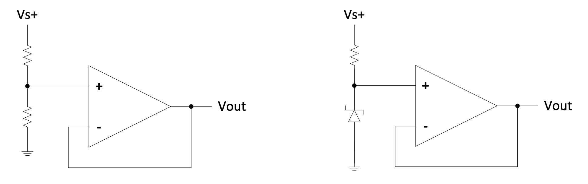
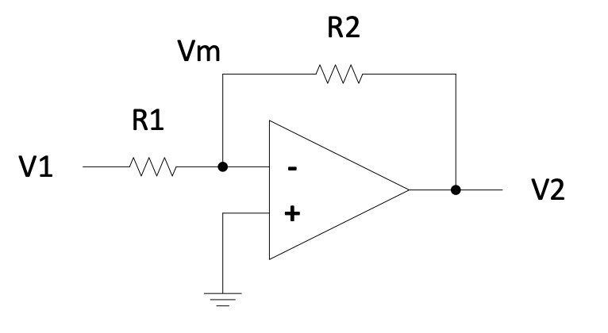

# Chapter 2: Power Design

Power supply design forms the foundation of reliable electronic systems. Every mechatronic device requires stable, regulated power to function correctly—whether derived from the AC mains or from portable battery sources. Understanding power circuitry is essential for creating robust embedded systems that operate safely and efficiently across varying load conditions and input voltages.

This chapter explores the complete power supply chain: from AC mains conversion through transformer, rectification, and regulation stages; through linear and switching regulator topologies; to the electromechanical and solid-state relays that control power delivery to loads. We examine the trade-offs between efficiency, cost, complexity, and performance that guide practical design decisions.

## AC Mains Supply

In many applications, electronic systems derive their power from the AC mains supply. In South Africa and many other regions, the mains supply provides $230\ \text{V}_{\text{RMS}}$ alternating current at $50\ \text{Hz}$. To use this with DC circuits, the voltage must be transformed to a lower level, converted to DC through rectification, smoothed to reduce ripple, and finally regulated to provide a stable output.

_Figure 2.1: Complete AC to DC power supply block diagram showing transformer, rectifier, smoothing capacitor, and regulator stages_

The process involves four fundamental stages, each addressing a specific requirement of the conversion from high-voltage AC to stable low-voltage DC.

### Transformer Stage

The first stage steps down the AC mains voltage to a level closer to the desired DC output. The peak voltage of AC mains is considerably higher than its RMS value:

{: .note }
$V_{\text{peak}} = V_{\text{RMS}} \times \sqrt{2} = 230 \times 1.414 \approx 325\ \text{V}$

Direct rectification without transformation would produce approximately $325\ \text{V DC}$ (ignoring diode drops)—far too high for typical electronic circuits. For a $12\ \text{V DC}$ output, the transformer must step down the voltage by a factor of approximately 27 which is not practical physically.

{: .warning }
**MAINS CAN BE LETHAL!** When working with mains-connected circuits, always take appropriate safety precautions. Ensure proper isolation, use insulated tools, and never work on live equipment alone.

### Rectification Stage

The rectifier converts the bidirectional AC waveform into a unidirectional pulsating DC using a diode bridge configuration. This arrangement routes current such that the output is always positive, regardless of the input polarity.

_Figure 2.2: Bridge rectifier circuit showing four diodes converting AC to pulsating DC_

Since current must pass through two diodes in series during each half-cycle, the output peak voltage is reduced by approximately $1.4\ \text{V}$ (two $0.7\ \text{V}$ silicon diode drops).

### Smoothing Stage

The pulsating DC from the rectifier contains significant ripple at twice the mains frequency ($100\ \text{Hz}$ for $50\ \text{Hz}$ mains). A large electrolytic capacitor connected across the output stores charge during the voltage peaks and releases it during the troughs, substantially reducing the ripple amplitude.

_Figure 2.3: Smoothed DC output showing ripple voltage after capacitor filtering_

The remaining ripple voltage depends on the load current, capacitance value, and ripple frequency:

$$V_{\text{ripple}} \approx \frac{i_{\text{load}}}{f_{\text{ripple}} \times C}$$

While smoothing improves the DC quality, the voltage still varies with mains fluctuations and load changes. Sensitive electronic circuits require additional regulation.

### Regulation Stage

The final stage employs a voltage regulator to maintain a constant output voltage despite variations in input voltage and load current. Linear regulators, discussed in detail in the following section, dissipate excess voltage as heat to maintain a stable output.

_Figure 2.4: Regulated DC output showing stable voltage regardless of input variations_

The regulator provides:
- Stable, constant output voltage
- Rejection of input ripple and noise
- Protection against over-current and thermal overload

## Linear Voltage Regulators

Linear voltage regulators maintain a stable output voltage by operating a pass transistor in its active region, continuously adjusting its resistance to drop exactly the voltage difference between input and output. While simple and effective, this approach has significant implications for efficiency and thermal management.

### Principles of Linear Regulation

The fundamental linear regulator circuit uses negative feedback to compare the output voltage against a reference. An operational amplifier drives a pass transistor, adjusting its conduction to maintain the desired output.

_Figure 2.5: Linear voltage regulator with control loop showing Zener reference and feedback network_

In this configuration:
- D1 is a Zener diode establishing a stable reference voltage (typically $5.6\ \text{V}$)
- R2 and R3 form a voltage divider feeding back a fraction of the output
- The op-amp amplifies the difference between the reference and feedback voltages
- T1 acts as the pass transistor, controlled by the op-amp output

When the output voltage rises above the target, the op-amp reduces the base drive to T1, increasing its effective resistance and lowering the output. Conversely, when the output drops (due to increased load), the op-amp increases the base drive, reducing the voltage drop across T1.

#### **Example 2.1**

Design a $10\ \text{V}$ regulator using the circuit of Figure 2.5, given:
- Zener diode D1: $V_Z = 5.6\ \text{V}$
- Transistor T1: $V_{BE} = 0.7\ \text{V}$
- Supply voltage: $12\ \text{V}$

**Solution:**

The op-amp maintains its inputs at equal potential through negative feedback:

$$V_+ = V_- = 5.6\ \text{V}$$

The output voltage divider gives:

$$V_- = V_{\text{out}} \times \frac{R_3}{R_2 + R_3}$$

Therefore:

$$5.6 = 10 \times \frac{R_3}{R_2 + R_3}$$

Rearranging:

$$\frac{R_2}{R_3} = \frac{10}{5.6} - 1 = 0.786$$

Selecting $R_3 = 1.5\ \text{k}\Omega$:

$$R_2 = 0.786 \times 1500 = 1179\ \Omega$$

The closest standard E12 value is $1.2\ \text{k}\Omega$. Verifying:

$$V_{\text{out}} = 5.6 \times \left(\frac{1.2}{1.5} + 1\right) = 5.6 \times 1.8 = 10.08\ \text{V}$$

### Power Dissipation and Efficiency

Linear regulators achieve voltage reduction by dissipating the voltage difference as heat in the pass transistor. This fundamental characteristic limits their efficiency, particularly when the input-output voltage difference is large.

{: .note }
$P_{\text{dissipated}} = (V_{\text{in}} - V_{\text{out}}) \times i_{\text{load}}$

The total efficiency is:

$$\eta = \frac{P_{\text{out}}}{P_{\text{in}}} = \frac{V_{\text{out}} \times i_{\text{out}}}{V_{\text{in}} \times i_{\text{in}}}$$

For linear regulators, $i_{\text{in}} \approx i_{\text{out}}$ (plus a small quiescent current), so:

$$\eta \approx \frac{V_{\text{out}}}{V_{\text{in}}}$$

#### **Example 2.2**

Compare the power dissipation and efficiency for a $5\ \text{V}$ regulator with $70\ \text{mA}$ load:

**Case 1:** $24\ \text{V}$ supply
- Load power: $P_{\text{load}} = 5 \times 0.07 = 0.35\ \text{W}$
- Regulator dissipation: $P_{\text{reg}} = (24 - 5) \times 0.07 = 1.33\ \text{W}$
- Efficiency: $\eta = 5/24 = 21\%$

**Case 2:** $7\ \text{V}$ supply
- Load power: $P_{\text{load}} = 0.35\ \text{W}$ (unchanged)
- Regulator dissipation: $P_{\text{reg}} = (7 - 5) \times 0.07 = 0.14\ \text{W}$
- Efficiency: $\eta = 5/7 = 71\%$

This example demonstrates why selecting a supply voltage close to the regulated output is crucial for thermal management and efficiency.

### Headroom (Dropout Voltage)

Linear regulators require a minimum voltage difference between input and output to maintain regulation. This minimum difference is called the **headroom** or **dropout voltage**.

{: .note }
$V_{\text{in(min)}} = V_{\text{out}} + V_{\text{headroom}}$

For standard regulators, $V_{\text{headroom}}$ is typically $2\ \text{V}$ or more. If the input voltage (including ripple) drops below this threshold, the output voltage will sag and regulation is lost.

### Protection Circuitry

Practical voltage regulator ICs incorporate several protection mechanisms:

**Over-current protection:** Limits the output current when the load attempts to draw excessive power, such as during a short circuit. The regulator enters a current-limiting mode where the output voltage drops to maintain a safe current.

**Thermal shutdown:** Reduces or disables the output if the junction temperature exceeds safe limits, protecting the device from damage due to excessive power dissipation or inadequate heat sinking.

**Over-voltage protection:** Some regulators include crowbar circuits that rapidly reduce the output to near-zero if a fault condition causes the output to exceed a safe threshold, protecting downstream circuitry.

### Heatsinking Requirements

The power dissipated in a linear regulator converts directly to heat. Without proper thermal management, the junction temperature can exceed safe limits, causing reduced reliability or catastrophic failure.

_Figure 2.6: Various heatsink styles for TO-220 and other packages showing different thermal designs_

The junction temperature is calculated as:

$$T_J = T_A + P_D \times R_{\theta JA}$$

Where:
- $T_J$ = junction temperature
- $T_A$ = ambient temperature
- $P_D$ = power dissipated
- $R_{\theta JA}$ = thermal resistance from junction to ambient

Adding a heatsink reduces $R_{\theta JA}$, allowing higher power dissipation for a given temperature rise. Always consult the device datasheet for maximum junction temperature and thermal resistance specifications.

### Low Dropout (LDO) Regulators

Standard linear regulators require significant headroom, which limits efficiency in battery-powered applications where the input voltage may be only slightly higher than the required output. Low Dropout (LDO) regulators address this limitation.

_Figure 2.7: Low dropout regulator circuit showing additional transistor Q1 for improved pass element control_

In the LDO configuration, transistor Q1 serves as the primary pass element. The op-amp drives T1, which in turn controls the base current of Q1. This arrangement allows the op-amp to force Q1 into saturation, reducing $V_{CE(\text{sat})}$ to a very low value—typically less than $0.5\ \text{V}$.

When the output drops due to load changes:
1. The op-amp increases its output
2. This increases base drive to T1
3. T1's collector current increases, raising Q1's base drive
4. Q1 conducts more fully, increasing the output voltage

The LP2951 is a common LDO regulator with worst-case dropout of only $0.6\ \text{V}$, making it ideal for battery applications where every millivolt of headroom matters.

### Fixed and Adjustable Regulator ICs

Integrated circuit voltage regulators simplify power supply design by combining all necessary components in a single package.

**Fixed Regulators:** The 78xx series provides fixed output voltages, where "xx" indicates the voltage. The 7805 provides $5\ \text{V}$, the 7812 provides $12\ \text{V}$, and so on. These require only input and output capacitors for stable operation.

_Figure 2.8: Fixed 5V regulator using 7805 with input and output capacitors_

The 79xx series provides negative output voltages (e.g., 7905 for $-5\ \text{V}$), enabling split-supply designs for operational amplifiers and other analog circuits.

**Adjustable Regulators:** The LM317 (positive) and LM337 (negative) allow output voltage programming via external resistors.

_Figure 2.9: Adjustable voltage regulator using LM317 with resistor divider for voltage setting_

The LM317 maintains $1.25\ \text{V}$ between its output and adjustment terminals. With minimal current into the ADJ pin ($\approx 50\ \mu\text{A}$), the output voltage is:

$$V_{\text{out}} = 1.25 \times \left(1 + \frac{R_2}{R_1}\right) + i_{\text{adj}} \times R_2$$

Standard design practice sets $R_1$ between $200-330\ \Omega$ to establish a reasonable bias current, then calculates $R_2$ for the desired output.

### Linear Regulator Summary

| Advantages | Disadvantages |
|------------|---------------|
| Low cost | Large headroom requirement |
| Excellent line and load regulation | Poor efficiency with large $V_{\text{in}} - V_{\text{out}}$ |
| Low output noise and ripple | Significant standby power consumption |
| Low EMI emissions | Requires heatsinking for moderate power |
| Fast transient response | Step-down only (cannot boost voltage) |

## Buck Converters

When efficiency is paramount or the input-output voltage difference is large, switching regulators offer significant advantages over linear approaches. The Buck converter—also known as a step-down switching regulator—efficiently reduces voltage by storing energy in an inductor and delivering it to the load in discrete packets.

### Principles of Operation

Unlike linear regulators that dissipate excess voltage as heat, Buck converters use a switching element (typically a MOSFET) to alternately connect and disconnect the input voltage from an LC filter network.

_Figure 2.10: Basic Buck converter circuit showing switch, inductor, diode, and capacitor_

When the switch closes:
- Current flows through the inductor, storing energy in its magnetic field
- The inductor current ramps up linearly
- The diode is reverse-biased and does not conduct

When the switch opens:
- The inductor maintains current flow through the freewheeling diode
- Energy stored in the inductor transfers to the load and output capacitor
- The inductor current ramps down linearly

The output capacitor averages these current pulses, maintaining a relatively smooth DC voltage. The switching frequency is typically tens to hundreds of kilohertz—much higher than the control signal bandwidth—so the load perceives only the average value.

### Transfer Function and Duty Cycle

Assuming ideal components (100% efficiency), the energy delivered from the input equals the energy delivered to the output over each switching cycle.

During the on-time ($t_{\text{on}}$):
$$E_{\text{in}} = (V_{\text{in}} - V_{\text{out}}) \times t_{\text{on}}$$

During the off-time ($t_{\text{off}}$):
$$E_{\text{out}} = V_{\text{out}} \times t_{\text{off}} = V_{\text{out}} \times (T - t_{\text{on}})$$

Equating input and output energy:

$$(V_{\text{in}} - V_{\text{out}}) \times t_{\text{on}} = V_{\text{out}} \times (T - t_{\text{on}})$$

Simplifying:

$$V_{\text{in}} \times t_{\text{on}} = V_{\text{out}} \times T$$

{: .note }
$$\frac{V_{\text{out}}}{V_{\text{in}}} = \frac{t_{\text{on}}}{T} = D \text{ (duty cycle)}$$

The output voltage is directly proportional to the duty cycle of the switching waveform. By varying the duty cycle from 0 to 100%, the output can be controlled from near-zero up to nearly $V_{\text{in}}$.

### The Flywheel Circuit

The inductor, capacitor, and diode form a **flywheel circuit**—so named because the energy storage and transfer resembles a mechanical flywheel maintaining rotational momentum.

_Figure 2.11: Flywheel circuit showing current paths during switch on and off states_

The key insight is that only the energy required by the load is drawn from the supply. When the load demand decreases, the controller reduces the duty cycle, delivering smaller energy packets. This contrasts sharply with linear regulators, which always drop the full voltage difference regardless of load.

### Efficiency Considerations

Buck converters achieve efficiencies exceeding 90%, and often above 95%, because:

1. **Minimal resistive losses:** The switch operates either fully on (low $V$, low $P = IV$) or fully off ($I = 0$, zero power)
2. **Reactive energy storage:** Energy temporarily stored in the inductor and capacitor is transferred to the load rather than dissipated
3. **No inherent voltage drop:** The output can be any value from near-zero to $V_{\text{in}}$ without the penalty of $(V_{\text{in}} - V_{\text{out}}) \times I$ dissipation

Practical losses occur in:
- Switch conduction resistance ($R_{DS(\text{on})}$ for MOSFETs)
- Inductor winding resistance and core losses
- Diode forward voltage drop (or synchronous rectifier losses)
- Switching transitions (brief periods when $V$ and $I$ are both non-zero)
- Control circuitry quiescent current

### Buck Converter Features

| Advantages | Disadvantages |
|------------|---------------|
| Very high efficiency (>97% possible) | Higher output ripple than linear regulators |
| Wide input-output voltage range | More complex circuit design |
| Minimal no-load power consumption | EMI generation requires filtering |
| Compact size at high frequencies | More expensive than linear alternatives |
| Can regulate over wide load range | Slower transient response than linear |

Higher switching frequencies allow smaller inductors and capacitors, reducing overall converter size. However, switching losses increase with frequency, creating a trade-off between size and efficiency.

### Practical Buck Regulator Implementation

The R-78xx series provides drop-in replacements for 78xx linear regulators, delivering the efficiency benefits of switching regulation with the simplicity of three-terminal linear regulators.

_Figure 2.12: R-78xx series buck regulator block diagram showing internal feedback and control circuitry_

These modules integrate:
- High-frequency switching controller
- Power MOSFET switches
- Inductor and capacitors
- Feedback network (R1/R2)
- Over-current and thermal protection

The feedback loop continuously monitors the output voltage through the R1/R2 divider, adjusting the PWM duty cycle to maintain regulation against input voltage and load variations.

Key specifications for the R-78xx series:
- Efficiency: up to 97%
- Input voltage: up to $72\ \text{V}$ DC
- Quiescent current: as low as $20\ \mu\text{A}$ in shutdown
- Pin-compatible with 78xx linear regulators

### Cascaded Regulation

For applications requiring both high efficiency and extremely low output ripple, a Buck converter can feed a linear regulator. This cascaded arrangement combines the best attributes of both approaches.

_Figure 2.13: Cascaded power supply with Buck converter feeding a linear regulator_

The Buck converter efficiently drops the high input voltage to a level just above the linear regulator's dropout voltage. The linear regulator then provides the final voltage reduction with excellent noise performance and minimal ripple.

For example, converting $24\ \text{V}$ to $5\ \text{V}$ at $1\ \text{A}$:
- Linear only: $\eta \approx 5/24 = 21\%$, $19\ \text{W}$ dissipated
- Buck only: $\eta \approx 95\%$, $0.26\ \text{W}$ loss (but higher ripple)
- Cascaded (Buck to $7\ \text{V}$, then linear): $\eta \approx 0.95 \times 0.71 = 67\%$, $2.6\ \text{W}$ total loss, low ripple

The cascaded approach achieves much better efficiency than linear-only while maintaining the low noise essential for sensitive analog circuits.

## Relays

Relays provide electrical isolation between control circuits and power circuits, allowing low-voltage logic to safely switch high-voltage or high-current loads. Understanding the characteristics of electromechanical and solid-state relays enables appropriate selection for specific applications.

### Relay Types and Applications

Two primary relay technologies serve different application requirements:

**Electromechanical Relays (EMRs):** Use a solenoid coil to mechanically move contacts, creating or breaking electrical connections. The physical separation between coil and contacts provides excellent electrical isolation.

**Solid-State Relays (SSRs):** Employ semiconductor switches (typically TRIACs for AC or MOSFETs for DC) controlled via optocouplers. No moving parts eliminates wear and enables faster switching.

Relays find application throughout industrial and consumer systems:
- Home appliances and HVAC systems
- Industrial machinery and process control
- Automotive systems
- Test and measurement equipment
- Telecommunications infrastructure

### Electromechanical Relay Characteristics

EMRs exhibit several important operational characteristics:

**Pick-up current:** The minimum coil current required to initially close the contacts. This is typically higher than the hold current due to static friction and spring forces.

**Hold current:** The reduced current required to maintain contact closure once activated. Energy savings are possible by reducing coil current after pick-up, though this requires additional circuitry.

**Contact bounce:** When contacts close, mechanical oscillation causes multiple make-break cycles before settling. This bounce typically lasts $5-15\ \text{ms}$ and can create electrical noise or multiple logic transitions if not debounced.

**Switching speed:** EMRs are relatively slow, with operate times of $5-20\ \text{ms}$. This limits their application in high-frequency switching or PWM control.

**Contact life:** Mechanical wear and arcing during switching limit the number of operations. Life expectancy ranges from $10^5$ to $10^7$ operations depending on load current and type.

**Electrical isolation:** The coil and contacts are physically separated, typically providing thousands of volts of isolation. This enables safe control of AC mains circuits from low-voltage DC logic.

### Solid-State Relay Characteristics

SSRs overcome many EMR limitations through semiconductor switching:

_Figure 2.14: Solid-state relay internal structure showing optocoupler isolation and TRIAC output stage_

The input LED, optically coupled to a photosensitive TRIAC driver, provides control while maintaining galvanic isolation. When the LED illuminates, the TRIAC (or back-to-back SCRs) conducts, allowing load current to flow.

| Characteristic | EMR | SSR |
|----------------|-----|-----|
| Switching speed | $5-20\ \text{ms}$ | Microseconds |
| Contact bounce | Yes | No |
| Electrical noise | Significant (coil EMI, contact arcing) | Minimal |
| Lifetime | Limited by mechanical wear | Essentially unlimited |
| Isolation | Excellent | Excellent |
| Power consumption | Continuous (coil current) | Low (LED drive only) |
| Size (high power) | Large | Compact with heatsinking |
| Cost (high power) | Lower | Higher |
| ON-state voltage drop | Near-zero (mΩ contact resistance) | $1-2\ \text{V}$ (semiconductor drop) |
| Failure mode | Typically open | May fail short or open |

### Relay Control Circuits

Driving relays from microcontroller outputs requires attention to voltage levels, current requirements, and inductive kickback protection.

**NPN Saturated Switch:** The most common relay driver uses an NPN transistor as a low-side switch.

_Figure 2.15: NPN transistor relay driver with flyback diode protection_

The flywheel diode is essential for EMR coils. When the transistor turns off, the inductor's stored energy ($E = \frac{1}{2}LI^2$) generates a voltage spike ($V = L\frac{di}{dt}$) as the magnetic field collapses. Without the diode, this spike—potentially hundreds of volts—would damage the transistor.

The diode provides a circulating path for the coil current, clamping the transistor collector voltage to approximately $V_{\text{supply}} + 0.7\ \text{V}$. For AC relay coils, more complex protection (such as varistors or RC snubbers) is required since a simple diode would conduct on alternate half-cycles.

**Emitter Follower Configuration:** Placing the relay in the emitter path provides different characteristics:

_Figure 2.16: Emitter follower relay driver configuration_

In this configuration, the relay voltage is approximately $V_{\text{in}} - 0.7\ \text{V}$, requiring a higher control voltage for proper relay operation. The benefit is inherent short-circuit protection and softer current limiting.

Alternative configurations include:
- **Darlington drivers:** For high-gain switching of high-current relays from low-drive logic
- **PNP high-side switches:** When the relay must be grounded
- **MOSFET drivers:** For minimal drive current and lowest ON-resistance

### SSR Selection Considerations

When specifying solid-state relays, several parameters require attention:

**Load type:** AC, DC, or universal SSRs are available. AC SSRs typically use TRIACs or SCRs; DC SSRs use MOSFETs or bipolar transistors. Using an AC SSR for DC loads or vice versa will not function correctly and may damage the device.

**Voltage rating:** The SSR must withstand peak load voltages, including any transients. For AC mains applications, select devices rated for at least $400\ \text{V}$ to handle peak line voltages plus safety margin.

**Current rating:** Unlike EMRs, SSRs generate significant heat due to their ON-state voltage drop ($1-2\ \text{V}$). The semiconductor junction must be kept below its maximum temperature through appropriate heatsinking.

$$P_{\text{dissipated}} = V_{\text{ON}} \times i_{\text{load}}$$

For a $10\ \text{A}$ SSR with $1.5\ \text{V}$ drop, $15\ \text{W}$ must be dissipated—requiring substantial heatsinking.

**Zero-cross switching:** Many AC SSRs include zero-cross detection, switching the load only when the AC waveform passes through zero. This minimizes EMI and inrush currents, particularly important for resistive loads like heaters.

### Practical Relay Selection Guidelines

For low-power DC loads or moderate switching frequencies, SSRs offer silent operation, long life, and fast response. For high-current AC applications where cost is critical and switching is infrequent, EMRs remain economical. The decision matrix typically follows:

- **EMR preferred:** High AC currents, cost-sensitive, infrequent switching, audible indication desired
- **SSR preferred:** DC loads, high switching frequency, explosive or dusty environments, vibration-prone mounting, long maintenance-free life required

> #### **Question 2.1:**
>
> Calculate the power dissipation and efficiency for a linear regulator converting $15\ \text{V}$ to $3.3\ \text{V}$ at $200\ \text{mA}$. What is the minimum heatsink thermal resistance required to keep the junction below $125°C$ in $40°C$ ambient, given $R_{\theta JC} = 3°C/\text{W}$?

> #### **Question 2.2:**
>
> Design a Buck converter to provide $5\ \text{V}$ at $2\ \text{A}$ from a $12\ \text{V}$ input. Calculate the required duty cycle. Assuming $95\%$ efficiency, what is the input current?

> #### **Question 2.3:**
>
> An EMR coil draws $50\ \text{mA}$ at $12\ \text{V}$ and has an inductance of $100\ \text{mH}$. Calculate the energy stored in the coil and estimate the voltage spike across a switching transistor if it opens in $1\ \mu\text{s}$ without a flyback diode.

> #### **Question 2.4:**
>
> Compare the annual operating cost (at $0.15$/kWh) of a $24\ \text{V}$ relay coil drawing $30\ \text{mA}$ continuously versus an equivalent SSR with $10\ \text{mA}$ LED drive current, assuming both operate 24/7.
