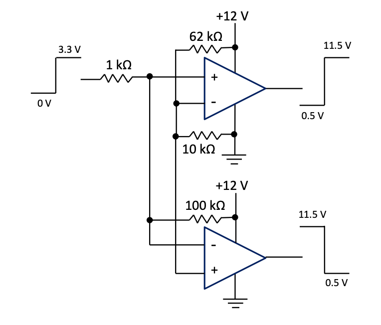

# Chapter 3: Interfacing with Digital Systems

At the end of Chapter 1, the example of a MOSFET H-bridge was given, and it was mentioned that a microcontroller output with levels 0 V or 3.3 V can provide the Drive Signals for the H-bridge, because a level adjuster was already part of the circuitry given there. The 3.3 V level will however have to be increased if a BJT H-bridge is used.

Likewise, the inputs to microcontrollers must be designed to vary only between 0 V and 3.3 V if they are inputs to the A/Ds of micros, or they must have logical levels of 0 V or 3.3 V if they are logical inputs to micros. But the sensors or sensor circuitry could be producing voltages way beyond these levels.

Circuitry is required to do these.

## Level adjusters

A level adjuster must in principle do two things to a signal that must be inputted to a micro:

-   Add an offset voltage to the signal.
-   Multiply the signal with a gain (or an attenuation, but take note: attenuations are often also called gains, attenuation is a gain of less than 1.0).

Let's think of the original signal to be $x$ and the level adjusted signal to be $y$. The level adjuster must perform the following: $y = mx + c$ or $y = m(x +c)$.

Because differential amplifiers are often the best to use for level adjusters, the last equation is the best to use.

If $x$ can vary from $x_{min}$ to $x_{max}$, $y$ must vary from 0 to 3.3 V.

#### **Example 3.1**
\\
Let's say a sensor output can vary between -12 V and +12 V.

Assume that the supplies of -12 V and +12 V are available.

From $y = m(x + c)$ follows:

$$0 = m\*(-12 + c), and$$

$$3.3 = m\*(+12 + c)$$

Therefore $c = 12$, thus $m = \frac{3.3}{24}$.

Therefore $y = \frac{3.3}{24}$(x + 12) = $\frac{3.3}{24}$\[x -- (-12)\].

The following circuit would be good:

_Figure 3.1: Level adjuster based on differential amplifier_

> #### **Question 3.1:**
> Can 330 Ω and 2.4 kΩ also work?
> 
> Why are the chosen values better?
> 
> Can 3.87 kΩ and 28.15 kΩ also work?
> 
> Why are the chosen values better?

#### **Example 3.2**
\\
Let's say a sensor output can vary between -10 V and +10 V.

Assume that supplies of -5 V and +5 V are available for level adjuster circuitry.

Design the level adjuster circuitry suitable for connecting the sensor output to the A/D of a micro.

Indicate the supply voltages to the op-amp(s).

Similar to what we've done in Example 3.1, the required solution is:

$$y = \frac{3.3}{20}(x + 10) = \frac{3.3}{20}(x - (-10))$$

A general differential amplifier as shown below would work. Make sure you can analyse and design it.

_Figure 3.2: Level adjuster based on a differential amplifier_

Applying the equation
$$V_{3} = V_{2}\frac{R3}{R1}\left( \frac{1 + \frac{R1}{R3}}{1 + \frac{R2}{R4}} \right) - V_{1}\frac{R3}{R1}$$

that was derived before for the general differential amplifier, yields
$$V_{3} = y,\ V_{2} = x,\ V_{1} = - 5:$$

$$y = x\frac{3.3k}{10k}\left( \frac{1 + \frac{10k}{3.3k}}{1 + \frac{23.3k}{3.3k}} \right) + 5\frac{3.3k}{10k}$$
$$= 0.33(0.5x + 5) = 0.165x --(-5)0.33$$

Test: $x = -10 V =\> y = 0\  V$ and $x = +10 V =\> y = 3.3\  V$

How were the resistors designed?

From the equations above follow: $\frac{R3}{R1} = 0.33$ and
$\frac{R3}{R1}\left( \frac{1 + \frac{R1}{R3}}{1 + \frac{R2}{R4}} \right) = 0.165$

Choose $R_{1} = 10\  k\Omega$, $\Rightarrow$ $R_{3} = 3.3\  k\Omega$

Therefore
$$\frac{3.3k}{10k}\left( \frac{1 + \frac{10k}{3.3k}}{1 + \frac{R2}{R4}} \right) = 0.165$$
Choose $R_{4} = 3.3\  k\Omega$, $\Rightarrow$ $R_{2} = 23.3 k\Omega = 20 k\Omega + 3.3\  k\Omega$

#### **Example 3.3**
\\
Let's say a sensor output can vary between -12 V and +12 V.

Assume that the supplies of -12 V and +12 V are available, but different from example 1, -12 V from the sensor must provide 3.3 V, and +12 V must provide 0 V.

From $y = m(x + c)$ follows:

$$0 = m\*(+12 + c),$$

$$3.3 = m\*(-12 + c)$$

Therefore $c = -12$, thus $m = - \frac{3.3}{24}$.

Therefore $y = - \frac{3.3}{24}(x - 12) = \frac{3.3}{24}(12 - x) = - \frac{3.3}{24}x - \frac{3.3}{24}( - 12)$.

From the last two representations, it can be seen that it can be implemented with either a differential amplifier and the +12 V as one input, or an inverting adder and the -12 V as the one input:

_Figure 3.3: Level adjusters based on a differential amplifier (a) and an inverting adder (b)_

{: .note }
You must be able to design similar level adjusters after changing the sensor voltage levels and available supplies in the examples above to anything realistic. Be careful of the supply voltages and always check whether all op-amps can deliver what it should with the given supplies.

## Gains and attenuations
Gains or attenuations (gain < 1.0) are often required and are simpler to implement than level adjusters:

-   If a gain of more than one is required, and it must be non-inverting, a non-inverting amplifier is suitable.

-   If an attenuation is required, and it must be non-inverting, two inverting amplifiers in series can be considered.

Comparators can also be used to effectively get required gains or attenuations. The supply voltages to the comparators will then determine the output levels.

The following circuit will change 0 V and 3.3 V levels to about 0 V and 12 V respectively. It will also produce the inverse of the first comparator's output. This is required if drive signal 1 and drive signal 2 are required to drive a BJT H-bridge in the mode where the one must be the inverse of the other.

_Figure 3.4: Level adjuster based on two comparators_

The $10 \  k\Omega$ and $62 \  k\Omega$ were calculated to produce a reference voltage of about half the 3.3 V on one of the inputs of each of the two comparators.

The $1 \  k\Omega$ and $100 \  k\Omega$ were practically found to let the comparators always function correctly, because they prevent the inputs to the comparators to be too close to the 0 V of the comparators' supply voltage when the input signal is at 0 V.
