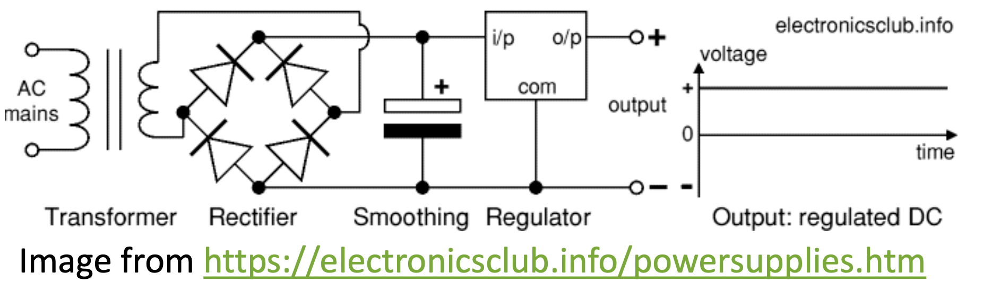
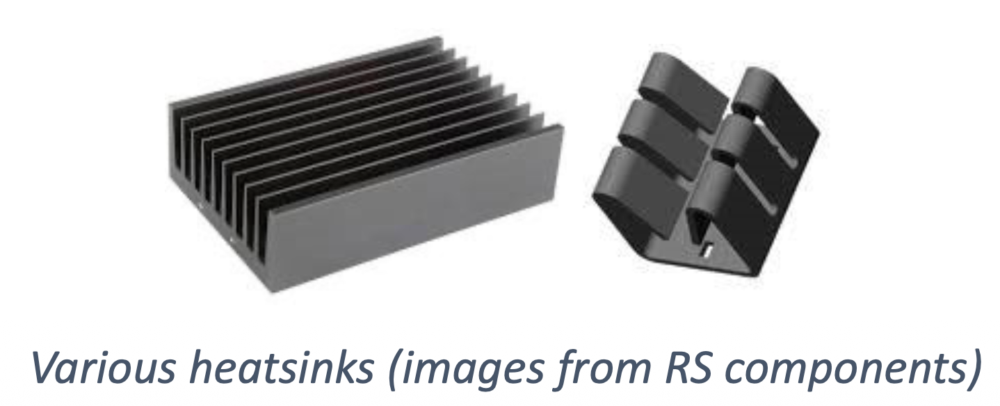
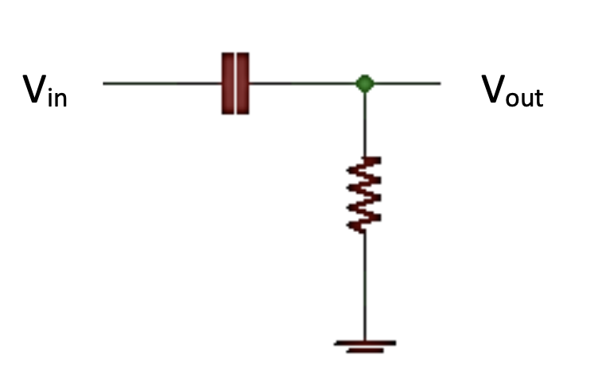
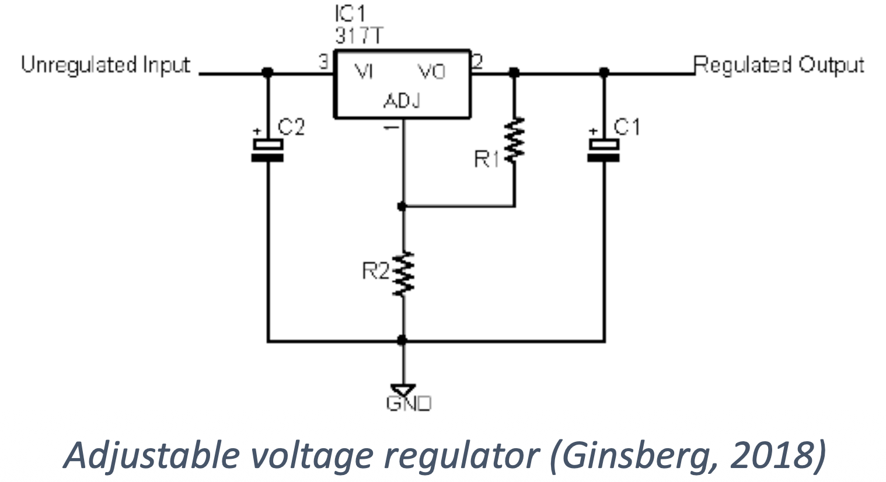
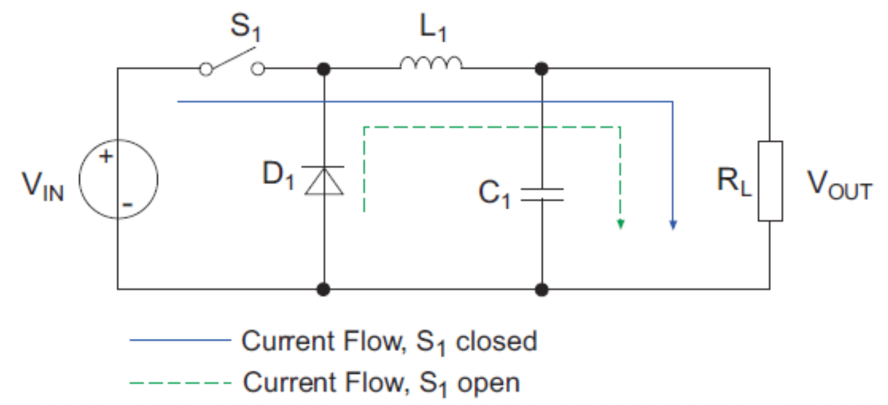
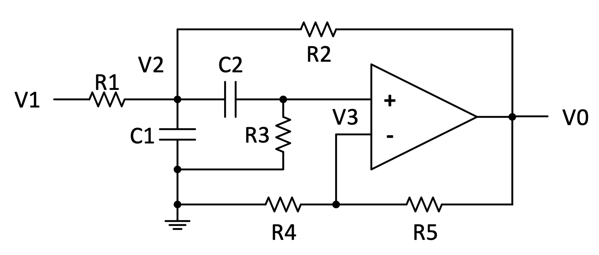
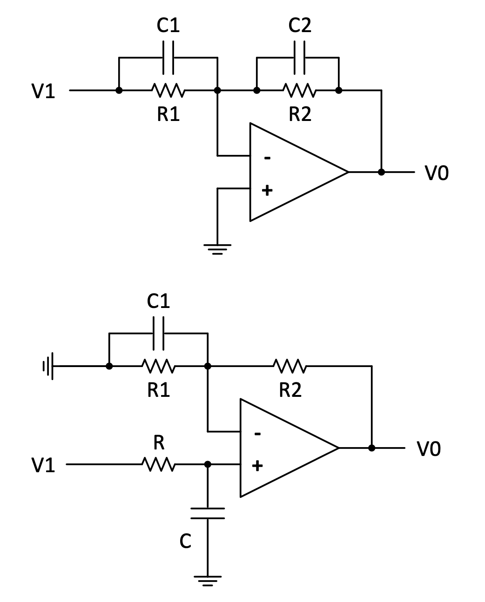

# Chapter 5: Filter Circuits

Often, we have small signals which we need to measure. We need to apply
some special techniques in order to preserve these.

## Noise

Noise is one of the biggest problems we have in dealing with small
signals. We have 2 basic types of noise:

_Figure 4.1: Noise types_

Of course, ideal properties are shown on the graphs -- in practice the
noise will taper off against frequency, and single frequencies will have
harmonics (multiples of the base frequency) as well. The best approach is to try and stop the noise from getting into the
system and thus eliminate it completely. Noise comes from several sources. It can be radiated into a system or it
can be generated by components.

Internal noise or component noise consists of:

-   Thermal noise: Any temperature above absolute zero causes electrons
    to move resulting in thermal noise. This can be reduced by cooling
    down the system.

-   Shot Noise: This noise is caused by the nature of current being the
    movement of discrete charged particles (electrons).

The bigger the resistance of the component the greater the generated
noise.

If we choose our components carefully then we can often reduce noise. If
high amplification is needed then good quality, low noise components
should be used. For example the LM358 op-amp has high noise, but the
Ne5532 has low noise. The same can be found with transistors.

External or radiated noise is most common around 50 Hz which is radiated
by power conductors. The best way of minimizing this noise is to
properly shield your system, including cables, connectors and circuitry.

The simplest method is to place a shield around cables as shown below or
use metal casings. There are different quality shields available and
some will perform better against noise than others.

_Figure 4.2: Shielded cable_

Notice that the shield is connected to ground. Some systems use the
shield to carry signals; then it won't be connected to ground.

We can get even better performance using an impedance balanced
differential system. This is done by adding a resistor in the ground
line below, with resistance equal to the output resistance of the signal
line.

_Figure 4.3: Impedance balanced differential system_

Any noise that affects line A will also affect line B likewise, not only
because they are close together (where twisting them will help even
more), but also because they are impedance matched.

The following diagram explains how impedance matching reduces noise.

_Figure 4.4: Impedance matching_

The common noise in line A and line B will be eliminated by the
differential amplifier.

Without the added R in the lower line, the output would have been
Gain\*\[S\*Z/(Z+R) + N\*R/(Z+R)\] because there would have been no noise
in the lower line.

The best system is to use an impedance matched shielded differential
system.

_Figure 4.5: Instrumentation amp applied to a differential system in a shielded cable_

Instrumentation amps are great for balanced systems. They can provide
good quality differential outputs. Ability to reject common signals on a
differential amp is called "common mode rejection ratio" CMRR. The
better the CMRR specification the better your circuit will reject noise.

Even if we use properly connected and shielded cables, we may still get
noise in our system which will have to be removed. One method to do this
is by using filters.

## Decoupling Capacitors, Capacitive Coupling

You can use decoupling capacitors to smooth off noise from supplies or
certain parts of the circuitry. They are connected between the supply
and ground. In principle they are like the $1^{st}$ low-pass filter
discussed below, with the internal resistance of the power supply acting
as the resistor.

Some devices are noisier than others. Anything that switches high
current will create noise. Motors are particularly noisy. It is common
practise to use more than one capacitor to eliminate noise. Small
capacitors are more effective for high frequency, low amplitude noise,
while larger ones are better for slow, larger amplitude signal changes.
Physical proximity must be considered as well.

You can also enclose each noisy module in a metal box, which will
further shield other circuitry from the effects of noise.

Capacitive coupling is when the DC component in a signal is to be taken
out while the AC components must pass. This is done by inserting a
capacitor in a line in series with the circuitry following. In principle
this is like the $1^{st}$ high-pass filter discussed below.

## Filter Revision

There are four types of filters we will discuss here. The first two you
should have come across before. They are the low-pass filter, and the
high-pass filter. The last two will be the band-pass filter and the
notch filter. A summary of the basic transfer functions of all 4 these
filters are given at the end of this chapter.

### The low-pass filter

_Figure 4.6: Low-pass filter circuit_

To analyze a filter we look at its behavior at DC and at an infinite AC
frequency.

At DC, there will be a steady voltage at the capacitor (the capacitor
charges and holds its voltage). This voltage will be present at the
output. Thus at low frequencies $V_{out}$ is almost equal to $V_{in}$.

At very high frequencies the capacitor becomes a short circuit to
ground. This means that no voltage will be present at the output.

This filter passes the low frequency signals but reduces the high
frequency signals which is why it is called a low-pass filter. It would
be used if the frequency of the noise in the system is high. You can set
the frequency at which this filter blocks the voltage by choosing
different resistor and capacitor combinations.

If we plot the frequency response for a low-pass filter we see that the
tail, or end of the graph takes up the most space. However, if we plot
the same graph over a logarithmic scale we get a much more convenient
result. The Bode plot of a low-pass filter is shown below. 

_Figure 4.7: Bode plot of a low-pass filter_

The transfer function of this low-pass filter is:

{: .note }
$$\frac{V_{out}}{V_{in}} = \frac{\frac{1}{sC}}{R+\frac{1}{sC}} = \frac{1}{1 + sRC} = \frac{1}{\tau s + 1} = \frac{\omega}{s + \omega}$$

This is a $1^{st}$ order low-pass filter with bandwidth or cut-off
frequency $\omega = \frac{1}{RC}$ rad/s and low frequency gain of 1.

$\mathbf{\frac{\omega}{s + \omega}}$ **is the form of a $1^{st}$ order low-pass filter with a DC gain of 1.**

Note that a load like a resistor to ground will change the transfer of
this filter, so a load connected to this must be of high impedance or
the transfer must be calculated with the load taken into account.

### The high-pass filter

_Figure 4.8: High-pass filter circuit_

At very high frequencies the capacitor becomes a short circuit from the
input to the output. This means that $V_{out}$ will closely match
$V_{in}$.

At DC, no current will be allowed through once the capacitor is charged
thus no voltage will be present at the output.

This filter passes the high frequencies but stops any low frequencies
which is why it is called a high-pass filter. This filter would be used
if the frequency of the noise in the system was low and you don't need
to pass on any DC signals. You can set the frequency at which this
filter blocks the voltage by choosing different resistor and capacitor
combinations. 

The Bode plot of a high-pass filter is shown below.

_Figure 4.9: Bode plot of a high-pass filter_

The transfer function of this high-pass filter is:

{: .note }
$$\frac{V_{out}}{V_{in}} = \frac{R}{R + \frac{1}{(sC)}} = \frac{sRC}{sRC + 1} = \frac{\tau s}{\tau s + 1} = \frac{s}{s + \omega}$$

This is a $1^{st}$ order high-pass filter with cut-off frequency
$\omega = \frac{1}{RC}$ rad/s and high frequency gain of 1.

$\frac{\mathbf{s}}{\mathbf{s + \omega}}$ **is the form of a $1^{st}$
order high-pass filter with a high frequency gain of 1.**

### Active $1^{st}$ order low-pass filter

_Figure 4.10: Active $1^{st}$ order low-pass filter circuit_

Unlike the passive filters above, this one is active because an op-amp
is part of it.

Start by looking carefully at the circuit. This is an inverting
amplifier with negative feedback with the addition of a capacitor. First
analyse this circuit at DC where the capacitor becomes an open circuit.
This means we can ignore it when considering DC and the circuit becomes
a standard inverting amplifier. If the gain is 1, Vout = Vin. This
circuit is very useful to add gain to the output apart from the
filtering, and can supply more current than the passive version.

Then analyse this circuit at very high frequencies where the capacitor
becomes a short circuit. This means all the current flows through C and
none through R2. Since the voltage at the inverting input is zero, the
output will be zero.

Clearly there will be a range of frequencies between infinite AC
frequency signals and DC signals. For these the capacitor will allow
varying amounts of current to flow, reducing the gain of the output.

Apply the short-cut method:

$$0 = V_{in}\left( \frac{1}{R_{1}} \right) + V_{out}\left( \frac{1}{R_{2}} \right) + V_{out}(sC)$$

{: .note }
$$\Rightarrow \frac{V_{out}}{V_{in}} = - \frac{\frac{1}{R_{1}}}{\frac{1}{R_{2}} + sC} = - \frac{\frac{R_{2}}{R_{1}}}{sR_{2}C + 1} = \frac{K}{\tau s + 1} = \frac{K\omega}{s + \omega}$$

This is a $1^{st}$ order low-pass filter with bandwidth or cut-off
frequency $\omega = \frac{1}{R_{2}C}$ rad/s and low frequency gain
of $- \frac{R_{2}}{R_{1}}$.

$\frac{\mathbf{K\omega}}{\mathbf{s + \omega}}$ **is the form of a $1^{st}$
order low-pass filter with a DC gain of *K*.**

Check the correlation and differences between this filter and the $1^{st}$
order low-pass filter in Chapter 2.

#### **Example 4.1**
\\
$$\frac{V_{out}}{V_{in}} = - \frac{\frac{R_{2}}{R_{1}}}{sR_{2}C + 1} = - \frac{\frac{1}{R_{1}C}}{s + \frac{1}{R_{2}C}} = \frac{K\omega}{s + \omega}$$

**Specifications**: Cut-off frequency of 80 Hz, $\omega = 2\pi80 = 502.7 \ rad/s$

Gain K = -5.0

There are 3 unknowns (components *R1, R2* and *C*), 2 equations,
therefore 1 component can be chosen and the remaining 2 components can
be calculated and selected from the E12 series -- as close as possible
or using two instead of one component.

$\frac{1}{R_{1}C} = 5.0 \times 502.7$ and $\frac{1}{R_{2}C} = 502.7$

Choose *C* = 10 nF, $\Rightarrow R_{1} = 39.79 \ k\Omega$, therefore choose
$R_{1} = 39 \ k\Omega$.

$R_{2} = 198.9 \ k\Omega$, therefore choose $R_{2} = 200 \ k\Omega$ (or 100 k$\Omega$ + 100 k$\Omega$).

Therefore the design results are: $R_{1} = 39 \ k\Omega$, $R_{2} = 200 \ k\Omega$, C = 10 nF

Check:

Resulting design parameters: \\
$\omega = \frac{1}{R_{2}C} = 2\pi \times 79.58 = 499.8 \ rad/s$, \\
$K = - \frac{1}{R_{1}C} \times \frac{1}{2\pi 79.58} = - 5.13$

They are close to the specifications.

$\omega\ \%\ error = \frac{79.58 - 80}{80} \times 100\% = - 0.52\%$

$K\ \%\ error = \frac{- 5.13 - ( - 5.0)}{- 5.0} \times 100\% = + 2.6\%$

$|K|\ \%\ error = \frac{5.13 - 5.0}{5.0} \times 100\% = + 2.6\%$

### Active $2^{nd}$ order low-pass filter

_Figure 4.11: Active $2^{nd}$ order low-pass filter circuit_

The transfer function for an active $2^{nd}$ order low-pass filter can be calculated with the short-cut method:

$V_{3}(1/R_{1} + 1/R_{2}) = V_{4}(1/R_{2})$; and

$V_{3}(1/R_{1} + sC) = V_{2}(1/R)$

$\Rightarrow V_{3} = V_{4}\frac{R_{1}}{R_{1}+R_{2}}$ and

$V_{4}\frac{R_{1}}{R_{1} + R_{2}} = V_{2}\frac{1}{sRC + 1}$
$V_{2} = V_{4}\frac{R_{1}}{R_{1} + R_{2}}(sRC + 1)$

$V_{2}(1/R_{1} + 1/R_{2} + sC) = V_{1}(1/R_{1}) + V_{3}(1/R_{2}) + V_{4}sC$

$\Rightarrow V_{2}(2+sRC) = V_{1} + V_{3} + V_{4}sRC$

Substitute $V_{2}$ and $V_{3}$ in terms of $V_{4}$:

$V_{4}\frac{R_{1}}{R_{1} + R_{2}}(sRC + 1)(sRC + 2) - V_{4}\frac{R_{1}}{R_{1} + R_{2}} - V_{4}sRC = V_{1}$

Multiply all terms with $1+R_{2}/R_{1}=(R_{1}+R_{2})/R_{1}$:

$V_{4}\left\lbrack s^{2}(RC)^{2} + 3sRC + 1 - sRC\left( 1 + \frac{R_{2}}{R_{1}} \right) \right\rbrack = V_{1}(1 + \frac{R_{2}}{R_{1}})$

{: .note }
$$\Rightarrow \frac{V_{4}}{V_{1}} = \frac{1 + \frac{R_{2}}{R_{1}}}{s^{2}(RC)^{2} + sRC\left( 2 - \frac{R_{2}}{R_{1}} \right) + 1} = \frac{K\omega^{2}}{s^{2} + 2\zeta\omega s + \omega^{2}}$$

This is a $2^{nd}$ order low-pass filter with bandwidth or cut-off frequency $\omega = \frac{1}{RC}$ rad/s and low frequency gain $K = 1 + \frac{R_{2}}{R_{1}}$.

$\frac{\mathbf{K}\mathbf{\omega}^{\mathbf{2}}}{\mathbf{s}^{\mathbf{2}}\mathbf{+ 2}\mathbf{\zeta\omega s +}\mathbf{\omega}^{\mathbf{2}}}$ **is the form of a $2^{nd}$ order low-pass filter with a DC gain of *K*.**

Check:

$$\left.\frac{V_{4}}{V_{1}}\right\|_{s=0} = 1 + \frac{R_2}{R_1} \quad \checkmark$$

$$\left.\frac{V_{4}}{V_{1}}\right\|_{s\to \infty} \to 0 \quad \checkmark$$

NB:

Although these two checks pass, it is not to say that the transfer
function is in all aspects 100%. Before realizing all the components and
building it (that would be the ultimate test), it is always good to
double check your calculations. But if the simple checks fail, something
is obviously wrong.

### Active $1^{st}$ order high-pass filter

_Figure 4.12: Active $1^{st}$ order high-pass filter circuit_

This is an inverting amplifier with negative feedback with the addition
of a capacitor. First analyse this circuit at DC where the capacitor
becomes an open circuit. If the capacitor is an open circuit and the
voltage at the non-inverting input is zero, the output will be zero.

Then analyse this circuit at very high frequencies where the capacitor
becomes a short circuit. This is then a standard inverting op-amp and
$V_{out} = - \frac{R_{2}}{R_{1}}V_{in}$ at high frequencies.

Clearly for a frequency increase from DC to high, the capacitor will
allow varying amounts of current to flow, increasing the gain as the
frequency increases.

The transfer can be calculated with the short-cut method:

$0 = V_{in}{[}1/(R_{1}+1/sC){]} + V_{out}(1/R_{2})$

{: .note }
$$\Rightarrow \frac{V_{out}}{V_{in}} = - \frac{R_{2}}{R_{1} + \frac{1}{sC}} = - \frac{sR_{2}C}{sR_{1}C + 1} = \frac{K\tau s}{\tau s + 1} = \frac{Ks}{s + \omega}$$

This is a $1^{st}$ order high-pass filter with time constant $\tau = R_{1}C$
and high frequency gain $K = - \frac{R_{2}}{R_{1}}$.

$\omega$ is again equal to $1/\tau$ and is called the cut-off frequency in
rad/s.

$\frac{\mathbf{Ks}}{\mathbf{s + \omega}}$ **is the form of a $1^{st}$ order
high-pass filter with a high frequency gain of $K$.**

Check:

$$\left.\frac{V_{out}}{V_{in}}\right\|_{s = 0} = 0 \quad \checkmark$$

$$\left.\frac{V_{out}}{V_{in}}\right\|_{s \to \infty} \to - \frac{R_2}{R_1} \quad \checkmark$$

Many other examples like $2^{nd}$ order high-pass filters, notch filters,
band-pass filters and higher order filters can be analysed.

### Active band-pass filter

_Figure 4.13: Active band-pass filter circuit_

Can you see that the gains at very low and very high frequencies will
approach zero?

Apply the short-cut method:

$V_{m}(1/R_{1} + 1/R_{2} + sC_{1} + sC_{2}) = V_{1}(1/R_{1}) + V_{2}(sC_{1})$;
and

$0 = V_{m}(sC_{2}) + V_{2}(1/R_{3})$

Get rid of $V_{m}$:

$- \frac{V_{out}}{sR_{3}C_{2}}\left\lbrack \frac{1}{R_{1}} + \frac{1}{R_{2}} + s\left( C_{1} + C_{2} \right) \right\rbrack - V_{out}sC_{1} = V_{in}/R_{1}$

Multiply all terms with $sR_{1}R_{2}R_{3}C_{2}$:

$- V_{out}\left\lbrack R_{2} + R_{1} + sR_{1}R_{2}\left( C_{1} + C_{2} \right) + s^{2}R_{1}R_{2}R_{3}C_{1}C_{2} \right\rbrack = V_{in}sR_{2}R_{3}C_{2}$

{: .note }
$$\Rightarrow \frac{V_{out}}{V_{in}} = \frac{- s\frac{1}{R_{1}C_{1}}}{s^{2} + s\frac{C_{1} + C_{2}}{R_{3}C_{1}C_{2}} + \frac{R_{1} + R_{2}}{R_{1}R_{2}R_{3}C_{1}C_{2}}} = \frac{2\zeta\omega Ks}{s^{2} + 2\zeta\omega s + \omega^{2}}$$

This is a band-pass filter, with resonance frequency $\omega = \sqrt{\frac{R_{1} + R_{2}}{R_{1}R_{2}R_{3}C_{1}C_{2}}}$ in rad/s and damping $\zeta$.

The damping will determine the width of the passing band.

$K$ is the gain at frequency $\omega$ and can be proven to be so by
substituting *s = i$\omega$* in the last equation.

$\frac{\mathbf{2}\mathbf{\zeta\omega Ks}}{\mathbf{s}^{\mathbf{2}}\mathbf{+ 2}\mathbf{\zeta\omega s +}\mathbf{\omega}^{\mathbf{2}}}$
**is the form of a $2^{nd}$ order band-pass filter with gain *K* at
frequency *ω*.**

Check:

$$\left.\frac{V_{2}}{V_{1}}\right\|_{s = 0} = 0 \quad \checkmark$$

$$\left.\frac{V_{2}}{V_{1}}\right\|_{s \to \infty} \to 0 \quad \checkmark$$

$$\left.\frac{V_{2}}{V_{1}}\right\|_{s = i\omega} = - \frac{R_3C_2}{R_1\left( C_1 + C_2 \right)} \quad \checkmark$$

and this can be proven to be equal to the *K* defined above.

The Bode plot of a band-pass filter is shown below.

_Figure 4.14: Bode plot of a band-pass filter_

#### **Example 4.2**
\\
$$\frac{V_{2}}{V_{1}} = \frac{- s\frac{1}{R1C1}}{s^{2} + s\frac{C1 + C2}{R3C1C2} + \frac{R1 + R2}{R1R2R3C1C2}} = \frac{2\zeta\omega Ks}{s^{2} + 2\zeta\omega s + \omega^{2}}$$

**Specifications**: Centre frequency of 70 Hz,
$\omega = 2\pi \times 70 = 439.8$ rad/s

Damping $\zeta = 0.5$

Gain $K = -3.5$

There are 5 unknowns (components $R_{1}$, $R_{2}$, $R_{3}$, $C_{1}$ and $C_{2}$), 3 equations, therefore 2 components can be chosen and the remaining 3 components can be calculated and selected from the E12 series.

A set of design results is: $R_{1} = R_{2} = 10 k\Omega$

$R_{3} = 43 k\Omega$, $C_{1} = 68 nF$, $C_{2} = 0.39 \mu F$

Check:

Resulting design parameters, following from the equations above:

$\omega = \sqrt{\frac{R_{1} + R_{2}}{R_{1}R_{2}R_{3}C_{1}C_{2}}} = 2\pi \times 66.65$ rad/s,

$\zeta = \frac{\frac{C_{1} + C_{2}}{R_{3}C_{1}C_{2}}}{2\omega} = 0.48$, with
$\omega = 2\pi \times 66.65$ rad/s and

$K = - \frac{\frac{1}{R_{1}C_{1}}}{2\zeta\omega} = - 3.66$, with
$\zeta = 0.48$ and $\omega = 2\pi \times 66.65$ rad/s

Because of the particular 3 equations, the design parameters must be
determined in this specific sequence, because $\omega$ is only dependent
on the component values, then $\zeta$ is only dependent on this
calculated $\omega$ and components, and then $K$ is dependent on these
calculated $\omega$ and $\zeta$ and components.

[% errors]{.underline} (***check the signs!***):

$\% \omega$ error $= \frac{66.65 - 70}{70} \times 100\% = - 4.8\%$

$\% \zeta$ error $= \frac{0.48 - 0.5}{0.5} \times 100\% = - 4.0\%$

$\% K$ error $= \frac{- 3.66 - ( - 3.5)}{- 3.5} \times 100\% = + 4.6\%$

Here is a $2^{nd}$ example of a band-pass filter.

_Figure 4.15: Another active band-pass filter circuit_

> #### **Question 4.1**
>
> Derive the transfer function of the circuit in Figure 4.15:
>
> $\frac{V_{0}}{V_{1}}(s) = \frac{s\frac{1}{C_{1}R_{1}}\left( 1 + \frac{R_{5}}{R_{4}} \right)}{s^{2} + s\left\lbrack \frac{1}{R_{3}}\left( \frac{1}{C_{1}} + \frac{1}{C_{2}} \right) + \frac{1}{C_{1}}\left( \frac{1}{R_{1}} - \frac{R_{5}}{R_{2}R_{4}} \right) \right\rbrack + \frac{1}{C_{1}C_{2}R_{3}}\left( \frac{1}{R_{1}} + \frac{1}{R_{2}} \right)}$

### Notch filters

The above filters are useful if you have wide band noise. However
sometimes you need to eliminate a specific frequency such as 50 Hz. For
this you can use a notch filter.

**Active notch filter**:

This can be realized by adding the outputs of a low-pass and high-pass
filter.

_Figure 4.16: Active notch filter circuit_

From the equations for the active $1^{st}$ order low-pass and high-pass
filters follow:

$V_{1} = - \frac{\frac{1}{R_{1}C_{1}}}{s + \frac{1}{R_{1}C_{1}}}V_{in}$

$V_{2} = - \frac{s}{s + \frac{1}{R_{2}C_{2}}}V_{in}$

$V_{out} = - \left( V_{1} + V_{2} \right)$

$\therefore V_{out} = \frac{R_{3}}{R_{3}}\left( \frac{\frac{1}{R_{1}C_{1}}}{s + \frac{1}{R_{1}C_{1}}} + \frac{s}{s + \frac{1}{R_{2}C_{2}}} \right)V_{in} = \frac{\frac{1}{R_{1}C_{1}}\left( s + \frac{1}{R_{2}C_{2}} \right) + s\left( s + \frac{1}{R_{1}C_{1}} \right)}{\left( s + \frac{1}{R_{1}C_{1}} \right)\left( s + \frac{1}{R_{2}C_{2}} \right)}V_{in} = \frac{s^{2} + \left( \frac{2}{R_{1}C_{1}} \right)s + \frac{1}{R_{1}C_{1}R_{2}C_{2}}}{s^{2} + \left( \frac{1}{R_{1}C_{1}} + \frac{1}{R_{2}C_{2}} \right)s + \frac{1}{R_{1}C_{1}R_{2}C_{2}}}V_{in}$

{: .note }
$$\Rightarrow\frac{V_{out}}{V_{in}} = \frac{s^{2} + \left( \frac{2}{R_{1}C_{1}} \right)s + \frac{1}{R_{1}C_{1}R_{2}C_{2}}}{s^{2} + \left( \frac{1}{R_{1}C_{1}} + \frac{1}{R_{2}C_{2}} \right)s + \frac{1}{R_{1}C_{1}R_{2}C_{2}}} = \frac{s^{2} + 2\zeta_{1}\omega s + \omega^{2}}{s^{2} + 2\zeta_{2}\omega s + \omega^{2}}$$

$\mathbf{\frac{s^{2} + 2\zeta_{1}\omega s + \omega^{2}}{s^{2} + 2\zeta_{2}\omega s + \omega^{2}}}$
**is the form of a $2^{nd}$ order notch filter with DC and high frequency
gain of 1.**

The gains are:

-   At low frequency: 1.0

-   At notch frequency:
    $\frac{\zeta_{1}}{\zeta_{2}} = \frac{\frac{2}{R_{1}C_{1}}}{\frac{1}{R_{1}C_{1}} + \frac{1}{R_{2}C_{2}}}$

-   At high frequency: 1.0

The notch frequency is: $\omega = \sqrt{\frac{1}{R_{1}C_{1}R_{2}C_{2}}}$, in rad/s.

The Bode plot of a notch filter is shown below.

_Figure 4.17: Bode plot of a notch filter_

> #### **Question 4.2**
>
> What would you change to add some gain to this active notch filter?

#### **Example 4.3**
\\
$$\frac{V_{out}}{V_{in}} = \frac{s^{2} + \left( \frac{2}{R_{1}C_{1}} \right)s + \frac{1}{R_{1}C_{1}R_{2}C_{2}}}{s^{2} + \left( \frac{1}{R_{1}C_{1}} + \frac{1}{R_{2}C_{2}} \right)s + \frac{1}{R_{1}C_{1}R_{2}C_{2}}} = \frac{s^{2} + 2\zeta_{1}\omega s + \omega^{2}}{s^{2} + 2\zeta_{2}\omega s + \omega^{2}}$$

With $\zeta_{1}$, $\zeta_{2}$ and $\omega$ specified, there are 4
unknowns (components $R_{1}$, $R_{2}$, $C_{1}$ and $C_{2}$), 3 equations, therefore one
would think that 1 component can be chosen and the remaining 3
components can be calculated and selected (from the E12 series). However, in this case, the $\frac{\zeta_{1}}{\zeta_{2}}$
ratio can be specified, or any one of $\zeta_{1}$ or $\zeta_{2}$ but not
both. One has to work through this example to see this.

> #### **Question 4.3**

> You may try the following specifications:
>
> $\frac{\zeta_{1}}{\zeta_{2}} = 0.01$ and $\omega = 160$ rad/s

This type of restriction on specifications is not unique to some notch
filters, but can also occur with other filters depending on their
implementation configuration.

A notch filter can also be realized by subtracting a band-pass filter's
transfer function from a gain. The following circuit will do this:

_Figure 4.18: Active notch filter circuit formed by subtracting a band-pass filter's transfer function from a gain_

The transfer function is:
$\frac{V_{0}}{V_{1}} = \frac{1 + \frac{R_{7}}{R_{6}}}{1 + \frac{R_{5}}{R_{4}}} . \frac{s^{2} + \left\lbrack \frac{1}{R_{3}}\left( \frac{1}{C_{1}} + \frac{1}{C_{2}} \right) - \frac{R_{5}}{R_{4}} . \frac{1}{R_{1}C_{1}} \right\rbrack s + \frac{1}{R_{3}C_{1}C_{2}}\left( \frac{1}{R_{1}} + \frac{1}{R_{2}} \right)}{s^{2} + \frac{1}{R_{3}}\left( \frac{1}{C_{1}} + \frac{1}{C_{2}} \right)s + \frac{1}{R_{3}C_{1}C_{2}}\left( \frac{1}{R_{1}} + \frac{1}{R_{2}} \right)} = K\frac{s^{2} + 2\zeta_{1}\omega s + \omega^{2}}{s^{2} + 2\zeta_{2}\omega s + \omega^{2}}$

It was derived by first getting $\frac{V_{2}}{V_{1}}(s)$, similar to
what was done before because this part is a band-pass filter. Next, the
two short-cut method equations can be written down for $V_{n}$. From these 3
equations, by doing the algebra carefully, $\frac{V_{0}}{V_{1}}(s)$, can
be found.

#### **Example 4.4**
\\
In this case, all parameters can be specified, for example:

$K = 1$, $\zeta_{1} = 0.01$, $\zeta_{2} = 1.0$ and $\omega = 160$ rad/s.

From
$\omega^{2} = \frac{1}{R_{3}C_{1}C_{2}}\left( \frac{1}{R_{1}} + \frac{1}{R_{2}} \right)$,
choosing $R_{1} = R_{2} = 10k$ follows: $R_{3}C_{1}C_{2} = 7.8125e-9$.

Note that $2\zeta_{2}\omega = \frac{C_{1} + C_{2}}{R_{3}C_{1}C_{2}}$,
thus $C_{1} + C_{2} = 2.5e-6$.

This can be realized with 1.0 $\mu$F and 1.5 $\mu$F capacitors, but
smaller capacitors would be better. Choose therefore
$R_{1} = R_{2} = 100k$, therefore $R_{3}C_{1}C_{2} = 7.8125e-10$,
therefore $C_{1} + C_{2} = 2.5e-7$.

Let $C_{1} = 0.1 \mu F$, therefore $C_2 = 0.15 \ \mu F$, therefore
$R_{3} = 51k + 1k$.

$\frac{1}{R_{3}}\left( \frac{1}{C_{1}} + \frac{1}{C_{2}} \right) - \frac{R_{5}}{R_{4}} . \frac{1}{R_{1}C_{1}} = 2\zeta_{2}\omega$,
therefore $\frac{R_{5}}{R_{4}} = 3.173$.

Let $R_{4} = 47k$, therefore $R_{5} = 150k$.

$K = \frac{1 + \frac{R_{7}}{R_{6}}}{1 + \frac{R_{5}}{R_{4}}} = 1.0$,
therefore $\frac{R_{7}}{R_{6}} = 3.191$.

$\frac{1}{R_{3}}\left( \frac{1}{C_{1}} + \frac{1}{C_{2}} \right) - \frac{R_{5}}{R_{4}} . \frac{1}{R_{1}C_{1}} = 2\zeta_{2}\omega$,
therefore $\frac{R_{5}}{R_{4}} = 3.173$.

Let $R_{4} = 47k$, therefore $R_{5} = 150k$.

Let $R_{6} = 16k$, therefore $R_{7} = 51k$.

### Compensator networks

Compensators are used in control loop designs. How to design their time
constant values, is not covered in this course, but how to implement
them, and design the components to produce the time constants, are done
in this section.

In general, a compensator is of the form:
$k\frac{\tau_{1}s + 1}{\tau_{2}s + 1}$, with *k* a gain, $\tau_{1}$ the
lead time constant, and $\tau_{2}$ the lag time constant.

It can be implemented with either of the following circuits, the first
producing a negative gain, and the second not.

_Figure 4.19: Compensator networks_

> #### **Question 4.4**
>
> Calculate the transfer functions $\frac{V_{0}}{V_{1}}$ for the two circuits above.

The answers are:
$- \frac{R_{2}}{R_{1}} . \frac{sC_{1}R_{1} + 1}{sC_{2}R_{2} + 1}$
and
$\left( 1 + \frac{R_{2}}{R_{1}} \right)\frac{s\frac{C_{1}R_{1}R_{2}}{R_{1} + R_{2}} + 1}{sCR + 1}$  

### Summary of transfer functions of filters

In general, $\tau$ refers to the time constant (in s) associated with
the filter, $\omega$ with the resonance frequency or bandwidth (in
rad/s) of the filter, $\zeta$ with the damping factor, and $K$ with some
gain in the filter.

Low-pass filter, $1^{st}$ order:

{: .note }
$\frac{V_{out}}{V_{in}} = \frac{K}{\tau s + 1} = \frac{K\omega}{s + \omega}$

High-pass filter, $1^{st}$ order:

{: .note }
$\frac{V_{out}}{V_{in}} = \frac{K\tau s}{\tau s + 1} = \frac{Ks}{s + \omega}$

Low-pass filter, $2^{nd}$ order:

{: .note }
$\frac{V_{out}}{V_{in}} = \frac{K\omega^{2}}{s^{2} + 2\zeta\omega s + \omega^{2}}$

High-pass filter, $2^{nd}$ order:

{: .note }
$\frac{V_{out}}{V_{in}} = \frac{Ks^{2}}{s^{2} + 2\zeta\omega s + \omega^{2}}$

Band-pass filter, $2^{nd}$ order:

{: .note }
$\frac{V_{out}}{V_{in}} = K\frac{2\zeta\omega s}{s^{2} + 2\zeta\omega s + \omega^{2}}$

Notch filter, $2^{nd}$ order:

{: .note }
$\frac{V_{out}}{V_{in}} = K\frac{s^{2} + 2\zeta_{1}\omega s + \omega^{2}}{s^{2} + 2\zeta_{2}\omega s + \omega^{2}}$

The gain at $\omega$, can be determined by replacing s with i$\omega$.

Therefore, the gain at $\omega$ will e.g. be:

-   *K* for the $2^{nd}$ order band-pass filter

-   $K\frac{\zeta_{1}}{\zeta_{2}}$ for the notch filter
