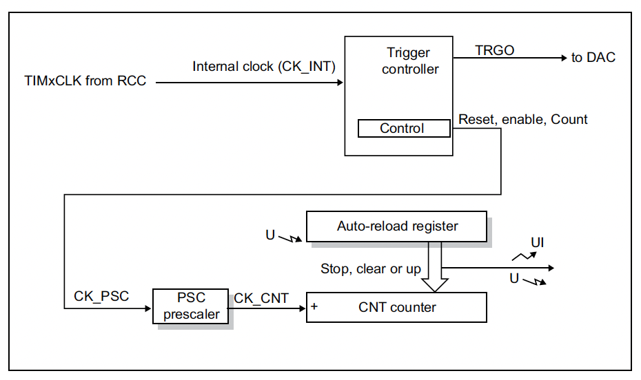

# Timer peripherals

Timers are a peripheral on the microcontroller that can be used to generate timing signals, measure the time between events, and control the timing of events. As a peripheral, they are not part of the CPU, but rather a separate component that is controlled by the CPU. They are configured by the programmer using registers, and once enabled, they operate independently of the CPU. This allows the programmer to use the CPU to do other things while the timer is running. In the past delays of desired durations may have achieved by using various loop structures, all of which, while effective, waste CPU resources by using the CPU to actively do the counting, preventing it from doing other things.

On the STM32F0 series of microcontrollers, there are 3 different types of timers available:

- Advanced-control timers (TIM1)
- General-purpose timers (TIM2, TIM3, TIM14-17)
- Basic timers (TIM6, TIM7)

Basic Timers, such as TIM6 and TIM7 on the STM32F0, are primarily intended for time-base generation purposes where they can trigger interrupts once a defined period has elapsed. However, a key distinction between them and the other timer types, is that they do not possess I/O channels, meaning they cannot directly engage with the GPIO pins based on timer charateristics. However, despite lacking I/O channels, they can trigger other peripherals. For instance, they can be used to adjust the pace of counting for a peripheral like an Analog-to-Digital Converter (ADC). They are fed by a clock and a trigger controller, which defines the counting period.

General-purpose Timers, such as TIM2, TIM3, TIM14-17, are more versatile and feature more advanced capabilities. Like basic timers, theyc can be used for elapsed time interrupt generation, but they can also be used to generate timing signals on certain GPIO pins and measure the time between events tracked by signal levels on a pin.

Finally, Advanced Timers feature all the capabilities of General-purpose Timers, but also are capable of achieving more more complex timing and control tasks. They support features like complementary PWM generation, which includes dead time insertions. This makes them particularly suitable for applications in areas like motor control, inverters, Switched-Mode Power Supplies (SMPSs), and other power electronics-related tasks where precise, often synchronous, control signals are required.

The overall and specific functional capabilities of the timers are described in Sections 17-21 of the STM32 Reference Manual.

# Timer peripheral architecture

The figure below shows the basic architecture of the timers on the STM32F0 series of microcontrollers. This particular diagram shows the TIM6 peripheral, which is a basic timer.

_Figure 9.1: Basic timer architecture [1]_

Breaking down the fundamental components of a timer and their operation using the basic timer block diagram above as our reference, firstly, each timer has a timing source, TIMxCLK which is the clock signal that drives the timer. On the STM32, these come from the APB prescaler of the Reset and Clock Control (RCC) peripheral. The RCC peripheral is responsible for controlling the clock signal that drives the timer, thus the rate of the signal fed into the timer determines the time resolution of the timer.

The clock signal is fed into a control unit, which is used to control the timer. This control unit is used to start and stop the timer, and to set the timer in different modes. For this course we will not consider the trigger capabilities of the timers. This clock signal is then fed into a prescaler under the signal name CK_PSC, which is used to divide the clock signal by a certain factor. This is controlled by the TIMx_PSC register. This has the effect of slowing down the rate of the clock signal fed into the timer, and thus the period of the clock signal. This divided signal, CK_CNT, is fed into the counter unit of the timer. The counter unit, CNT, is a digital counter that counts the number of clock pulses since the timer was started. Usually, the counter operaters in an up-counting manner, which means that it counts up from 0 to some maximum value of the counter. This maximum value is defined by the number of bits of the counter, which is 2^n - 1, where n is the number of bits of the counter. The timer can also be configured to count down, from this maximum value to 0. However, it is uncommon to use the timer's full range of counting; instead, the timer is configured to count to a specific value, which is defined by the programmer. This value is loaded into the timer's Auto-reload Register, TIMx_ARR.

So, the timer will count from 0 to TIMx_ARR, and then _overflow_ back to 0. The timer will then continue to count up from 0 to TIMx_ARR, and so on. This is the basis of the timer's operation. An overflow is the point at which the counter reaches the maximum value of the counter and then resets to 0. On the STM32F0, this is called an update event and an update event interrupt can be triggered when this occurs.

# Timer configuration

The timer peripheral is configured using a number of registers. The control registers are used to configure the timer into a desired mode and enable the timer. The prescaler and auto-reload value are set using the TIMx_PSC and TIMx_ARR registers respectively - These control the rate of counting and the number of counts before an overflow event occurs. Together, these two registers define the period of the timer.

The TIMx_PSC register is used to set the prescaler value, which is the factor by which the clock signal is divided. On the basic timers, this is a 16-bit register, so the maximum prescaler value is 65535. However, in order to prevent a division by 0, the prescaler value must prevented from being set to 0. Therefore, the prescaler uses a +1 offset - the value written to the register is incremented by 1 before being used as the prescaler value.

The TIMx_ARR register is used to set the auto-reload value, which is the value to which the counter will count before overflowing. This is also happens to be a 16-bit register on the basic timers, so the maximum auto-reload value is 65535.

Thus, the period of the timer is given by the equation:

$$T_{period} = (TIMx\_PSC + 1) \times (TIMx\_ARR + 1) \times T_{clock}$$

Where $T_{clock}$ is the period of the clock signal fed into the timer.
