# Communication Interfaces

## Table of Contents
{: .no_toc}

1. TOC
{:toc}

---

Microcontrollers rarely operate alone. They often need to exchange data with sensors, displays, motor drivers, other microcontrollers, and PCs. This chapter introduces the communication interfaces most commonly used in this course: UART/USART, I2C, and SPI.

{: .note}
The lecture slides used for this section are available [here](./slides/comms.pdf).

## Introduction to Communication

In an embedded system, data is often collected in one place and used somewhere else. A sensor may measure a temperature, a microcontroller may process the reading, and a display or PC may show the result. The communication interface is the set of electrical signals, timing rules, and data framing rules that allows those devices to exchange information reliably.

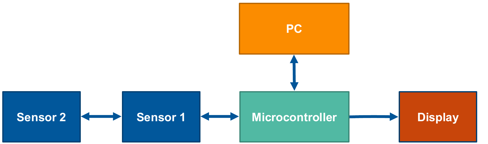
_Figure 12.1: Microcontrollers often exchange data with sensors, displays, PCs, and other peripherals_

At the highest level, digital communication can be either parallel or serial:

- **Parallel communication** sends multiple bits at the same time using multiple signal lines.
- **Serial communication** sends bits one after another using fewer signal lines.

Parallel communication can be fast over short distances, but it needs many pins and becomes awkward as systems grow. Serial communication is more common in small embedded systems because it uses fewer pins and is easier to route on a PCB. In this course we constrain ourselves to serial communication.

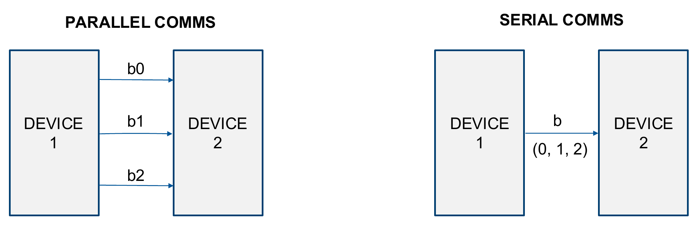
_Figure 12.2: Parallel communication sends multiple bits at once, while serial communication sends bits sequentially_

## Serial Communication Concepts

Serial communication protocols differ in how they time the data transfer, how many devices can share the bus, and whether data can move in both directions at the same time.

### Synchronous and Asynchronous Communication

In **synchronous communication**, the devices share a clock signal. The clock defines when the transmitter changes the data line and when the receiver samples it. SPI and I2C are synchronous protocols.

In **asynchronous communication**, there is no clock line. Both devices must be configured for the same bit timing before communication begins. UART is asynchronous, so both sides must agree on the baud rate, word length, parity, and stop-bit configuration.

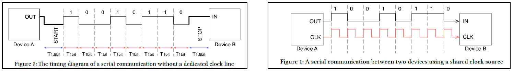
_Figure 12.3: Synchronous communication uses a shared clock, while asynchronous communication relies on preconfigured bit timing [2]_

| Type | Timing source | Typical protocols | Common signals |
|------|---------------|-------------------|----------------|
| Synchronous | Shared clock line | SPI, I2C | Data plus clock |
| Asynchronous | Preconfigured bit period | UART | TX and RX |

### Simplex, Half-Duplex, and Full-Duplex

The direction of communication also matters:

- **Simplex**: data moves in one direction only.
- **Half-duplex**: data can move in either direction, but not at the same time.
- **Full-duplex**: data can move in both directions at the same time.

UART is commonly used as a full-duplex point-to-point link with separate transmit and receive lines. I2C is a shared half-duplex bus. SPI is often full-duplex because data is shifted out and shifted in simultaneously.

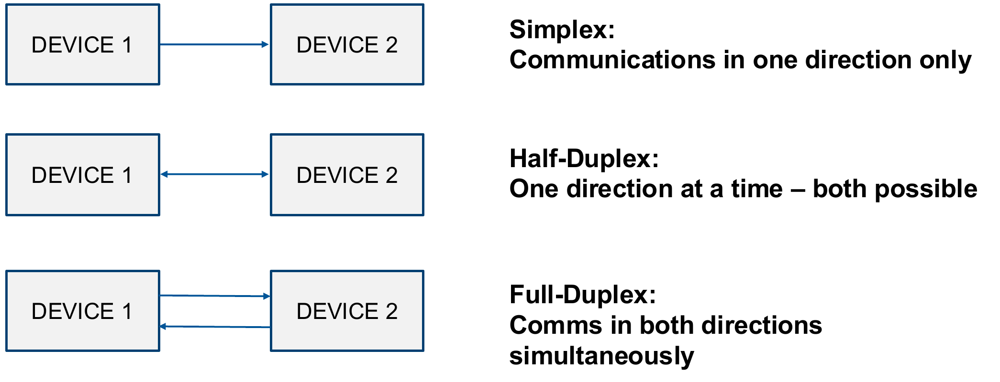
_Figure 12.4: Simplex, half-duplex, and full-duplex communication directions_

### Packet Structure

Most communication protocols wrap the useful data in some form of packet or frame. A simple packet structure contains:

1. A start condition or start symbol.
2. The data field, usually grouped into bytes or words.
3. Optional error checking, such as parity.
4. A stop condition or stop symbol.

The exact meaning of the start and stop conditions depends on the protocol. In UART these are bit levels inside a frame. In I2C they are transitions on the SDA line while SCL is high.

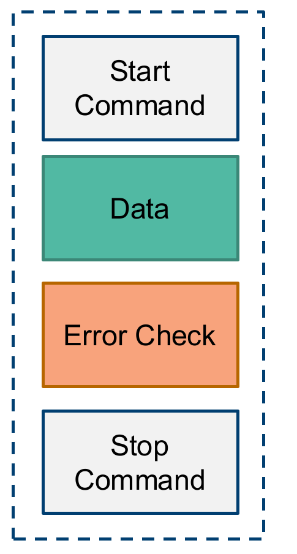
_Figure 12.5: Simple packet structure containing a start command, data, optional error check, and stop command_

## UART and USART

UART stands for Universal Asynchronous Receiver Transmitter. Strictly speaking, UART is not a complete communication standard. It is the hardware block that serialises parallel data into bits for transmission and deserialises received bits back into data.

The STM32F0 implements **USART** peripherals, not only UART peripherals. USART stands for Universal Synchronous/Asynchronous Receiver Transmitter. The STM32 USART can be configured for asynchronous UART-style communication, synchronous communication, and some related modes such as SPI-like operation. In this course, the USART is mainly used in asynchronous mode.

### UART Electrical Connection

A basic UART connection between two devices uses:

- `TX`: transmit line
- `RX`: receive line
- `GND`: shared reference voltage

The `TX` pin of one device connects to the `RX` pin of the other. Both devices must share a ground reference.

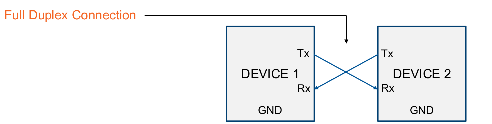
_Figure 12.6: UART full-duplex connection using crossed transmit and receive lines with a shared ground_

UART is normally used between two devices only. The idle state of the line is high, a start bit pulls the line low, the data bits follow, and the frame ends with one or more stop bits.

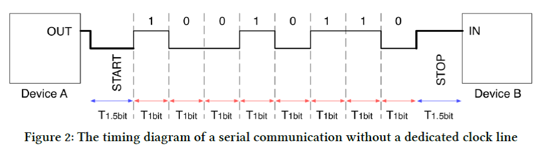
_Figure 12.7: UART frame timing with an idle high line, start bit, data bits, and stop bit [2]_

### Baud Rate

The baud rate defines the number of bit periods per second. Common baud rates include:

- `9600` bit/s
- `19200` bit/s
- `115200` bit/s

Both devices must use the same baud rate. If the transmitter and receiver are configured for different rates, the receiver will sample bits at the wrong times and the received data will be unreliable.

On the STM32F0, the USART baud-rate register is configured from the peripheral clock:

$$\text{USART_BRR} = \frac{f_{CK}}{\text{baud}}$$

For example, with a `48 MHz` USART clock and a baud rate of `115200` bit/s:

$$\text{USART_BRR} = \frac{48\,000\,000}{115\,200} \approx 417$$

which is `0x1A1` in hexadecimal.

### UART Frame Format and Parity

A typical UART frame contains:

1. An idle high state before transmission.
2. A start bit.
3. Data bits.
4. Optional parity bit.
5. One or more stop bits.

Parity is a simple error check. An extra bit is added so that the total number of `1` bits is either even or odd:

- **Even parity**: data bits plus parity bit contain an even number of `1`s.
- **Odd parity**: data bits plus parity bit contain an odd number of `1`s.


_Figure 12.8: UART packet structure when an error-checking parity field is included_

Parity can detect some single-bit errors, but it is not a complete data integrity mechanism.

## RS-232

RS-232 is an asynchronous serial communication interface standard that commonly uses UART data framing, but not STM32 logic-level voltages. The STM32 USART pins use logic levels around `0 V` and `3.3 V`. RS-232 uses larger inverted voltage levels:

- Logic high: approximately `-3 V` to `-15 V`
- Logic low: approximately `+3 V` to `+15 V`

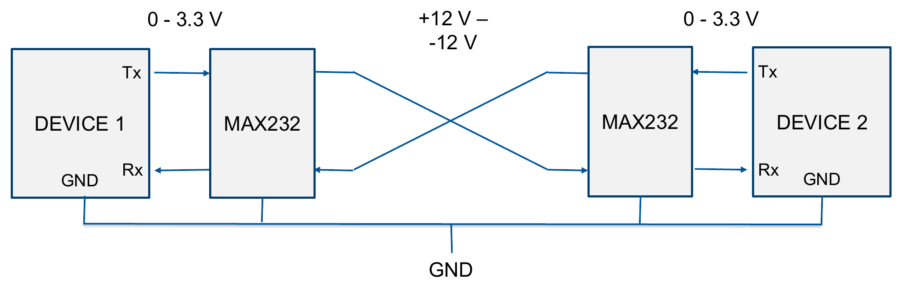
_Figure 12.9: RS-232 communication requires line drivers to translate between logic-level UART signals and larger RS-232 voltage swings_

Because of this voltage difference, an STM32 cannot connect directly to an RS-232 signal. A line-driver IC is required to translate between STM32 logic levels and RS-232 voltage levels. An example of this is the `MAX232`.

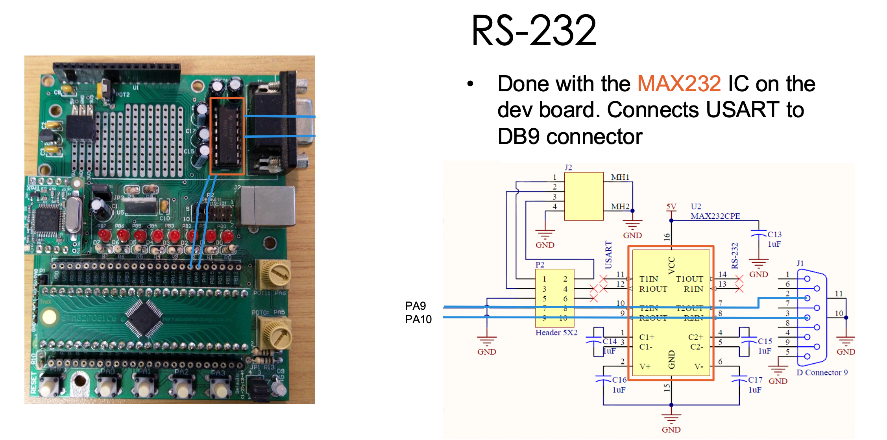
_Figure 12.10: MAX232 level-shifting circuit used to connect STM32 USART pins to an RS-232 connector_

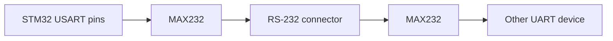
```mermaid
flowchart LR
    MCU[STM32 USART pins] --> L1[MAX232]
    L1 --> DB9[RS-232 connector]
    DB9 --> L2[MAX232]
    L2 --> DEV[Other UART device]
```

RS-232 can work over longer distances than direct logic-level UART because it uses a larger voltage swing. For short connections between two STM32 boards, direct UART-to-UART communication is possible if both boards use compatible logic levels and share a ground.

## USART on the STM32F0

The STM32F051 has two USART peripherals:

- `USART1`, clocked from `APB2`
- `USART2`, clocked from `APB1`

The transmit and receive pins must be configured as alternate-function GPIO pins before the USART can use them. On the course development board, `USART1` can be used on `PA9` and `PA10`, with alternate function `AF1`.

The USART registers used most often are:

- `USARTx_CR1`: control register 1, including USART enable, transmitter enable, receiver enable, parity, word length, and interrupt enables.
- `USARTx_CR2`: control register 2, including stop-bit configuration.
- `USARTx_BRR`: baud-rate register.
- `USARTx_ISR`: interrupt and status register.
- `USARTx_TDR`: transmit data register.
- `USARTx_RDR`: receive data register.

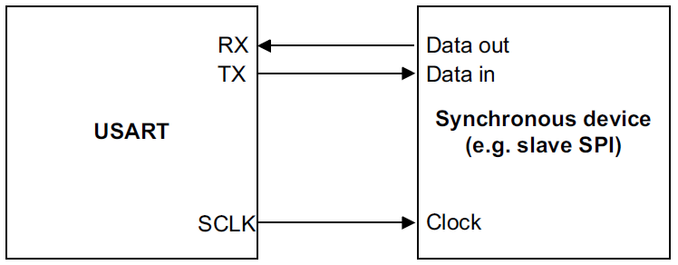
_Figure 12.11: USART hardware can support synchronous operation as well as asynchronous UART-style communication [1]_

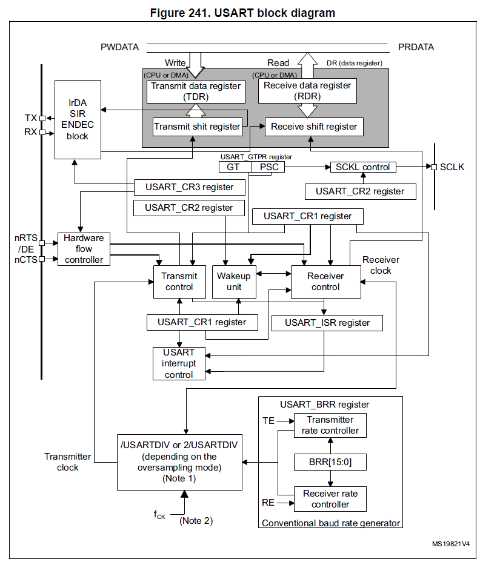
_Figure 12.12: STM32F0 USART data path and control logic [1]_

### USART Status Flags

The `USART_ISR` register contains flags that describe the state of the peripheral:

- `RXNE`: receive data register not empty. A byte has arrived and can be read from `RDR`.
- `TXE`: transmit data register empty. Software may write the next byte to `TDR`.
- `TC`: transmission complete. The last byte has fully left the transmitter.
- `PE`: parity error.

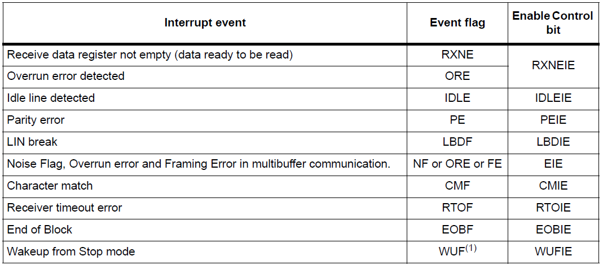
_Figure 12.13: Example USART interrupt events and the corresponding enable bits [1]_

When using interrupts, the interrupt handler should check the relevant flag before servicing the event, especially if more than one USART interrupt source has been enabled.

### USART Configuration Sequence

A typical asynchronous USART setup is:

1. Enable the GPIO clock.
2. Configure the TX and RX pins for alternate-function mode.
3. Select the correct alternate function in `GPIOx_AFR`.
4. Enable the USART peripheral clock.
5. Configure the baud rate in `USARTx_BRR`.
6. Configure word length, parity, and stop bits.
7. Enable transmitter and/or receiver mode.
8. Enable USART interrupts if needed.
9. Enable the USART by setting `UE`.

The following example configures `USART1` on `PA9` and `PA10` for `9600` bit/s, receive interrupts, transmit mode, and receive mode:

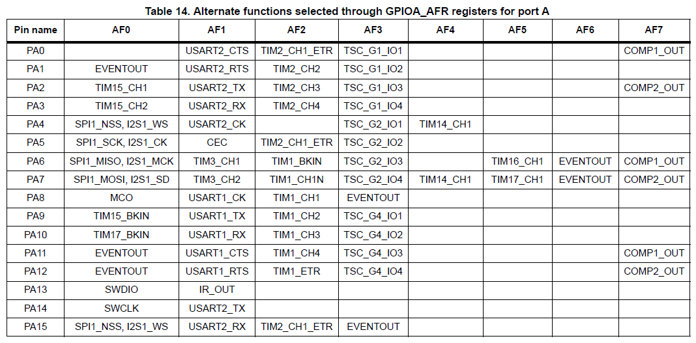
_Figure 12.14: Alternate-function pin mapping must be checked before selecting USART pins [3]_

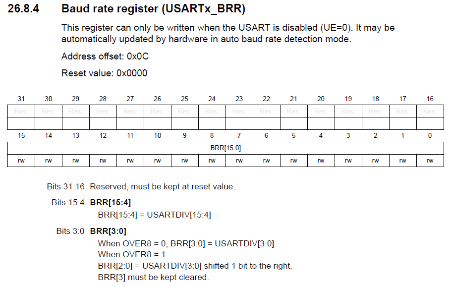
_Figure 12.15: USART baud-rate register used to configure the bit timing [1]_

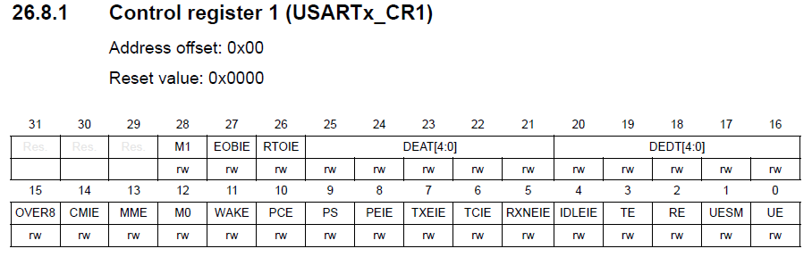
_Figure 12.16: USART control register 1 contains the USART enable, transmitter and receiver enables, parity settings, and interrupt enables [1]_

```c
void init_USART1(void)
{
    RCC->AHBENR |= RCC_AHBENR_GPIOAEN;       // Enable GPIOA clock

    GPIOA->MODER |= GPIO_MODER_MODER9_1
                 |  GPIO_MODER_MODER10_1;   // PA9, PA10 alternate function

    GPIOA->AFR[1] |= (1 << (4 * 1))          // PA9 is AFR[1] field 1
                  |  (1 << (4 * 2));         // PA10 is AFR[1] field 2

    RCC->APB2ENR |= RCC_APB2ENR_USART1EN;    // Enable USART1 clock

    USART1->BRR = 48000000 / 9600;           // Baud rate
    USART1->CR1 |= USART_CR1_RXNEIE;         // RXNE interrupt enable
    USART1->CR1 |= USART_CR1_TE | USART_CR1_RE;
    USART1->CR1 |= USART_CR1_UE;             // Enable USART

    NVIC_EnableIRQ(USART1_IRQn);
}
```

{: .note}
The USART must be disabled when configuring some frame settings, such as parity and word length. Check the reference manual before changing configuration bits while the peripheral is running.

### Transmitting Data

To transmit one byte, wait until `TXE` is set, then write the byte to `TDR`:

```c
void usart1_write_byte(uint8_t data)
{
    while ((USART1->ISR & USART_ISR_TXE) == 0);
    USART1->TDR = data;
}
```

`TXE` means the transmit data register can accept another byte. `TC` means the final bit of the previous transmission has completed on the line.

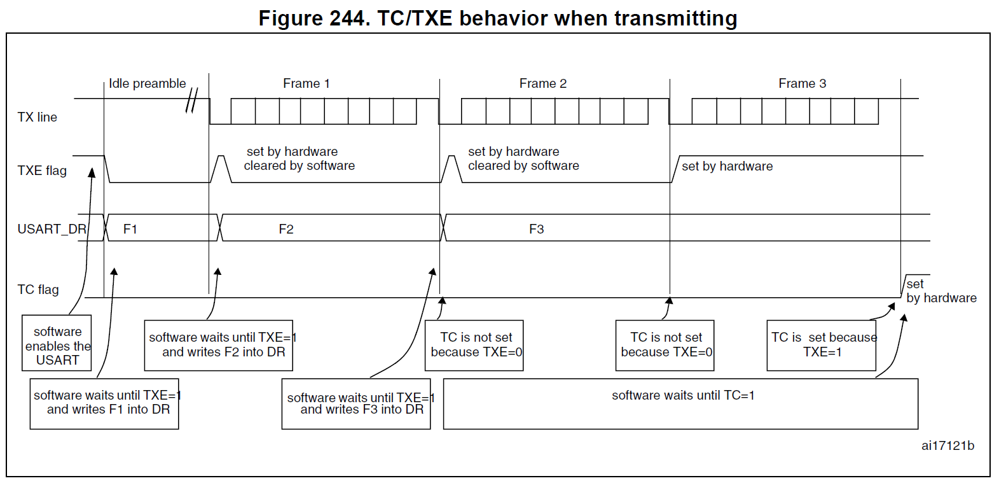
_Figure 12.17: UART transmit and receive mechanism, showing transmit and receive register behaviour_

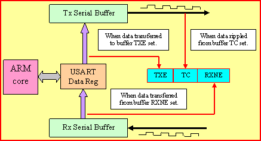
_Figure 12.18: Animated view of the UART transmit and receive buffer mechanism_

### Receiving Data with an Interrupt

The `RXNE` flag is raised when a received byte is available in `RDR`. Reading `RDR` clears `RXNE`.

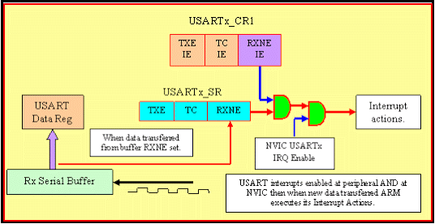
_Figure 12.19: Animated view of a UART receive interrupt being generated from received data_

```c
volatile uint8_t comm_data[2] = {0, 0};
volatile uint8_t counter = 0;
volatile uint8_t data_received = 0;

void USART1_IRQHandler(void)
{
    if (USART1->ISR & USART_ISR_RXNE)
    {
        comm_data[counter] = USART1->RDR;
        counter++;

        if (counter >= 2)
        {
            counter = 0;
            data_received = 1;
        }
    }
}
```

The main program can then respond once the full message has arrived:

```c
while (1)
{
    if (data_received)
    {
        usart1_write_byte(comm_data[0] + 1);
        usart1_write_byte(comm_data[1] + 1);
        data_received = 0;
    }
}
```

## I2C

I2C stands for Inter-Integrated Circuit. It is a synchronous two-wire bus used for communication between ICs on the same board or over short cable distances.

I2C uses two shared lines:

- `SCL`: serial clock line
- `SDA`: serial data line

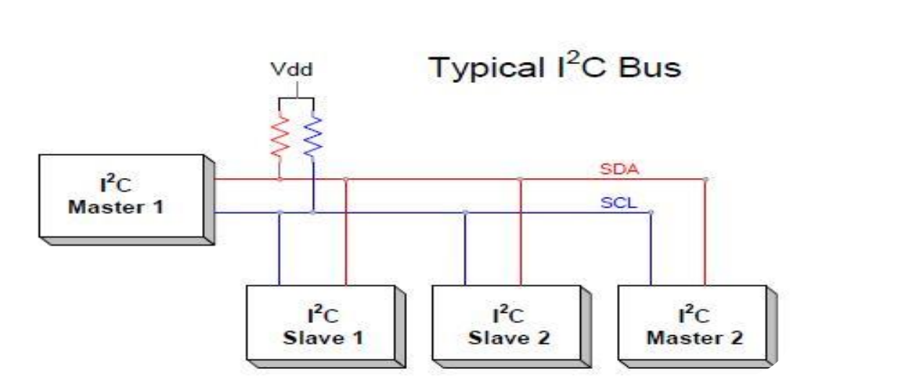
_Figure 12.20: Typical I2C bus topology with shared SDA and SCL lines and pull-up resistors_

Both lines are open-drain and require pull-up resistors. A device can pull the line low, but it does not actively drive the line high. The line returns high through the pull-up resistor when no device is pulling it low.

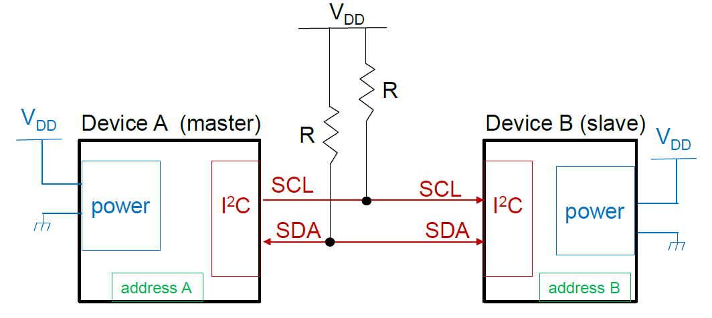
_Figure 12.21: I2C hardware connection using open-drain SCL and SDA lines with pull-up resistors_

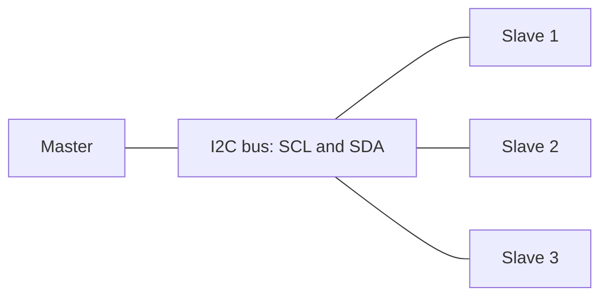
```mermaid
flowchart LR
    M[Master] --- BUS[I2C bus: SCL and SDA]
    BUS --- S1[Slave 1]
    BUS --- S2[Slave 2]
    BUS --- S3[Slave 3]
```

### I2C Bus Behaviour

I2C is a master-slave protocol. The master initiates communication and generates the clock. Each slave has an address, commonly a 7-bit address. The address frame is followed by a read/write bit:

- `0`: write to the slave
- `1`: read from the slave

A basic I2C transaction contains:

1. Start condition.
2. Slave address.
3. Read/write bit.
4. Acknowledge bit.
5. One or more data bytes.
6. Acknowledge or not-acknowledge bits.
7. Stop condition.

A **start condition** occurs when `SDA` falls while `SCL` is high. A **stop condition** occurs when `SDA` rises while `SCL` is high. During normal data transfer, `SDA` should only change while `SCL` is low.

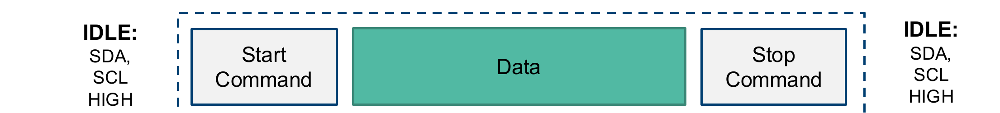
_Figure 12.22: High-level I2C packet structure, showing idle bus state, start command, data, and stop command_

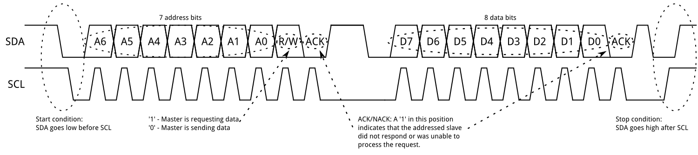
_Figure 12.23: I2C address and data frame structure [4]_

### Repeated Start

Some devices require more than one message without releasing the bus. For example, a master may first write a register address to a sensor, then read data from that register. In this case, the master can issue a repeated start instead of a stop condition.

A repeated start is simply another start condition before the previous transaction has been ended with a stop condition. The master keeps control of the bus.

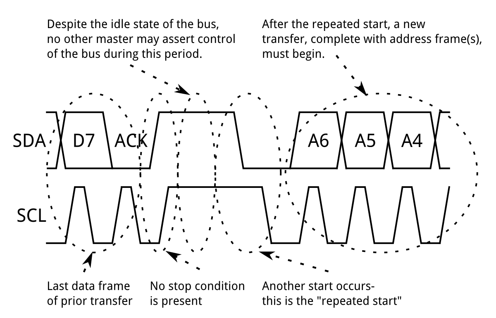
_Figure 12.24: I2C repeated-start timing [4]_

### Clock Stretching

An I2C slave may hold `SCL` low to delay the master. This is called clock stretching. It is used when the slave is not ready for the next bit or byte. For example, a sensor may stretch the clock while waiting for an internal conversion to complete.

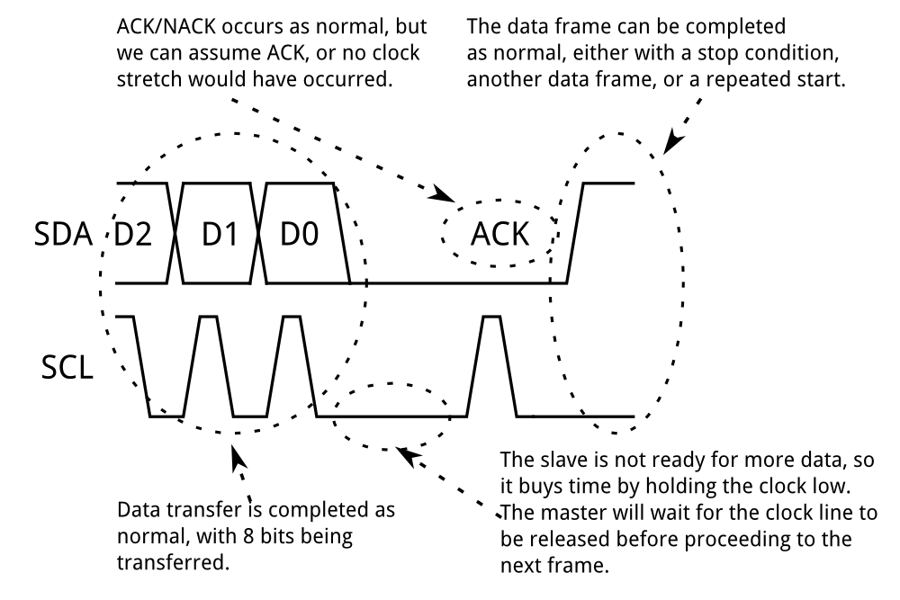
_Figure 12.25: I2C clock stretching allows a slave to hold SCL low until it is ready [4]_

### I2C Strengths and Limitations

I2C is useful because many devices can share the same two wires, and devices are selected in software using addresses. It also includes acknowledgement bits, so the master can detect whether a slave responded.

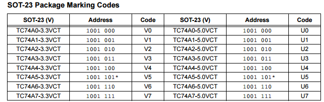
_Figure 12.26: I2C multi-slave addressing example_

The trade-offs are:

- It is intended for short distances.
- It is slower than SPI in most applications.
- The addressing and acknowledgement bits add overhead.
- A stuck-low bus line can prevent all bus communication.

Common I2C speeds include:

- Low speed: `10 kbit/s`
- Standard mode: `100 kbit/s`
- Fast mode: `400 kbit/s`

### I2C on the STM32F0

The STM32F0 includes two I2C peripherals. On the course board, useful pin mappings include:

- `I2C1` on `PB8` and `PB9`
- `I2C2` on `PB10` and `PB11`, or `PF6` and `PF7`

The I2C registers used most often are:

- `I2C_CR1`: peripheral enable and interrupt enables.
- `I2C_CR2`: slave address, transfer direction, start and stop generation, and number of bytes.
- `I2C_TIMINGR`: timing configuration.
- `I2C_ISR`: status flags.
- `I2C_RXDR`: receive data register.
- `I2C_TXDR`: transmit data register.

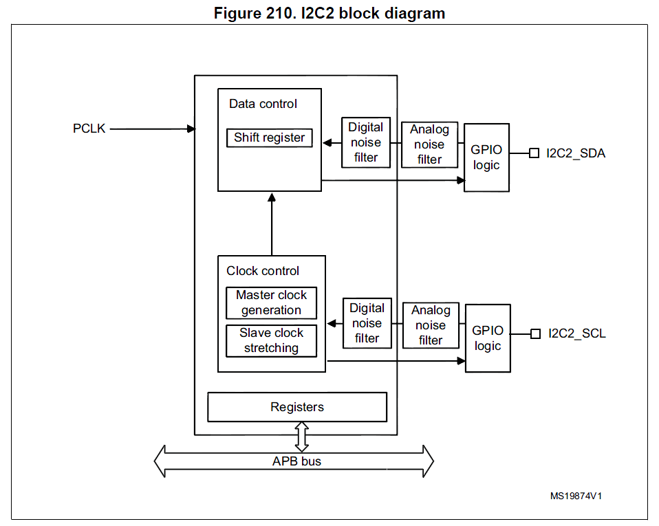
_Figure 12.27: STM32F0 I2C peripheral feature overview [1]_

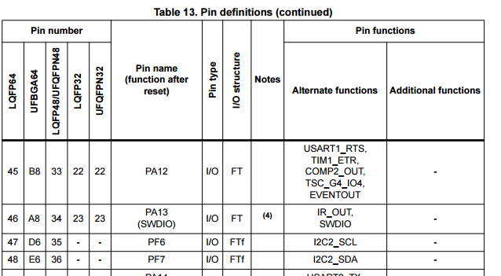
_Figure 12.28: I2C pin mapping must be checked in the datasheet before choosing pins [3]_

The timing register must be configured while the I2C peripheral is disabled.

### I2C Configuration Example

The following example configures `I2C2` on `PF6` and `PF7` for use as an I2C master. The timing values are representative values from the reference-manual style setup used in the lecture slides.

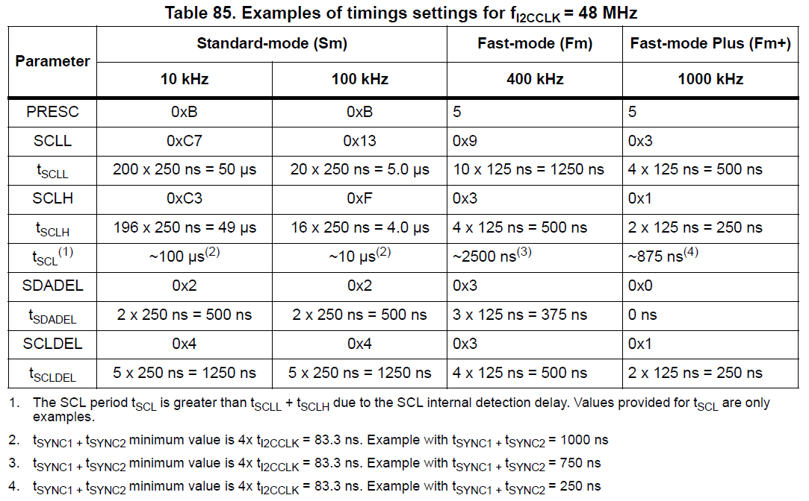
_Figure 12.29: I2C timing configuration values can be taken from the reference manual or calculated from the timing equations [1]_

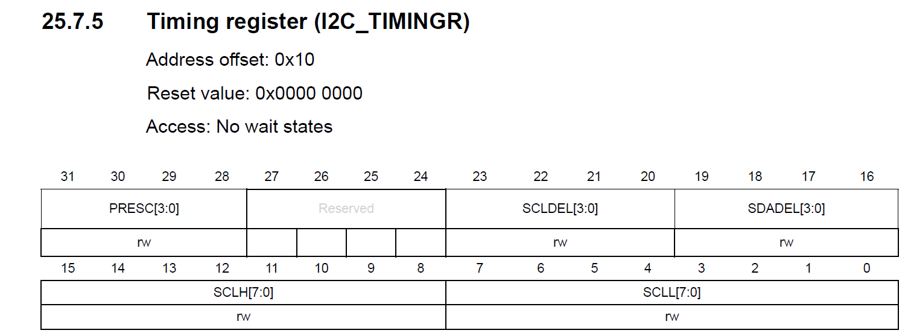
_Figure 12.30: I2C timing register fields used to set SCL low time, SCL high time, data setup time, data hold time, and prescaler [1]_

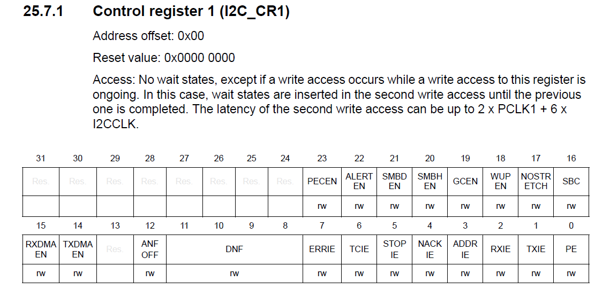
_Figure 12.31: I2C control register 1 contains the peripheral enable and interrupt enable bits [1]_

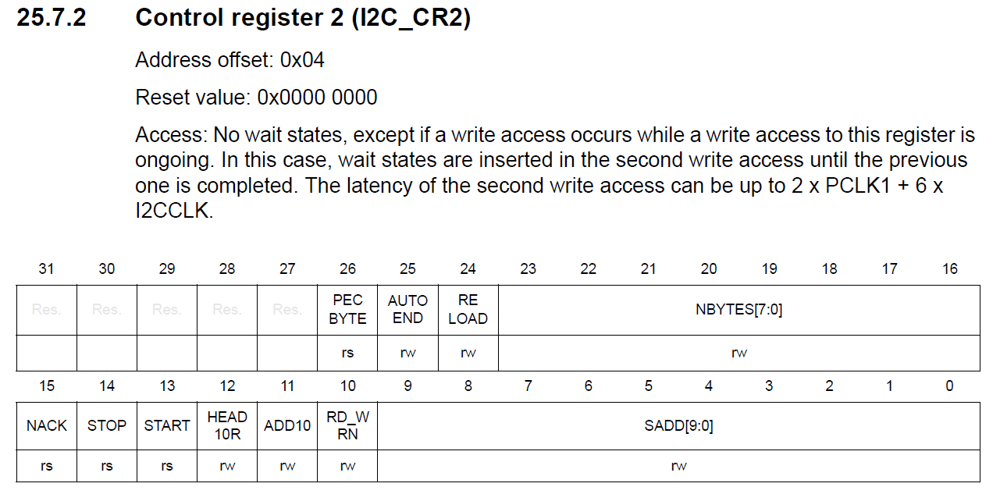
_Figure 12.32: I2C control register 2 contains address, transfer direction, start, stop, and byte-count fields [1]_

```c
void init_i2c2(void)
{
    RCC->AHBENR |= RCC_AHBENR_GPIOFEN;       // Enable GPIOF clock

    GPIOF->MODER &= ~(GPIO_MODER_MODER6 | GPIO_MODER_MODER7);
    GPIOF->MODER |= GPIO_MODER_MODER6_1
                 |  GPIO_MODER_MODER7_1;    // Alternate function mode

    GPIOF->OTYPER |= GPIO_OTYPER_OT_6
                  |  GPIO_OTYPER_OT_7;      // Open-drain outputs

    RCC->APB1ENR |= RCC_APB1ENR_I2C2EN;      // Enable I2C2 clock

    I2C2->CR1 &= ~I2C_CR1_PE;                // Disable before timing setup

    I2C2->TIMINGR = (0xC7 << 0)              // SCLL
                  | (0xC3 << 8)              // SCLH
                  | (0x02 << 16)             // SDADEL
                  | (0x04 << 20)             // SCLDEL
                  | (0x0B << 28);            // PRESC

    I2C2->CR1 |= I2C_CR1_PE;                 // Enable I2C
}
```

### I2C Read Example

The following code reads one byte from a TC74 temperature sensor. The TC74 has a 7-bit address of `0b1001000`.

```c
#define TC74ADDR 0b1001000

uint8_t tc74_read_temperature(void)
{
    I2C2->CR2 = 0;                           // Clear previous transfer setup
    I2C2->CR2 |= (TC74ADDR << 1);            // 7-bit address in SADD
    I2C2->CR2 |= (1 << 16);                  // NBYTES = 1
    I2C2->CR2 |= I2C_CR2_RD_WRN;             // Read transfer
    I2C2->CR2 |= I2C_CR2_START;              // Generate start

    while ((I2C2->ISR & I2C_ISR_RXNE) == 0);

    uint8_t temperature = I2C2->RXDR;

    I2C2->CR2 |= I2C_CR2_STOP;               // Generate stop

    return temperature;
}
```

In a robust application, the code should also check for acknowledgement failure and timeout conditions rather than waiting forever.

## SPI

SPI stands for Serial Peripheral Interface. It is a synchronous master-slave interface commonly used with displays, memory chips, ADCs, shift registers, and sensors.

SPI commonly uses four signals:

- `SCK`: serial clock, generated by the master.
- `MOSI`: master out, slave in.
- `MISO`: master in, slave out.
- `SS` or `NSS`: slave select.

The master pulls a slave-select line low to choose the slave, then generates clock pulses. Data is shifted out and shifted in as the clock runs.

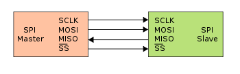
_Figure 12.33: SPI master-slave connection showing clock, MOSI, MISO, and slave-select signals_

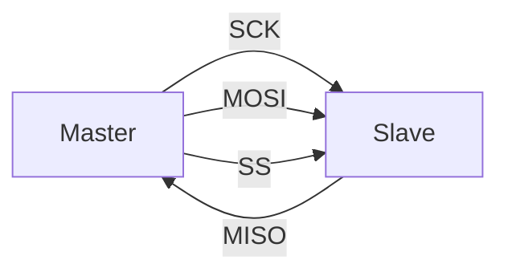
```mermaid
flowchart LR
    M[Master] -- SCK --> S[Slave]
    M -- MOSI --> S
    S -- MISO --> M
    M -- SS --> S
```

When there are multiple slaves, the `SCK`, `MOSI`, and `MISO` lines are often shared, but each slave usually needs its own select line.

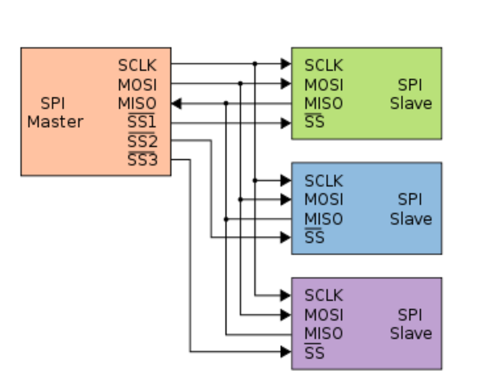
_Figure 12.34: SPI can share clock and data lines across multiple slaves, but each slave usually needs its own select line_

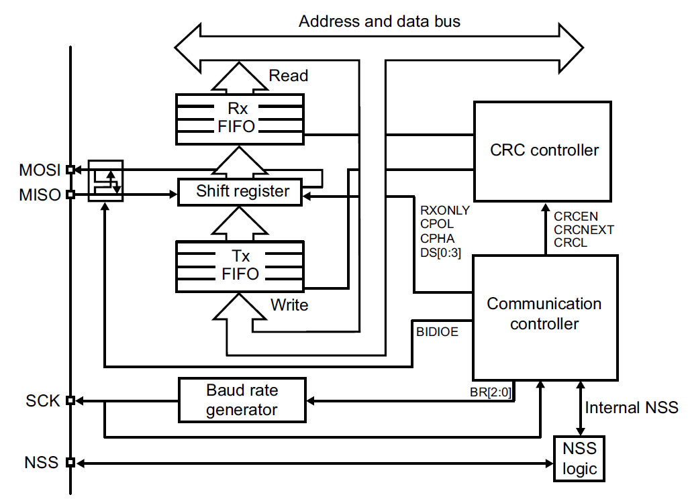
_Figure 12.35: STM32F0 SPI block diagram [1]_

### SPI Modes and Clocking

SPI is synchronous, so the master controls the transfer speed through the serial clock. Two settings define the relationship between the clock and data:

- `CPOL`: clock polarity, which sets the idle clock level.
- `CPHA`: clock phase, which chooses which clock edge captures data.

Both the master and slave must use compatible `CPOL` and `CPHA` settings. Otherwise, the receiver may sample data on the wrong edge.

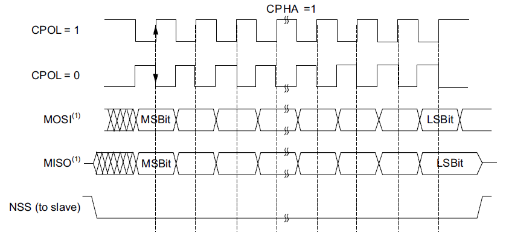
_Figure 12.36: SPI timing relationship when `CPHA = 0` [1]_

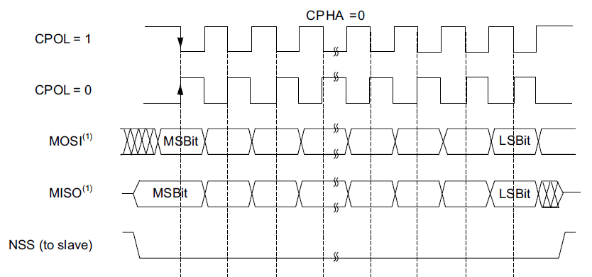
_Figure 12.37: SPI timing relationship when `CPHA = 1` [1]_

### Full-Duplex Transfers

SPI is naturally shift-register based. While the master shifts a bit out on `MOSI`, the slave can shift a bit back on `MISO`. This means that transmitting and receiving often happen at the same time.

This has an important consequence: to read from a slave, the master still has to transmit something so that clock pulses are generated. The transmitted byte may be dummy data, but it causes the slave's response bits to be clocked into the master.

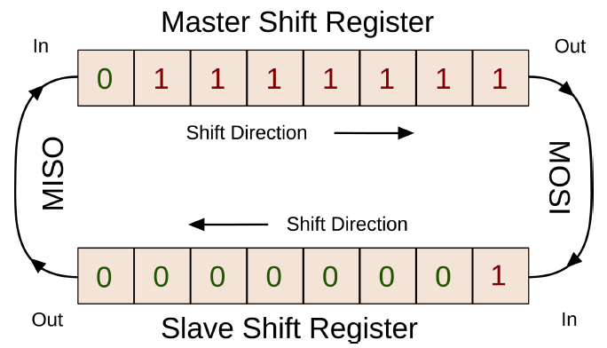
_Figure 12.38: SPI full-duplex operation shifts data out and in at the same time_

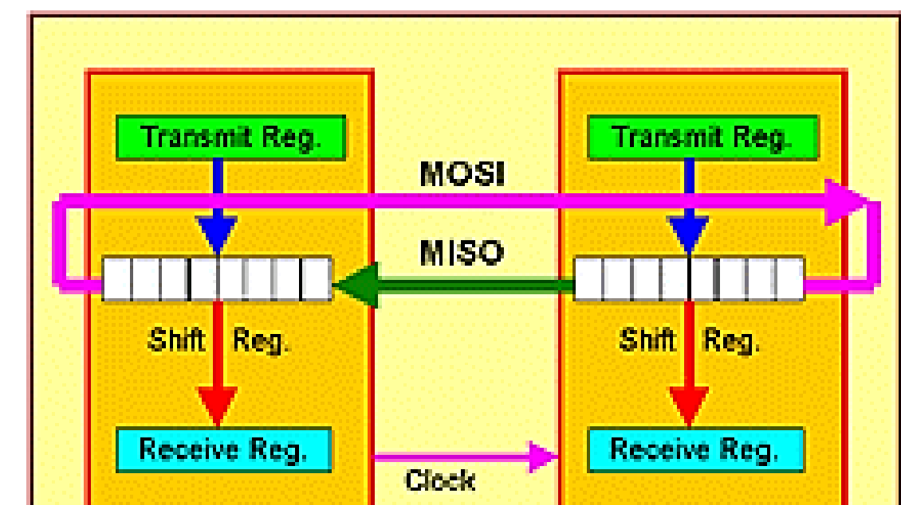
_Figure 12.39: In full-duplex SPI, each clock pulse shifts data through the master and slave shift registers at the same time_

### SPI Strengths and Limitations

SPI has several advantages:

- It is usually faster than asynchronous serial communication.
- It has little protocol overhead.
- The receive hardware can be implemented as a simple shift register.
- It supports multiple slaves.

Its limitations are:

- It uses more signal lines than I2C.
- Each slave usually needs a separate select line.
- There is no built-in addressing or acknowledgement.
- The amount and meaning of data must be defined by the devices and firmware.

### SPI on the STM32F0

The STM32F0 SPI registers used most often are:

- `SPI_CR1`: baud-rate selection, clock polarity and phase, master mode, bidirectional mode, and SPI enable.
- `SPI_CR2`: data size, FIFO threshold, and slave-select output options.
- `SPI_SR`: status flags.
- `SPI_DR`: data register.

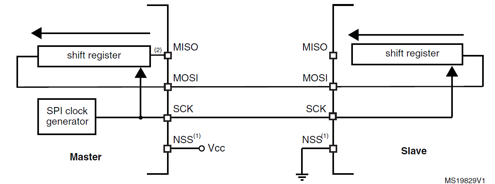
_Figure 12.40: SPI simplex single-master, single-slave arrangement [1]_

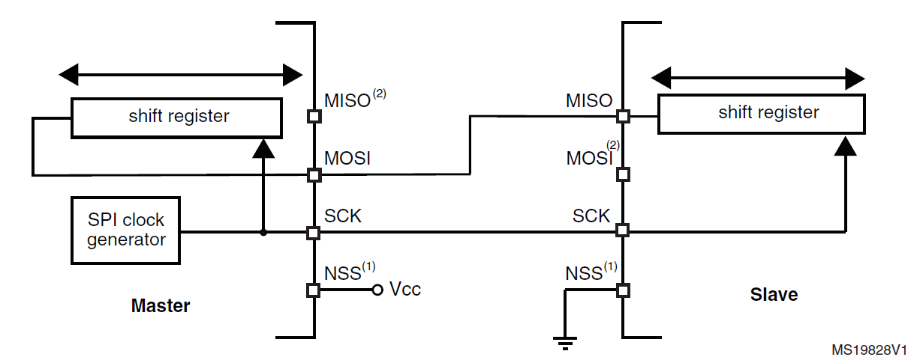
_Figure 12.41: SPI half-duplex single-master, single-slave arrangement [1]_

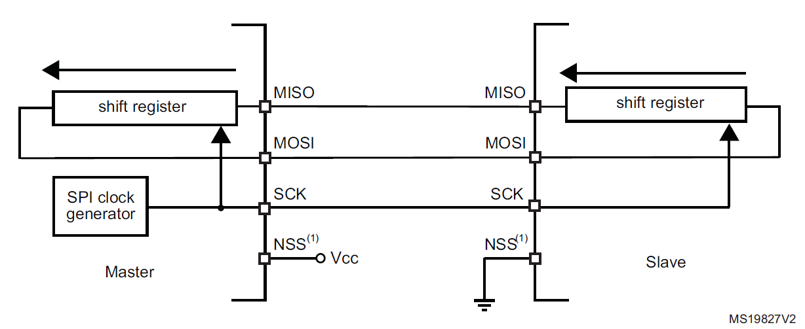
_Figure 12.42: SPI full-duplex single-master, single-slave arrangement [1]_

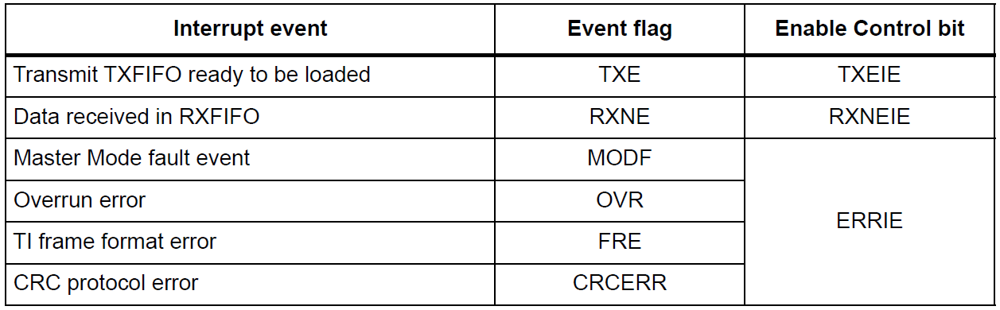
_Figure 12.43: SPI interrupt events and enable bits [1]_

The setup sequence for SPI is:

1. Configure the GPIO pins for `SCK`, `MOSI`, `MISO`, and slave select.
2. Enable the SPI peripheral clock.
3. Configure the baud rate in `SPI_CR1`.
4. Configure `CPOL` and `CPHA`.
5. Select simplex, half-duplex, or full-duplex mode as needed.
6. Configure master mode with `MSTR`.
7. Configure the data size in `SPI_CR2`.
8. Enable the SPI peripheral with `SPE`.

### SPI Configuration Example

The following example configures `SPI2` using `PB13` to `PB15`, with `PB12` as a software-controlled slave-select pin.

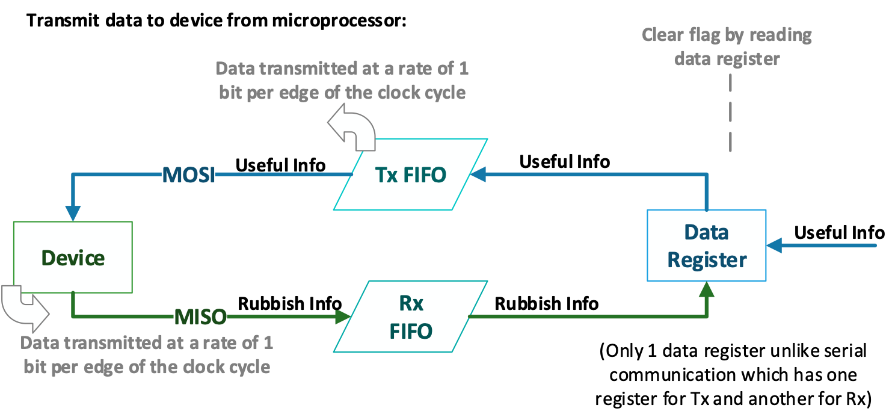
_Figure 12.44: SPI control register 1 controls master mode, baud rate, clock configuration, and bidirectional settings [1]_

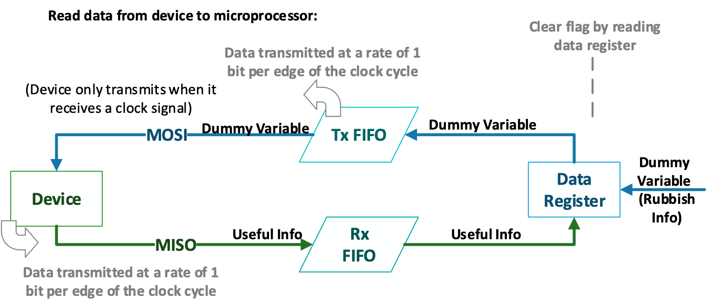
_Figure 12.45: SPI control register 2 controls data size, FIFO threshold, and slave-select output behaviour [1]_

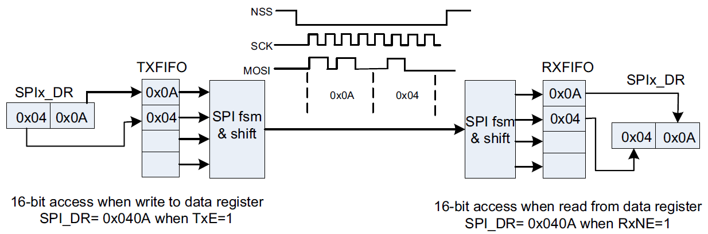
_Figure 12.46: SPI status flags describe transmit and receive FIFO state [1]_

```c
void init_spi2(void)
{
    RCC->AHBENR |= RCC_AHBENR_GPIOBEN;       // Enable GPIOB clock

    GPIOB->MODER |= GPIO_MODER_MODER12_0     // PB12 output for SS
                 |  GPIO_MODER_MODER13_1     // PB13 SCK alternate function
                 |  GPIO_MODER_MODER14_1     // PB14 MISO alternate function
                 |  GPIO_MODER_MODER15_1;    // PB15 MOSI alternate function

    GPIOB->BSRR |= GPIO_BSRR_BS_12;          // Disable slave, SS high

    RCC->APB1ENR |= RCC_APB1ENR_SPI2EN;      // Enable SPI2 clock

    SPI2->CR1 |= SPI_CR1_BR_1 | SPI_CR1_BR_0; // fPCLK / 16
    SPI2->CR1 |= SPI_CR1_MSTR;               // Master mode

    SPI2->CR2 |= SPI_CR2_FRXTH               // 8-bit RX threshold
              |  SPI_CR2_DS_2
              |  SPI_CR2_DS_1
              |  SPI_CR2_DS_0;               // 8-bit data size

    SPI2->CR1 |= SPI_CR1_SPE;                // Enable SPI
}
```

### SPI Write and Read Helpers

To write a byte, select the slave, write to `SPI_DR`, wait until a byte has been received, then read and discard the dummy receive data.

```c
void spi2_write_byte(uint8_t data)
{
    GPIOB->BSRR |= GPIO_BSRR_BR_12;          // SS low

    SPI2->DR = data;

    while ((SPI2->SR & SPI_SR_RXNE) == 0);
    (void)SPI2->DR;                          // Discard dummy received byte

    GPIOB->BSRR |= GPIO_BSRR_BS_12;          // SS high
}
```

To read a byte, transmit dummy data so that the master generates clock pulses:

```c
uint8_t spi2_read_byte(void)
{
    GPIOB->BSRR |= GPIO_BSRR_BR_12;          // SS low

    SPI2->DR = 0xFF;                         // Dummy byte to generate clocks

    while ((SPI2->SR & SPI_SR_RXNE) == 0);
    uint8_t received_data = SPI2->DR;

    GPIOB->BSRR |= GPIO_BSRR_BS_12;          // SS high

    return received_data;
}
```

## Choosing a Communication Interface

The best interface depends on the devices being connected and the constraints of the system.

| Interface | Wires | Timing | Typical use | Main advantage | Main limitation |
|-----------|-------|--------|-------------|----------------|-----------------|
| UART/USART | TX, RX, GND | Asynchronous | PC links, simple device-to-device links | Simple point-to-point communication | Usually only two devices |
| I2C | SDA, SCL, GND | Synchronous | Sensors and ICs on one board | Many devices on two wires | Slower and short distance |
| SPI | SCK, MOSI, MISO, SS, GND | Synchronous | Displays, ADCs, memory, fast sensors | Fast and low overhead | More pins |

Use UART when two devices need a simple serial link, especially when connecting to a PC through USB-serial or RS-232 hardware. Use I2C when several low- to moderate-speed devices must share a small number of pins. Use SPI when speed and low overhead matter more than pin count.

## Practical Notes for This Course

For communication practicals, always check four things before debugging the protocol itself:

1. The peripheral clock is enabled in `RCC`.
2. The GPIO pins are configured for the correct mode and alternate function.
3. The electrical interface is correct, including shared ground, pull-up resistors for I2C, and level shifting for RS-232 if required.
4. The STM32 settings match the external device settings or datasheet requirements.

Communication faults are often caused by pin configuration or electrical assumptions before they are caused by the protocol logic.

## Summary

Serial communication allows the STM32 to exchange data with external devices using a small number of pins. UART/USART provides simple asynchronous point-to-point communication, with baud rate and frame format configured in advance. I2C provides a two-wire addressed bus for many short-distance devices. SPI provides fast synchronous transfers using a master clock and slave-select lines. Each interface has different trade-offs, so the correct choice depends on distance, speed, pin count, and the external devices being used.

# References

[1] ST Microelectronics, "RM0091 Reference Manual". May 2022. [Online]. Available: https://www.st.com/resource/en/reference_manual/rm0091-stm32f0x1stm32f0x2stm32f0x8-advanced-armbased-32bit-mcus-stmicroelectronics.pdf

[2] Carmine Noviello, "Mastering STM32". Leanpub.

[3] SparkFun, "I2C". [Online]. Available: https://learn.sparkfun.com/tutorials/i2c/all
