# Embedded Control

## Table of Contents
{: .no_toc}

1. TOC
{:toc}

---

This chapter connects continuous-time control design to embedded implementation. In the control systems course you have already designed controllers in the $s$-domain and assessed stability using frequency-domain criteria such as Bode and Nichols plots. Here the question is different: once a controller is stable in continuous time, how do we implement it on a microcontroller without changing the behaviour so much that the system becomes unstable?

The example used throughout this chapter is a brushed DC motor speed controller. The controller is designed as an ideal PI controller in the $s$-domain, converted into a discrete-time controller in the $z$-domain, checked again with the chosen sampling time, adjusted for hardware effects, and finally written as a difference equation that can run inside a timer interrupt.

{: .note}
The lecture slides used for this section are available in [here](./slides/MEC3079S_Chapter13_DigitalControlSystems.pdf).

## The Embedded Control Workflow

The complete workflow is shown below. The main point is that "designing a stable controller" is not the final step. Sampling, sensor scaling, actuator limits, and finite update rates all change the loop that is actually implemented.

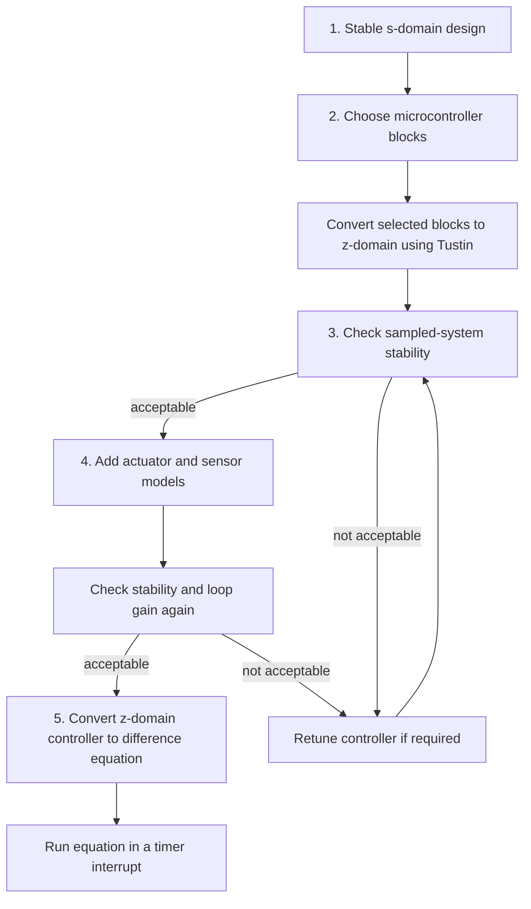

In practice this process is iterative. If the sampling time is too large, a controller that looked stable in the $s$-domain may have too much phase lag after discretisation. If a sensor gain is added in the feedback path, the open-loop gain changes unless the controller gain is adjusted. If an H-bridge saturates, the closed-loop response can no longer be predicted by a purely linear model.

## Step 1: Design in the s-Domain

Let's begin with developing the plant model of a brushed DC motor:

1. An armature current flows in the rotor in response to a motor voltage according to:

    $$i_a(s) = \frac{V_m(s)}{R_m+sL_m},$$

    where $R_m$ and $L_m$ are the resistance and inductance, respectively, of the armature.

2. This current generates a torque, $T_a$, according to the motor constant , $K_m$:

    $$T_a(s) = I_a(s)K_m.$$

3. The difference between this torque on the armature and any potential disturbance torque (e.g. Friction) is:

    $$T_r(s)= T_a(s)-T_d(s).$$

4. This net torque generates an angular acceleration, $\alpha$, relative to the combined interia of the armature and any load it drive, $J$, such that:

    $$\alpha(s) = T_r(s)\frac{1}{J}.$$

5. Integration of $\alpha$ yields the inertial rotational rate of the rotor:

    $$\omega_r(s) = \alpha(s)\frac{1}{s}.$$

6. From this, the relative rotational rate between the rotor and stator is given by:

    $$\dot{\theta}(s) = \omega_r(s) - \omega_s(s),$$

    where $\omega_s$ is the inertial rotational rate of the stator.

7. This relative rate predicts the torque disturbance due to friction,

    $$T_d(s) = f(\dot{\theta}(s)),$$

    and the back emf of the motor, $V_{bemf}$, such that:

    $$V_{bemf}(s) = K_mT_d(s).$$

8. Finally, the motor voltage is given by the difference between an applied voltage, $V_a$, and $V_{bemf}$:

    $$V_m(s)= V(s) - V_{bemf}(s).$$


Together, these eight step are shown in the light purple section of the block diagram in Figure 13.1 below. There, $V_a(s)$ is generated by a PID contoller in the s-domain. A command signal is generated by a step function producing $\dot{\theta_c}$, from which the feedback, $\dot{\theta}$ is subtracked to produce the error signal, $\dot{\theta_e}$ driving the PID.

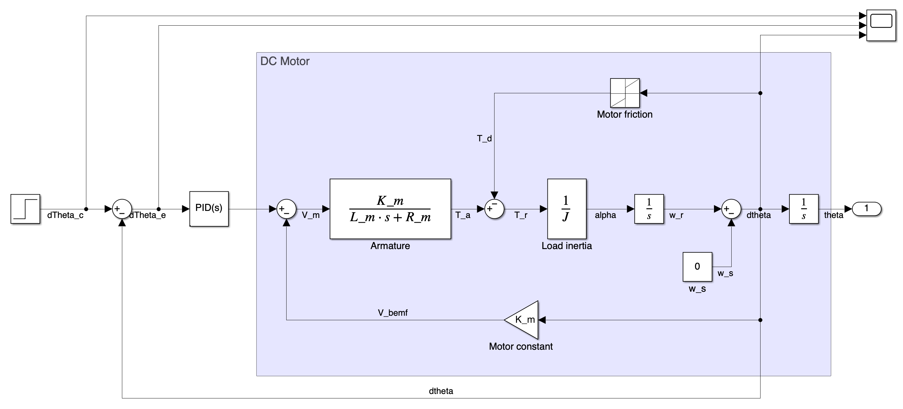
_Figure 13.1: Continuous-time motor speed control model before discretisation_

The speed controller used here is an ideal PI controller of the form:

$$PID(s) = C(s) = P\left(\frac{s+I}{s}\right),$$

where, $P$ is the proportional gain, and $I$ is the integrator constant.

The first design step is to choose $P$ and $I$ so that this continuous-time loop is stable with acceptable gain margin, phase margin, bandwidth, overshoot, and settling time. In the figures below, the following values have been chosen for the controller parameters:

$$P=5000,$$
$$I=0.5.$$


The Bode diagram in Figure 13.2 is used to check the frequency-domain behaviour of the continuous-time design before moving to the sampled implementation. In this design, the gain crossover occurs while the phase is still well above $-180^\circ$, so the continuous-time loop has positive phase margin. This is the stability check that must be completed before discretising the controller.

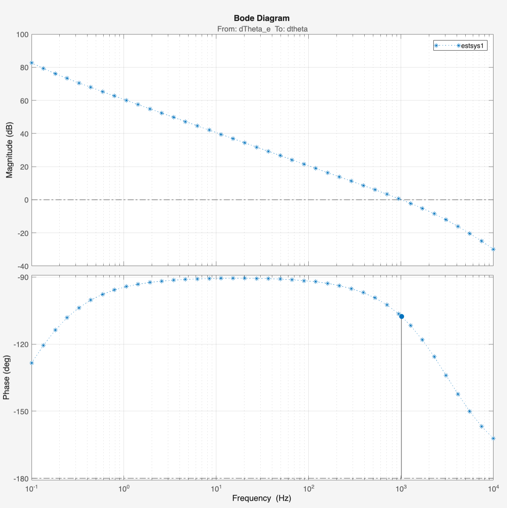
_Figure 13.2: Bode diagram used to verify the continuous-time controller before discretisation_

Following this, we check the step response of the loop in Figure 13.3 below which indicatesthat the error remains close to zero and thus, the output follows the command well.

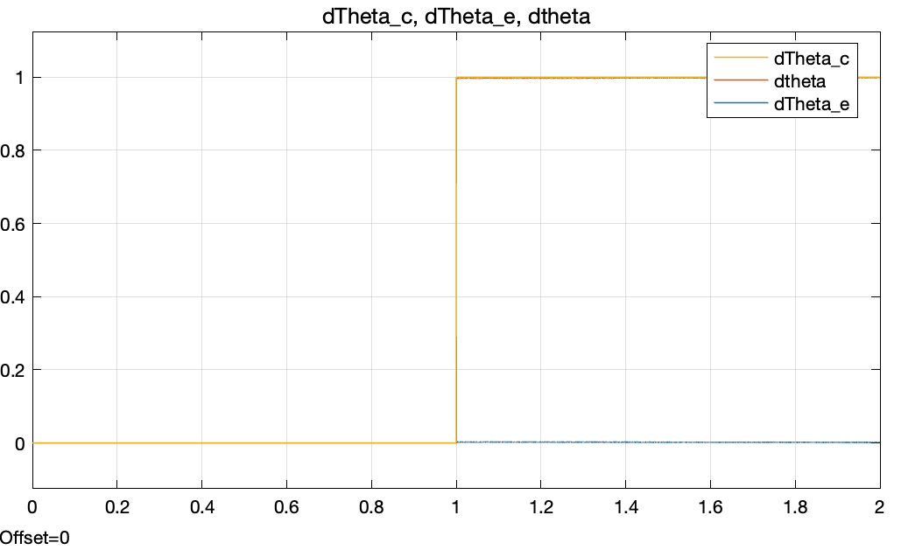
_Figure 13.3: Example continuous-time response after choosing stable PI controller parameters_

At this stage the design is still an analogue mathematical design. It assumes signals are continuous and that the controller can update instantaneously. A microcontroller cannot do that.

## Step 2: Decide What Runs on the Microcontroller

The next step is to decide which blocks of the model above are to be implemented in firmware. In a typical motor speed controller, the microcontroller performs the following operations:

1. Read the speed measurement from a sensor, e.g. using an ADC, timer capture input, encoder interface, or communication peripheral.
2. Convert the raw measurement into engineering units or into a scaled feedback signal.
3. Compute the error between the reference and the measured output.
4. Evaluate the controller equation.
5. Limit the control command if required.
6. Write the command to a PWM output, DAC, or motor-driver interface.

These are indicated in the dashed block of the bloack diagram below:

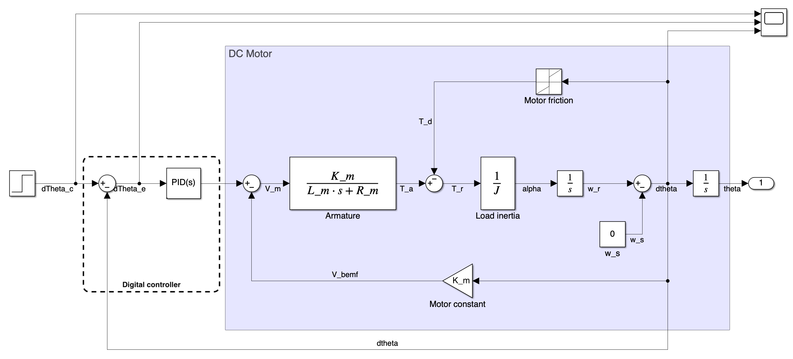
_Figure 13.4: Delineation of digital components of the model_


The plant remains in the analogue physical world. The controller, summing junction, reference generation, and signal scaling are usually implemented in software.

Digital control is sampled. The controller only reads the input and updates the output every $T_s$ seconds. This sampling time must be chosen before converting the controller. It is normally set by a hardware timer interrupt.

### Sampling and the Tustin Transform

To implement the controller digitally, convert the selected continuous-time controller blocks into the $z$-domain. In this chapter we use the Tustin transform, also called the bilinear transform:

$$s \approx \frac{2(z-1)}{T_s(z+1)}$$

and the inverse relationship:

$$z \approx \frac{1+sT_s/2}{1-sT_s/2}$$

The Tustin transform comes from approximating integration using the trapezoidal rule. It is widely used because it maps the stable left-half $s$-plane into the inside of the unit circle in the $z$-plane.

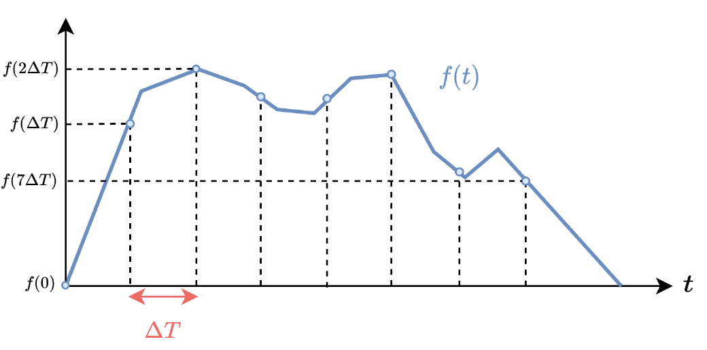
_Figure 13.5: Sampling a continuous signal and relating the s-domain and z-domain using Tustin_

For the ideal PI controller

$$C(s) = P\left(\frac{s+I}{s}\right),$$

substituting the Tustin approximation gives:

$$C(z)=P\frac{\left(2+IT_s\right)z+\left(IT_s-2\right)}{2z-2},$$


where the sampling time $T_s$ is now part of the controller. Changing $T_s$ changes the implemented controller, even if $P$ and $P$ are unchanged. In Simulink, the model is changed to represent this according to the figure below:

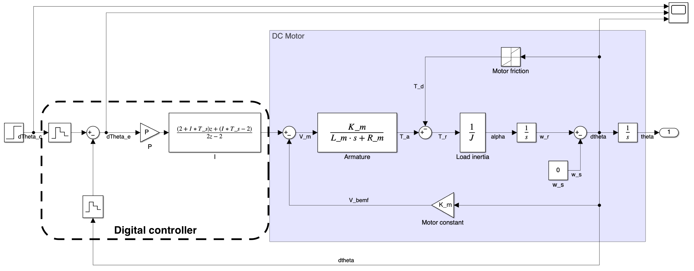
_Figure 13.6: Discrete time model_

Here, the PID(s) block has been replaced with the z-domain form of the controller and the command and feedback signals are converted to discrete time with the zero-order hold blocks.

## Step 3: Check Stability After Sampling

After discretisation, check the system again. A design that is stable in the continuous-time model may be unacceptable once the controller is sampled.

This is because, in the frequency domain, sampling adds phase lag and can also change gain at higher frequencies.

For small sampling times relative to the loop bandwidth, the discrete implementation may closely match the continuous-time design. As $T_s$ increases, the sampled controller behaves less like the continuous controller. The loop can move closer to the critical point and may become unstable. With the values for $P$ and $I$ unchaged from the analogue model, we now see that the response to the step command below is unstable when a sampling period fo $T_s = 0.001$ s is used.

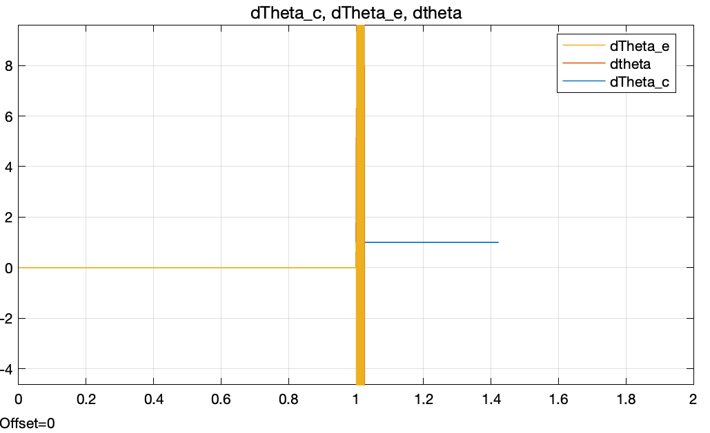
_Figure 13.7: A sampled implementation can become unstable if the sampling time and controller gains are not compatible_

If the sampled design is not acceptable, adjust the design. This usually means reducing bandwidth, reducing gain, or selecting a faster sampling rate. As a practical rule, the controller update rate should be much faster than the closed-loop bandwidth. A common starting point is to sample at least 10 to 20 times faster than the dominant closed-loop dynamics, then verify using the actual discrete model. 

The figure below now represents the response with a sample time $T_s = 0.001$ s after reducing the proportional gain to $P=700$ and increasing the integral gain to $I=1$. The response is now stable, albeit with a slower rise time and more overshoot than the continuous-time design.

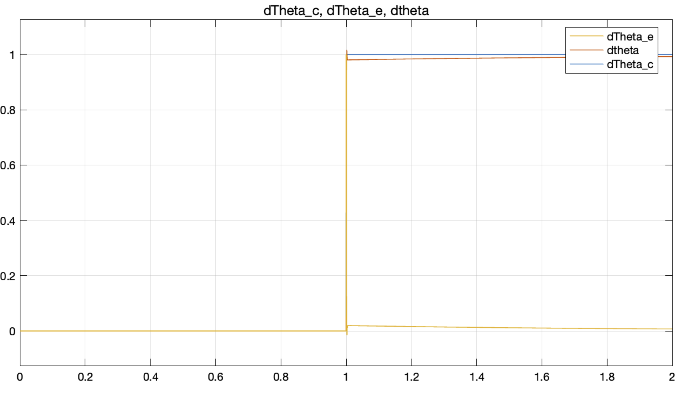
_Figure 13.8: Redesigning the controller parameters can recover a stable sampled response_

## Step 4: Add Sensors, Actuator Limits, and Scaling

At this point the controller has been designed for the discrete-time implementation. However, the model used for continuous-time design is rarely the same as the implementation model. Two hardware effects are especially important to consider: modelling the sensor appropriately in the feedback path and modelling the actuator in the command path. In both cases, the loop gain and stability can be affected by the implementation details. In this example, we will represent the actuator as a limit on the command (in practice this might be equivalent to the maximum voltage that can be applied to the motor) and the sensor as a gain in the feedback path.

### Sensor Gain

Suppose the motor speed is measured by an analogue speed sensor. If the sensor produces $3.3\text{ V}$ at $100\text{ rad/s}$, then the sensor gain is

$$K_s=\frac{3.3}{100}=0.033\text{ V/(rad/s)}$$

If this sensor voltage is fed back directly, the feedback signal is no longer $\omega$ in rad/s. It is a scaled voltage. The loop gain has changed be the added sensor gain in the feedback path. The model is now:

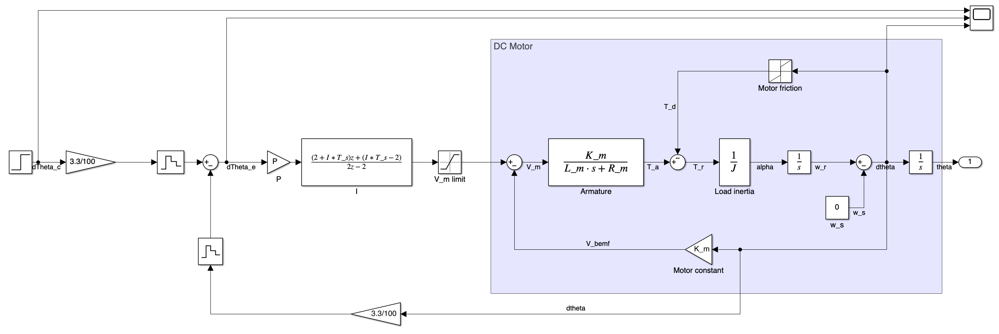
_Figure 13.9: Adding a sensor model changes the feedback scaling and therefore the loop gain_

To preserve the same open-loop gain after adding a sensor gain in the feedback path, compensate for that scaling. If the original design assumed unity feedback and the sensor gain is $K_s$, then the effective loop gain is multiplied by $K_s$. One simple correction is to adjust the proportional gain so that

$$P_\text{new}K_s = P_\text{old}$$

which gives

$$P_\text{new}=\frac{P_\text{old}}{K_s} = 700\left(\frac{100}{3.3}\right) = 21212.12$$

This is not a substitute for checking stability again. It is only a way to keep the intended loop gain from being accidentally changed by the measurement model. One should check the Bode plot of the new model to verify that the gain and phase margins are still acceptable.

### Actuator Limits

The motor is driven by real hardware, such as an H-bridge. The H-bridge cannot output arbitrary voltage. If the supply voltage is $20\text{ V}$, the command is limited to the range the driver can physically apply. If the microcontroller command is PWM duty cycle, then the command is also limited by the valid duty-cycle range. This is shown by the limit block in the command path after the controller in Figure 13.9 above.

Actuator saturation is nonlinear. Once the controller output saturates, increasing the calculated control action no longer increases the physical input to the plant. This can cause slow recovery, overshoot, or integral windup. A PI controller should therefore include output limiting and, in more complete implementations, anti-windup logic.

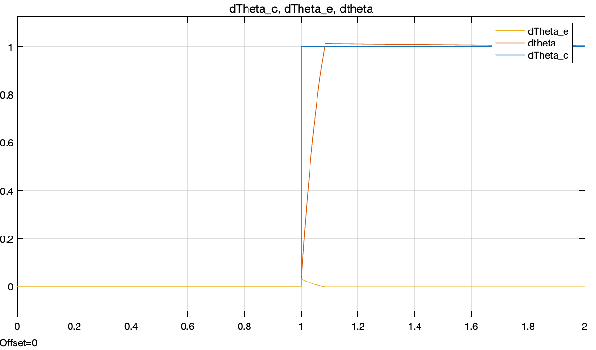
_Figure 13.10: Response after adding implementation effects such as actuator limits and sensor scaling_

After adding sensor and actuator models, check stability and performance again using the model that most closely matches the embedded implementation.

At this point, the model is close to the final implementation. The controller is discrete, the sensor and actuator are modelled, and the stability and performance have been checked. The final step is to convert the z-domain controller into a difference equation that can be implemented on the microcontroller.

## Step 5: Convert the z-Domain Controller to a Difference Equation

A microcontroller cannot directly execute a transfer function. It executes arithmetic on stored variables. The final step is to convert the discrete transfer function into a difference equation. This step involved considering how z is defined. The z-transform is essentially a specialised version of the Laplace transform for discrete-time signals. The fundamental mapping of between the continuous complex frequency variable, $s$, and the discrete complex frequency variable, $z$, is:

$$z = e^{sT_s}.$$

Considering the inverse of this gives:

$$z^{-1} = e^{-sT_s},$$

where $e^{-sT_s}$ is the Laplace identity for a delay of time $t = T_s$. This means that $z^{-1}$ can be used to represent a one-sample delay in the discrete-time domain. This is the key to converting from the z-domain to a difference equation.


For the PI controller derived above:

$$C(z)=P\frac{\left(2+IT_s\right)z+\left(IT_s-2\right)}{2z-2},$$

can be expressed in terms of the input, $E(z)$, and output, $U(z)$, as:

$$U(z)=P\frac{\left(2+IT_s\right)z+\left(IT_s-2\right)}{2z-2}E(z)$$

Divide numerator and denominator by $z$ to express in terms of $z^{-1}$ (which in practice means in terms of a one-sample delay):

$$U(z)=P\left[\frac{\left(2+IT_s\right)+\left(IT_s-2\right)z^{-1}}{2-2z^{-1}}\right]E(z)$$

$$\left(2-2z^{-1}\right)U(z)=P\left[\left(2+IT_s\right)+\left(IT_s-2\right)z^{-1}\right]E(z)$$

Now isolate the control action, $U(z)$, on the left-hand side and express the right-hand side in terms of the current error, $E(z)$, and the previous error, $E(z)z^{-1}$:

$$U(z)=\frac{P\left[\left(2+IT_s\right)E(z)+\left(IT_s-2\right)E(z)z^{-1}\right]+2U(z)z^{-1}}{2}.$$


Here, $E(z)$ is the current error, $E(z)z^{-1}$ is the value of the previous error, one sample period ($T_s$) ago, $U(z)$ is the current control action, and $U(z)z^{-1}$ is the previous control action, one sample period ago. Considering how this can be implemented on a microcontroller, we can use global variables to store the previous error and control action, and then update those variables at each time step. Let, $u$ be a variable that stores the current control action, $e$ be a variable that stores the current error, $e_p$ be a variable that stores the previous error, and $u_p$ be a variable that stores the previous control action. Then, the difference equation can be expressed as:

$$u = \frac{P\left[\left(2+IT_s\right)e+\left(IT_s-2\right)e_p\right]+2u_p}{2}.$$

This equation is now implementable on a microcontroller and is equivalent to the z-domain controller derived from the continuous-time design. The final step is to run this equation in a timer interrupt at the selected sampling time, $T_s$. The values of $P$, $I$, and $T_s$ are the same as those used in the design and stability checking steps. The variables $e_p$ and $u_p$ must be updated at each time step to store the previous error and control action for use in the next iteration.

### Timer Interrupt Implementation

The controller should run at a fixed interval. A hardware timer interrupt is the usual way to guarantee that the update period is $T_s$. One may want to implement these parameters such as below:

```c
const float P = 700.0;
const float I = 1.0;
const float T_s = 0.001;

volatile float e_p = 0.0;
volatile float u_p = 0.0;
```

The controller can then be implemented in a function such as below, which is called by the timer interrupt every $T_s$ seconds. The function takes the current command and feedback as inputs, computes the control action, updates the stored previous values, and returns the control action to be applied to the actuator.:

```c
float run_controller(float command, float feedback)
{
    
    float e = command - feedback;   // Compute current error from command and feedback passed to the function
    
    float u = (P * ((2 + I*T_s)*e + (I*T_s - 2)*e_p) + 2*u_p) / 2; // Compute control action using the difference equation

    if (u > upper_limit) //where upper_limit is the maximum command that can be applied to the actuator
    {
        u = upper_limit;
    }
    else if (u < lower_limit) //where lower_limit is the minimum command that can be applied to the actuator
    {
        u = lower_limit;
    }

    e_p = e;    // Update previous error
    u_p = u;    // Update previous control action

    return u;
}
```


Note that the code above assumes that the final command is expressed as a motor voltage. If the hardware uses PWM, an additional step is required to convert the voltage command into a duty cycle command. This can be done by dividing the voltage command by the maximum voltage that can be applied to the motor, which gives a duty cycle in the range of 0 to 1. The duty cycle can then be converted to a percentage or directly to a value suitable for the PWM hardware.

### Implementation Checklist

Before running the controller on hardware, check the following:

1. The timer interrupt period matches the $T_s$ used in the Tustin conversion.
2. The ADC, encoder, or sensor conversion produces the units assumed by the controller.
3. The sign of the feedback is correct. Positive feedback can destroy the system quickly.
4. The controller output is limited to the actuator range.
5. The initial stored values, such as `e_p` and `u_p`, are set deliberately.
6. The closed-loop response has been checked after adding sampling, sensor gain, and actuator limits.
7. The motor can be disabled quickly during testing.

## Summary

The embedded control design process starts with a stable continuous-time controller, but it does not end there. The controller must be discretised using the selected sampling time, checked again for stability, adjusted for sensor and actuator models, and converted into a difference equation. On the microcontroller, the final controller is just a timed sequence of reads, arithmetic, limits, writes, and state updates.

The key habit is to keep the model aligned with the implementation. If the microcontroller samples every $T_s$ seconds, the model must include that sampling. If the speed sensor outputs volts instead of rad/s, the feedback path must include that gain. If the H-bridge saturates, the command path must include limits. Each of these details changes the loop that determines stability.
