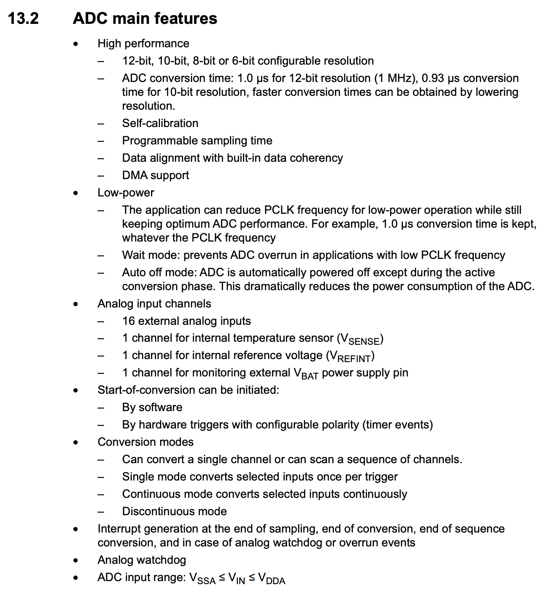
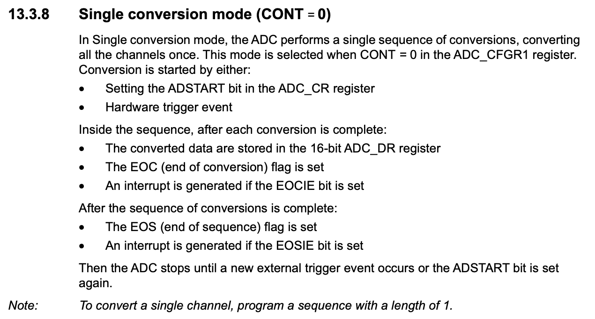
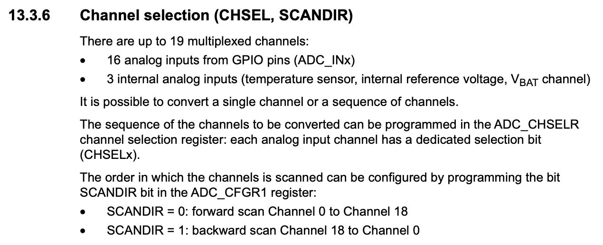
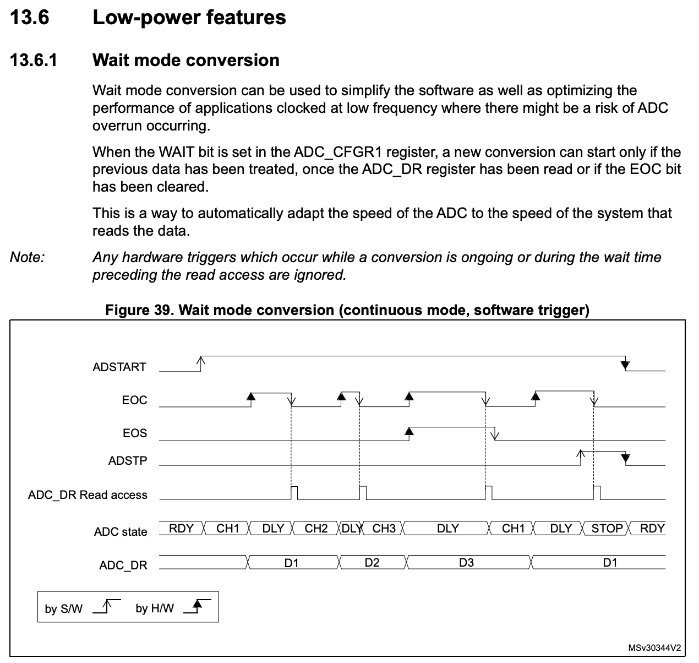
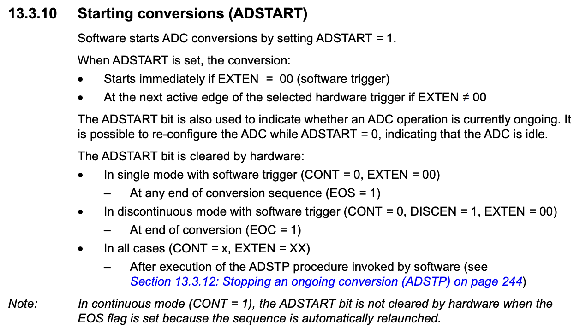
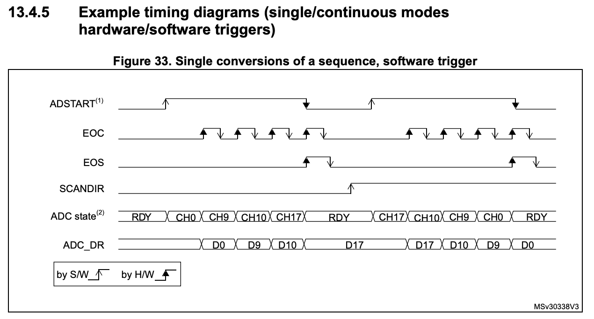
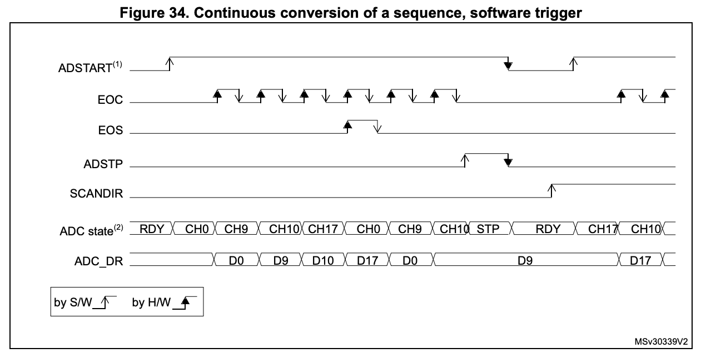
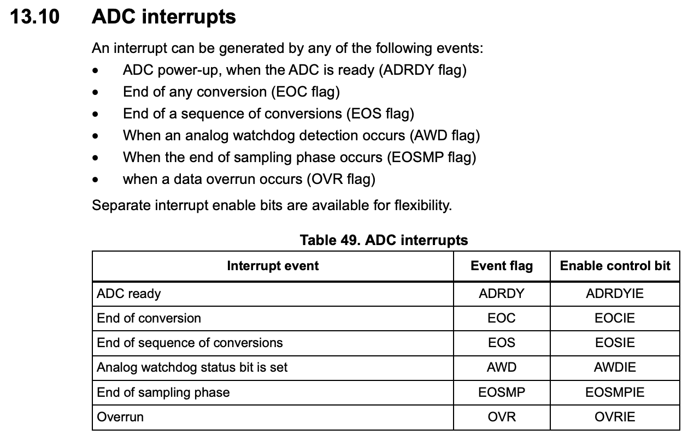

# Analog-to-Digital Conversion

Analog-to-Digital Converters (ADCs) are essential components in embedded systems that convert continuous analog signals into discrete digital values. This chapter covers the fundamentals of ADC operation and implementation on STM32 microcontrollers.

## Introduction to ADC

The ADC peripheral in STM32 microcontrollers provides a bridge between the analog and digital domains, enabling the microcontroller to process real-world signals. Key features include:

- Up to 12-bit resolution ADC. On the STM32F0 the resolution is selectable to 6, 8, 10, or 12 bits.
- 19 sample channels (16 external, 3 internal).
- Single converter with multiplexed inputs.
- Configurable conversion parameters.
- Hardware triggers and DMA support.

These, and further features are described in Section 13.2 of the STM32F0 Reference Manual:


_Figure 7.1: Features of the ADC on the STM32F0_

The governing equation for an ADC is shown in the equation below:

$$\text{ADC value} = \lfloor \frac{V_{in}}{V_{max}} \times (2^{n}-1) \rfloor$$

Where:
* $V_{in}$ is the input voltage.
* $V_{max}$ is the ADC maximum voltage (3.3V for an STM32).
* $n$ is the **ADC resolution**, a value you set in firmware.
* $\lfloor * \rfloor$ means rounding down to the next closest integer value.

So say we have an input signal of 1.23V, the ADC max voltage is 3.3V and the resolution is 10 bits. That would results in a value of:

$$ \text{ADC value} = \lfloor \frac{1.23}{3.3} \times (2^{10}-1) \rfloor = 381 $$

That value is about a third of $2^{10}$, which should make sense as $V_{in}$ was about a third of $V_{max}$.

## ADC Architecture

### Input Channels

The ADC supports multiple input channels:

- 16 external channels (ADC_IN[15:0]) - these are routed from the GPIO pins when configured in Analogue mode.
- 3 internal channels:
  - V_BAT (battery voltage).
  - V_REF (reference voltage).
  - TS (temperature sensor).

### Conversion Modes

The ADC can operate in different modes, however, unless it is configured in the rarely used Discontinuous mode (set by then DISCEN) bit, the ADC always converts a sequence of channels once triggered:

- Single conversion - here the selected channels are converted, in sequence of their selection, once before the ADC stops conversions. This behaviour is described in 13.3.8 of the Reference Manual:


_Figure 7.2: Functional description of the single conversion mode of the ADC_

- Continuous conversion - here the selected channels are converted, in sequence of their selection, and once the sequence is complete, it is begun again until the ADC is either stopped or disabled. This behaviour is described in 13.3.8 of the Reference Manual:


_Figure 7.3: Functional description of the continuous conversion mode of the ADC_

Within these modes, an Up scan is defined as from ADC_IN0 first, whilst a Down scan is from VBAT first.

## ADC Configuration

### Enabling the ADC

As with all peripherals on the microcontroller, the ADC peripheral must be enabled before it can be used. This is done by enabling the ADC clock in the RCC_APB2ENR register:

```c
RCC->APB2ENR |= RCC_APB2ENR_ADCEN;
```

Once the clock is enabled, the ADC peripheral must be activated by setting the ADEN bit in the ADC_CR register:
```c
ADC1->CR |= ADC_CR_ADEN;
```

On the STM32F0, care must be taken in order of enabling and configuring the ADC peripheral. These details can be found in the instructions of Section 13.3.5 of the Reference Manual:


_Figure 7.4: Order of enabling and configuring the ADC peripheral_

### Channel Selection

Channel selection is done by configuring the GPIO pins for analogue mode and then selecting the channels in the ADC_CHSELR register. This can be seen in the instructions of Section 13.3.6 of the Reference Manual:


_Figure 7.5: Channel selection in the ADC_

For example, to configure and select GPIOA6 as an ADC channel:

1. Configure GPIO pins for analog input:
```c
GPIOA->MODER |= GPIO_MODER_MODER6;  // Example for PA6
```

2. Select channels in the ADC_CHSELR register which correspond to the configured GPIO:
```c
ADC1->CHSELR |= ADC_CHSELR_CHSEL;  // Example for channel 6 
```

### Resolution and Alignment

The ADC supports configurable resolution and data alignment. Lower resolutions result in faster conversions, but with a loss of precision. The resolution and alignment can be set in the ADC_CFGR1 register:

- Default 12-bit resolution
- Option for 8-bit resolution:
```c
ADC1->CFGR1 |= ADC_CFGR1_RES_1;
```

The ADC data register (ADC_DR) is the register where the ADC conversion result is stored. It is 32 bits wide and the most significant 16 bits are not used. The ADC output is a maximum of 12 bits wide and is governed by the chosen resolution, thus, not all bits are used for storing data in the ADC_DR register. The data is then be right or left justified, accordingly:

Right Justified (ALIGN = 0):
ADC_DR[15:0] = [0 0 0 b12 b11 b10 b9 b8 b7 b6 b5 b4 b3 b2 b1 b0]

Left Justified (ALIGN = 1):
ADC_DR[15:0] = [b12 b11 b10 b9 b8 b7 b6 b5 b4 b3 b2 b1 b0 0 0 0]

- Data alignment (right or left):
```c
ADC1->CFGR1 |= ADC_CFGR1_ALIGN;  // Left alignment
```

### Wait mode

The ADC can be configured to use a low power mode by the setting of the WAIT bit in the ADC_CFGR1 register. This causes the ADC to pause in its sequence of conversions until the ADC_DR register is read. This can be seen in the instructions of Section 13.6 of the Reference Manual:


_Figure 7.6: Wait mode in the ADC_

In addition to lowering the power usaage of the ADC (becuase conversions are not continually being performed), this setting has the additional benefit of preventing data loss by forcing each conversion to be read before the next one begins.

### Conversion Monitoring

Once enabled, the ADC takes some time to complete its configuration and may only be used once the ADC Ready flag is raised in the Interrupt and Status Register (ISR). Typically after configuration and enabling, the programmer inserts a line such as that below to wait until the ADC may be used:

```c
while((ADC1->ISR & ADC_ISR_ADRDY) == 0);  // Wait for ADC ready
```

Once the ADC is ready, the programmer can then trigger a conversion by setting the ADSTART bit in the ADC_CR register (if using software triggering). This can be seen in the instructions of Section 13.3.10 of the Reference Manual:


_Figure 7.7: Starting a conversion in the ADC_

Once, begun, a conversion result is not instantanious. The ADC will continue to convert the selected channels until the conversion is complete. The ADC will raise the ADC_ISR_EOC flag when the conversion is complete and then raise the ADCl_ISR_EOS flag once the sequence of conversions is complete. See Figures 7.2 and 7.3 for reference. In a single conversion mode, the timings of the conversion and flag raising are as follows:


_Figure 7.8: Timing of a single conversion in the ADC_

Conversely, in a continuous conversion mode, the timings of the conversion and flag raising are as follows:


_Figure 7.9: Timing of a continuous conversion in the ADC_


Once the conversion of a channel is complete, the ADC_ISR_EOC flag is raised and the ADC_DR register is updated with the result. The programmer can then read the ADC_DR register to get the result of the conversion. Typically this can be done by using a while loop to wait for the ADC_ISR_EOC flag to be raised and then reading the ADC_DR register:

```c
while((ADC1->ISR & ADC_ISR_EOC) == 0);  // Wait for conversion to complete
ADC_DR = ADC1->DR;  // Read the result
```

### Interrupt generation

Whilst the above methode is effective in simple applications, this method is not ideal for more complex applications where the programmer may need to perform other tasks whilst waiting for the conversion to complete. For this reason, the ADC peripheral interrupt generation from a variety of events. Typically any flag contained in and ISR register can be used to generate an interrupt. On the STM32F0, the ADC peripheral can generate interrupts from the following events stated in Section 13.3.10 of the Reference Manual:


_Figure 7.10: Interrupt events on the ADC_

Using an interrupt driven approach, the programmer can configure the ADC to raise an interrupt when a specific event occurs. For example, instead of using a while loop to wait for the conversion to complete, the programmer can configure the ADC to raise an interrupt when the conversion is complete and then handle the interrupt in the interrupt service routine. To do this, the programmer must first enable the ADC interrupt in the ADC_IER   register:

```c
ADC1->IER |= ADC_IER_EOCIE;  // Enable interrupt on end of conversion
```

Then, the programmer must enable the ADC interrupt in the NVIC:

```c
NVIC_EnableIRQ(ADC1_IRQn);
```

Finally, the programmer must implement the ADC interrupt service routine to handle the interrupt and (in this case) read the ADC_DR register:

```c
void ADC1_COMP_IRQHandler(void) 
{
    ADC_DR = ADC1->DR;  // Read the result
}
```


