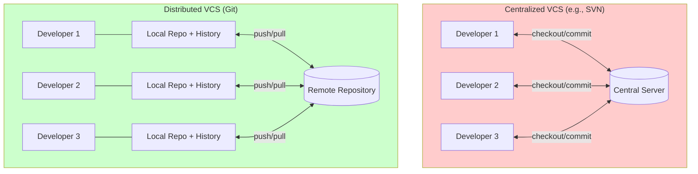
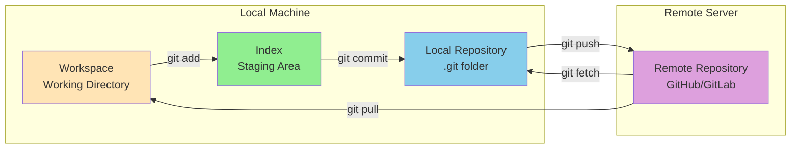
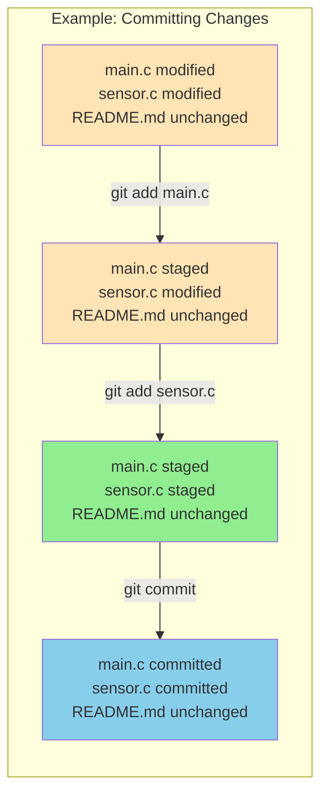
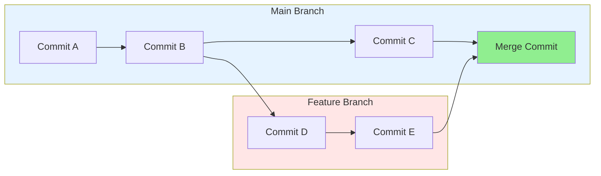

# Version Control with Git

## Table of Contents
{: .no_toc}

1. TOC
{:toc}

---

Version control is an essential tool for embedded systems development. As projects grow in complexity and team size increases, the ability to track changes, collaborate effectively, and maintain a complete history of your codebase becomes critical. Git, the most widely used distributed version control system, provides these capabilities and more.

{: .note}
The lecture slides used for this section are available [here](./slides/chapter-7-git-slides.pdf).

## Introduction to Version Control

Version control systems (VCS) are software tools that track changes in a file system over time. They serve as a safety net for developers, allowing you to:

1. **Track changes effectively** - Every modification is recorded with details about what changed, when, and by whom.
2. **Collaborate efficiently** - Multiple developers can work on the same codebase simultaneously without conflict.
3. **Recover from mistakes** - Roll back to previous versions when bugs are introduced.
4. **Maintain project history** - A complete audit trail of how the codebase evolved.

### Traditional Version Control

Before modern version control systems, developers often relied on manual methods:

- **File naming conventions**: `main.c`, `main_backup.c`, `main_backup_final.c`, `main_backup_final_ACTUAL.c`
- **Directory copies**: Entire project folders duplicated with date stamps
- **Shared drives**: Central storage with informal coordination

These approaches are error-prone, waste storage space, and make collaboration difficult. Modern version control solves these problems systematically.

### Git as a Distributed Version Control System

Git is a **Distributed Version Control System (DVCS)**. Unlike centralized systems where a single server holds the official copy, Git gives every developer a complete local copy of the entire repository, including its full history.



Key characteristics of Git:

1. **Effective tracking**: Changes are actually tracked at the content level, not just file level.
2. **Efficient storage**: Git stores changes intelligently using delta compression.
3. **Distributed architecture**: Each team member has a local copy of the entire file system and history.
4. **Collaboration support**: Individual changes can be merged after review.

---

## Core Git Concepts

### Repositories

A **repository** (or repo) stores the source code and complete commit history of your project. In Git's distributed model, repositories exist at two levels:

{: .note }
| Repository Type | Location | Purpose |
|----------------|----------|---------|
| Local Repository | Your machine | Complete copy for daily work |
| Remote Repository | Server (e.g., GitHub) | Centralized sharing point |

The local and remote repositories communicate to synchronize changes, but each is a complete, independent copy of the project.

### The Git Workflow

Git operates on a four-stage workflow:

1. **Fetch** - Retrieve the latest version from the remote server
2. **Edit** - Modify files in your workspace
3. **Stage** - Add modified files to the staging area (Index)
4. **Commit** - Save staged files to the local repository history

These stages create a clear separation between work in progress and committed changes.

### Three States of Git

Git manages file states across three distinct areas:

{: .note }
| Area | Purpose | Commands |
|------|---------|----------|
| **Workspace** | Where you edit files | Your working directory |
| **Index** (Staging Area) | Prepares changes for commit | `git add` |
| **Local Repository** | Permanent history storage | `git commit` |

Changes flow from Workspace → Index → Local Repository → Remote Repository.



---

## Essential Git Commands

### git init — Creating a Repository

Initialize a new Git repository in your project directory:

```bash
git init
```

This creates a hidden `.git` directory that stores all version control information.

### git add — Staging Changes

The `git add` command moves files from the Workspace to the Index (Staging Area):

```bash
git add filename.c          # Add a specific file
git add .                   # Add all modified files in directory
git add *.c                 # Add all C files
```

The Index acts as a staging area where you can prepare changes before committing them to the project history.

### git commit — Saving Changes

The `git commit` command saves staged files to the Local Repository:

```bash
git commit -m "Descriptive message about changes"
```

Key points about commits:

- Commits create a permanent snapshot of the staged changes
- Files are "safe" once committed and won't change unless explicitly modified
- Each commit receives a unique hash identifier (SHA-1)
- Write clear, descriptive commit messages explaining *why* changes were made

Example commit workflow:

```bash
git add main.c
git add sensor_driver.c
git commit -m "Add temperature sensor calibration routine"
```



### git status — Checking State

View the current state of your repository:

```bash
git status
```

This shows:
- Which files are modified but not staged
- Which files are staged but not committed
- Which files are untracked
- The current branch

### git log — Viewing History

Review the commit history:

```bash
git log                     # Full history
git log --oneline          # Compact one-line format
git log -5                 # Last 5 commits
```

### git diff — Comparing Changes

View differences between states:

```bash
git diff                    # Changes in workspace vs. index
git diff --staged          # Changes in index vs. last commit
git diff HEAD~1            # Changes from previous commit
```

---

## Working with Remote Repositories

### git remote — Managing Remotes

Connect your local repository to a remote server:

```bash
git remote add origin https://github.com/username/repo.git
git remote -v              # List configured remotes
```

### git push — Uploading Changes

Update the remote repository with your local commits:

```bash
git push origin main       # Push main branch to origin
git push -u origin main    # First push, set upstream tracking
```

Push transfers commits from your Local Repository to the Remote Repository.

### git fetch — Downloading Updates

Retrieve changes from the remote without merging them:

```bash
git fetch origin           # Get latest from remote
```

Fetch updates your Local Repository with the remote's state, but does not modify your Workspace.

### git pull — Integrating Remote Changes

Combine fetch and merge to integrate remote changes:

```bash
git pull origin main       # Fetch and merge remote changes
```

Pull updates:
- Your Local Repository with remote commits
- Your Index with any staged changes
- Your Workspace with merged files

---

## Branching and Merging

### Understanding Branches

A **branch** is an isolated line of development. In Git, a branch is simply a pointer to a specific commit. Creating a branch does not change the repository history—it just creates a new reference point.

Key benefits of branching:

1. **Isolated development** - Work on features without affecting the main codebase
2. **Parallel work** - Multiple developers work on separate tasks independently
3. **Safe experimentation** - Test new functions or bug fixes without risk
4. **Code review** - Changes can be reviewed before integration

### git branch — Managing Branches

```bash
git branch                 # List local branches
git branch feature-adc     # Create new branch
git branch -d old-branch   # Delete a branch
```

### git checkout — Switching Branches

Switch to a different branch:

```bash
git checkout feature-adc   # Switch to existing branch
git checkout -b new-feature # Create and switch to new branch
```

### git merge — Combining Branches

Integrate changes from one branch into another:

```bash
git checkout main
git merge feature-adc      # Merge feature-adc into main
```

Merge creates a new commit that combines the histories of both branches. If conflicts occur between changes in different branches, they must be resolved before the merge can complete.



### Typical Branching Workflow

```bash
# Start new feature
git checkout -b uart-driver

# Make changes and commit
git add uart.c
git commit -m "Implement UART initialisation"

# Switch back to main
git checkout main

# Merge the feature
git merge uart-driver
```

---

## Additional Git Commands

### git checkout — Restoring Files

View or restore previous versions:

In Git, `HEAD` is a special symbolic reference to the commit you currently have checked out. Commits are identified and refered to using unique hexadecimal identifying numbers called a hash. In normal use, `HEAD` usually points to the latest commit on your current branch. Just like a C pointer, this means that `HEAD` contains the identifier (hex number) of the commit that is currently checked out, in the same way that a C pointer contains the identifier (address) of a variable. You can refer to earlier commits relative to `HEAD`: for example, `HEAD~1` means "the commit one step before the current one", and `HEAD~2` means two commits before. This makes `HEAD` useful with commands such as `git checkout` and `git reset`, where you want to restore files from or move back to an earlier commit.

```bash
git checkout filename      # Restore file from index
git checkout HEAD~1 -- file.c  # Restore file from previous commit
```

### git reset — Undoing Changes

Reset allows you to update the index to a previous commit:

```bash
git reset HEAD~1           # Move index back one commit (soft)
git reset --mixed HEAD~1   # Move index back, keep workspace changes
git reset --hard HEAD~1    # Move index and workspace back (destructive)
```

{: .warning }
`git reset --hard` permanently discards changes. Use with caution.

### git clone — Copying Repositories

Create a local copy of an existing remote repository:

```bash
git clone https://github.com/user/repo.git
cd repo
```

Clone automatically sets up the remote connection and downloads the complete history.

---

## Collaboration Workflows

### Pull Requests

A **Pull Request** (PR) provides a user-friendly web interface for discussing proposed changes before integrating them into the official project:

1. Developer creates a branch and makes changes
2. Developer pushes branch to remote and opens a Pull Request
3. Team reviews the code and discusses changes
4. Once approved, the branch is merged into main

This workflow is standard on platforms like GitHub, GitLab, and Bitbucket.

### Best Practices for Team Collaboration

1. **Commit often** - Small, focused commits are easier to review and revert
2. **Write clear messages** - Explain *why* not just *what*
3. **Use branches for features** - Keep main branch stable
4. **Pull before pushing** - Synchronize with remote changes first
5. **Review code** - Use pull requests for quality control
6. **Ignore build artifacts** - Use `.gitignore` for generated files

---

### Commit Message Guidelines

Good commit messages improve code readability and aid understanding:

```
Subject: Brief summary (50 characters or less)

Body: Detailed explanation of what changed and why.
Include motivation for the change and contrast with
previous behaviour. Wrap at 72 characters.

Reference issue numbers where applicable.
```

Example:
```
Fix ADC sampling rate calculation

The TIM6 prescaler was incorrectly calculated, causing
sampling at half the intended rate. Update the prescaler
formula to account for the +1 offset in the register.

Fixes #42
```

---

## Common Pitfalls

1. **Forgetting to commit** - Large commits are harder to review and revert
2. **Vague commit messages** - "Fixed stuff" provides no context
3. **Committing generated files** - Build artifacts should not be versioned
4. **Working directly on main** - Use feature branches for isolation
5. **Not pulling before pushing** - Creates unnecessary merge conflicts
6. **Using `git add .` blindly** - Review changes before staging

---

## Summary

Git provides powerful capabilities for tracking changes, collaborating with team members, and maintaining project history. By understanding the core concepts—repositories, the staging area, branching, and remotes—you can work more effectively on embedded systems projects.

Key commands to remember:

| Command | Purpose |
|---------|---------|
| `git add` | Stage changes |
| `git commit` | Save to local history |
| `git push` | Upload to remote |
| `git pull` | Download and merge remote changes |
| `git branch` | Manage branches |
| `git checkout` | Switch branches or restore files |
| `git merge` | Combine branches |

Mastering these fundamentals will serve you throughout your embedded systems career, whether working on individual projects or large team collaborations.

## References

- [Git Documentation](https://git-scm.com/doc)
- [GitHub Git Cheat Sheet](https://education.github.com/git-cheat-sheet-education.pdf)
- [Atlassian Git Tutorials](https://www.atlassian.com/git/tutorials)
