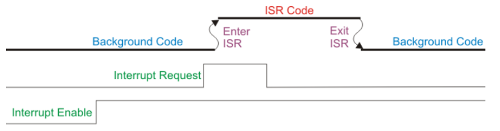
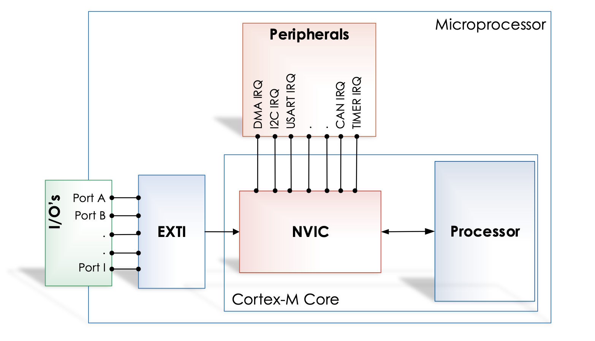
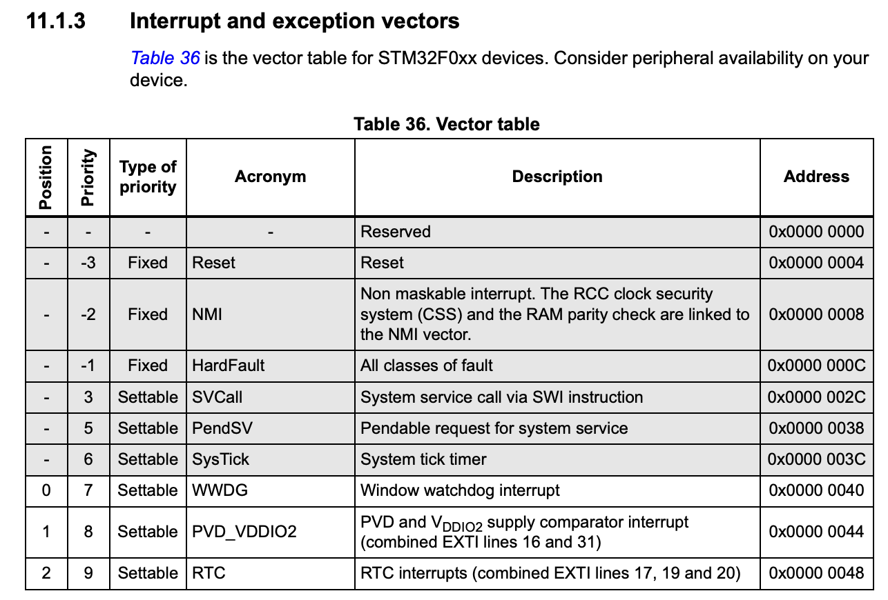

# Interrupts

Interrupts are essential mechanisms in embedded systems that allow the microcontroller to respond to asynchronous events immediately. This chapter covers the fundamentals of interrupts and their implementation on STM32 microcontrollers.

## Introduction to Interrupts

An interrupt is a signal to the CPU to immediately begin executing different code, known as an Interrupt Service Routine (ISR). On the STM32 these are called interrupt handlers. Some key features of interrupts include:

- Asynchronous operation - interrupts can occur at any time, they are independent of the main program flow.
- Immediate response - execution begins as soon as the current instruction completes.
- Interrupt latency - time between interrupt request and ISR entry is very low and depends on the _priority_ of the interrupt. This is a predefined order in which interrupts are handled.
- Context preservation - CPU state is saved before and restored after the ISR. This means that the main program can continue from the point it was interrupted.

## Interrupts as compared to polling

Polling is the name given to the way in which you may have programmed an STM32 microcontroller in the past. It involves using the CPU to repeatedly check the status of a peripheral. This is a _synchronous_ operation and the CPU is constantly busy checking the status of the peripheral. Some examples you may have come across include:

- Checking if a button has been pressed by repeatedly checking the GPIO input register.
- Checking if an ADC conversion has finished by repeatedly checking the EOC flag in the ADC status register.

In these cases the CPU is constantly busy checking the status of the feature of interest, and, by definition, cannot be doing anything else. This is both inefficient and unnecessary, and prevents the CPU from being used to do other things whilst waiting for the event to occur.

In contrast, interrupts allow the CPU to be notified when the event of interest occurs by the peripheral itself. This means that the CPU can be used for other tasks until the event occurs that needs to be handled. When the event occurs, the peripheral will send a signal to the CPU to notify it. The CPU can then stop what it is doing and immediately jump to the interrupt handler to deal with the event. Once the interrupt handler has finished, the CPU can resume whatever it was doing before the interrupt occurred. This is a _asynchronous_ operation and the CPU is not constantly busy checking the status of the peripheral.

In general, interrupt handlers are called Interrupt Service Routines (ISRs). The behaviour of the process is as follows:


_Figure 7.1: Interrupts flow [1]_

As can be seen from the diagram above, an interrupt source must be enable in the peripheral before it can be used. On the STM32 this is at least a two step process descibed in the next section.

## Interrupt Architecture

### Interrupt Controllers

The STM32 features two main interrupt controllers which act as gatekeepers between the peripherals and the CPU. Nearest the CPU is the Nested Vectored Interrupt Controller (NVIC) which handles the interrupts from the internal peripherals. Further out is the Extended Interrupts and Events Controller (EXTI) which handles the interrupts from the external peripherals. All interrupts must be enabled in the NVIC before they can be used, whilst those from external peripherals must also be enabled in the EXTI controller (e.g. the GPIO pins are routed to the EXTI controller). This in addition to an interrupt needing to be enabled in the peripheral itself. The architecture is shown in the figure below:


_Figure 7.2: Interrupt controllers_

To summarise the two interrupt controllers:

1. Nested Vectored Interrupt Controller (NVIC)
   - Handles internal peripheral interrupts
   - Manages DMA requests
   - Controls communication channels (USART, CAN, I2C)
   - Handles timer interrupts

2. Extended Interrupts and Events Controller (EXTI)
   - Manages external and internal asynchronous events
   - Supports up to 32 interrupt lines (23 external, 9 internal)
   - Interfaces with the NVIC
   - Controls GPIO-based interrupts

### Vector Table

It is not inconceivable for an interrupt to be generated by a peripheral whilst the CPU is already executing code in an ISR from a different peripheral. The Vector Table, defined in Seciton 11.1.3 of the Reference Manual is a crucial component in determining how the CPU should handle this situation. The vector table is a table of pointers to the ISRs for each interrupt. The table is indexed by the interrupt number, which is a unique identifier for each interrupt. The table is shown in the figure below:


_Figure 7.3: The first few entries in the interrupt vector table for the STM32F0 [2]_

The Vector Table is used to determine the priority of the interrupt and the address of the ISR. A higher priority ISR will be given precedence over a lower priority one, meaning that the CPU will immediately stop executing the current ISR and jump to the new one. Once completed, the CPU will return to the point it was interrupted, I.e., in this case, the point in the first ISR where it was interrupted. Only once the first ISR has finished will the CPU return to the main program. The vector table does the following:

- Defines interrupt priorities
- Stores addresses of ISR handlers
- Maps interrupt sources to their handlers
- Allows for priority-based interrupt handling

## ISR Implementation

Interrupt Service Routines look like normal functions, but must follow specific rules:

1. Cannot return values
2. Cannot accept arguments
3. Must be as short as possible
4. Must preserve CPU state

The last rule is handled by the compiler automatically, but the first three must be adhered to by the programmer. On the STM32, the compiler will automatically save the CPU state and restore it when the ISR has finished. Interrup handlers on the STM32 have predefined names which are given the in CMSIS documentation. For example, the interrupt handler for the EXTI0 interrupt is `EXTI0_IRQHandler`.

Example ISR structure:
```c
void EXTI0_IRQHandler(void)
{
    // Handle interrupt
    // Clear pending bit
    EXTI->PR |= EXTI_PR_PR0;
}

void USART1_IRQHandler(void)
{
    // Handle interrupt
    // Clear pending bit
    USART1->SR &= ~USART_SR_RXNE;
}
```
Here it can be seen that the general structure of the ISR is as follows:

```c
void PERIPHERAL_IRQHandler(void)
{
    // Handle interrupt
}
```
They are always void functions and take no arguments. If in doubt of the precise name of the ISR, the CMSIS library can be consulted.

{: .note }
All interrupts must be acknowledged in the ISR. This is the process of lowering the flag generating the interrupt in the relevant peripheral. This can usually be done by writing a 1 to the flag in the peripheral's Interrupt and Status Register, although this is peripheral dependent and other methods may exist. For example, the EOC flag in the ADC status register can be cleared by writing a 1 to the EOC bit in the ADC_ISR register or by reading the ADC_DR register.

## Best Practices

1. Keep ISRs as short as possible
2. Always clear interrupt flags
3. Use proper priority levels
4. Avoid complex calculations in ISRs
5. Properly save and restore context
6. Handle interrupt latency considerations

## Advanced Features

### Priority Management

- Interrupts can be assigned different priority levels
- Higher priority interrupts can preempt lower priority ones
- NVIC supports nested interrupt handling (this is name given to the ability of an ISR to interrupt another ISR)

### Event Generation

The EXTI controller can generate:
- Hardware interrupts
- Software interrupts
- Event triggers for other peripherals

# References

[1] ‘Introduction to Microcontrollers - Interrupts - Mike Silva’. Accessed: Apr. 21, 2025. [Online]. Available: https://www.embeddedrelated.com/showarticle/469.php

[2] ST Microelectronics, ‘RM0091 Reference Manual’. May 2022. [Online]. Available: https://www.st.com/resource/en/reference_manual/rm0091-stm32f0x1stm32f0x2stm32f0x8-advanced-armbased-32bit-mcus-stmicroelectronics.pdf

