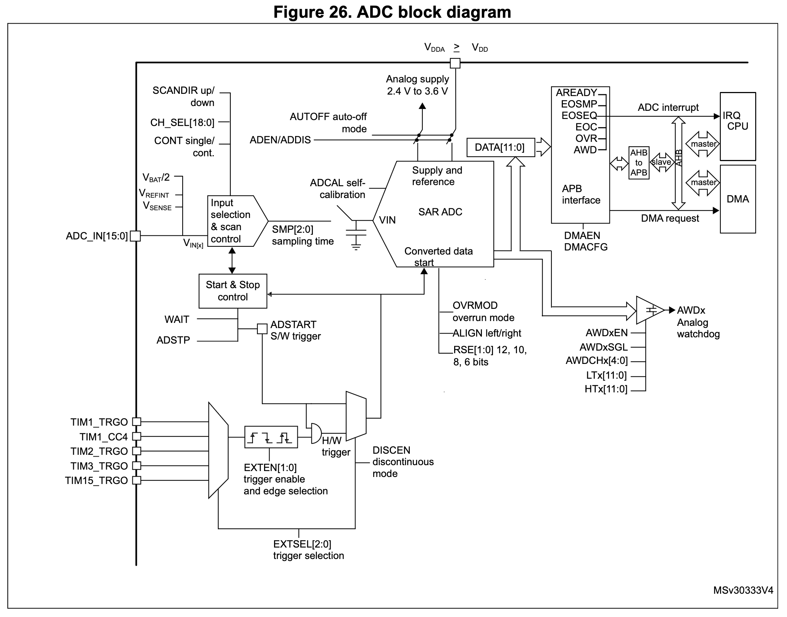

<!-- _class: lead -->
<!-- _paginate: false -->

# Chapter 10
## Analogue-to-Digital Conversion

**Integrated Embedded Systems**
MEC4126F Programming Lectures

*James Hepworth*

---

# Outline

1. ADC overview and purpose
2. ADC channels and conversion modes
3. ADC configuration on the STM32F0
4. Monitoring conversions and reading data
5. Interrupt-driven ADC operation
6. Worked polling example

---

# What Does an ADC Do?

- Converts a **continuous analogue voltage** into a **discrete digital value**
- Allows the microcontroller to process **real-world signals**
- Bridges the gap between the **analogue** and **digital** domains

Examples:
- Potentiometers
- Temperature sensors
- Light sensors
- Battery voltage measurement

---

# ADC Features on the STM32F0

- Up to **12-bit** resolution
- Resolution selectable to **12, 10, 8, or 6 bits**
- **19 sample channels**
  - 16 external
  - 3 internal
- **Single converter** with multiplexed inputs
- Supports **hardware triggers**, **interrupts**, and **DMA**

---

# ADC Block Diagram



---

# ADC Conversion Equation

The digital output of an ADC is approximately:

$$\text{ADC value} = \left\lfloor \frac{V_{in}}{V_{max}} \times (2^n - 1) \right\rfloor$$

Where:
- $V_{in}$ = input voltage
- $V_{max}$ = ADC reference voltage
- $n$ = resolution in bits

On the STM32:
- `V_DD` powers the MCU core
- `V_DDA` sets the ADC conversion range


---

# Example ADC Calculation

If:
- $V_{in} = 1.23\text{ V}$
- $V_{max} = 3.3\text{ V}$
- $n = 10$

Then:

$$
\text{ADC value} =
\left\lfloor \frac{1.23}{3.3} \times (2^{10}-1) \right\rfloor
= 381
$$

> A voltage around one third of full scale gives a digital value around one third of the maximum count.

---

# ADC Channels

- **External channels:** `ADC_IN[15:0]`
- Routed from GPIO pins configured in **analogue mode**
- **Internal channels:**
  - `V_BAT`
  - `V_REF`
  - `TS` (temperature sensor)

> The ADC peripheral may support more channels than are physically exposed on a specific device package.

---

# Channel Availability in Practice

- Always check the **datasheet**
- Do not assume every ADC channel is available on pins

Examples on the device used in this course:
- `PA5` corresponds to **ADC channel 5**
- `PA6` corresponds to **ADC channel 6**

Basic sequence:
1. Set the GPIO pin to **analogue mode**
2. Select the channel in `ADC_CHSELR`

---

# Conversion Modes

The ADC converts a **sequence of selected channels** once triggered.

Two common modes:

- **Single conversion**
  - One conversion sequence
  - ADC stops afterwards

- **Continuous conversion**
  - Sequence repeats automatically
  - Continues until stopped or disabled

---

# Scan Direction

When multiple channels are selected, the ADC can scan through them in a defined order.

- **Up scan**: starts at `ADC_IN0`
- **Down scan**: starts at `VBAT`

> Scan order matters when you are reading multiple channels and need to know which result arrives first.

---

# Starting and Stopping Conversions

The ADC can begin a conversion sequence in two ways:

- **Software trigger**
  - Set `ADSTART` in `ADC_CR`
- **Hardware trigger**
  - Triggered by another peripheral or external event

The ADC can also be **stopped** when required.

> Think of ADC use as: configure, start, monitor, read, then retrigger or stop.

---

# Enabling the ADC

First, provide a clock to the ADC peripheral:

```c
RCC->APB2ENR |= RCC_APB2ENR_ADCEN;
```

Then enable the ADC itself:

```c
ADC1->CR |= ADC_CR_ADEN;
```

After enabling, wait for the ADC to become ready:

```c
while ((ADC1->ISR & ADC_ISR_ADRDY) == 0);
```

---

# Selecting an ADC Channel

Configure the GPIO pin for analogue mode:

```c
GPIOA->MODER |= GPIO_MODER_MODER6;   // PA6 as analogue input
```

Select the desired ADC channel:

```c
ADC1->CHSELR |= ADC_CHSELR_CHSEL6;   // Select channel 6
```

> GPIO configuration must be done before expecting valid ADC measurements.

---

# Resolution and Alignment

Lower resolution:
- gives **faster conversions**
- gives **less precision**

Example: set the ADC to **8-bit resolution**

```c
ADC1->CFGR1 |= ADC_CFGR1_RES_1;
```

Data alignment:
- **Right-aligned** by default
- **Left-aligned** if `ALIGN` is set

```c
ADC1->CFGR1 |= ADC_CFGR1_ALIGN;
```

---

# ADC Data Alignment

**Right aligned (`ALIGN = 0`)**

```text
ADC_DR[15:0] = [0 0 0 b12 b11 b10 b9 b8 b7 b6 b5 b4 b3 b2 b1 b0]
```

**Left aligned (`ALIGN = 1`)**

```text
ADC_DR[15:0] = [b12 b11 b10 b9 b8 b7 b6 b5 b4 b3 b2 b1 b0 0 0 0]
```

Use alignment based on how you plan to process the result in software.

---


# Single-Shot Conversion Sequence

1. Start the conversion sequence with `ADSTART`
2. Wait for `EOC` in `ADC_ISR`
3. Read the result from `ADC_DR`
4. Start another conversion when a new sample is needed

Typical polling code:

```c
ADC1->CR |= ADC_CR_ADSTART;
while ((ADC1->ISR & ADC_ISR_EOC) == 0);
adc_result = ADC1->DR;
```

---

# Continuous Conversion Sequence

1. Start the conversion sequence once
2. Wait for `EOC` after each conversion
3. Read `ADC_DR`
4. ADC automatically begins the next sequence

Best suited to applications where:
- data is sampled repeatedly
- software needs a steady stream of measurements

---

# Wait Mode

<div class="columns">
<div>

Set the `WAIT` bit in `ADC_CFGR1` to pause the ADC after a conversion until `ADC_DR` is read.

**Benefits:**
- reduces unnecessary conversions
- can reduce power usage
- helps prevent data loss

</div>
<div>

**Operational sequence:**
1. Start conversion
2. Wait for `EOC`
3. ADC pauses
4. Read `ADC_DR`
5. ADC continues when appropriate

</div>
</div>

---


# Interrupt-Driven ADC

Polling is simple, but it keeps the CPU waiting.

Interrupts allow the CPU to do other work until the ADC is ready.

Enable the ADC interrupt source:

```c
ADC1->IER |= ADC_IER_EOCIE;
NVIC_EnableIRQ(ADC1_IRQn);
```

Implement the interrupt service routine:

```c
void ADC1_COMP_IRQHandler(void)
{
    adc_result = ADC1->DR;
}
```

---

# Worked Polling Example

```c
#include <stdint.h>
#include "stm32f0xx.h"

static void init_adc(void);
uint16_t adc_result;

void main(void)
{
    init_adc();

    while (1)
    {
        ADC1->CR |= ADC_CR_ADSTART;
        while ((ADC1->ISR & ADC_ISR_EOC) == 0);
        adc_result = ADC1->DR;
    }
}
```

---

# Worked Polling Example

```c
static void init_adc(void)
{
    RCC->AHBENR  |= RCC_AHBENR_GPIOAEN;
    RCC->APB2ENR |= RCC_APB2ENR_ADCEN;

    GPIOA->MODER |= GPIO_MODER_MODER6;
    ADC1->CHSELR |= ADC_CHSELR_CHSEL6;
    ADC1->CFGR1  |= ADC_CFGR1_RES_1;
    ADC1->CR     |= ADC_CR_ADEN;

    while ((ADC1->ISR & ADC_ISR_ADRDY) == 0);
}
```

---

# Worked Polling Example

This example:
- configures `PA6` as an ADC input
- selects channel 6
- uses **8-bit** conversion
- waits for `ADRDY` before starting conversions
- waits for `EOC` before reading `ADC_DR`

---

# Summary

- ADCs convert analogue voltages into digital values
- The STM32F0 ADC supports multiple channels and configurable resolution
- GPIO pins must be set to **analogue mode** before use
- Common workflow:
  1. Enable clock and ADC
  2. Select channel
  3. Start conversion
  4. Wait for `EOC`
  5. Read `ADC_DR`
- Interrupts are useful when polling becomes inefficient
