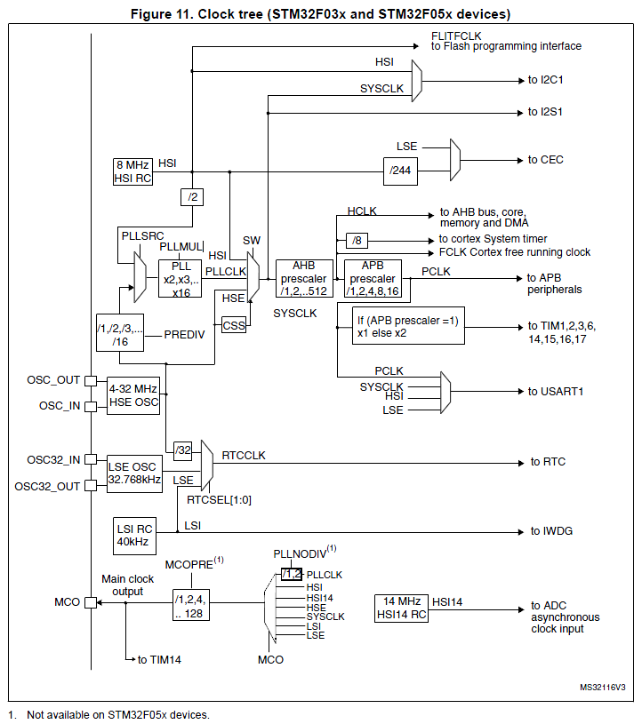
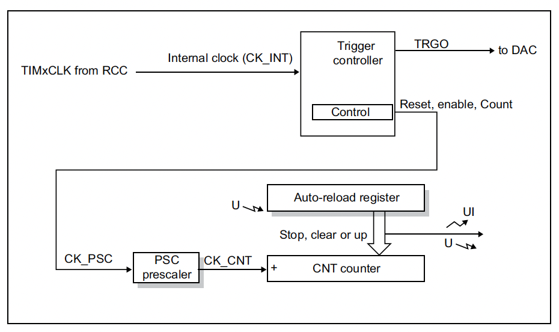
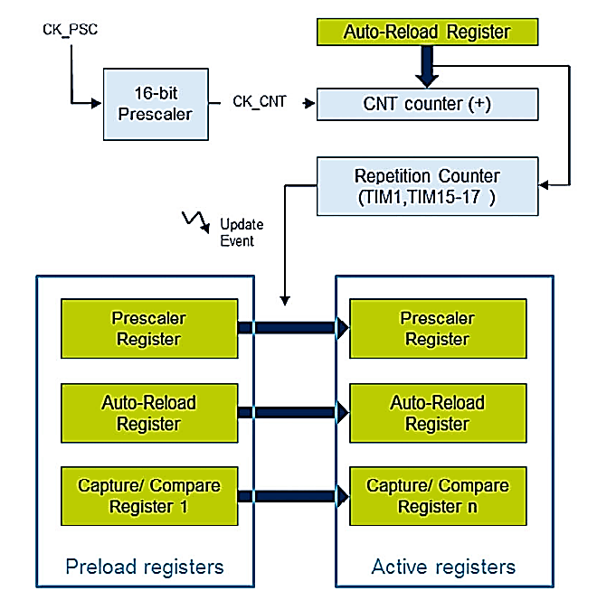
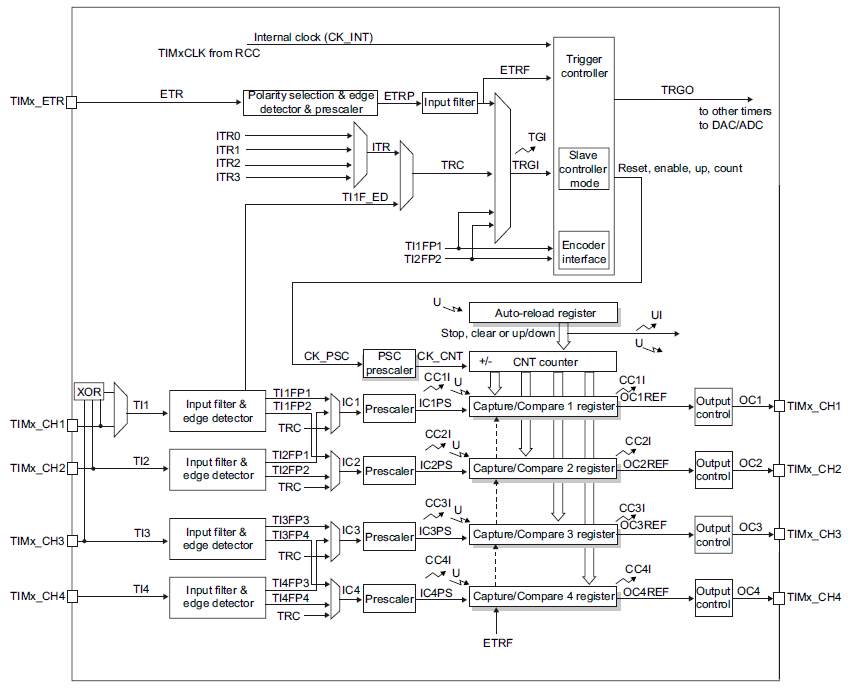
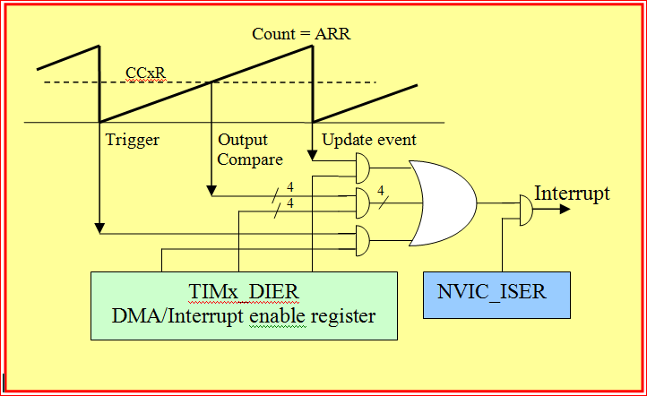
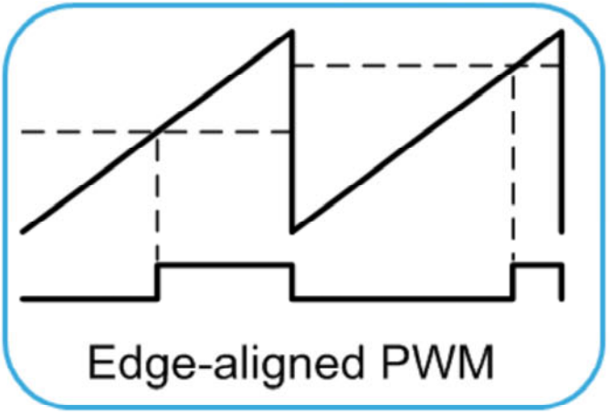
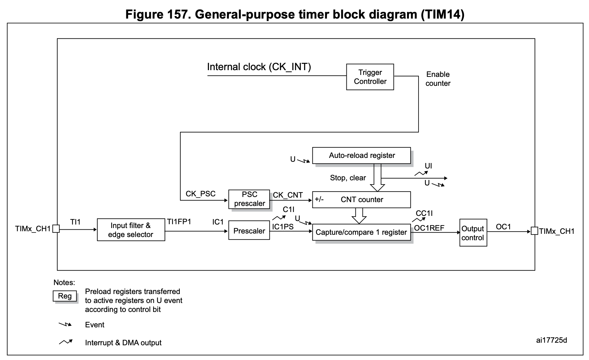
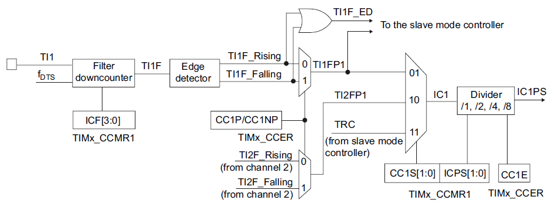

<!-- _class: lead -->
<!-- _paginate: false -->

# Chapter 11
## Timers

**Integrated Embedded Systems**
MEC4126F Programming Lectures

*James Hepworth*

---

# Outline

1. What timers are and why they matter
2. Timer classes and clocking
3. Time-base operation and update events
4. Output compare and PWM
5. Input capture
6. Practical configuration patterns

---

# Why Timers Matter

- Timers count in hardware while the CPU does other work
- They provide accurate delays without software busy loops
- They support:
  - periodic interrupts
  - waveform generation
  - PWM outputs
  - timing measurements of external signals

> Timers are one of the most useful peripherals in embedded systems because they turn time into something hardware can manage directly.

---

# Timers Versus Software Delays

Software delay loop:
- wastes CPU time
- depends on compiler and clock assumptions
- makes concurrent work difficult

Hardware timer:
- runs independently of the CPU
- gives repeatable timing
- can raise flags or interrupts when needed

Typical pattern:
1. Configure the timer
2. Start the timer
3. Let the main code continue
4. Respond when the timer reaches an event

---

# Timer Classes on STM32F0

- **Advanced-control timers**
  - example: `TIM1`
  - used for applications such as motor control
- **General-purpose timers**
  - examples: `TIM2`, `TIM3`, `TIM14` to `TIM17`
  - support capture/compare channels
- **Basic timers**
  - examples: `TIM6`, `TIM7`
  - mainly provide time-base functions

The exact set of timers and channel pins depends on the device package and board wiring.

---

# Timer Clocking

- A timer must receive a clock before it can count
- On STM32F0, timer clocks come from the `RCC` clock tree through the APB bus
- In this course, examples usually assume a `48 MHz` timer clock

The timer does not always count directly at the raw input clock:
- the input first passes through a **prescaler**
- the counter then increments at the divided rate

---

# Timer Clock Tree



> The timer input clock is derived from the MCU clock tree, then divided before it reaches the counter.

---

# Basic Timer Architecture



---

# Core Time-Base Registers

The most important registers for time-base operation are:

- `TIMx_PSC` = prescaler
- `TIMx_CNT` = current counter value
- `TIMx_ARR` = auto-reload value
- `TIMx_CR1` = control register
- `TIMx_DIER` = interrupt enable register
- `TIMx_SR` = status register

Basic up-counting behaviour:
1. `CNT` starts at `0`
2. It increments on each `CK_CNT` tick
3. It reaches `ARR`
4. An **update event** occurs
5. The counter wraps and repeats

---

# Time-Base Equations

The two main timer equations are:

$$f_{CNT} = \frac{f_{TIM}}{TIMx\_{PSC} + 1}$$

and

$$T_{update} = \frac{TIMx\_{ARR} + 1}{f_{CNT}} = \frac{(TIMx\_{PSC} + 1)(TIMx\_{ARR} + 1)}{f_{TIM}}$$

Where:
- $f_{TIM}$ is the timer input clock
- $f_{CNT}$ is the counter rate
- $T_{update}$ is the time between update events

Important:
- `PSC = 0` means divide by `1`
- `ARR = 999` means the timer counts `1000` steps

---

# Worked Time-Base Example

Assume:
- $f_{TIM} = 48\text{ MHz}$
- `PSC = 47`
- `ARR = 999`

Then:

$$f_{CNT} = \frac{48\,000\,000}{47 + 1} = 1\,000\,000\text{ Hz}$$

So the counter advances every `1 us`.

Then:

$$T_{update} = \frac{999 + 1}{1\,000\,000} = 1\text{ ms}$$

> This configuration gives a convenient `1 ms` time base.

---

# Update Events and Interrupts

When the counter reaches `ARR`, the timer can:

- reload the counter
- move preloaded values into active registers
- set `UIF` in `TIMx_SR`
- request an interrupt if `UIE` is enabled in `TIMx_DIER`

To use timer interrupts:
1. Configure the timer registers
2. Set `UIE` in `TIMx_DIER`
3. Enable the IRQ in the NVIC
4. Start the timer with `CEN`

---

# Polling a Timer Flag

Simple polling approach:

```c
while ((TIM3->SR & TIM_SR_UIF) == 0);
TIM3->SR &= ~TIM_SR_UIF;
```

This is useful for simple examples, but the CPU waits until the update event happens.

Interrupts are better when:
- the CPU has other work to do
- precise periodic service is required

---

# Timer Interrupt Example

```c
void TIM3_Init(void)
{
    RCC->APB1ENR |= RCC_APB1ENR_TIM3EN;

    TIM3->PSC = 47999;                  // 48 MHz / 48000 = 1 kHz
    TIM3->ARR = 999;                    // 1 kHz / 1000 = 1 Hz
    TIM3->CNT = 0;

    TIM3->DIER |= TIM_DIER_UIE;
    NVIC_EnableIRQ(TIM3_IRQn);

    TIM3->CR1 |= TIM_CR1_CEN;
}
```

---

# Timer Interrupt Handler

```c
void TIM3_IRQHandler(void)
{
    if (TIM3->SR & TIM_SR_UIF)
    {
        TIM3->SR &= ~TIM_SR_UIF;
        /* Do something every update event */
    }
}
```

Handler rules:
- check the correct source flag
- clear or acknowledge it correctly
- keep the ISR short

---

# Preload and Active Registers



Why this matters:
- software may write new values to `PSC`, `ARR`, or `CCRx`
- the timer often stores them in a **preload** register first
- the active hardware value updates on an **update event**

> This prevents glitches while the timer is running.

---

# General-Purpose Timer Channels



---

# Channel-Related Registers

General-purpose timers add channel hardware and extra registers:

- `TIMx_CCR1` to `TIMx_CCR4` = capture/compare values
- `TIMx_CCMR1`, `TIMx_CCMR2` = channel mode selection
- `TIMx_CCER` = channel enable and polarity

The same channel can operate as:
- **output compare**
- **PWM output**
- **input capture**

The `CCxS` bits decide whether the channel behaves as an output or an input.

---

# Output Compare

In output compare mode:
- the timer compares `CNT` with `CCRx`
- when `CNT == CCRx`, a compare event occurs

That event can:
- set a `CCxIF` flag
- change the output pin state
- toggle the pin
- generate an interrupt

Useful modes selected by `OCxM` include:
- set active
- set inactive
- toggle
- PWM mode 1
- PWM mode 2

---

# Output Compare Event



> Output compare is useful when something must happen at a precise counter value.

---

# Output Compare Configuration

Typical setup sequence:

1. Enable timer and GPIO clocks
2. Configure the pin for alternate function mode
3. Set `PSC` and `ARR`
4. Set `CCRx` for the compare position
5. Set `CCxS = 00` for output mode
6. Choose `OCxM`
7. Enable preload if needed with `OCxPE`
8. Set polarity in `CCER`
9. Enable the channel with `CCxE`
10. Start the timer with `CEN`

Always confirm the correct GPIO alternate function in the datasheet.

---

# Example Output Compare Setup

```c
RCC->APB1ENR |= RCC_APB1ENR_TIM14EN;

TIM14->PSC  = 7;                       // 8 MHz / 8 = 1 MHz
TIM14->ARR  = 99;                      // 10 kHz period
TIM14->CCR1 = 30;                      // Compare point

TIM14->CCMR1 &= ~TIM_CCMR1_CC1S;
TIM14->CCMR1 |= TIM_CCMR1_OC1PE;
TIM14->CCMR1 |= TIM_CCMR1_OC1M_0 | TIM_CCMR1_OC1M_1;

TIM14->CCER |= TIM_CCER_CC1E;
TIM14->CR1  |= TIM_CR1_CEN;
```

This example configures channel 1 for a timed output action.

---

# Pulse-Width Modulation

PWM uses timer compare hardware to create a repeating digital waveform.

Core idea:
- `ARR` sets the overall period
- `CCRx` sets where the output changes state
- the result is a waveform with an adjustable **duty cycle**

Common uses:
- motor speed control
- LED brightness control
- power conversion

---

# Edge-Aligned PWM



In up-counting PWM mode 1:
- the update event usually starts the pulse
- the compare event usually ends the pulse

---

# PWM Equations

For up-counting PWM mode 1:

$$f_{PWM} = \frac{f_{TIM}}{(TIMx\_{PSC} + 1)(TIMx\_{ARR} + 1)}$$

Approximate duty cycle:

$$\text{Duty cycle} = \frac{TIMx\_{CCR_x}}{TIMx\_{ARR} + 1} \times 100\%$$

Example:
- `PSC = 47` gives a `1 MHz` counter from `48 MHz`
- `ARR = 99` gives `10 kHz`
- `CCR1 = 30` gives about `30%` duty cycle

---

# PWM Configuration Sequence

1. Enable timer and GPIO clocks
2. Configure the output pin alternate function
3. Set `PSC` and `ARR` for PWM frequency
4. Set `CCRx` for duty cycle
5. Set `CCxS = 00`
6. Select PWM mode 1 or 2 using `OCxM`
7. Enable `OCxPE` for clean updates
8. Set polarity in `CCER`
9. Enable the channel with `CCxE`
10. Start the timer with `CEN`

> Changing `CCRx` at run time changes the duty cycle.

---

# Example PWM Setup

```c
RCC->APB1ENR |= RCC_APB1ENR_TIM3EN;

TIM3->PSC  = 47;                       // 48 MHz / 48 = 1 MHz
TIM3->ARR  = 99;                       // 10 kHz PWM
TIM3->CCR1 = 30;                       // 30% duty cycle

TIM3->CCMR1 &= ~TIM_CCMR1_CC1S;
TIM3->CCMR1 |= TIM_CCMR1_OC1PE;
TIM3->CCMR1 |= TIM_CCMR1_OC1M_1 | TIM_CCMR1_OC1M_2;

TIM3->CCER |= TIM_CCER_CC1E;
TIM3->CR1  |= TIM_CR1_CEN;
```

---

# Input Capture

Input capture uses the timer channel as an input rather than an output.

When a selected edge arrives:
- the current `CNT` value is copied into `CCRx`
- the channel flag is set
- an interrupt can be requested

This is useful for measuring:
- signal period
- pulse width
- time between events

---
# Input Capture Channel



---

# Input Capture Channel



---

# Measuring Period with Capture

Suppose:
- the counter runs at `1 MHz`
- rising edges are captured on channel 2

If two captured values are:
- first capture = `12000`
- second capture = `14500`

Then:

$$\Delta counts = 14500 - 12000 = 2500$$

Since each count is `1 us`:

$$T = 2500\text{ us} = 2.5\text{ ms}$$


---

# Input Capture Example

```c
TIM2->PSC = 47;                        // 1 MHz counter clock
TIM2->ARR = 0xFFFF;                    // Free-running counter

TIM2->CCMR1 &= ~TIM_CCMR1_CC2S;
TIM2->CCMR1 |= TIM_CCMR1_CC2S_0;       // CC2 as input on TI2

TIM2->CCER &= ~(TIM_CCER_CC2P | TIM_CCER_CC2NP);
TIM2->CCER |= TIM_CCER_CC2E;           // Rising edge capture

TIM2->DIER |= TIM_DIER_CC2IE;
TIM2->CR1  |= TIM_CR1_CEN;
```

In the ISR, read `TIM2->CCR2` and compare successive capture values.

---

# Choosing the Right Timer Mode

- **Time base**
  - "Has a fixed time interval passed?"
- **Output compare**
  - "What should happen at this count value?"
- **PWM**
  - "How do I create a repeating waveform with a chosen duty cycle?"
- **Input capture**
  - "At what count did this external event happen?"

These are different uses of the same timer hardware.

---

# Practical Notes

In this course, timers are especially useful for:

- periodic interrupts
- PWM for actuator or motor control
- measuring external pulse timing

Before a timer channel works on a pin:
1. enable the timer clock
2. enable the GPIO clock
3. select alternate function mode
4. choose the correct AF mapping from the datasheet

---

# Summary

- Timers provide accurate hardware-based timing
- `PSC` sets the counter rate and `ARR` sets the period
- Update events can be polled or used to generate interrupts
- General-purpose timers add output compare, PWM, and input capture
- The same timer hardware can solve delays, waveform generation, and measurement problems efficiently
