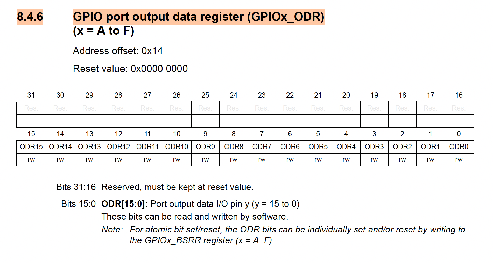
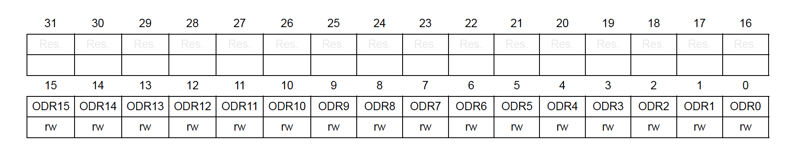

<!-- _class: lead -->
<!-- _paginate: false -->

# Chapter 6
## C Programming for Embedded Systems

**Integrated Embedded Systems**
MEC4126F Programming Lectures

*James Hepworth*

---

# Outline

1. Introduction to C for Embedded Applications
2. **Data Elements** (Types, Scope, Qualifiers)
3. **Operators & Logic** (Arithmetic, Bitwise)
4. **Grouped Statements** (Flow Control, Functions)
5. **Structural & System Elements** (Pointers, Preprocessor)

---

# Introduction to C

- Developed in **1972** by Dennis Ritchie at Bell Labs
- **Imperative** — statements determine program behaviour
- **Procedural** — statements execute in sequential order
- Remains the **dominant language** for embedded systems

---

# Why C for Embedded Systems?

1. **Direct hardware access** — pointers and memory-mapped I/O
2. **Minimal runtime overhead** compared to higher-level languages
3. **Predictable performance** characteristics
4. **Fine-grained control** over system resources
5. **Portability** across different microcontroller architectures

> C allows engineers to work closely with the hardware while maintaining readability and structure.

___

<!-- _class: lead -->

# 1. Data Elements
## (The "What")

---

# Variables and Data Types

## Data Type Categories

**1. Primitive (Built-in)**
- Fundamental types: `char`, `int`, `float`, `double`, `void`

**2. Derived**
- Built from primitives: **Arrays**, **Pointers**, **Functions**

**3. User-defined**
- Custom types: `struct`, `union`, `enum`, `typedef`

---

# Variables and Data Types

## Integer Types

| Type | Size | Description |
|------|------|-------------|
| `char` | 1 byte | Smallest addressable unit |
| `short` | 2 bytes | Short integer |
| `int` | typically 4 bytes | Standard integer |
| `long` | 4 or 8 bytes | Long integer |
| `long long` | 8 bytes | Extra-long integer |

All integer types can be **signed** (default) or **unsigned**.

---

# Variables and Data Types

## Floating-Point Types

| Type | Size | Description |
|------|------|-------------|
| `float` | 4 bytes | Single-precision |
| `double` | 8 bytes | Double-precision |

**Note:** Floating-point operations may be **expensive** without hardware FPU support.

---

# Variables and Data Types

## Character Type — `char`

- The smallest integer type (**1 byte** / 8 bits)
- **Wait, an integer?** Yes, a `char` is just a small `int`!
- Stores **numerical values** (0-255) mapped to **ASCII** (e.g. `'A'` = 65)

**Context vs. `int`:**
- `char`: 8 bits · Best for text or very small numbers
- `int`: 32 bits · Best for standard calculations on STM32


---

# Fixed-Width Integer Types

In embedded C, use types from `<stdint.h>` for **consistent behaviour** across platforms:

```c
#include <stdint.h>

uint8_t  one_byte;   // Unsigned 8-bit integer
int16_t  two_bytes;  // Signed 16-bit integer
uint32_t four_bytes; // Unsigned 32-bit integer
```

- The numerical part → number of bits
- The `u` prefix → unsigned (positive only)
- No prefix → signed (positive and negative)

---

# Integer Ranges and Limits

The range of values depends on the **number of bits ($n$ bits)**:

| Bits | Unsigned ($0$ to $2^n - 1$) | Signed ($-2^{n-1}$ to $2^{n-1} - 1$) |
| :--- | :--- | :--- |
| **8** | $0$ to $255$ | $-128$ to $127$ |
| **16** | $0$ to $65,535$ | $-32,768$ to $32,767$ |
| **32** | $0$ to $\approx 4.29 \times 10^9$ | $\approx \pm 2.14 \times 10^9$ |

**Embedded Tip:** Always choose the smallest type that fits your data to save memory and improve performance.

---

# Declaration, Assignment, and Initialization

**Declaration** — reserves memory, value is indeterminate:
```c
int counter;
float temperature;
```

**Assignment** — sets a value to a declared variable:
```c
counter = 0;
temperature = 25.5;
```

**Initialization** — combines both (preferred):
```c
int counter = 0;
float temperature = 25.5;
```

---

# Multiple Declarations

Variables of the same type can be declared together:

```c
uint8_t hour = 0, minute = 0, second = 0;  // Multiple init
```

> **Warning:** Using a variable before assigning a value is a **common source of bugs**.

---

# Arrays

Collection of elements of the **same type** stored in contiguous memory:

```c
uint16_t adc_readings[8];     // Array of 8 unsigned 16-bit integers
float temperatures[4] = {23.5, 24.1, 23.9, 25.0}; // Initialized array
```

**Key Characteristics:**
- **Zero-indexed:** First element is `adc_readings[0]`
- **Fixed size:** Boundary must be known at compile time
- **Contiguous memory:** Ideal for DMA and hardware buffers

> **Warning:** C does NOT check **array bounds**! Accessing an index outside the size leads to system crashes or memory corruption.

---

# Accessing Arrays

```c
// Assigning a value
adc_readings[0] = 4095;
adc_readings[1] = 3000;
adc_readings[2] = 2000;
adc_readings[3] = 1000;

// Accessing elements
reading_0 = adc_readings[0]; // sets reading_0 to the value of the first element in the array
reading_1 = adc_readings[1]; // sets reading_1 to the value of the second element in the array

```

---

# Structures

Group related data of **different types** into a single unit:

```c
struct SensorData 
{
    uint32_t id;         // 4 bytes
    float value;        // 4 bytes
    uint16_t threshold; // 2 bytes
    char status;        // 1 byte
};
```

Usage with `struct` keyword:

```c
struct SensorData reading;
reading.id = 1;
reading.value = 25.5;
reading.threshold = 100;
reading.status = 'A';
```

---

# Custom Aliases with `typedef`

The `typedef` keyword creates a **shorter or more descriptive alias** for an existing type:
- It does **not** create a new data type; it just gives an alternative name.
- It works with **any** type: primitives, arrays, structs, or pointers.

**Examples with Primitives:**
```c
typedef unsigned char byte_t;    // Common alias for 8-bit data
byte_t mask = 0xAA;

typedef uint32_t handle_t;      // Meaningful name for a handle
```

> **Note:** The `uint32_t` and `int16_t` types you've been using are actually `typedef`s of the standard C `unsigned int` and `short` types!

---

# Typedef with Structures

Use `typedef` to create a shorter name for a structure to avoid typing `struct` every time:

```c
typedef struct 
{
    uint32_t id;
    float value;
    uint16_t threshold;
    char status;
} sensor_data_t;
```

Usage (no `struct` keyword needed!):

```c
sensor_data_t reading1;
reading1.id = 1;
reading1.value = 25.5;
```

---

# Variable Scope

## Global Variables
- Declared **outside** functions
- Accessible from **anywhere** in the program
- Lives for the **entire duration** of program execution

## Local Variables
- Declared **inside** a function or `{}` block
- Only accessible **within that block**
- Only exists while the block is executing

**Embedded Tip:** Keep globals to a minimum! They consume RAM permanently and can be altered by mistake from unrelated parts of the code.

---

# Type Qualifiers

## `const`

Declares a variable whose value **cannot be changed** after initialization:

```c
const uint16_t MAX_ADC_VALUE = 4095;
const float PI = 3.14159;
```

**Benefits:**
1. Documents that a value should not change
2. Allows compiler to place data in **read-only memory**
3. Enables compiler **optimizations**
4. Prevents accidental modifications

---

# Type Qualifiers

## `static` — Local Variables

Preserves the variable's value **between function calls**:

```c
void count_events(void) 
{
    static uint32_t event_counter = 0;  // Initialized only once
    
    event_counter++;
    printf("Event count: %lu\n", event_counter);
}
```

Each call to `count_events()` increments from the **previous value**, not from 0.

---

# Type Qualifiers

## `static` — File Scope

Limits visibility to the file where it is defined (**encapsulation**):

```c
// In timer.c
static uint32_t timer_ticks;      // Only accessible within timer.c
static void update_timer(void);   // Only callable within timer.c

void timer_init(void)             // Globally accessible
{            
    timer_ticks = 0;
}
```

**Benefits:** Prevents name conflicts · Hides implementation details · Enforces access through public API

---

# Type Qualifiers

## `volatile`

Tells the compiler a variable's value **may change unexpectedly**:

```c
volatile uint8_t interrupt_flag;
```

Critical for:
1. **Memory-mapped hardware registers**
2. Variables shared between main code and **ISRs**
3. Memory modified by **DMA** operations

---
# Type Qualifiers

## `volatile`

Tells the compiler a variable's value **may change unexpectedly**:

```c
// Example: Waiting for a flag set in an Interrupt (ISR)
while (data_ready == 0) 
{
    // Without volatile, the compiler might "optimize" this 
    // by assuming data_ready never changes!
}
```

---

<!-- _class: lead -->

# 2. Operators & Logic
## (The "How")

---

# Arithmetic Operators

| Operator | Description | Example |
|----------|-------------|---------|
| `+` | Addition | `a + b` |
| `-` | Subtraction | `a - b` |
| `*` | Multiplication | `a * b` |
| `/` | Division | `a / b` |
| `%` | Modulo | `a % b` |
| `++` | Increment | `a++` or `++a` |
| `--` | Decrement | `a--` or `--a` |

---

# Prefix vs. Postfix

```c
uint8_t a = 5;
uint8_t b = ++a;  // b = 6, a = 6  (increment first)
```
```c
uint8_t a = 5;
uint8_t c = a++;  // c = 5, a = 6  (use first, then increment)
```
> **Warning:** Division and modulo may be **computationally expensive** on microcontrollers without hardware division support.

---

# Assignment Operators

| Operator | Description | Equivalent |
|----------|-------------|------------|
| `=` | Assign | — |
| `+=` | Add and assign | `a = a + b` |
| `-=` | Subtract and assign | `a = a - b` |
| `*=` | Multiply and assign | `a = a * b` |
| `/=` | Divide and assign | `a = a / b` |
| `%=` | Modulo and assign | `a = a % b` |
| `<<=` | Left shift and assign | `a = a << b` |
| `>>=` | Right shift and assign | `a = a >> b` |
| `&=` | AND and assign | `a = a & b` |
| `\|=` | OR and assign | `a = a \| b` |

---

# Comparison & Logical Operators

<div class="columns">
<div>

**Comparison**

| Operator | Meaning |
|----------|---------|
| `==` | Equal to |
| `!=` | Not equal |
| `>` | Greater than |
| `<` | Less than |
| `>=` | Greater/equal |
| `<=` | Less/equal |

</div>
<div>

**Logical**

| Operator | Meaning |
|----------|---------|
| `&&` | AND |
| `\|\|` | OR |
| `!` | NOT |

C uses **short-circuit evaluation**: stops evaluating as soon as the result is determined.

</div>
</div>

---

# Examples: Logic in Practice

```c
// 1. Combined conditions
if (temp > 40 && alarm_enabled) 
{
    activate_fan();  // Both must be true
}

// 2. Either condition
if (button_pressed || timer_finished) 
{
    wake_system();   // True if at least one is true
}

// 3. Logical NOT for flags
if (!system_busy) 
{
    start_processor(); // True if system_busy is 0
}
```

---

# Bitwise Operators

| Operator | Description | Example |
|----------|-------------|---------|
| `&` | Bitwise AND | `a & b` |
| `\|` | Bitwise OR | `a \| b` |
| `^` | Bitwise XOR | `a ^ b` |
| `~` | Bitwise NOT | `~a` |
| `<<` | Left shift | `a << b` |
| `>>` | Right shift | `a >> b` |

**Heavily used** in embedded systems for register manipulation.

---

# Bitwise OR (`|`) — Combining Bits

Used to **combine** bit patterns or **set** bits:

```c
uint8_t temp1 = 0b00000010; // (2)
uint8_t temp2 = 0b01001010; // (74)

uint8_t result = temp1 | temp2;
// result = 0b01001010 (= 0x4A = 74)
```

---

# Bitwise AND (`&`) — Masking bits

Used to **extract** bits or **clear** bits:

```c
uint8_t temp1 = 0b11111101; // (253)
uint8_t temp2 = 0b01001011; // (75)

uint8_t result = temp1 & temp2;
// result = 0b01001001 (= 0x49 = 73)
```

---

# Bitwise XOR (`^`) — Toggling bits

Used to **toggle** (flip) bits:

```c
uint8_t temp1 = 0b00000010; // (2)
uint8_t temp2 = 0b01001010; // (74)

uint8_t result = temp1 ^ temp2;
// result = 0b01001000 (= 0x48 = 72)
```

---

# Bitwise Shift (`<<` and `>>`)

Used to move bits left or right:

```c
uint8_t a = 0b00000101; // (5)

uint8_t result_left = a << 2;  // Shift left 2
// result = 0b00010100 (= 20)

uint8_t result_right = a >> 1; // Shift right 1
// result = 0b00000010 (= 2)
```

---

# Miscellaneous Operators

| Operator | Description | Example |
|----------|-------------|---------|
| `sizeof` | Size of type/variable | `sizeof(int)` |
| `&` | Address-of | `&variable` |
| `*` | Dereference pointer | `*pointer` |
| `.` | Structure member | `struct.member` |
| `->` | Structure pointer member | `ptr->member` |
| `?:` | Ternary conditional | `cond ? a : b` |

```c
uint8_t duty_cycle = (temperature > THRESHOLD) ? MAX_DUTY : MIN_DUTY;
```

---

# A Detour to Pointers to explain the -> operator

Every variable lives at a specific location in memory — its **address**.
- A **pointer** is a variable that **stores an address** instead of a value.

```
Memory:
  Address  │ Value
  ─────────┼───────
  0x2000   │  10      ← uint32_t val = 10;
  0x2004   │  0x2000  ← uint32_t *ptr = &val;  (stores the address of val)
```

> **Why this matters for STM32:** Hardware registers like GPIO ports live at **fixed addresses**. The ST libraries give you *pointers* to those addresses so you can control hardware directly.

---

# Pointer Syntax

Reading pointer declarations can be confusing at first. Break it into two parts:

```c
uint32_t * ptr;
│          │
│          └─ Name of the pointer variable
└─ Type of data it points to (a uint32_t lives at that address)
```

| Statement | Meaning |
|---|---|
| `uint32_t val = 10;` | A 32-bit variable holding `10` |
| `uint32_t *ptr = &val;` | A pointer to `val`'s address |
| `*ptr` | The value *at* that address (i.e. `10`) |

> The `*` in a **declaration** defines a pointer. The `*` in an **expression** dereferences it.

---

# Referencing and Dereferencing

Two operators work together to use pointers:

| Operator | Name | Meaning |
|---|---|---|
| `&` | Reference / **address-of** | "Give me the address of this variable" |
| `*` | Dereference | "Give me the value at this address" |

```c
uint32_t val = 10;
uint32_t *ptr = &val;   // ptr holds the address of val
uint32_t res = *ptr;    // Dereference: go to address, read value → res = 10

*ptr = 99;              // Write through the pointer: val is now 99
```

> **Note:** Dereferencing a pointer is like following a hyperlink — you go to the location it points to.

---

# Pointers to Structures

A pointer can point to an entire **structure** — a whole block of related data — from a **single address**.

```c
sensor_data_t my_sensor;          // The object in memory
sensor_data_t *ptr = &my_sensor;  // Pointer to the start of that object
```

To access a member through a pointer, you must **dereference first, then access**:

```c
// Long form — dereference, then use dot operator:
(*ptr).id = 1;

// These two lines do the same thing:
my_sensor.id = 1;
(*ptr).id    = 1;
```

---

# The Arrow Operator (`->`)

The parentheses in `(*ptr).member` are easy to get wrong. C provides a cleaner shorthand:

```
ptr->member   ≡   (*ptr).member
```

```c
sensor_data_t my_sensor;
sensor_data_t *ptr = &my_sensor;

my_sensor.id = 1;   // Direct access   (object)
ptr->id      = 1;   // Arrow access     (pointer to object)  ← same result
```

| Syntax | When to use |
|---|---|
| `object.member` | You have the object itself |
| `pointer->member` | You have a *pointer* to the object |

---

# Connecting to STM32 — Hardware Registers

All of this leads directly to how STM32 peripherals are accessed in C:

**1. Registers are grouped into structs** (one struct per peripheral):
```c
typedef struct {
    volatile uint32_t MODER;   // Pin mode register
    volatile uint32_t ODR;     // Output data register
    // ...
} GPIO_TypeDef;
```

**2. A pointer is placed at the hardware address:**
```c
#define GPIOA  ((GPIO_TypeDef *) 0x40020000)  // From stm32f4xx.h
```

---

**3. You access registers with `->` :**
```c
GPIOA->ODR = 0xFF;    // Write 0xFF to GPIOA's Output Data Register
```

> **Note:** `GPIOA` is just a pointer. `->` dereferences it and selects the register member.

---

# Return to Bitwise Operations — Common Patterns

**Set** a bit:
```c
GPIOA->ODR |= (1 << 5);   // Set bit 5
```

**Clear** a bit:
```c
GPIOA->ODR &= ~(1 << 5);  // Clear bit 5
```

**Toggle** a bit:
```c
GPIOA->ODR ^= (1 << 5);   // Toggle bit 5
```

**Check** a bit:
```c
if (GPIOA->IDR & (1 << 0)) { /* Bit 0 is set */ }
```

---

# What is a Bitmask?

A **bitmask** is a value used with a bitwise operator to **select, set, clear, or test** specific bits in a register.

- Bits set to **1** in the mask → the bits you care about
- Bits set to **0** in the mask → the bits you ignore

```c
uint32_t mask = (1 << 5);  // Only bit 5 is 1: 0b00100000
```

> Think of a mask as a **stencil** — it lets certain bits through and blocks the rest.

---

# Building Bitmasks — The Shift Pattern

Use `(1 << n)` to target **bit n**. Combine with `|` to target multiple bits:

```c
(1 << 5)          // Targets bit 5 only
(1 << 5) | (1 << 3)   // Targets bits 5 and 3
```

The `~` operator **inverts** the mask — useful for clearing:

```c
~(1 << 5)         // All bits set EXCEPT bit 5 (i.e. 0b11011111)
```

> This pattern is used **everywhere** in STM32 register programming.

---

# Bitmasks in Practice — GPIO `ODR`

The `ODR` (Output Data Register) controls pin output levels using **1 bit per pin**:



---
# Bitmasks in Practice — GPIO `ODR`



In the stm32f051x8.h library header file:

```c
/******************  Bit definition for GPIO_ODR register  ********************/
#define GPIO_ODR_0                      (0x00000001U)
#define GPIO_ODR_1                      (0x00000002U)
#define GPIO_ODR_2                      (0x00000004U)
#define GPIO_ODR_3                      (0x00000008U)
#define GPIO_ODR_4                      (0x00000010U)
#define GPIO_ODR_5                      (0x00000020U)
```

---
# Bitmasks in Practice — GPIO `ODR`


Applying the mask patterns from before:

```c
// Turn ON LED on pin 5  — set bit 5
GPIOA->ODR |= GPIO_ODR_5;

// Turn OFF LED on pin 5 — clear bit 5
GPIOA->ODR &= ~GPIO_ODR_5;

// Toggle LED on pin 5   — flip bit 5
GPIOA->ODR ^= GPIO_ODR_5;
```

---


<!-- _class: lead -->

# 3. Grouped Statements
## (The "Logic")

---

# Conditional Statements

## `if` / `else`

<div class="columns">
<div>

```c
if (ADC_value > 3000)
{
    LED_HIGH();
}
else if (ADC_value > 1000)
{
    LED_MED();
}
else
{
    LED_OFF();
}
```
</div>
<div>
Only one code block will run in an <code>if / else if / else</code> chain.
</div>

---

# Conditional Statements

## `switch`

```c
switch (system_state) 
{
    case IDLE:
        enter_low_power_mode();
        break;
    case ACTIVE:
        process_sensor_data();
        break;
    case ERROR:
        trigger_alarm();
        break;
    default:
        reset_system();
}
```

---

# Enumerations (`enum`)

An **enumeration** assigns names to integer constants, making code readable and eliminating "magic numbers". They are commonly used with `switch` statements to build **state machines**.

```c
enum SystemState {
    IDLE,      // Automatically assigned 0
    ACTIVE,    // Automatically assigned 1
    ERROR      // Automatically assigned 2
};

enum SystemState system_state = ACTIVE;
```

> **Tip:** `if (state == 1)` is confusing. `if (state == ACTIVE)` is perfectly clear.

---

# Loops

**`for`** — when number of iterations is known:
```c
for (int i = 0; i < 10; i++) 
{
    send_data_packet(i);
}
```

**`while`** — continues while condition is true:
```c
while (UART_is_receiving()) 
{
    process_byte(UART_read_byte());
}
```
---

# Loops

**`do-while`** — executes at least once:
```c
do {
    read_sensor_value();
} while (more_readings_available());
```

---

# The Embedded Super Loop

In embedded systems, `main()` typically contains an **infinite loop**:

```c
void main(void) 
{
    system_init();
    
    while (1) 
    {
        if (flag_set) 
        {
            process_data();
            flag_set = 0;
        }
    }
}
```

Actual processing often occurs in **interrupt service routines** (ISRs).

---

# Functions

A well-structured C function:

```c
return_type function_name(parameter_type parameter_name, ...) 
{
    // Function body
    return value;
}
```

**Key elements:**
1. **Return type** — `void` if nothing returned
2. **Function name** — verb-noun format, e.g. `initialize_hardware`
3. **Parameters** — each needs type and name; `void` = no parameters
4. **Return statement** — must match declared return type

---

# Functions — Example

```c
uint16_t calculate_voltage_mv(uint16_t adc_reading)
{
    // Convert 12-bit ADC reading to millivolts (assuming 3.3V reference)
    uint32_t voltage = (adc_reading * 3300) / 4095;
    
    return (uint16_t)voltage;
}
```

Takes a `uint16_t` parameter and returns a calculated `uint16_t` result.

---

# Function Prototypes

Declare a function **before** its implementation so the compiler can perform type checking:

```c
// Prototype — BEFORE main()
void initialize_hardware(void);

int main(void) 
{
    initialize_hardware();  // Compiler knows the function exists
}

// Implementation — AFTER main()
void initialize_hardware(void) 
{
    // Initialization code
}
```

---


<!-- _class: lead -->

# 4. Structural & System Elements
## (The "System")

---


# Preprocessor Directives

## `#include`

```c
#include <stdint.h>       // System header (angle brackets)
#include "uart_driver.h"  // Project header (quotes)
```

## `#define` — Macros

```c
#define LED_PIN     5
#define SET_BIT(REG, BIT)  ((REG) |= (1 << (BIT)))

SET_BIT(GPIOA->ODR, LED_PIN);
```

Macros improve readability but **lack type checking**.

---

# Conditional Compilation

Include or exclude code before it even reaches the compiler using:
- **`#ifdef` / `#ifndef`** (If Defined / If Not Defined)
- **`#if` / `#elif` / `#else`** (If / Else If / Else)
- **`#endif`** (Ends the conditional block)

```c
#define HARDWARE_V2

#ifdef HARDWARE_V2
    init_new_sensor();
#else
    init_legacy_sensor();
#endif
```

---

### Safely "Commenting Out" Code

Always use `#if 0` instead of `/* ... */` to disable large blocks of code. 

```c
#if 0
    // This code is completely ignored by the compiler
    int old_value = 5;
    /* This comment would break a nested block comment! */
    process_data(old_value);
#endif
```

---

# Main Program Structure

```c
// Includes  ----------------------------------------
#include <stdio.h>
#include <math.h>

// Global variables  ---------------------------------
float a = 67;

// Function declarations  ----------------------------
void main();

// Main function  ------------------------------------
void main()
{
    printf("sqrt(67)=%f", sqrt(a));
    return 0;
}

// Function implementations --------------------------

// END  ----------------------------------------------
```

---

# Libraries in C

A **library** is a collection of pre-written, reusable code that provides specific functionality. 
Using a library typically requires two parts:
1. **The Implementation (`.c` file / compiled binary):** Contains the actual instructions that perform the work.
2. **The Header (`.h` file):** The "interface" that tells your compiler which functions and variables are available to use.

> Think of the **header file** as a restaurant menu, and the **implementation** as the kitchen.
---

# Header Files & Implementations

Separate **interfaces** (`.h`) from **implementations** (`.c`):

<div class="columns">
<div>

**`sensor.h`** (Interface)
```c
#ifndef SENSOR_H
#define SENSOR_H

#include <stdint.h>

typedef struct {
    uint8_t id;
    uint16_t value;
} sensor_data_t;

void sensor_init(void);
sensor_data_t sensor_read(void);

#endif
```
</div>
<div>

**`sensor.c`** (Implementation)
```c
#include "sensor.h"

void sensor_init(void) 
{
    // Hardware setup
}

sensor_data_t sensor_read(void) 
{
    sensor_data_t data = {1, 42};
    return data;
}
```
</div>
</div>

**Include guards** (`#ifndef ... #endif`) prevent multiple inclusion.


