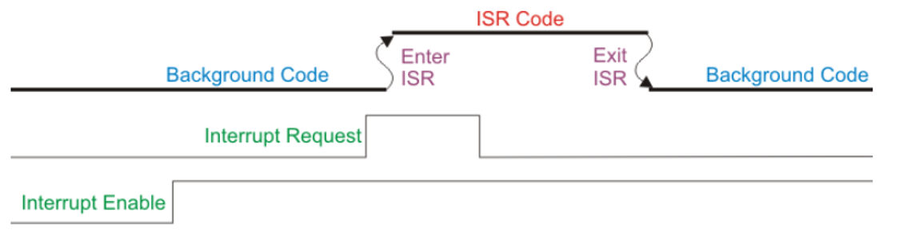
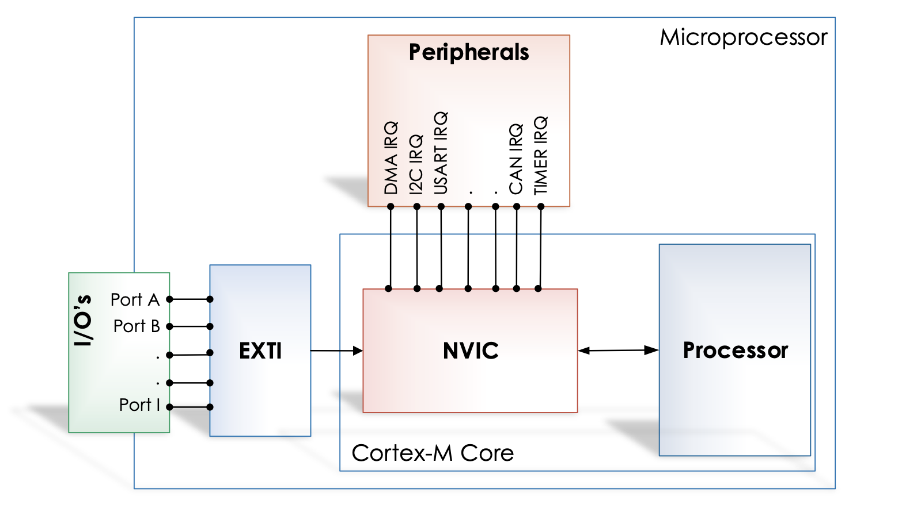
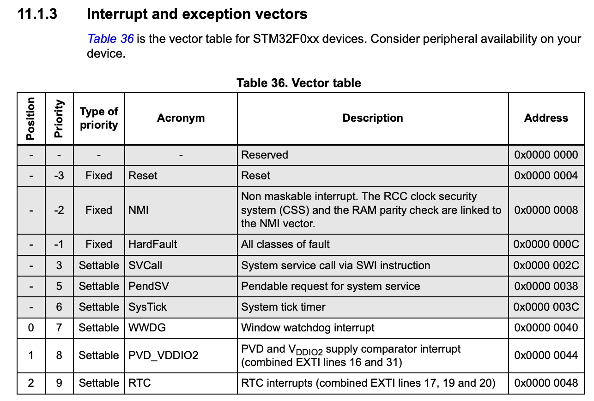

<!-- _class: lead -->
<!-- _paginate: false -->

# Chapter 9
## Interrupts

**Integrated Embedded Systems**
MEC4126F Programming Lectures

*James Hepworth*

---

# Outline

1. What interrupts are and why they matter
2. Interrupts compared to polling
3. STM32 interrupt architecture
4. Peripheral `IER` and `ISR` registers
5. Vector table and ISR structure
6. Best practices and advanced features

---

# What Is an Interrupt?

- An interrupt tells the CPU to stop normal execution and run a handler
- The handler is called an **Interrupt Service Routine (ISR)**
- On STM32, handlers use predefined names such as `EXTI0_IRQHandler`

Key features:
- **Asynchronous** operation
- **Immediate** response after the current instruction
- Low **interrupt latency**
- Automatic **context preservation**

---

# Interrupts Versus Polling

Polling:
- CPU repeatedly checks a status flag
- Simple, but inefficient

Interrupts:
- Peripheral raises a request only when an event occurs
- CPU can do other work meanwhile
- Better for responsive, event-driven systems

Examples of polling:
- Checking a GPIO input in a loop
- Waiting for `ADC_ISR_EOC` after every conversion

---

# Interrupt Flow



> A peripheral event sets a flag, requests service, and the CPU branches to the ISR.

---

# Why Interrupts Help

- Avoid wasting CPU time on repeated status checks
- Allow multiple peripherals to be serviced efficiently
- Improve responsiveness to external and internal events

Typical pattern:
1. Configure the peripheral
2. Enable the interrupt source
3. Let the main program continue
4. Handle the event when the ISR runs

---

# STM32 Interrupt Architecture

- **NVIC** sits close to the CPU
- **EXTI** handles external interrupt/event lines
- Most interrupts must be enabled in both:
  - The peripheral itself
  - The NVIC

For GPIO-based interrupts, EXTI is also involved between the pin and the NVIC.

---

# Interrupt Controllers



---

# NVIC and EXTI Roles

**NVIC**
- Handles internal peripheral IRQs
- Applies priority and nesting rules
- Dispatches the CPU to the correct handler

**EXTI**
- Routes external interrupt sources
- Supports GPIO-based interrupt lines
- Can also generate events for other peripherals

---

# Peripheral `IER` and `ISR` Registers

The NVIC is only the final stage. Each peripheral also tracks its own interrupt sources.

- `IER` = **Interrupt Enable Register**
- `ISR` = **Interrupt and Status Register**

The basic idea:
- `ISR` says an event **happened**
- `IER` says that event is **allowed to interrupt**

Both matter before the CPU sees the interrupt.

---

# How ST Uses `IER` and `ISR`

An interrupt request is normally forwarded only when:

1. The event flag is set in the peripheral `ISR`
2. The matching enable bit is set in the peripheral `IER`
3. The IRQ is enabled in the NVIC

So the enable path is layered:
- Peripheral event flag
- Peripheral interrupt enable
- NVIC enable

---

# Example: ADC Interrupt Generation

- ADC finishes a conversion
- ADC sets `EOC` in `ADC_ISR`
- If `EOCIE` is set in `ADC_IER`, the ADC can request an interrupt
- If `ADC1_IRQn` is enabled in the NVIC, the CPU enters the ADC handler

This separates:
- **Status tracking**: what happened
- **Interrupt permission**: which events should interrupt

---

# Register Names Vary by Peripheral

The model is consistent, even when names differ.

Examples:
- Newer peripherals often use `IER` and `ISR`
- Timers often use:
  - `DIER` for interrupt enables
  - `SR` for status flags
- Some peripherals use `ICR` to clear flags

> Same principle: one register enables interrupt sources, another records events.

---

# Enabling an Interrupt on STM32

Typical sequence:

1. Configure the peripheral
2. Enable the desired interrupt source in the peripheral
3. Enable the IRQ in the NVIC

Example:

```c
ADC1->IER |= ADC_IER_EOCIE;
NVIC_EnableIRQ(ADC1_IRQn);
```

---

# Vector Table



---

# What the Vector Table Does

- Stores the address of each ISR
- Maps each interrupt source to a handler
- Supports priority-based interrupt handling
- Allows higher-priority interrupts to preempt lower-priority ones

> The vector table tells the CPU where to jump when a specific interrupt is accepted.

---

# ISR Rules

Interrupt handlers must:

1. Return no value
2. Accept no arguments
3. Stay short and focused
4. Correctly acknowledge the interrupt source

The compiler handles CPU state save/restore on STM32.

---

# ISR Structure

```c
void EXTI0_IRQHandler(void)
{
    // Handle the event
    EXTI->PR |= EXTI_PR_PR0;
}

void ADC1_COMP_IRQHandler(void)
{
    // Read or clear the relevant ADC flag source
}
```

General pattern:

```c
void PERIPHERAL_IRQHandler(void)
{
    // Handle interrupt
}
```

---

# Clearing Interrupt Flags

- The interrupt source must usually be acknowledged inside the ISR
- Otherwise the handler may run again immediately

Depending on the peripheral, a flag may be cleared by:
- Writing to a clear register such as `ICR`
- Writing to a status bit
- Reading a data register

Always check the reference manual for the exact rule.

---

# Best Practices

1. Keep ISRs as short as possible
2. Clear or acknowledge flags correctly
3. Use priorities carefully
4. Avoid long calculations inside handlers
5. Share data with main code safely
6. Be aware of interrupt latency

---

# Advanced Features

**Priority management**
- Higher-priority interrupts can preempt lower-priority ones
- NVIC supports nested interrupt handling

---

# Summary

- Interrupts make embedded systems responsive and efficient
- On STM32, enabling an interrupt is usually a multi-stage process
- Peripheral `ISR` bits track events
- Peripheral `IER` bits decide which events may interrupt
- The NVIC then applies enable and priority rules
- Every ISR must handle and acknowledge its interrupt source

