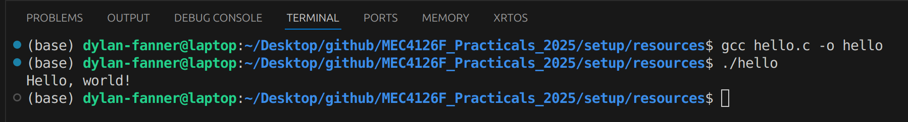
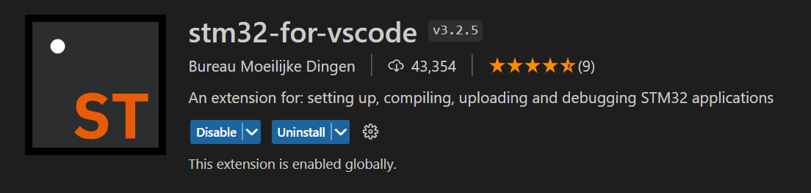

# Linux Setup for Practicals

The MEC4126F practicals will require a way for you to develop code either through an IDE or text editor for STM32. If you do not have either setup from a previous course, please follow the guide below after ensuring that your system is up to date by running:

```bash
$ sudo apt-get update && sudo apt-get upgrade
```

Setting up C and STM32 programming on Linux distributions can be relatively painless compared to Windows, or to a lesser extent MacOS. The instructions below were developed on Ubuntu 24.04 'Noble', but should work on other distributions similarly.

Table of Contents
=================

* [Table of Contents](#table-of-contents)
* [Visual Studio Code (IDE)](#visual-studio-code-ide)
    * [C Programming](#c-programming-in-vsc)
    * [STM32 Programming](#stm32-programming)
* [Terminal (optional)](#terminal)
    * [Setup](#setup)
    * [Programming and Flashing](#programming-and-flashing)
* [STMCubeIDE (not recommended)](#stm32cubeide)

## Visual Studio Code (IDE)
The preferred IDE for MEC4126F STM32 programming is Visual Studio Code (VSC), since we can standardise the installation over multiple operating systems. There are two ways to install it. The first way is to use apt. To complete this first find the deb file from the following URL:
[Visual Studio Code](https://code.visualstudio.com/download).
From the URL choose the version of VSC that you prefer the most and download it to a directory that you can find. You can also use wget to manage the download:
```bash
$ mkdir ~/VSC && wget https://code.visualstudio.com/sha/download?build=stable&os=linux-deb-x64 -P ~/VSC #assuming Debian/Ubuntu distro
```
Then use apt to install the deb file:
```bash
# if you used the wget method
$ sudo apt install ~/VSC/linux-deb-x64
# otherwise
$ sudo apt install ./<file>.deb
```
Your VSC should now be ready to be used. If you would prefer to use snap, you can also download and install VSC through snap:
```bash
$ sudo snap install --classic code # or code-insiders
```

### C Programming in VSC

Your first task is to make sure your operating system can compile and run C code. For this, a **C compiler** is needed. There are several options that you can use but Ubuntu comes with **GCC** (Gnu C Compiler) pre-installed, however you can check that you have it by running:

```bash
$ gcc -v
```

If it is not installed, you will have to install it manually - find and follow online instructions for your particular distribution.

Additionally, you should install Microsoft's **C/C++ Extension** for VSCode, which includes debugging and intellisense functionality. It is available under the extensions menu on the left hand side of VSCode's GUI. The **C/C++ Extension Pack** also includes some other useful tools, and can also be installed. 

<p align="center" width="100%">
     
</p>

Once the desired extensions are installed, create a new file called `hello.c`. Inside, include code as follows:

```
#include <stdio.h>

int main() {
   printf("Hello, world!\n");
   return 0;
}
```

{:.note2}
This file is also available under [`./setup/Resources/hello.c`](/practicals/setup/Resources/hello.c).

Save the file, and try and compile the program. Open a new terminal in VSCode with `Terminal → New Terminal` menu at the top left of the GUI or the keyboard shortcut and run:

```bash
$ gcc hello.c -o hello
```

This should compile `hello.c` into an executable `hello` which can now be run. In the same terminal, run:

```bash
$ ./hello
```

You should see output similar to the following as output:

<p align="center" width="100%">
     
</p>

### STM32 Programming

Compiling and flashing code for your STM32 with VSCode is done primarily through the **stm32-for-vscode** extension.

<p align="center" width="100%">
     
</p>

This extension is also available in the extensions marketplace, similar to the C/C++ Extension already installed. Go ahead and install it now.

{:.note2}
While it is installing, you may be asked to install other pre-requisites in a pop-up in the bottom right of the screen. If you see this pop-up, accept and install anything requested.

If you don't see any pop-ups, that is fine - you will be prompted in the next step.

Once the **stm32-for-vscode** extension is installed, download the [`STM32 Programming Template`](/STM32-Programming-Template) available in the Integrating Embedded Systems repo. Save it to a convenient location, and open the folder in VSCode using `File → Open Folder ...`

Once it is open, you should see the STM32 plugin window available on the left hand side of the screen. It is the **small block with a dot and the letters ST under the extension marketplace icon**

<p align="center" width="100%">
     
</p>

Click on the STM32 for VSCode extension, it should open a new window on the left.

{:.note2}
You may at this point see three blue blocks, and a message saying the extension cannot find the build tools. In this case, simply select **Install Build Tools** from the menu, and wait for them to finish installing.

If the build tools are found, you should see a menu like the one below:

<p align="center" width="100%">
     
</p>

At this point, you can **plug in your STM32 Development Board**. Select **Build** to build the demo program, and then **Flash STM32** to flash the program to your development board. 

Your STM32 board should now flash with the code provided, and display `Hello World :)` on the attached LCD.

### If that was successful, you are ready to write and compile the C code required for MEC4126F practicals.

However, it is worth familiarizing yourself with the `STM32 Programming Template` provided at this point, as it is expected you use it for future practicals.

The most important files for practical use are located in `Core/Inc/...` and `Core/Src/...`

The **Inc** folder contains all the header files related to STM32 programming, as well as **main.h** the header file for your code.

The **Src** folder contains all the code files related to STM32 programming, as well as **main.c** the file which will contain any custom code your write for a given practical. It may be worthwhile to try modifying the **main.c** file to display your own text on the STM32 LCD display to make sure you understand the modify, build and flash workflow.

{:.caution}
Inc and Src also contain program and header files for the attached LCD screen. These are not standard STM32 files, and are specific to the UCT development board.

Other files inside the `STM32 Programming Template` folder may provide insight into the deeper workings of the STM32, but are not essential for MEC4126F.

*(If you would like a challenge, poke around in the template and see if you can recreate a custom, multi-line display message such as the one below)*

<p align="center" width="100%">
     
</p>


## Terminal
### Setup
If you prefer to use the traditional approach to C programming we suggest using the following recipe. To begin you will require GCC (for C Compiling), GIT (for package management), make (for managing C compilation) and stlink-tools (for flashing).
```bash
$ sudo apt-get install gcc make git stlink-tools
```
Before continuing, connect your STM32 dev board to your computer and run `st-info --probe`. You should then get an output that looks something like the following:
```bash
$ st-info --probe
Found 1 stlink programmers
  version:    V2J42
  serial:     39FF6D064153383741371857
  flash:      32768 (pagesize: 1024)
  sram:       8192
  chipid:     0x440
  dev-type:   STM32F05x
```
We can now grab `STM32 Programming Template` from the course git page. You can do this with two methods, the first is to simply clone the whole repo or we can complete a sparse checkout. To clone the whole repo run:

```bash
$ git clone https://github.com/MechatronicSystems-Group/Integrated-Embedded-Systems.git
```
To complete the sparse checkout we can run the following commands:

{:.caution}
Sparse checkout was introduced in Git 2.25.0, check your Git version before continuing.

```bash
$ git clone https://github.com/MechatronicSystems-Group/Integrated-Embedded-Systems.git --no-checkout
$ cd Integrated-Embedded-Systems
$ git sparse-checkout init
$ git sparse-checkout set STM32-Programming-Template
$ git checkout
```

You are now ready to create C programs for your STM32 dev board.

### Programming and Flashing
You can use your favourite flavour of text editor/IDE to develop your C code in `./STM32 Programming Template/Core/SRC/main.c`. 
When you have written your first program, we need a way to build the program and flash it to the dev board. The program can be built quite easily with make. Ensure that your CWD is `./STM32 Programming Template` and run make with:
```bash
$ make
```
To flash we will use `st-flash` and will use make to control the flashing process. To complete this add the following lines to the `Makefile` somewhere near line 177:

{:.caution}
**Make** is whitespace sensitive! Do not expand tabs to spaces. Ensure there is a tab on the second line of the recipe.

```bash
flash: $(BUILD_DIR)/$(TARGET).bin
    st-flash --reset write $< 0x8000000
```
You should now be able to flash to the dev board br running:

```bash
$ make flash
```

## STM32CubeIDE
The STM32CubeIDE is another method that can be used to develop C/C++ code for STM projects. This IDE is based off the  Eclipse IDE (an IDE first used for Java). It is not recommanded that you use the STM32CubeIDE, however it is an alternative IDE to VSCode if desired, and was used previously in the course. It is also already installed on EM101 PCs, which is beneficial if you wish to use them for code development, as the VSCode toolchain must be installed every time the computers are used. The legacy installation instructions for STM32CubeIDE for Windows and Mac are included in `/setup/resources`. Linux users are hoped to have better taste, and installation instructions are not provided.
