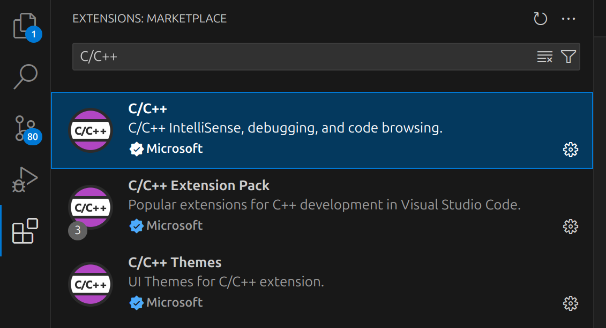
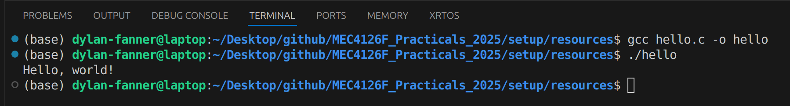
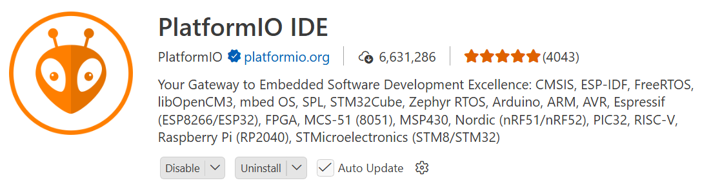
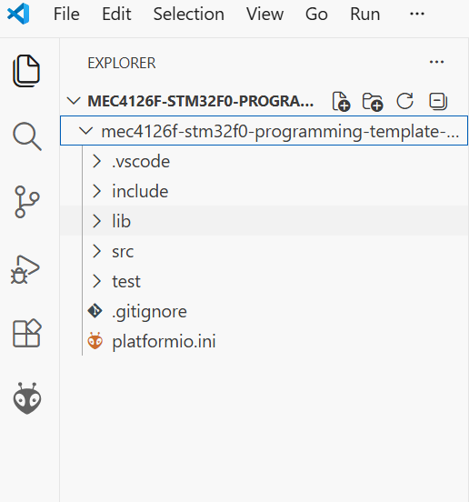
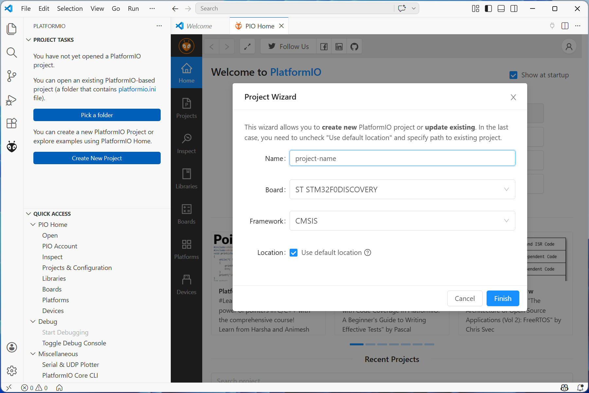
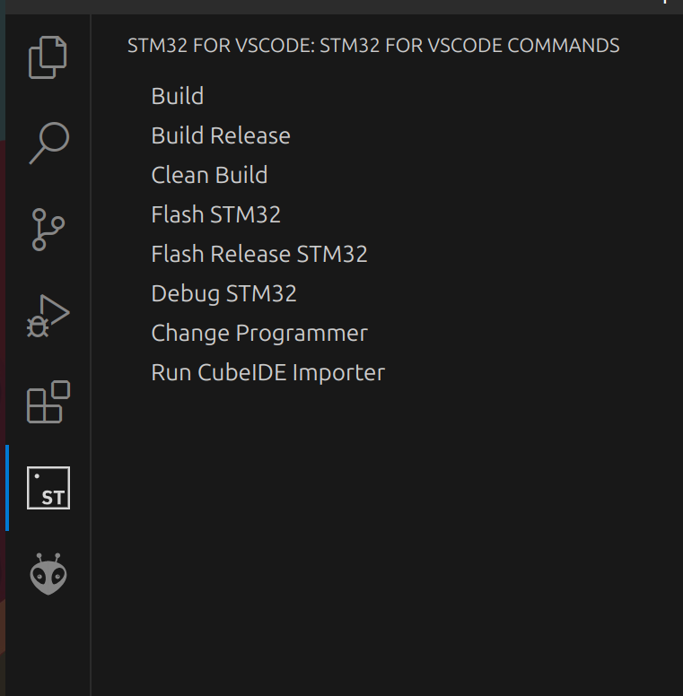
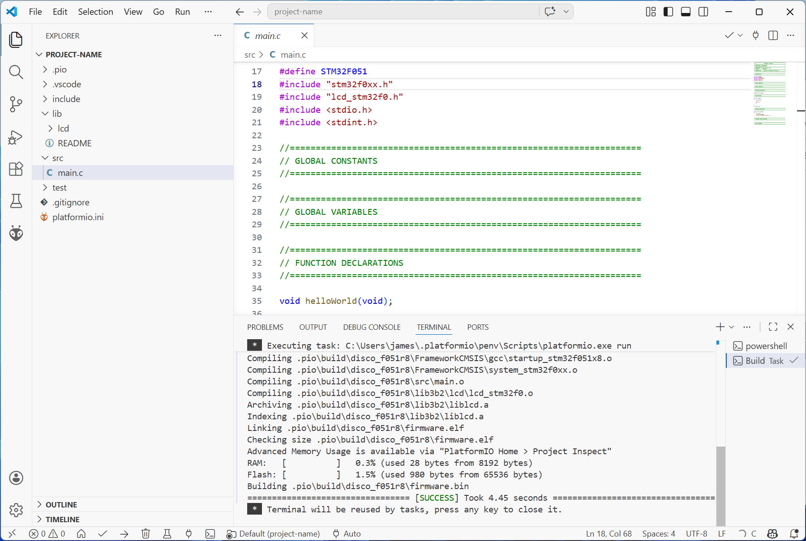

# macOS Setup for Practicals

The MEC4126F practicals will require a way for you to develop code either through an IDE or text editor for STM32. If you do not have either setup from a previous course, please follow the guide below. The instructions below were tested on a fresh installation of macOS Sequioa 15.2, but should work on other versions similarly.

Table of Contents
=================

* [Table of Contents](#table-of-contents)
* [Visual Studio Code (IDE)](#visual-studio-code-ide)
    * [C Compiling](#c-compiling)
    * [C Programming](#c-programming)
    * [STM32 Programming](#stm32-programming)

## Visual Studio Code (IDE)
The preferred IDE for MEC4126F STM32 programming is Visual Studio Code (VSC), since the installation can be standardized over multiple operating systems.

**Visual studio code is available for macOS [here](https://code.visualstudio.com/)**

## C Compiling
Your first task is to make sure your laptop can compile C code. For this we need a compiler, which basically converts a .c file into an executable program your computer can run. Installing a C compiler on macOS is very simple, just open a terminal and run the following command:
```bash
xcode-select --install
```

You should be prompted to install `Command Line Tools`. Accept and let the installation finish. You can make sure the installation was successful by running the following command in your terminal:

```bash
gcc --version
```
You should see a print-out with details of your gcc installation.

## C Programming

Now that a C compiler is installed, one or two more installations are necessary before you can write your first program. Within VSCode install Microsoft's **C/C++ Extension** for VSCode from the extension marketplace, which includes debugging and intellisense functionality. It is available under the extensions menu on the left hand side of VSCode's GUI. The **C/C++ Extension Pack** also includes some other useful tools, and can also be installed. 

<p align="center" width="100%">
     
</p>

Once the desired extensions are installed, create a new file called `hello.c`. Inside, include code as follows:

```
#include <stdio.h>

int main() {
   printf("Hello, world!\n");
   return 0;
}
```

{:.note2}
This file is also available under [`./setup/Resources/hello.c`](https://mechatronicsystems-group.github.io//Integrated-Embedded-Systems/practicals/IDE-setup/Resources/hello.c).

Save the file, and try and compile the program. Open a new terminal in VSCode with `Terminal → New Terminal` menu at the top left of the GUI or the keyboard shortcut and run:

```bash
$ gcc hello.c -o hello
```

This should compile `hello.c` into an executable `hello` which can now be run. In the same terminal, run:

```bash
$ ./hello
```

You should see output similar to the following as output (*this specific output was captured on Ubuntu, but macOS should also display the "Hello World!" message*).

<p align="center" width="100%">
     
</p>

### STM32 Programming

Compiling and flashing code for your STM32 with VSCode is done primarily through the **PlatformIO** extension.

<p align="center" width="100%">
     
</p>

This extension is available in the extensions marketplace, similar to the C/C++ Extension already installed. Go ahead and install it now. You may also need to install Python to make this work.

{:.note2}
While it is installing, you may be asked to install other pre-requisites in a pop-up in the bottom right of the screen. If you see this pop-up, accept and install anything requested.

If you don't see any pop-ups, that is fine - you will be prompted in the next step.

Once the **PlatformIO** extension is installed, download the [MEC4126F STM32 Programming Template](https://github.com/MechatronicSystems-Group/mec4126f-stm32f0-programming-template) available in its own GitHub repo. Save it to a convenient location (either use git clone ... or download as a .zip file and extract) and open the folder in VSCode using `File → Open Folder ...`

Once it is open, you should see the following file directory:

<p align="center" width="100%">
     
</p>

Open a new VS Code Window and click on the PlatformIO extension icon (the bug face) and then `Create New Project` once the initialisation is complete. Then click `New Project` which will take you to this screen:

<p align="center" width="100%">
     
</p>

{:.note2}
You at this point see three blue blocks, and a message saying the extension cannot find the build tools. In this case, simply select **Install Build Tools** from the menu, and wait for them to finish installing. This may take a while - the arm-eabi-gcc toolchain is about 1.5GB once it is unpacked.

If the build tools are found, you should see a menu like the one below:

<p align="center" width="100%">
     
</p>

Here, you will need to give your new project a name, choose the `ST STM32F0DISCOVERY` board, and the `CMSIS` framework. You can either use the default location or choose one.

Once your new project has opened, replace the `src` and `lib` folders with those from the template which you should still have open.

At this point, you can **plug in your STM32 Development Board**. Select **Build** (the tick mark in the top right corner) to build the demo program. If successful, you will see "SUCCESS" in the terminal window:

<p align="center" width="100%">
     
</p>

Then navigate to the Run and Debug view and click the play icon to Start Debugging.
Your STM32 board should now flash with the code provided, and display `Hello World :)` on the attached LCD.