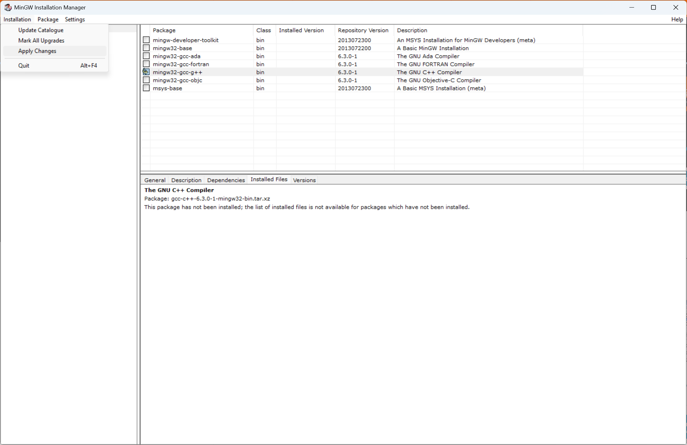
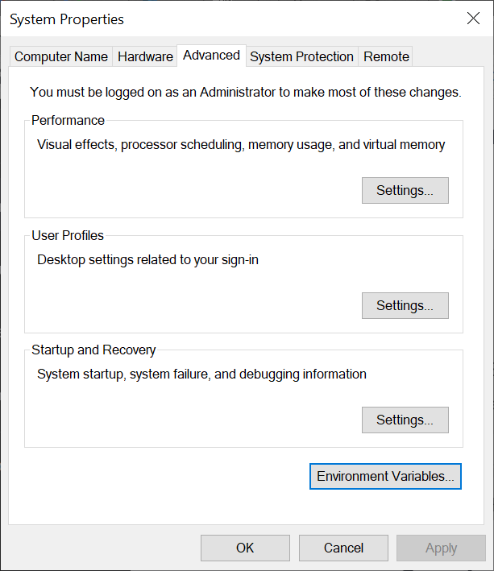
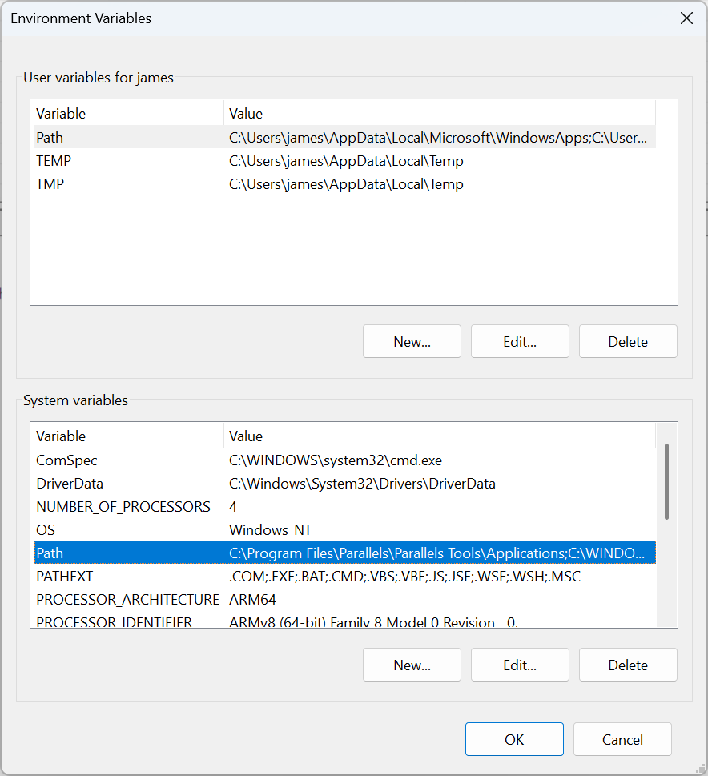
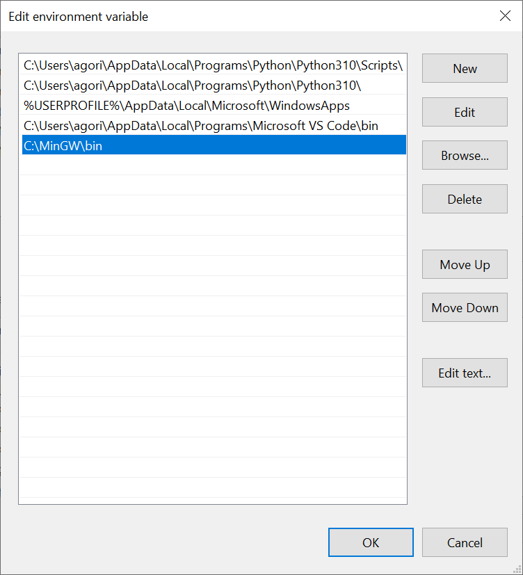

# Windows Setup for Practicals

The MEC4126F practicals will require a way for you to develop code either through an IDE or text editor for STM32. If you do not have either setup from a previous course, please follow the guide below. The instructions below were tested on a fresh installation of Windows 10, but should work on other versions similarly.

Table of Contents
=================

* [Table of Contents](#table-of-contents)
* [Visual Studio Code (IDE)](#visual-studio-code-ide)
    * [MinGW](#mingw)
    * [C Programming](#c-programming)
    * [STM32 Programming](#stm32-programming)

## Visual Studio Code (IDE)
The preferred IDE for MEC4126F STM32 programming is Visual Studio Code (VSC), since the installation can be standardized over multiple operating systems.

**Visual studio code is available for Windows [here](https://code.visualstudio.com/)**

## MinGW
Your first task is to make sure your Windows installation can compile and run C code. For this, a **C Compiler** is needed. Windows does not come with a C compiler installed by default, so the next step is to install [MinGW](https://www.mingw-w64.org/), which is a complete C toolchain for Windows. 

{:.important}
Follow the instructions below *carefully*, MinGW installation have been a particularly troublesome for this course in previous years. 

Download MinGW from this link: [https://sourceforge.net/projects/mingw/](https://sourceforge.net/projects/mingw/). Once downloaded, double click the downloaded file and install with the default settings.

Once the MinGW Installation Manager loads, select the `mingw32-gcc-g++` package for installation and click `Installation -> Apply Changes`.

<p align="center" width="100%">
     
</p>

This will take a while.

Now you need to add the relevant environmental variable so you can access the C compiling tools in the Windows terminal (CMD). Click on search and type in "Edit Environmental Variables..." and hit enter. The pop-up below should open. Click on "Environmental Variables".

<p align="center" width="100%">
     
</p>

Under "System Variables" find "Path" and click "Edit". It is the last system variable visible in the screenshot below.

<p align="center" width="100%">
     
</p>

A pop-up like the one below should open. Click on "New" and add the following path: `C:\MinGW\bin`. If you used a different install location, replace `C:\MinGW` with the directory you chose during installation.

<p align="center" width="100%">
     
</p>

Click "Ok" to save your changes.

### Before continuing, check your installation!

Open a new terminal (CMD) and type in `gcc --version`. You should see some text printed out describing the version of the installed gcc compiler. If you do not, carefully recheck the above instructions, making sure that the path variable you saved matches the actual on-disk location of the MinGW installation. If that fails, get in touch with a tutor for help.


## C Programming

Now that a C compiler is installed, one or two more installations are necessary before you can write your first program. Within VSCode install Microsoft's **C/C++ Extension** for VSCode from the extension marketplace, which includes debugging and intellisense functionality. It is available under the extensions menu on the left hand side of VSCode's GUI. The **C/C++ Extension Pack** also includes some other useful tools, and can also be installed. 

<p align="center" width="100%">
     
</p>

Once the desired extensions are installed, create a new file called `hello.c`. Inside, include code as follows:

```
#include <stdio.h>

int main() {
   printf("Hello, world!\n");
   return 0;
}
```

{:.note2}
This file is also available under [`./setup/Resources/hello.c`](https://mechatronicsystems-group.github.io//Integrated-Embedded-Systems/practicals/IDE-setup/Resources/hello.c).

Save the file, and try and compile the program. Open a new terminal in VSCode with `Terminal → New Terminal` menu at the top left of the GUI or the keyboard shortcut and run:

```bash
$ gcc hello.c -o hello
```

This should compile `hello.c` into an executable `hello` which can now be run. In the same terminal, run:

```bash
$ ./hello
```

You should see output similar to the following as output (*this specific output was captured on Ubuntu, but Windows should also display the "Hello World!" message*).

<p align="center" width="100%">
     
</p>

### STM32 Programming

Compiling and flashing code for your STM32 with VSCode is done primarily through the **PlatformIO** extension.

<p align="center" width="100%">
     
</p>

This extension is available in the extensions marketplace, similar to the C/C++ Extension already installed. Go ahead and install it now. You may also need to install Python to make this work.

{:.note2}
While it is installing, you may be asked to install other pre-requisites in a pop-up in the bottom right of the screen. If you see this pop-up, accept and install anything requested.

If you don't see any pop-ups, that is fine - you will be prompted in the next step.

Once the **PlatformIO** extension is installed, download the [MEC4126F STM32 Programming Template](https://github.com/MechatronicSystems-Group/mec4126f-stm32f0-programming-template) available in its own GitHub repo. Save it to a convenient location (either use git clone ... or download as a .zip file and extract) and open the folder in VSCode using `File → Open Folder ...`

Once it is open, you should see the following file directory:

<p align="center" width="100%">
     
</p>

Open a new VS Code Window and click on the PlatformIO extension icon (the bug face) and then `Create New Project` once the initialisation is complete. Then click `New Project` which will take you to this screen:

<p align="center" width="100%">
     
</p>

{:.note2}
You at this point see three blue blocks, and a message saying the extension cannot find the build tools. In this case, simply select **Install Build Tools** from the menu, and wait for them to finish installing. This may take a while - the arm-eabi-gcc toolchain is about 1.5GB once it is unpacked.

If the build tools are found, you should see a menu like the one below:

<p align="center" width="100%">
     
</p>

Here, you will need to give your new project a name, choose the `ST STM32F0DISCOVERY` board, and the `CMSIS` framework. You can either use the default location or choose one.

Once your new project has opened, replace the `src` and `lib` folders with those from the template which you should still have open.

At this point, you can **plug in your STM32 Development Board**. Select **Build** (the tick mark in the top right corner) to build the demo program. If successful, you will see "SUCCESS" in the terminal window:

<p align="center" width="100%">
     
</p>

Then navigate to the Run and Debug view and click the play icon to Start Debugging.
Your STM32 board should now flash with the code provided, and display `Hello World :)` on the attached LCD.


