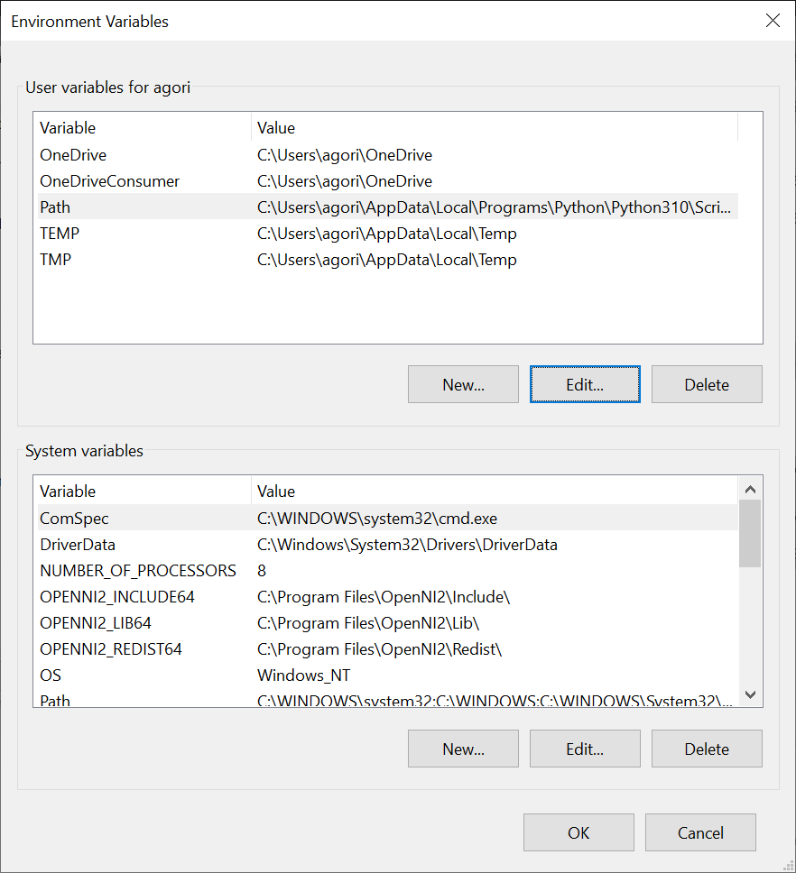

# Windows Setup for Practicals

The MEC4126F practicals will require a way for you to develop code either through an IDE or text editor for STM32. If you do not have either setup from a previous course, please follow the guide below. The instructions below were tested on a fresh installation of Windows 10, but should work on other versions similarly.

Table of Contents
=================

* [Table of Contents](#table-of-contents)
* [Visual Studio Code (IDE)](#visual-studio-code-ide)
    * [MinGW](#mingw)
    * [C Programming](#c-programming)
    * [STM32 Programming](#stm32-programming)
* [STM32CubeIDE (not recommended)](#stm32cubeide)

## Visual Studio Code (IDE)
The preferred IDE for MEC4126F STM32 programming is Visual Studio Code (VSC), since the installation can be standardized over multiple operating systems.

**Visual studio code is available for Windows [here](https://code.visualstudio.com/)**

## MinGW
Your first task is to make sure your Windows installation can compile and run C code. For this, a **C Compiler** is needed. Windows does not come with a C compiler installed by default, so the next step is to install [MinGW](https://www.mingw-w64.org/), which is a complete C toolchain for Windows. 

{:.important}
Follow the instructions below *carefully*, MinGW installation have been a particularly troublesome for this course in previous years. 

Download MinGW from this link: [https://nuwen.net/files/mingw/mingw-19.0.exe](https://nuwen.net/files/mingw/mingw-19.0.exe). Once downloaded, double click the downloaded file and you should see a prompt like the one below. Change the extract destination to `C:\` or your preferred destination.

{:.caution}
If you change the install directory, make careful note of what it is set to - it will be needed in the next step.

<p align="center" width="100%">
     
</p>

Now you need to add the relevant environmental variable so you can access the C compiling tools in the Windows terminal (CMD). Click on search and type in "Edit Environmental Variables..." and hit enter. The pop-up below should open. Click on "Environmental Variables".

<p align="center" width="100%">
     
</p>

Under "System Variables" find "Path" and click "Edit". It is the last system variable visible in the screenshot below.

<p align="center" width="100%">
     
</p>

A pop-up like the one below should open. Click on "New" and add the following path: `C:\MinGW\bin`. If you used a different install location, replace `C:\MinGW` with the directory you chose during installation.

<p align="center" width="100%">
     
</p>

Click "Ok" to save your changes.

### Before continuing, check your installation!

Open a new terminal (CMD) and type in `gcc --version`. You should see some text printed out describing the version of the installed gcc compiler. If you do not, carefully recheck the above instructions, making sure that the path variable you saved matches the actual on-disk location of the MinGW installation. If that fails, get in touch with a tutor for help.


## C Programming

Now that a C compiler is installed, one or two more installations are necessary before you can write your first program. Within VSCode install Microsoft's **C/C++ Extension** for VSCode from the extension marketplace, which includes debugging and intellisense functionality. It is available under the extensions menu on the left hand side of VSCode's GUI. The **C/C++ Extension Pack** also includes some other useful tools, and can also be installed. 

<p align="center" width="100%">
     
</p>

Once the desired extensions are installed, create a new file called `hello.c`. Inside, include code as follows:

```
#include <stdio.h>

int main() {
   printf("Hello, world!\n");
   return 0;
}
```

{:.note2}
This file is also available under [`./setup/Resources/hello.c`](/practicals/setup/Resources/hello.c).

Save the file, and try and compile the program. Open a new terminal in VSCode with `Terminal → New Terminal` menu at the top left of the GUI or the keyboard shortcut and run:

```bash
$ gcc hello.c -o hello
```

This should compile `hello.c` into an executable `hello` which can now be run. In the same terminal, run:

```bash
$ ./hello
```

You should see output similar to the following as output (*this specific output was captured on Ubuntu, but Windows should also display the "Hello World!" message*).

<p align="center" width="100%">
     
</p>

### STM32 Programming

Compiling and flashing code for your STM32 with VSCode is done primarily through the **stm32-for-vscode** extension.

<p align="center" width="100%">
     
</p>

This extension is also available in the extensions marketplace, similar to the C/C++ Extension already installed. Go ahead and install it now.

{:.note2}
While it is installing, you may be asked to install other pre-requisites in a pop-up in the bottom right of the screen. If you see this pop-up, accept and install anything requested.

If you don't see any pop-ups, that is fine - you will be prompted in the next step.

Once the **stm32-for-vscode** extension is installed, download the [`STM32 Programming Template`](/STM32-Programming-Template) available in the Integrating Embedded Systems repo. Save it to a convenient location, and open the folder in VSCode using `File → Open Folder ...`

Once it is open, you should see the STM32 plugin window available on the left hand side of the screen. It is the **small block with a dot and the letters ST under the extension marketplace icon**

<p align="center" width="100%">
     
</p>

Click on the STM32 for VSCode extension, it should open a new window on the left.

{:.note2}
You at this point see three blue blocks, and a message saying the extension cannot find the build tools. In this case, simply select **Install Build Tools** from the menu, and wait for them to finish installing. This may take a while - the arm-eabi-gcc toolchain is about 1.5GB once it is unpacked.

If the build tools are found, you should see a menu like the one below:

<p align="center" width="100%">
     
</p>

At this point, you can **plug in your STM32 Development Board**. Select **Build** to build the demo program, and then **Flash STM32** to flash the program to your development board. 

Your STM32 board should now flash with the code provided, and display `Hello World :)` on the attached LCD.

### If that is successful, you are ready to write and compile the C code required for MEC4126F practicals.

However, it is worth familiarizing yourself with the `STM32 Programming Template` provided at this point, as it is expected you use it for future practicals.

The most important files for practical use are located in `Core/Inc/...` and `Core/Src/...`

The **Inc** folder contains all the header files related to STM32 programming, as well as **main.h** the header file for your code.

The **Src** folder contains all the code files related to STM32 programming, as well as **main.c** the file which will contain any custom code your write for a given practical. It may be worthwhile to try modifying the **main.c** file to display your own text on the STM32 LCD display to make sure you understand the modify, build and flash workflow.

{:.caution}
Inc and Src also contain program and header files for the attached LCD screen. These are not standard STM32 files, and are specific to the UCT development board.

Other files inside the `STM32 Programming Template` folder may provide insight into the deeper workings of the STM32, but are not essential for MEC4126F.

*(If you would like a challenge, poke around in the template and see if you can recreate a custom, multi-line display message such as the one below)*

<p align="center" width="100%">
     
</p>

## STM32CubeIDE
The STM32CubeIDE is another method that can be used to develop C/C++ code for STM projects. This IDE is based off the  Eclipse IDE (an IDE first used for Java). It is not recommanded that you use the STM32CubeIDE, however it is an alternative IDE to VSCode if desired, and was used previously in the course. It is also already installed on EM101 PCs, which is beneficial if you wish to use them for code development, as the VSCode toolchain must be installed every time the computers are used. The legacy installation instructions for STM32CubeIDE for Windows and Mac are included in ['/Setup/Resources'](./Resources/STM32CubeIDE_Install_and_Configure_Windows.mp4).
