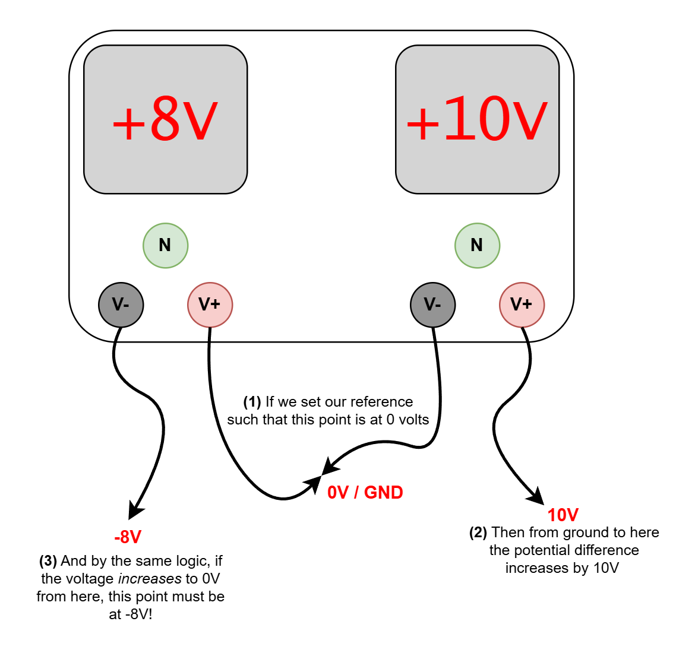

# Practical 0: Workbench Equipment
This practical looks to remind you of (or possibly introduce you to!) the functionality of the workbench equipment available in EM101, or any of the other UCT electronics labs. This equipment will be crucial for completing the rest of the MEC4126F practicals, so please take your time to familiarize yourself with the equipment now.

{:.important}
> Please use the [feedback form](https://forms.office.com/r/bMUfettP7m) to give us feedback on this practical and to report broken/faulty equipment.

Table of Contents
=================

* [Background](#background)
    * [Bench DC Power Supply](#bench-dc-power-supply)
    * [Multimeter](#multimeter)
    * [Signal Generator](#signal-generator)
    * [Oscilloscope](#oscilloscope)
* [Question 1: DC Power Supply and Multimeter](#question-1-dc-power-supply-and-multimeter)
    * [DC Power Supply Current Limiting](#dc-power-supply-current-limiting)
    * [Positive and Negative Reference Voltages](#positive-and-negative-reference-voltages)
* [Question 2: Signal Generator and Oscilloscope](#question-2-signal-generator-and-oscilloscope)
    * [Signal Generators](#signal-generator)
    * [Oscilloscopes](#oscilloscopes)
* [Demonstration](#demonstration)

## Background
### Bench DC Power Supply
A workbench DC power supply supplies stable, adjustable output of direct current (DC) voltage and current. The EM101 power supplies feature two adjustable outputs, which you can connect to your circuit using the provided crocodile clips. As the lab uses **bi-polar power supplies** it is possible to generate a DC voltage with a potential lower than that of mains earth - this is explained below. This will be used later for bi-directional DC motor control and op-amp circuits.

### Multimeter
A multimeter is a tool used to measure electrical properties like voltage, current and resistance. It combines several functions in one device, allowing you to test and troubleshoot electrical circuits. A useful feature of hand-held multimeters is the **continuity tester**. Using this you can test whether two points on your circuit are connected (shorted) or not. While this may seem basic, it is a very helpful debugging tool for some of the more complicated circuits covered in this course.

### Signal Generator
A workbench signal generator is an electronic test instrument used to produce various types of electrical waveforms (sine, square, triangle, pulse, etc.) at different frequencies, amplitudes, and voltages. It is primarily used for testing and troubleshooting other electronic equipment by providing a known signal input. We will use it in this practical to generate a PWM (pulse width modulated) signal.

### Oscilloscope
An oscilloscope is an electronic test instrument used to visually display and analyze the waveform of electrical signals. It shows how voltage varies over time, allowing you to observe signal characteristics like frequency, amplitude, and waveform shape visually. This helps in diagnosing issues, verifying signal integrity, and testing circuit performance. It is probably the most complex piece of equipment available, but also the most useful.

*Naturally, as this is a course that includes digital electronics, we will begin counting our practicals at zero.*

## Question 1: DC Power Supply and Multimeter

The first part of this prac is focused on using the DC power supply and multimeter. You are going to construct a setup such that there are three outputs to the circuit: ground, a positive reference voltage, and a negative reference voltage. Any of the lab DC power supplies are able to do this by a setup such as the one below - be careful not to use the third (GND) port, as this connects to mains earth. Then you will build a small voltage divider, and measure voltage and current at different points.

### DC Power Supply Current Limiting

{:.important}
> **Before using a DC power supply, you must set a current limit. This is done by the following procedure, and must be done for both outputs (left and right side) every time you use a power supply:**
> 1. Set **voltage** and **amperage** to zero on both DC power supplies using the adjustment knobs.
> 2. Connect the leads of each power supply together so that each supply is shorted.
> 3. Turn up the voltage on each power supply a little bit - the voltage output will still read 0 on the screen, but will be turned up for the machine. Don't worry too much about what the voltage actually is, the important part is that it is not zero.
> 4. Slowly increase the current limit to your desired value. Unless high current is expected (e.g. when driving a motor), this should be quite low. 0.5A or less would be typical.
> **Doing this is important as it ensures that if you connect your power leads to a circuit and there is a short (a path without resistance between the two leads) you limit the current flow (and possible damage to components) in the circuit.**


### Positive and Negative Reference Voltages

Once your current limit is set, you can create a DC power supply for the circuit you are about to build. To create a negative voltage, we connect the **positive terminal** of the left DC output to the **negative terminal** of the right DC output. If the middle point is then used as a reference point, the right positive lead will have a positive potential (of whatever you set) and the negative lead will have a *negative potential* (of whatever you set). The diagram below hopes to illustrate this.


_Figure 1: Setup to create positive and negative reference voltages._

Once your power supply is set up, build a small voltage divider such as the one below, and connect it to your power supply as indicated. The resistor values do not matter - this is only to make sure you are confident measuring circuit values using your multimeter. This is a required skill going forward in this course.


_Figure 2: Example voltage divider circuit._

Once the circuit is built, **turn on your multimeter** and measure the values of the following:

{:.tip}
> Make sure your multimeter is in DC mode - indicated by a straight, unbroken line, and that you measure voltage relative to the middle (GND) point in the circuit.

> ### **Question 1.1**
> Measure the resistance of each resistor in the circuit - are they all what you expect? (This one is a freebie - hopefully you put the resistors in the right places!) 

> ### **Question 1.2**
> Measure the voltage at each point in the circuit. Are the values what you expect for your chosen supply voltages and resistances? You should be able to calculate the expected values for a simple circuit like this.

> ### **Question 1.3**
> Measure the current in each branch of the voltage divider - to the left, and to the right. **Remember, to measure current you need to put the multimeter in series with the circuit! Otherwise it will short through the multimeter.**

*Spend any further time as you like familiarizing yourself with these two, but next up...*

## Question 2: Signal Generator and Oscilloscope

These two will be used in tandem similarly to the DC power supply and the multimeter above. The big difference is that the tools above are used (mostly) for constant signals that do not vary over time.
The oscilloscope and signal generator are used for measuring and generating transient signals which vary over time. This could be a once off, such as measuring the charging and discharging a capacitor, where the circuit reaches a steady state condition, or periodic where the signal repeats over time.

### Signal Generators

The goal of this question is for you to setup your signal generator to generate a PWM (pulse width modulated) square wave with an adjustable duty cycle, and measure it on the oscilloscope. The Vpp (peak-to-peak voltage) will be 3.3V, with Vmin = 0V and Vmax = 3.3V. The graphic below covers the critical parts of PWM with random values, but PWM signals will be covered in a lot more detail later in the course so don't worry too much about the specifics (yet).


_Figure 3: Example PWM wave with 50% duty cycle._

On newer signal generators this wave can be set up with just with the generator, but for the older machines you will also need to use the oscilloscope to tune the amplitude and DC offset as there is no readout. The graphic and table below hopes to explain what most of the buttons do on each machine, but it is usually the best to poke around yourself to see what everything does.

### Old Signal Generator

_Figure 4: Older signal generator model available in EM101._


{:.note2}
> Some buttons are not given descriptions - these should not be relevant to the course (though you are very welcome to try and figure out what they do!)

| Feature | Description |
| -------- | ------- |
| Frequency Display | Currently output signal frequency. |
| Main + Fine | Adjusts output frequency. *Main* makes large changes to output, *Fine* makes small adjustments to dial in the value |
| Range Hz / Gate Time | Select rough range for signal that you can then adjust with the dials. Varies from 1 MHz on the left to 1 Hz on the right. Pick this value first when setting up your signal. |
| Function | Shape of the wave generated. |
| Ramp/Pulse | The relevant function here is that this adjusts the duty cycle of the square wave. You must pull it out to adjust. |
| Amplitude | Peak-to-peak signal voltage |
| Offset | DC offset added to the signal. Shifts the wave up and down on the oscilloscope |
| Power | Turns the machine on and off |

### New Signal Generator

_Figure 5: Newer signal generator model available in EM101._

{:.note2}
> This is one of the newer signal generators in EM101 with bigger displays that show more information. These functions similarly - most buttons here have an analogous button on the older model. Where things differ, the screen should be able to guide you to what you are looking for.
> One small difference that can trip students up however, **on the new signal generators, you must press the *Main Out: ON/OFF* button to enable signal output**.

### Oscilloscopes
The oscilloscope is the tool we will use to visualise time-varying signals. There are many specifics to the use of the oscilloscope, so only the critical functions are explained here. You will become more familiar with these over time, but asking a tutor or knowledgeable peer is recommended if you get stuck.

**Fundamental idea:**
**Each oscilloscope has two probes, which can measure signals. Attach the ground (black crocodile clip) of the probe to the ground of your circuit, and the hook to the signal that you want to measure.**

### Older Oscilloscope Model

_Figure 6: Older oscilloscope model available in EM101 (with a cool CRT display!)_

### Newer Oscilloscope Model

_Figure 7: Newer oscilloscope model availabel in EM101 (with a boring LCD display). Both this and the above oscilloscope are measuring square waves._

{:.tip}
> The ON/OFF button for the Keysight oscilloscopes is hidden inside the front panel of the tool racks but is accessible by the little metal cutout above the top right of the oscilloscope.

### Oscilloscope Usage

{:.note2}
> Maybe more so than any of these other tools, oscilloscopes are complicated. Take your time experimenting with the buttons and options until you are confident you can use this device for future practicals. Many, *many* features are not described here in detail.

**Vertical panel**

| Feature | Description |
| -------- | ------- |
| Large knob | Adjusts the voltage/division scaling for the signal. That is how many volts each block on the screen represents, on the image above the Keysigh oscilloscope is set to ```CH1: 2.00V/``` indicating each block is 2V tall. |
| 1 or 2 button | Enables or disables the channel. |
| Up-Down knob | Applies a DC offset to the *displayed* signal - not the real one! This should usually be zero. |

**Horizontal panel**

| Feature | Description |
| -------- | ------- |
|Large knob | Adjusts the x-axis time scaling |
| Left-Right knob | Offsets the displayed signal in time |

**Other very useful buttons**

| Feature | Description |
| -------- | ------- |
| Default Setup | Resets the machine to default settings - useful if things are completely messed up. |
| Auto Scale | The oscillscope will attempt to capture the signal with reasonable scaling values. This is very useful when it works! But not always reliable. |
| Trigger | Adjusts the trigger for the oscilloscope, this is the input voltage that starts the oscilloscopes measurement. **This needs to be within the voltage range of your signal if you want the oscilloscope to work.** For example, if you have a 0-3.3V signal, your trigger should be ~1.5V.|
| Run/Stop | Runs and pauses the oscilloscope. |
| Single | Capture a single measurement. |
| Cursors | Opens the cursors menu. These are very, very useful when operating an oscilloscope, but too complex to explain in text. These should be demonstrated in the first practical, but if you need a refresher ask a tutor. |

> ### **Question 2.1**
> Use your signal generator to create a **square-wave** with a frequency of 1KHz. Do not worry about amplitude and offset just yet.

> ### **Question 2.2**
> Connect the **output** of the signal generator to the **first probe** of the oscilloscope. Adjust the scaling of the oscilloscope (volts/division and time scaling) until the wave is visible on your screen.

> ### **Question 2.3**
> Now we can tune the wave to what is desired:
> * Using the cursors on the oscilloscope, measure the peak-to-peak voltage of the waveform. Adjust this value on the signal generator until it is 3.3V. Call a tutor if you are struggling with the cursors.
> * Once you have the correct Vpp, adjust the DC offset such that the wave has a minimum voltage of 0V, and a maximum voltage of 3.3V. This signal is analogous to the PWM output you will configure from your STM32 later in the course!

> ### **Question 2.4**
> Now that your waveform is correct, use the signal generator to adjust the **duty cycle** of the PWM wave. You should see the logic HIGH portion of the wave grow and shrink as your adjust the value. If this is indeed what you are seeing - congratulations! You are done, and should hopefully be able to work the equipment as required for the course.

## Demonstration
There is no demonstration for practical 0.
