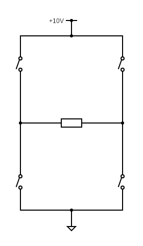
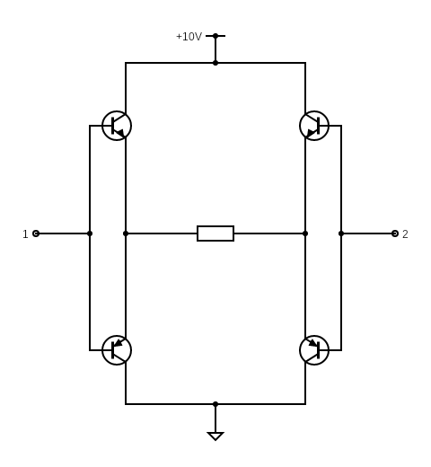
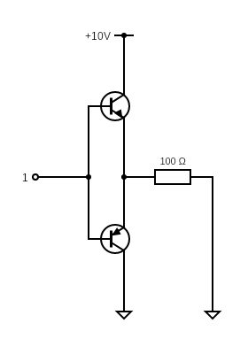
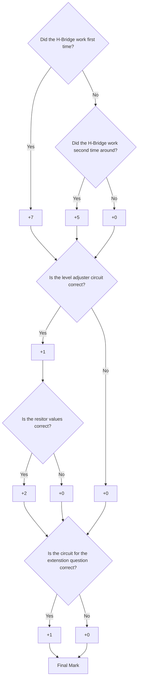

# Practical 1: Emitter Follower H-Bridge

This practical aims to introduce you to the functionality of an Emitter Follower H-Bridge. This type of circuit is extremely useful and is predominately used to drive a motor. In this practical we will only drive a resistor but later on in this practical series we will use this circuit to drive your servomotor.

{:.important}
> Please use the [feedback form](https://forms.office.com/r/bMUfettP7m) to give us feedback on this practical and to report broken/faulty equipment.

Table of Contents
=================

* [Background](#background)
* [What you will need](#what-you-will-need)
* [Question 1: Emitter Follower H-Bridge](#question-1-emitter-follower-h-bridge)
* [Question 2: Completing the circuit](#question-2-completing-the-circuit)
* [Question 3: Extending the Circuit](#question-3-extending-the-circuit)
* [Question 4: Extension Question](#question-4-extension-question)
* [Demonstrating your circuit](#demonstrating-your-circuit)
* [Mark Scheme](#mark-scheme)

## Background
The H-Bridge is a simple circuit that is used to alter the polarity of the voltage that is applied to load (usually a motor). The H-Bridge achieves this by using four devices that can act as a switch (like a toggle switch, relay, or transistor) such as shown in [Figure 1](./Resources/H_bridge.png).

The state of the switches are used to control the polarity and magnitude (on/off) of the voltage applied to the load. When two diagonally opposite switches are closed a voltage is applied across the load, the polarity of the voltage is controlled by each diagonal pair of switches. When the load is a motor we can also use the H-Bridge to brake the motor or coast the motor, you can check out the full truth table for driving a motor here [here](https://en.wikipedia.org/wiki/H-bridge#DC_motor_Driver).

_Figure 1: A basic representation of a H-Bridge._

As mentioned, the switches shown in Figure 1 can be implemented through several technologies. In this practical we will use the Darlington Transistor, specifically the TIP122 and TIP126. This requires that we use two NPN and PNP transistors are used in a complimentary transistor pair as shown in [Figure 2](./Resources/H_bridge_darl.png).

_Figure 2: A transistor H-Bridge._

Two drive signals are used to bias the transistors to turn them on or off. These dive signals are always anti-phase (i.e. when one is high the other is low) for our application. The voltage of the drive signals should be as close as possible to the rail voltages as to ensure that the transistors are properly biased.

{:.important}
> Before continuing further read the [datasheet](./Resources/TIP120-D.PDF) for the TIP122 and TIP126 transistors. Make sure you know the package orientation with regards to the pin numbers and functions.

## What you will need
To complete this practical you will require a breadboard and a pair of wire strippers.

{:.tip}
> It is suggested that you find a box or container that you can place your breadboard and circuitry in as the circuit you build in this practical **will** be used in later practicals.

The following components will be provided to you on the **Monday when this practical is released**, if you are unable to collect components then please collect them during the week at the **MechatronicSystems.Lab** located in the Duncan Macmillan Lab during the hours posted on the main README page:
- 2 x TIP 122
- 2 x TIP 126
- 1 x 100 Ω, 2 W Resistor
- Wire

{:.important}
> Due to protest action, component collection will be at a later point in time. Stay tuned on Amathuba for a relevant announcement.

## Question 1: Emitter Follower H-Bridge

We will first make what is commonly referred to as a half bridge, otherwise known as a class B amplifier. These are able to control high current input to a DC motor but only in one direction: the motor can be enabled, the speed can be controlled with PWM, but it can only be driven forward and cannot reverse.

We shall use one TIP 122 and one TIP 126 for this layout as shown in [Figure 3](./Resources/Half-bridge.png), read the [datasheet](./Resources/TIP120-D.PDF) to figure out which transistor to place where and how. Connect the output of the half bridge to one lead of your 100 Ω resistor and connect the other lead to ground, as shown in [Figure 3](./Resources/Half-bridge.png). In this case the 2W resistor is a stand in for a DC motor and is able to support a high current without exploding (do not use the normal ¼ watt resistors!).

_Figure 3: A Darlington transistor half bridge._

{:.tip}
> You will be using your breadboard for several practicals, it is suggested that you use the bus strips (the two long rows on either side of your breadboard) as a place to draw/sink power to/from. This will make your breadboard easier to use and to debug. Do note that most breadboards have a split in the middle of both rails on either side, so you will need to bridge these if you want power all the way along your board.

> ### **Question 1.1**
> For this question you must test your circuit to make sure if functions correctly. You can test this circuit in two manners:
> * If you are at home we suggest using your STM32 dev board as a power supply, connect the 5V pin on your dev board to power both the half bridge and the input pin. Then connect ground to the ground pin of your dev board. You should be then able to read around 3.2 V across the resistor (why do you think this is?).
> * If you are in the lab, use the same steps as before but just with the DC power supply and multimeter that is provided on the work bench.

> ### **Question 1.2**
> If you successfully see a ~3.2V output across the resistor when input is high, see if you can toggle the output by connecting the input to ground. You should now see 0V across the "motor" (resistor).

## Question 2: Completing the circuit
You can now construct the full H-Bridge by creating another half-bridge to create a circuit as shown in Figure 4. Depending on the combination of inputs (as both sides should now have an input signal) you should be able to drive your hypothetical motor forwards AND backwards!

_Figure 4: A Darlington transistor H-Bridge._

> ### **Question 2.1**
> You can test this circuit in two manners:
> * If you are at home, use your STM32 dev board as a power supply again. Connect the 5V pin on your dev board to both power the H-Bridge and one input pin. Then connect the circuit’s ground and the other input pin to the ground pin on your dev board. You should then be then able to read around 3.2 V across the resistor and -3.2 V across the resistor when you switch around the inputs.
> * If you are in the lab, use the same steps as before but just with the DC power supply and multimeter that is provided on the work bench.

{:.note2}
> When you are powering one input signal HIGH, do not leave the other input floating! This can lead to unpredictable results. Make sure it is grounded.

{:.important}
> Remember which multimeter lead you are connecting to where so the polarity sense stays the same between tests.

## Question 3: Extending the Circuit
You may have noticed that we always drive the H-Bridge with a voltage that is near the power supply voltage. This is to ensure that the transistors are properly biased (we want to lose the least amount of power across the transistors). This creates a significant issue since this limits the voltage that we can supply to the H-Bridge to the voltage we can drive the H-Bridge with. Since most μ-Controllers can only output 3V3, we can not transfer significant power to our load. Therefore, we require a method to step up our drive signal voltage from 3V3 to whatever we decided to power the H-Bridge with.

To complete this we will use a BJT level adjuster circuit using a [P2N2222 transistor](./Resources/P2N2222A-D.PDF).

> ### **Question 3.1**
> For this part of the practical you are required to design a level adjusting circuit using a P2N2222 transistor. This level adjuster should be used to drive a H-Bridge that is connected to a 20 V power supply from a μ-Controller that outputs 3V3. Draw the circuit on a piece of paper and calculate the values of the two resistors required to bias this circuit, assuming a β of 10, IE of 100 mA, VCE(sat) of 0.3V and VBE of 0.7V. Show this circuit to the tutor during your demonstration and explain how you would integrate this circuit to the H-Bridge.

**You do not need to actually build the circuit!**

{:.note2}
> You will notice that the logic of the drive signal is altered because of this circuit.

## Question 4: Extension Question
**This Question is not compulsory!**

You may have noticed that the drive signals that we use are always in anti-phase. This means that when we connect the H-Bridge to our μ-controller we will have to use two GPIO pins. We could then unnecessarily use up our GPIO pins.

> ### **Question 4.1**
> Using only PN2N2222s and resistors, design a circuit that can create two anti-phase signals from one input signal. Ensure that each signal has the same propagation delay. You need not to size the resistors for this question.

## Demonstrating your circuit
When you are happy with your full h-bridge circuit you can demonstrate the operation of your circuit to a tutor. If you have completed the extension question bring it along as well. When you are ready, you are required to power your circuit from the DC power supply with 10 V. Connect one input to 10 V and the other to ground. Read the voltage across the resistor, it should be around 7.2 V. Then switch the inputs and read the voltage across the resistor, it should be around -7.2 V.

{:.caution}
> You only have two attempts to demonstrate your circuit (with an associated mark deduction on the second attempt), please familiarise yourself with the [Mark Scheme](#mark-scheme) before you demonstrate your circuit.

### **Mark Scheme**
The following mark scheme will be used to mark your practicals:

