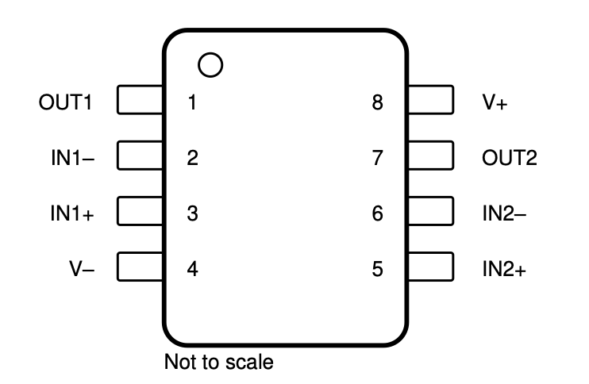

# Practical 2: Comparator Circuits

{:.important}
> Please use the [feedback form](https://forms.office.com/r/bMUfettP7m) to give us feedback on this practical and to report broken/faulty equipment.

Table of Contents
=================
* [Background](#background)
* [What you will need](#what-you-will-need)
* [Question 1: Basic comparator circuit](#question-1-basic-comparator-circuit)
* [Question 2: NPN Common-Emitter](#question-2-npn-common-emitter-switch)
* [Question 3: Extension Question](#question-3-extension-question)
* [Demonstration](#demonstrating-your-circuit)

## Background
In this practical, you are going to design, build, and test a simple comparator circuit. The goal of a comparator circuit is simple: it takes an analogue input voltage and compares it to a specified analogue reference voltage. If the input is GREATER than the reference voltage, it outputs a digital HIGH signal (depending on the configuration this could also be a LOW signal, mind you) and if the input is LESS than the reference voltage it outputs a digital LOW.

{:.tip}
> Comparator circuits are extremely useful when interfacing sensors that output some varying analogue signal with a microcontroller that can most easily read input as either HIGH or LOW. Let's say you have a temperature sensor that outputs 0-12V, and you want to turn on a cooling fan if the temperature reaches a value corresponding to 8V. A comparator circuit can be designed such that it outputs 0V (digital LOW) when the voltage is below the threshold and 3.3V (digital HIGH) when the voltage is above the threshold. This saves the microcontroller having to use an analog-to-digital converter (ADC) to read the analog voltage - much more computationally expensive than reading a digital pin!

For this prac we will use an LM358 dual op-amp IC. It is a cheap, standard chip with two internal op-amps on either side, as well as shared ```V+``` and ```V-``` pins. The [datasheet is available here](https://www.ti.com/lit/ds/symlink/lm358.pdf?HQS=dis-dk-null-digikeymode-dsf-pf-null-wwe&ts=1739693619104&ref_url=https://www.ti.com/general/docs/suppproductinfo.tsp%253FdistId=10&gotoUrl=https://www.ti.com/lit/gpn/lm358) but the pinout is reproduced below for convenience:


_Figure 1: LM358 IC pinout._

One drawback of the LM358 is that the op-amps are **not** rail-to-rail. This means that if ```V-``` is connected to ground, and the op-amp's output is ```V-``` then it can correctly output 0V. However, if ```V+``` is connected to 3.3V, and the output is set to ```V+```, the *actual output voltage will be slightly lower - typically around 3.3V - 0.6V*. We shall investigate why this can be a problem, and an easy solution, later in the practical.

## What you will need
To complete this practical you will need the following components, as well as a breadboard to place them on.
* 1 x 10kOhm Potentiometer
* 1 x LM358N Dual Op-Amp IC
* 1 x PN2222 NPN transistor
* 1 x 10kOhm Resistor
* 1 x 3.3kOhm Resistor
* [Extension question] 3 x same-valued resistors 

## Question 1: Basic comparator circuit

{:.tip}
> If you intend to attempt the extension question, build the circuit for Questions 1 and 2 on the **left or right half** of the breadboard, leaving space on the opposite side for Question 3 to be a separate circuit.

For this question you will construct a basic comparator circuit, with an adjustable voltage reference conected to the negative input pin of the op-amp. A circuit diagram is not provided (you must design your own![^1]) but the intended circuit should be very simple, and adhere to the requirements listed below. V<sub>signal</sub> refers to the input signal to the circuit which the comparator compares the reference against. This signal is expected to change over time. V<sub>reference</sub> is the fixed voltage that the comparator compares the input signal with to set its output. It needs to be adjustable (hint: potentiometer), but once set it is not expected to change.

### Requirements

* The LM358's output should turn HIGH when: V<sub>signal</sub> > V<sub>reference</sub>.
* The LM358's output should turn LOW when: V<sub>signal</sub> < V<sub>reference</sub>.
* The V<sub>reference</sub> should be adjustable once the circuit is built.
* No constant value resistors may be used.
* You must set your DC power supply input to the circuit to 3.3V - the adjustable reference voltage must be able to vary between 0 and 3.3V.

You can supply 3.3V and V<sub>signal</sub> using either the benchtop power supplies, or with more difficulty the UCT development board if you are working at home. Look at the dev board schematic to find which pins can provide variable voltage output from the board's built in potentiometers.

{:.important}
> If using the benchtop power supply in conjunction with your development board, be careful to set the amp limit on the power supply very low. Careless connections can destroy the STM32 microcontroller.

Once you have designed a circuit you are happy with, build it and have a look at the following questions to test its functionality:

### **Question 1.1**
If you vary your signal voltage above and below the reference, how does the **output** of your circuit change? Does the output have varied analogue values or only exist as dicrete HIGH or LOW?

### **Question 1.2**
When the circuit's output is HIGH, what is the actual voltage? The STM32 datasheet specifies that to reliably detect a logic HIGH input on a GPIO pin, the input must be higher than 0.7 * V<sub>DD</sub>, where V<sub>DD</sub> is 3.3V for our particular STM32. Based on this, would your circuit be able to reliably signal logic HIGH to the microcontroller? 

### **Question 1.3**
Set up your signal generator to output a 100Hz 0 to 3.3V **triangle wave**. This is one of the waveforms available on the lab signal generators, and looks like an up-down-up-down line. Remember to adjust the amplitude such that the minimum voltage is 0, not -(3.3÷2)V. Connect this to V<sub>signal</sub> of your circuit. What do you expect the output to look like on an oscilloscope? 

If you think you know, connect both your circuit's output and input to the oscilloscope. What happens if you then vary the reference voltage? Do you see what you were expecting?

{:.important}
> **This setup forms part of the demonstration for Practical 2. Make sure your final circuit can be connected to a signal generator and the output plotted on your oscilloscope.**

## Question 2: NPN Common-Emitter Switch
If the practical is functioning as intended, you may have noticed a problem in Question 1.2 - the HIGH output of the LM358 is roughly around the cutoff value for the STM32 to detect a HIGH logic signal. You may get lucky and the random tolerance of your particular chip is a little higher than the cutoff, or you may be unlucky and its well below the threshhold. The point is is that this is obviously not good enough.

A simple solution is to add a switch to the output of the op-amp such that the ~2.6V signal can turn on an off a voltage much closer to 3.3V logic HIGH which will switch the STM32 more reliably. The easiest solution is to use an NPN transistor in the ```common-emitter``` configuration. As [Wikipedia has a very helpful article](https://en.wikipedia.org/wiki/Common_emitter) on the common-emitter configuration, you are trusted to be able to build the circuit yourself. 


_Figure 2: NPN transistor acting as a common-emitter switch. Note this diagram neglects biasing details (specifically R<sub>B</sub>) which do matter in this case._

Take careful note of where you should connect a hypothetical microcontroller to the circuit such that it acts as a binary 0 → 3.3V switch.

You should use the supplied 3.3kOhm and 10kOhm resistors for R<sub>C</sub> and R<sub>B</sub> respectively, but you must prove that they will force the switch into saturation when Vin is HIGH. The datasheet of your transistor should have an available approximate β value for your calculation, though you may need to estimate or interpolate for your particular situation.

{:.tip}
> For a PN2222 NPN transistor, you can find the datasheet... somewhere online! One of the required skills for this course is being able to take a component, and do the research to be able to use it.

{:.important}
> **The calculation showing that the transistor is in saturation is part of the demonstration for Practical 2. Remember to have this available on a loose page to hand in with your demonstration.**

Once you have shown the switch is saturated, build your design and answer the questions below:

### **Question 2.1**
If you have correctly built the common-emitter switch, you should see your output toggle between 3.3V and 0V as V<sub>signal</sub> varies above and below the reference voltage. Do you see this behaviour? 

Note! While the switch should have a HIGH value much closer to 3.3V, the LOW value might be slightly higher than 0V. This is fine, as long as it is safely lower than 0.7V (the maximum LOW value for the STM32). Why do you think this might be?

{:.important}
> **This setup forms part of the demonstration for Practical 2. Make sure your final circuit clearly shows the output toggling between 0V and 3.3V as the input signal changes.**

### **Question 2.2**
In this question we have used a PN2222 transistor instead of the TIP127s used in the previous practical. What advantage does the PN2222 have over the TIP127 for signal conditioning? Think practically about what is needed here, and the advantages and tradeoffs that come with a TIP transistor package...

## Question 3: Extension Question
**This question is difficult, and is only worth bonus marks. Attempt if you would like a challenge.**

For this question you will extend the op-amp circuit above into a window comparator. It is recommended that you build this circuit away from the rest of the practical, as you only have 1 LM358 Op-Amp - you must first demonstrate Questions 1 and 2,  and then move the LM358 to this circuit for full marks. For this you need three resistors of the same value in the kΩ range. Either reuse old resistors, or collect from the resistor catalogue during the demonstration session or additional tutor assisted time in EM101.

The basic scheme for a window comparator is shown below. Make careful note of where the inputs to the circuit are. **For this question, ```Vs+``` should be 10V, and all three resistors should have the same resistance**. Both ```Vs+``` and ```Vin``` should be supplied by an appropriately current-limited dual DC power supply.


_Figure 3: Basic concept of a window comparator circuit. Note missing detail on the Op-Amp rails, and the OR gate on the output._

Using a PN2222 to raise the op-amp output voltage to exactly 10V is not necessary, however it may be useful in implementing the OR gate... the details are up to you.

{:.note}
> The polarity of your window comparator does not matter. It can be HIGH for values between the upper and lower limits, or LOW. What matters is that the output switches correct in **TWO** places for an input signal that rises betwen 0V and 10V.

### **Question 3.1** 
Using three identical resistors, what are the critical values at which the output of the window comparator changes?

### **Question 3.2**
How would you build the OR gate pictured in the diagram?

### **Question 3.3**
As you sweep the input signal from 0 → 10V, you should see the output change twice, either from LOW to HIGH to LOW or the opposite depending on the implementation of your OR gate. Verify this behaviour from your circuit, and if it is correct you may demonstrate the extension question.

{:.important}
> The window comparator must be demonstrated for the bonus marks. Good luck!

## Demonstrating your circuit

When you are happy with your comparator circuit and transistor, you can demonstrate your circuit to a tutor. To prepare you should set up Question 1 and Question 2 on your breadboard, and connect a 100Hz 0V → 3.3V V<sub>pp</sub> triangle wave signal to the input of your circuit. You should attach one oscilloscope probe to the input signal of your circuit (i.e. the triangle wave signal coming from the signal generator) and the second probe to the output of the circuit. Both signals should be clearly visible on the oscilloscope.

**You must set your comparators reference voltage to 2V**.

If the above is set up, please get a tutor to come and mark your demonstration.

### Demonstration procedure
* Measure the reference voltage using a multimeter to show that it is 2V.
* Show on the oscilloscope that the signal generator is outputing a 100Hz 0V → 3.3V V<sub>pp</sub> triangle wave signal.
* Show on the oscilloscope that the comparator SWITCHES when the signal voltage is greater than 2V and then again when the signal voltage is lower than 2V (polarity does not matter).
* Show calculations proving that Rb and Rc values ensure PN2222 transistor is saturated (should be on a loose piece of paper that can be submitted).
* Is there a PN2222 transistor biasing the op-amp output voltage? Show where it is on the breadboard and that it is connected to the op-amp.
* Based on the oscilloscope output, does the output signal reach near 3.3V and 0V, or is it limited by the op-amps internal voltage drop?

### **Mark Scheme**
The following mark scheme will be used to mark your practical:
- [ ] Is the reference voltage set correctly? **+2 marks**
- [ ] Is the triangle wave amplitude and frequency set correctly? **+2 marks**
    - [ ] Does the comparator toggle the circuit output at +2V? **+4 marks**
- [ ] Do the values of Rb and Rc for the transistor ensure that it is operating in the saturation region? Show calculations. **+3 marks**
- [ ] Is there an common-emitter configuration NPN transistor adjusting the output voltage? **+3 marks**
    - [ ] Is the output 0 → 3.3V (with a bit of tolerance around 0V)? **+2 marks**
- [ ] Does the extension circuit correctly toggle in two places over the 0 → 10V range? **+2 bonus marks**

### **Practical total: 16 marks (18 marks available)**

[^1]: The list of required components may provide some hints...
