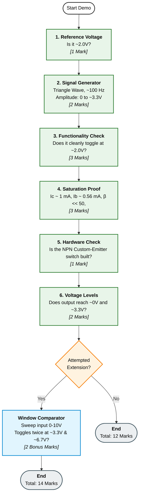

# MEC4126F Practical 2: Marking Flowchart

```mermaid
graph TD
    Start([Start Demo])
    
    Q1_Ref["<b>1. Reference Voltage</b><br/>Is it ~2.0V?<br/><i>[1 Mark]</i>"]
    
    Q1_Sig["<b>2. Signal Generator</b><br/>Triangle Wave, ~100 Hz<br/>Amplitude: 0 to ~3.3V<br/><i>[2 Marks]</i>"]
    
    Q1_Tog["<b>3. Functionality Check</b><br/>Does it cleanly toggle at ~2.0V?<br/><i>[3 Marks]</i>"]
    
    Q2_Calc["<b>4. Saturation Proof</b><br/>Ic ~ 1 mA, Ib ~ 0.56 mA, β << 50,<br/><i>[3 Marks]</i>"]
    
    Q2_Built["<b>5. Hardware Check</b><br/>Is the NPN Custom-Emitter switch built?<br/><i>[1 Mark]</i>"]
    
    Q2_Out["<b>6. Voltage Levels</b><br/>Does output reach ~0V and ~3.3V?<br/><i>[2 Marks]</i>"]
    
    Bonus{"Attempted<br/>Extension?"}
    
    Ext["<b>Window Comparator</b><br/>Sweep input 0-10V<br/>Toggles twice at ~3.3V & ~6.7V?<br/><i>[2 Bonus Marks]</i>"]
    
    End12(["<b>End</b><br/>Total: 12 Marks"])
    End14(["<b>End</b><br/>Total: 14 Marks"])

    %% Flow
    Start --> Q1_Ref
    Q1_Ref --> Q1_Sig
    Q1_Sig --> Q1_Tog
    Q1_Tog --> Q2_Calc
    Q2_Calc --> Q2_Built
    Q2_Built --> Q2_Out
    Q2_Out --> Bonus
    
    Bonus -- No --> End12
    Bonus -- Yes --> Ext
    
    Ext --> End14

    %% Styling
    classDef default fill:#fff,stroke:#333,stroke-width:2px,color:#000;
    classDef step fill:#e8f5e9,stroke:#2e7d32,stroke-width:2px,color:#000;
    classDef decision fill:#fff3e0,stroke:#f57c00,stroke-width:2px,color:#000;
    classDef bonus fill:#e1f5fe,stroke:#0288d1,stroke-width:2px,color:#000;
    classDef finish fill:#eceff1,stroke:#455a64,stroke-width:2px,color:#000;
    
    class Q1_Ref,Q1_Sig,Q1_Tog,Q2_Calc,Q2_Built,Q2_Out step;
    class Bonus decision;
    class Ext bonus;
    class End12,End14 finish;
```
