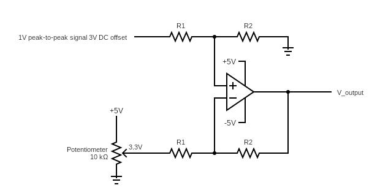
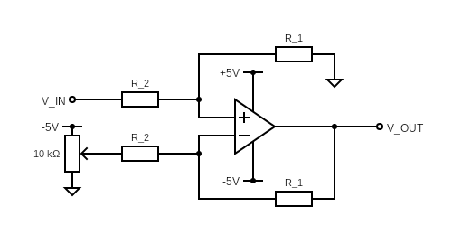
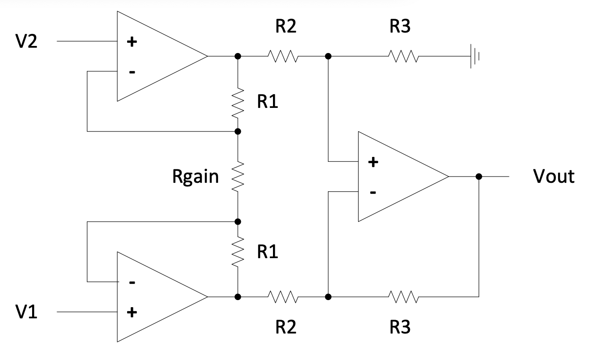
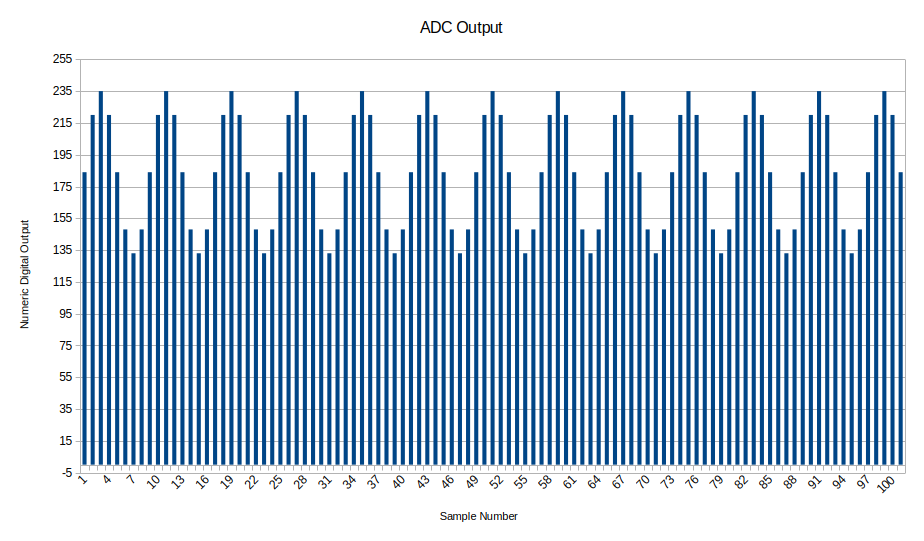
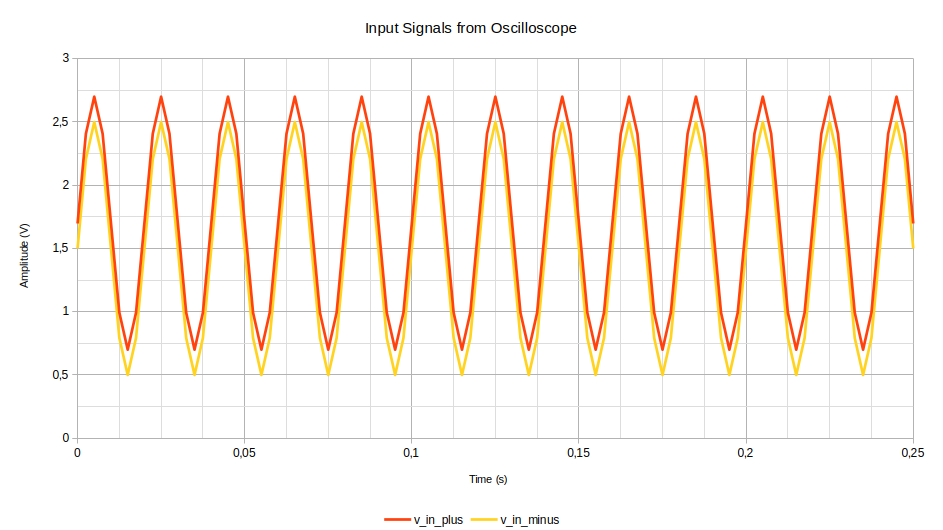

# Practical 3: The Differential Operational Amplifier

This practical will demonstrate to you the functionality of the differential amplifier and how it can be used to integrate analogue and digital circuits. First you will create a differential amplifier using an LM358, and then modify it into a level adjuster. Finally, you will have to derive the transfer function for the more complex but more accurate instrumentation amplifier.

{:.important}
> Please use the [feedback form](https://forms.office.com/r/bMUfettP7m) to give us feedback on this practical and to report broken/faulty equipment.

Table of Contents
=================

* [Background](#background)
* [What you will need](#what-you-will-need)
* [Question 1: The Differential Operational Amplifier](#question-1-the-differential-operational-amplifier)
* [Question 2: Level Adjuster](#question-2-level-adjuster)
* [Question 3: The Instrumentation Amplifier](#question-3-the-instrumentation-amplifier)
* [Question 4: Trouble in The Lab](#question-4-trouble-in-the-lab)
* [Demonstration](#demonstration)
* [Mark Scheme](#mark-scheme)

---

## Background

The differential amplifier is an electronic circuit that amplifies the difference between two input signals ($V_{in}^{+}$ and $V_{in}^{-}$), such that the output signal ($V_{out}$) adheres to the equation below. $A_d$ is the gain of the circuit (typically known as the differential gain).

$$V_{out} = A_d(V_{in}^{+}-V_{in}^{-})$$

This transfer function allows the circuit to multiply the difference between two signal, which makes this type of circuit extremely versatile. It is commonly used to remove [common mode signals](https://en.wikipedia.org/wiki/Common-mode_signal) (often erroneous signals that are common to the two inputs). 

In practice, the above equation is a poor representation of a differential amplifier since the different inputs to a differential amplifier will have different gains. A real differential amplifier will additionally have some common mode gain $A_c$ and its transfer function can be rewritten as:

$$V_{out} = A_d(V_{in}^{+}-V_{in}^{-}) + A_c \frac{V_{in}^{+}+V_{in}^{-}}{2}$$

The common mode rejection ratio (CMRR) is then used to define the ratio between the two gains of a differential amplifier and is measured in positive decibels.

$$CMRR = 20 log_{10}\left(\frac{A_d}{A_c}\right) dB$$

The differential amplifier is vital in many signal applications and can be found in practically any circuit that uses a differential pair to transmit information (for example [Ethernet](https://en.wikipedia.org/wiki/Ethernet) and [CAN bus](https://en.wikipedia.org/wiki/CAN_bus)) due to its ability to reject common mode noise. In fact, there are many specialised chips that are manufactured to complete this task such as the [LMH6554](https://www.ti.com/lit/ds/symlink/lmh6554.pdf?ts=1739307789118&ref_url=https%253A%252F%252Fwww.ti.com%252Fproduct%252FLMH6554). In this practical, however, you will be using an operational amplifier (specifically the LM358) to make a differential amplifier out of discrete components.

*(You may be relieved to know that some of the above information is only relevant if you intend to complete the extension question, and is not otherwise tested in this course.)*

---

## What you will need
To complete this practical you will require a breadboard and a pair of wire strippers. The following components will be provided to you on the **Monday when this practical is released**, if you are unable to collect components then please collect them during the week during the **optional tutorial sessions**:
- 1 x LM358
- 2 x 1.5 kΩ Resistor
- 2 x 3.3 kΩ Resistor
- 1 x 10 kΩ Potentiometer
- Wire

{:.note2}
> It is expected that you will still have the 10 kΩ potentiometer from practical 2. Contact the tutor team if you do not have this component.

{:.important}
> Before continuing further read the [datasheet](https://www.ti.com/lit/ds/symlink/lm358.pdf?HQS=dis-dk-null-digikeymode-dsf-pf-null-wwe&ts=1739693619104&ref_url=https://www.ti.com/general/docs/suppproductinfo.tsp%253FdistId=10&gotoUrl=https://www.ti.com/lit/gpn/lm358) for the LM358. Make sure you know the package orientation with regards to the pin numbers and functions. Thankfully, nothing should have changed since last week!

---

## Question 1: The Differential Operational Amplifier
This practical will first demonstrate the use of the differential operational amplifier to reject common mode noise. Using the resistors and the LM358 that you were given, design and build a differential amplifier that has a gain of approximately 2. An example circuit diagram is shown in Figure 1.

_Figure 1: A Differential Operational Amplifier Circuit._

For the above circuit the operating equation is as follow ([also available in the course notes](https://mechatronicsystems-group.github.io/Integrated-Embedded-Systems/analogue-electronics/chapter-2-opamps.html)):

{: .note }
> $$V_{out}=\frac{R_2}{R_1}(V_2-V_1)$$ 

{:.note2}
> The astute reader will notice that there are two naming conventions for the input signal. To align with the course notes we will use $V_{2}$ and $V_{in}^{+}$ interchangeably, as well as $V_{1}$ and $V_{in}^{-}$.

Due to the complexities of working with real op-amps, the circuit must be built carefully. The diagram below shows the circuit layout for this part of the question. The good news is that you only have to build this circuit - for question 2, only the potentiometer value must be changed, everything else remains the same.

Please note:
* The op-amp must be supplied with **+5** and **-5** volts, not +5 and GND. If you are at home, set $V_{in}^{-}$ to GND but in the lab this must be -5. Consult practical 0 if you have forgotten how to make a -5V to 5V voltage range.
* The inverting input must be set to 3.3V using a potentiometer. This is because both DC sources are needed to provide +/-5V. Use the +5V signal and your 10kOhm potentiometer to create a 3.3V signal at the inverting input ($V_{in}^{-}$).

_Figure 1.1: Circuit diagram for practical differential amplifier_

### **Question 1.1**
We can now demonstrate the circuit’s ability to reject common mode noise. This can be completed both at home and in the lab. In each method we will treat a DC signal as “common mode noise”.

### *If you are at home:*
You can test your differential amplifier circuit with your STM32 Dev board and use the 3V3 output as “common-mode noise” for this method. First power the LM358 with the 5V pin located on the side of you Dev board. Then connect the 5V pin to the non-inverting side of your differential amplifier and the 3V3 pin to the inverting side of differential amplifier. The circuit should then output approximately 3.4V ($2\times(5-3.3)$).

### *If you are at the lab:*
You can also test your differential amplifier circuit using a signal generator and a DC power supply. Power the LM358 with 5V and -5V using the DC power supplies. Then create a 100Hz sin-wave signal with a DC offset of 3V and a peak to peak voltage of 1V. Connect this signal to the non-inverting side of your differential amplifier (V2 in the diagram above). 

Your potentiometer's output should be set to 3.3V. If you have built the circuit correctly, you should be able to plot two signals on the oscilloscope: your input signal with a 1V Vpp and a 3.3V DC offset, and your output signal with a 2.2V Vpp and no DC offset. The DC offset has been treated as the "common mode noise" and removed by your filter.

Visually, the output should look similar to the picture below. The Vpp is 2.2 as the gain is equal to 3.3kOhm/1.5kOhm! This should agree with your equations above.

{:.important}
> Consult the the [Demonstration](#demonstration) section for this practical to understand what you are expected to complete during your circuit demonstration.

---

## Question 2: Level Adjuster

The differential amplifier is also used to integrate an analogue to a digital system, typically by adjusting the analogue input signal from one voltage range to another. This circuit is known as a level adjuster and is usually used to ensure that an input signal is able to be read by a microcontroller (this means, for example, it does not saturate the microcontrollers internal analogue-to-digital converter or ADC).

In this question we will use this circuit to amplify and add a DC offset to a low-voltage signal so that we can improve the resolution of the sampled signal on a microcontroller (don't worry if that sounds confusing - the microcontroller side of this will be covered in the later part of the course). 

We know that the input signal varies from approximately -1 V to 1 V and the ADC that we have on some generic microcontroller samples signals from 0 V to 5 V. You are now required to modify the differential amplifier circuit that you made in [Question 1](question-1-the-differential-operational-amplifier) such that your circuit is like the circuit shown in Figure 2.

{:.note2}
> As we are using E12 resistors and R1 and R2 have already been selected, you will not be able to perfectly map -1V to 0 and +1V to 5V. You should try and find an "approximately best" solution - unfortunately when building things in real life, compromises like this are very common!

_Figure 2: Level Adjusting Circuit._

{:.caution}
> * **Note that the input to the potentiometer is not -5V instead of +5V!**
> * Ensure that you wire the circuit such that you can demonstrate Question 1 and 2 in quick succession. Consult the [Demonstration](#demonstration) but all you should need to do is change the voltage input and value of the potentiometer.

### **Question 2.1**
Determine the voltage required to set with the potentiometer shown in Figure 2. Make sure the gain of the level adjuster is the same as the differential amplifier (i.e. you need not alter the layout of the resistors used in the differential amplifier). Show your working on a **piece of paper** and adjust the potentiometer to achieve your calculated value. Remember, a perfect value is not necessarily possible - you should find a compromise that you think is best.

{:.tip}
> Using a graphing calculator such as [Desmos](https://www.desmos.com/calculator) can help you visualize the operation of the circuit.
> Remember the operation of the level adjuster is a linear mapping from one set of value to another.

### **Question 2.2**
After you achieve the above, we can demonstrate the operation of the level adjuster. Change your 1V Vpp sin-wave with a 3.3V DC offset to a 2V Vpp signal with no offset. This means the max voltage value should be +1V and the minimum value -1V.

If you correctly set the potentiometer for the voltage you required, then you should see a signal that oscillates between 0 V and 5 V at a frequency equal to your input signal. 

---

## Question 3: The Instrumentation Amplifier

The instrumentation amplifier is another circuit that is based on the differential amplifier. Here two non-inverting amplifiers are attached to the inputs of the differential amplifier, ensuring that the input impedance of the circuit is high. The high input impedance allows this circuit to be used in many instrumentation applications since the high impedance reduces the need to match the impedance of the input line with the amplifier circuit. Practically these amplifiers allow for high gains, low DC offsets and a high CMRR values (i.e. the circuits common-mode gain is small compared to the differential gain). The gain for the circuit shown in Figure 3 can be written as:

$$\alpha=(1+\frac{2R_1}{R_{gain}})\frac{R_3}{R_2}$$

_Figure 3: The operational amplifier._

> ### **Question 3.1**
> Derive the equation that describes the gain of the instrumentation amplifier shown in Figure 3 assuming that all the operational amplifiers are ideal. Write your workings on a **piece of paper that can be submitted with your demonstration marksheet**.

---

## Question 4: Trouble in The Lab
**This is the extension question! It uses some of the more complex op-amp characteristics discussed at the beginning of this practical.**

An MSc student in the Centre for Materials Engineering (CME) is preparing to complete a series of tensile tests on several aluminium dog bones. This test is to be completed on a Universal Testing Machine (UTM). It is expected that these dog bones will fail somewhere around the 10 to 15 kN range, warranting the CME to purchase a new load cell for their UTM. While installing the load cell, the student in question decides to route the cables for the load cell through an iron pipe connected to the UTM so that they will be neatly out the way of any moving parts. 

Unfortunately, this iron pipe also contains a mains power line that powers the UTM’s computer, resulting in the load cell being magnetically coupled to the mains power supply. This introduces a 50 Hz common mode signal in the load cell's signal lines. Thinking back to MEC4126F, the student remembers that they needed an operational amplifier to remove this tone from their signal (as shown in [Figure 3](./Resources/inst_amp.png)). However, when the student installs an operational amplifier the erroneous signal is still there. Stumped, the student has come to you for help. 

The student shows you the sampled signal from their 8-bit ADC which has a reference voltage of 5 V and samples at 200 Hz. The sampled signal is shown in [Figure 4](./Resources/ADC_OUT.png). 

_Figure 4: ADC Output._

>{:.tip}
> ADCs will be covered in detail in the microcontroller section of the course starting in semester 2. For the purposes of this question, you just need to understand that an ADC converts an analogue input voltage into an integer value. In this case, the ADC would map a 0V input signal to a reading of 0, and a 5V input signal to a reading of 255. Using this relationship you can determine the original voltages of the signal in Figure 4.

The student also shows you an oscilloscope snapshot of the two input signals as shown in [Figure 5](./Resources/diff_in.png). After analysing the input signals you conclude that the one input signal can be described as $V_{in}^{+} = sin(2\cdot\pi\cdot50t)+1,7$ and the other can be described as $V_{in}^{-} = sin(2\cdot\pi\cdot50t)+1,5$.

_Figure 5: Input to the operational Amplifier._

### **Question 4.1**
Determine the equation that defines the sampled signal in the time domain (the output of operational amplifier) from the discrete signal shown above, assuming a sampling frequency of 200 Hz.

{:.tip}
>The frequency of the output signal is the same as the input signal and you should round the oscillating signal to the nearest integer (do not round the DC offset).

### **Question 4.2**
Using the equation that you used to define the sampled signal in the time domain and the two input signals. Determine the common mode and differential gain of the circuit assuming a CMRR of 20 dB.

{:.tip}
> Use the equations shown in the [Background](#background) section of this practical.

---

## Demonstration

{:.caution}
> You only have two attempts to demonstrate your circuits (with an associated mark deduction on the second attempt), please familiarise yourself with both the [mark scheme](#mark-scheme) and the demonstration procedure before your first attempt to demonstrate your circuit.

When you are ready to demonstrate your differential amplifier and level adjuster circuits and you have have completed question 3 and optionally question 4, you may call over a tutor so that you can begin your first attempt to demonstrate your circuits. Please clearly write your **peoplesoft ID** on the mark sheet as well as the **day’s date**. You are now ready to demonstrate your circuit using the following procedure:

1. Set up the DC power supply so that you can power your differential amplifier with +5V and -5V.
2. Create an AC signal with a DC offset of 3.3V and a peak to peak voltage of 1V. Connect this signal to the non-inverting side of your differential amplifier.
3. Make sure your potentiometer is set to 3.3V.
4. Show the output signal on the oscilloscope.
5. Submit your workings that you used to solve Question 2.1.
6. Change the potentiometer to your precalculated value from Question 2.1.
9. Change the signal generator to create an input signal that varies between +1V and -1V without a DC offset and connect the supply to the input of the level adjuster.
10. Show the output signal on the oscilloscope and measure the signal’s peak to peak voltage and period using the **measurement cursors**.
11. When the tutor is satisfied, you may then submit your working for question 3 and question 4 (if you have completed it).
12. The tutor will then mark your mark sheet and sign it.
13. **Make sure that your mark sheet is then scanned and your other submissions are stapled to your mark sheet**.

{:.important}
> - If you start your demonstration during a practical session you **must** complete it in that session if you do not want to loose marks.
> - **Do not** leave the venue with your mark sheet or workings, they will not be accepted for late submission if you do so.

---

## Mark Scheme
The following mark scheme will be used to mark your practical and is also shown on your mark sheet. The word **OR** will be  treated as an exclusive or and the symbol “↳” represents a prerequisite.

### Question 1
If the differential amplifier has been correctly set up, the output of the amplifier circuit should be an AC signal with a frequency that is equivalent to the input signal and a peak-peak voltage of approximately 2 V with a 0 V DC offset.

- [ ] The circuit operated as expected the first time (+3)
**OR** 
  - [ ] The circuit operated as expected the second time (+1)

### Question 2
If the level adjuster has been correctly set up, the output of the amplifier circuit should oscillate between 0 V and 5 V when the input signal oscillates between -1 V and 1 V, with the same frequency. 

- [ ] The student correctly determined the voltage that the potentiometer should output (+1)

- [ ] The circuit operated as expected the first time (+3) 
**OR** 
  - [ ] The circuit operated as expected the second time (+1)

- [ ] The student was able to demonstrate their ability to measure peak-to-peak voltage and the period using the oscilloscope’s cursors (+1).

### Question 3

- [ ] The gain equation that the student derived is correct (+1).

- [ ] The method that the student used is correct (i.e. the student shows understanding how to derive a gain assuming ideal operational amplifiers) (+1).

### Question 4
**This is the extension question!**

- [ ] The time domain signal is correct (+1)

**↳**
  - [ ] The student correctly found $A_d$ and $A_c$ (+1)

### Full marks = 10, Marks available = 12

