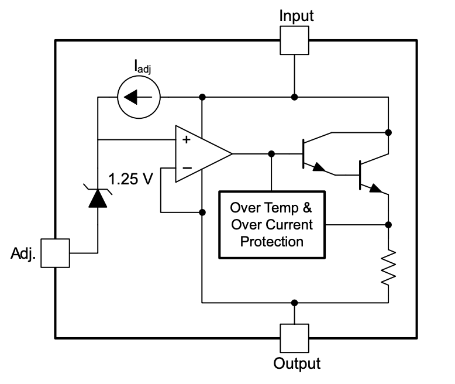
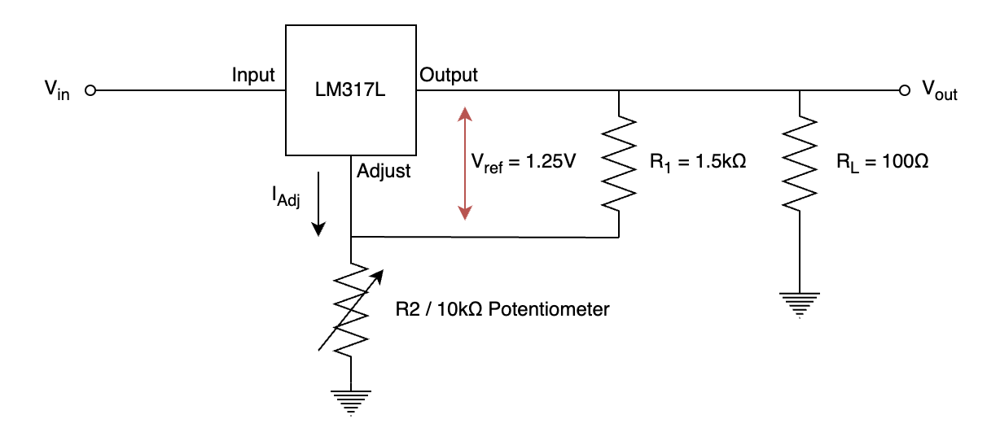
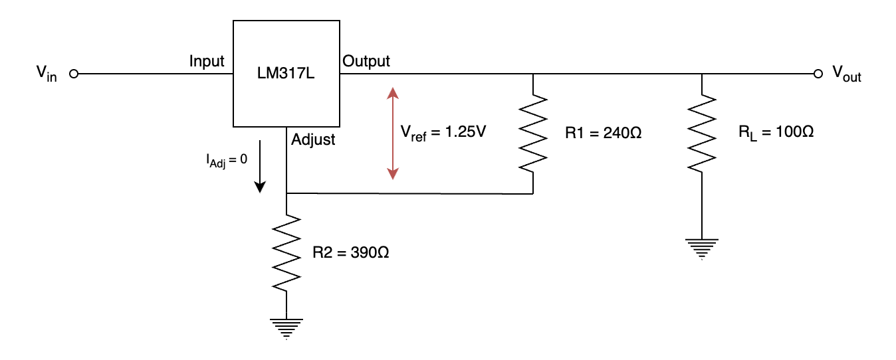

# Practical 4: Linear Voltage Regulators

In this practical you will learn how to use an LM317L adjustable voltage regulator, and how to configure its voltage output using a resistor and potentiometer. The overarching goal is to power your STM32 UCT development board from a battery via a 3.3V regulated voltage. 

{:.important}
> Please use the [feedback form](https://forms.office.com/r/bMUfettP7m) to give us feedback on this practical and to report broken/faulty equipment.

Table of Contents
=================

* [Background](#background)
* [What You Will Need](#what-you-will-need)
* [Question 1: LM317L governing equation](#question-1-lm317l-governing-equation)
* [Question 2: Efficiency](#question-2-efficiency)
* [Question 3: Battery Power!](#question-3-battery-power)
* [Question 4: Extension Question](#question-4-extension-question)
* [Demonstration](#demonstration)
* [Mark Scheme](#mark-scheme)
---

## Background

Voltage regulators are electrical devices designed to maintain a steady output voltage. Typically a voltage regulator will either have a fixed output (for example 3.3V or 5V) or be adjustable, but critically this regulated output is constant even if the input voltage varies. This makes regulators very useful for battery-powered applications, as over time the battery will discharge from some nominal voltage to a lower one, but the output of the regulator will remain the same!


_Figure 1: Typical use case for a voltage regulator._

Many voltage regulators exist with different operating principles, but in this practical we will work with an LM317L: an *adjustable*, *linear* voltage regulator.

The key properties of an LM317L are:
* It is *adjustable*: rather than having a fixed output, a resistor ratio between the ```output``` and ```adjust``` pins sets the voltage output according to a specific formula.
* It is *linear*: this refers to the mechanism of voltage regulation. Linear regulators produce a very clean and noise-free output, but are comparitively less efficient (lots of wasted heat!) compared to something like a switching regulator.

Internally, voltage regulators use some kind of feed-forward or negative feedback control loop to maintain their output despite input distubances. The functional block diagram for the LM317L in particular looks like this (for interest! This is not examined or used in the practical):


_Figure 2: Functional block diagram for an LM317L voltage regulator._

The goal of this prac is to implement the classic voltage regulator flow diagram shown in Figure 1. You will use an external dual 18650 Li-ion battery pack to power your UCT STM32 development board. The battery pack outputs a voltage of about ~9.5V which must be regulated to 3.3V to power your development board. Once you have an independently powered microcontroller (no laptops, no benchtop supply) the prac is complete!

## What you will need
To complete this practical you will require a breadboard and a pair of wire strippers. The following components will be provided to you on the **Monday when this practical is released**, if you are unable to collect components then please collect them during the week during the **optional tutorial sessions**:
- 1 x LM317L voltage regulator
- 1 x 10kΩ Potentiometer
- 1 x 1.5kΩ Resistor
- 1 x 100Ω Resistor
- 1 x UCT development board (bring your own)
- 1 x Dual 18650 Li-ion battery pack (will be supplied at the demonstration - not to be taken home)

## Question 1: LM317L governing equation
[The datasheet for the LM317L can be found here](https://www.ti.com/lit/ds/symlink/lm317l.pdf?ts=1742119920093). As the LM317L is an adjustable regulator, the output can be set using a resistor voltage divider with a potentiometer such as in the circuit below:


_Figure 3: Simple adjustable regulator circuit._

This circuit is based on **Figure 7-2** in the datasheet, with the accessory capacitors and protection diodes removed (they shouldn't be necessary for your use case). On the same page is **Section 7.2: Typical Application**. This contains the governing equation for the voltage regulators output (V<sub>O</sub>), so go find it!

### Question 1.1

Once you have found the governing equation, you can calculate your resistor values. Looking at the formula compared to the diagram above there might be some differences, but for your purposes:
* R<sub>1</sub> = 1.5kΩ
* R<sub>2</sub> = 10kΩ Potentiometer

With R<sub>1</sub> set to 1.5kΩ you must calculate what value your potentiometer must be set to to regulate your output voltage to **3.3V**. This should not be a terribly complex calculation! **But nonetheless please write your calculations on a sheet of paper you can submit.**

### Question 1.2

Build the circuit and set the potentiometer value to the value calculated in Question 1.1. You can supply the voltage regulator with any DC voltage between 3.3V - 40V, the output should be very close to 3.3V independent of the input! If the output is not 3.3V, carefully adjust the potentiometer until it outputs a correct voltage. If you do have to adjust the pot, measure the new value - what is it? Why do you think it does not equal the calculated value?

No matter if you have to adjust the circuit or not, if you measure a steady 3.3V output, you have successfully built the circuit. 

{:.important}
> **This setup forms part of the demonstration for Practical 2. Make sure your final circuit correctly outputs 3.3V so as to not damage your STM32 when you demonstrate.**

### Question 1.3

It is necessary to adjust the input voltage to 3.3V to avoid damaging the STM32, but most values in engineering are defined by a range. Looking at the STM32F0xx datasheet, available [here](https://google.com), what is the maximum allowable voltage able to be supplied to the VDD pin? What is the minimum voltage for the chip to still work? Which do you think would be more damaging if the range was exceeded?

## Question 2: Efficiency

While linear regulators are fast, cheap and produce relatively little noise, the biggest drawback is that they are not very efficient. This means that while they regulate the output voltage very well, a great deal of the power input to the system by the voltage source is dissipated as heat - not doing anything useful in the circuit! In this question you are going to analyze the efficiency of an LM317L in a typical use case taken from the datasheet.

The circuit below shows a different set of resistors that outputs a regulated ~3.3V. You may notice that the resistor values are quite low - this is per the datasheet, and ensures the regulator is always operational[^1]. Additionally, a 100Ω load is attached to the regulator output. The voltage regulator is powered by a 12V supply voltage (V<sub>in</sub> on the diagram).


_Figure 4: Hypothetical voltage regulator circuit._

{:.important}
> All the questions in Question 2 are to be submitted with your practical marksheet. They are calculation/text only.

### Question 2.1
Using the operating equation of the LM317L from the datasheet, and assuming I<sub>adj</sub> is 0A, calculate the output voltage of the LM317L, and the current through the load (R<sub>L</sub>) and adjustment resistors (R1 and R2).

### Question 2.2
Calculate the power delivered to the load resistor, and the power dissipated as heat elsewhere in the circuit. You should find the efficiency of the regulator using the following formula:

$$\eta = \frac{P_{load}}{P_{input}}$$

Where is the majority of the power being dissipated?

### Question 2.3
Management is not happy about the circuit above - the product is expected to be battery powered, and their customers want long battery life. With such a low efficiency, most of the power isn't doing anything useful! For this question, you must find a suitable replacement. The regulators output should 3.3V or 5V (either is fine, or an adjustable regulator that can be set to either option), but the efficiency must be greater than or equal 80%. You have a maximum budget of R50 for this part, or about $2.75.

You may make reasonable assumptions about the operating conditions, but your selection should be broadly compatible with the circuit above (12V input, 100Ω load). If a chosen part has variable pricing based on the number purchased, you can assume an order of 1000.

{:.note2}
> For this question, please write down the name of the part you have chosen, it's price to purchase one unit (including bulk discounts if you have any) and **have the datasheet open to where it shows the efficiency rating! You must show the tutor where this is on the sheet to get marks for this question.**

## Question 3: Battery Power!
If you are done Question 2, you can proceed to powering your STM32 with a battery (or a "battery" if you are not at the demonstration session yet). 

> ### Option 1: Working on the practical before the demonstration session.
> Set your DC power supply to approximately 9.8V, and connect it to the input to the voltage regulator you built in Question 1. You should see an output of 3.3V. If you do not, adjust your potentiometer until you get very close. When you are satisfied, connect the ground pin of your STM32 to the ground of your circuit, and the 3.3V pin to the regulated 3.3V output. You should see the status LEDS on the board light up, though the screen will remain dark as it is fed by 5V USB input that we are not powering. If this is working, your circuit is functioning as intended.

> ### Option 2: At the demonstration session and ready to go
> Put your hand up when you are ready and a tutor will give you a battery pack that can be attached to your breadboard. Plug in the batteries, and measure the output of your regulator. If you still see 3.3V, you should be able to attach it to your breadboard as before. At this point, as long as you have everything from Question 2 ready that you want to submit, you are ready to demonstrate! 

## Question 4: Extension Question
There is no extension question for Practical 4. Linear regulators are pretty simple!

## Demonstration

{:.caution}
> You only have two attempts to demonstrate your circuits (with an associated mark deduction on the second attempt), please familiarise yourself with both the [mark scheme](#mark-scheme) and the demonstration procedure before your first attempt to demonstrate your circuit.

{:.caution}
> Messing up your STM32 wires and plugging the 3.3V pin into a voltage higher than what it is rated for can damage or destroy your development board. [Be careful](https://en.wikipedia.org/wiki/Magic_smoke).

When you are ready to demonstrate your voltage regulator and have acquired a battery pack, you may call over a tutor so that you can begin your first attempt to demonstrate your circuit. On your mark sheet clearly write your **peoplesoft ID** as well as the **day’s date**. You are now ready to demonstrate your circuit using the following procedure, although you may do as much as possible in preparation:

1. Show the tutor your working for how you calculated the potentiometer value for the regulator circuit. 
2. Plug in the provided li-ion battery pack into the breadboard
3. Measure the output of the voltage regulator using a multimeter (this should be 3.3V).
4. Show the tutor your working for Question 2, including the datasheet for the selected component on your laptop screen.
5. Plug in your STM32 to the regulated output voltage.
6. The tutor must complete the marksheet and sign it at the bottom.
7. **Make sure your marksheet is scanned with your breadboard on it, and your other submissions are stapled to the back of your marksheet.**

{:.important}
> - If you start your demonstration during a practical session you **must** complete it in that session if you do not want to lose marks.
> - **Do not** leave the venue with your mark sheet or workings, they will not be accepted for late submission if you do so.

---

## Mark Scheme 

### Question 1
Has the governing equation for the LM317L been identified from the datasheet, and if so has the correct potentiometer resistance been calculated for a 3.3V output? Assume I<sub>Adj</sub> is negligible.

- [ ] Correct governing equation found (**+1 marks**)

↳ Correct potentiometer resistance calculated (**+1 marks**)

### Question 2
With a DC power supply or battery plugged in to the circuit, is the output voltage nearly equal to 3.3V? This value must be close to the desired V<sub>out</sub> to avoid damaging the microcontroller.
- [ ] LM317L voltage regulator output approximately equal to 3.3V (**+1 marks**)

### Question 3
For the calculations, the current through the load and the current through the adjustment resistors must be found. I<sub>Adj</sub> can be assumed to be zero. Using these current values, find the overall efficiency of the regulator circuit, comparing total power dissipated to power delivered to the load resistor. The component dissipating the majority of the wasted power as heat must also be identified.
- [ ] Correct load and adjustment resistor current (**+2 marks**)
    
↳ Efficiency value correct (**+2 marks**)
- [ ] Correctly identifies component responsible for most of the wasted power (**+1 marks**)

### Question 4
The replacement component for the LM317L needs to meet the following specifications:
* Efficiency > 80%
* Broadly compatible with the given circuit
* Price less than R50

Package shape and size is not relevant, and this should be marked generously. What is important is that a source can be given for the price (any website) and efficiency (datasheet).
- [ ] Reasonable replacement component found (**+2 marks**)

### Question 5
Can the final circuit be plugged into a battery pack for V supply, and power the STM32 through the regulated output? No cables should be attached to the setup from the workstation or any external power supply; the battery, circuit and STM32 should make an isolated unit.
- [ ] STM32 powered by external battery (**+2 marks**)

### Practical total: 12 marks (12 available)

[^1]: The reason for the low resistor values has to do with the confusingly named maximum minimum quiescent current. This is basically the minimum current that the regulator itself needs to supply such that it is always operational, and not just when a load is attached.
