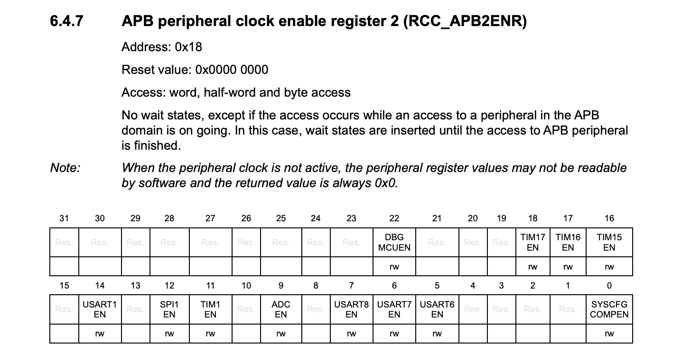

# Practical 5: STM32 Analog to Digital Converters (ADCs)

In this practical you will extend the STM32 programming you did in EEE2046S. It is helpful to have your old code available, as this practical will give *some* reintroduction but assumes you have a basic working knowledge of STM32 programming from the previous course. EEE2046S code may be a useful refresher and/or cheat sheet.

{:.important}
> Please use the [feedback form](https://forms.office.com/r/bMUfettP7m) to give us feedback on this practical and to report broken/faulty equipment.

{:.important}
> Please use the MEC4126F STM32 Programming Template for this and other C practicals. [You can download it here.](https://github.com/MechatronicSystems-Group/STM32-Programming-Template). You should write your code in `Core/Src/main.c`. 

Table of Contents
=================

* [Background](#background)
* [What You Will Need](#what-you-will-need)
* [Question 1: Single Shot ADC](#question-1-single-shot-adc)
* [Question 2: Using the ADC](#question-2-using-the-adc)
* [Question 3: Displaying Voltage Value](#question-3-displaying-voltage-value)
* [Demonstration](#demonstration)
* [Marking](#marking)

---

## Background
An analog to digital converter (ADC) is a device inside your STM32 that converts an **analog voltage signal** to a **discrete digital value**. What this means is that the ADC takes a signal that can have any continuous voltage (3.11, 4.45687, 5.01298, whatever) and converts it to an integer reading (100, 1940, 244, some other **positive integer value**). Imagine you have a dial that controls a voltage from 0 to 3.3 volts, and you want to measure the voltage using an ADC. Since computers can't read smooth, continuous voltages, the ADC "chops" the voltage range into a number of steps and assigns a number to each one. This is how it converts the voltage into digital form. In this example, the ADC would assign to 3.3V the **highest number you want to count to** and to 0V an ADC reading of 0.

The governing equation for an ADC does a good job describing how it works:

$$\text{ADC value} = \lfloor \frac{V_{in}}{V_{max}} \times (2^{n}-1) \rfloor$$

Where:
* $V_{in}$ is the input voltage
* $V_{max}$ is the ADC maximum voltage (3.3V for an STM32)
* $n$ is the **ADC resolution**, a value you set in firmware
* $\lfloor * \rfloor$ means rounding down to the next closest integer value

So say we have an input signal of 1.23V, the ADC max voltage is 3.3V and the resolution is 10 bits. That would results in a value of...

$$ \text{ADC value} = \lfloor \frac{1.23}{3.3} \times (2^{10}-1) \rfloor = 381 $$

That value is about a third of $2^{10}$, which should make sense as $V_{in}$ was about a third of $V_{max}$.

The challenge with ADCs is how many registers need to be set to configure them correctly. STM32 has a **lot** of different ways to configure ADCs to operate (consulting the reference manual should make this obvious). For this practical we are going to focus on **single-shot** readings. 

In this configuration, the code effectively does the following:
1. Asks the ADC to start making an analog-to-digital conversion.
2. Waits for the ADC to finish convering the value.
3. Reads the final integer value of the converted analog voltage. 

You could then convert the (int) reading in code to a (float) voltage value by multiplying by the inverse of the above formula. This is not usually necessary, as it is easier to work with the raw ADC value.

## What you will need
Thankfully, as we are now working on C programming, all you need is...
- 1 x UCT STM32 development board
- [STM32 F0xx Reference Manual](https://www.st.com/resource/en/reference_manual/rm0091-stm32f0x1stm32f0x2stm32f0x8-advanced-armbased-32bit-mcus-stmicroelectronics.pdf)

## Question 1: Single-shot ADC
As mentioned above the biggest challenge in this practical is all the required configuration options to run the ADC on the STM32. You need to (in no particular order):
* Enable the timer that controls the ADC
* Enable the timer that controls the pins the ADC is sampling
* Select which channel the ADC samples (this also controls the physical pin)
* Configure relevant pin to be in analog mode
* Set continuous conversions to FALSE
* Set discontinuous conversions to TRUE

You will also need to write a function that actually samples the ADC. This is obviously a lot, but the following questions should guide you through the process.

For the following questions, you should create and populate a function called `init_ADC`. Remember to define it at the beginning of your code!

E.g.
```
void init_ADC(void);

# main loop, other stuff

void init_ADC(void) {
    // Populate during Q1
}
```

### **Question 1.1**
To start with, let's turn the ADC on. Enabling the ADC requires setting the correct bit in an RCC (Reset and Clock Control) register called the APB2ENR (APB peripheral clock enable register 2). But what bit? At this point you should consult the **[STM32 F0xx Reference Manual](https://www.st.com/resource/en/reference_manual/rm0091-stm32f0x1stm32f0x2stm32f0x8-advanced-armbased-32bit-mcus-stmicroelectronics.pdf)**.

{:.important}
> **Guide to using the STM32 reference manual.**
>
> The STM32 reference manual is intimidating, and at about 17MB and over 1000 pages it is worth saving a local copy from the link above. However, what makes it maneagable is that it is laid out very well. You just need some practice in how to use it. Let's have a look at the problem from Q1.1.
>
> You have been given a hint that the APB2ENR for RCC controls the ADC. To find particular information on this register, or any other register, just look at the contents page for the manual. These are pages 2 to 31. However, most PDF viewers can access the built-in contents menu. For example on Chrome, just click on these two buttons to quickly scroll through a collapsable version.
>
> 
>
> Once you have the contents, it is fairly easy to open RCC, then scroll down to "RCC registers", and find APB2ENR.
>
> 
>
> Now looking at the register in question we can see that ADCEN is bit 9, and the definition on Page 124 says that it must be set by software (i.e. your code) and that it enables or disables the ADC interface clock. This is a bit of a trivial example, but this can be much less obvious when there are multiple options for a given config parameter! 
>
> 
>
> 
>
> This process of finding the relevant register, and the bits inside it that need to be set, is the core focus of the STM32 section. Consulting the lecture slides can also help, but be careful to understand what you are doing and why you are doing it.

Okay so know we know we need to write to `ADCEN` in the `APB2ENR` register for `RCC` to enable the ADC. How do we do that? You could set the bit manually using bitwise operations:

```
RCC -> APB2ENR |= 0b100000000 // Enable ADCEN using bitmask - do not use just "="!

// some code

RCC -> APB2ENR &= ~0b100000000 // Disable ADCEN using bitmask
```

This is inconvenient however, as it is unclear what you are doing at a glance and difficult to troubleshoot. Now that we know that we need to write to ADCEN, we can use the bitmasks in the **STM32 header file**. Look at the code below:

```
#define STM32F051
#include "stm32f0xx.h"

RCC -> APB2ENR |= RCC_APB2ENR_ADCEN // Enable ADCEN using STM32 bitmask

// some code

RCC -> APB2ENR &= ~RCC_APB2ENR_ADCEN // Disable ADCEN using STM32 bitmask
```	 

That is a lot better! The code above is all that is needed to enable the ADC peripheral clock. You do not need to disable it, but you should include the code to enable the ADC clock in your `ADC_init` function.

### **Question 1.2**
Next we need to configure the ADC itself. Your STM32 board only has one ADC so in the code it is referred to as `ADC1`. The register we are interested in is `CFGR1` (ADC configuration register 1). You can find a description of this register using the reference manual and the method above, however look under '13 Analog-to-digital converter (ADC)' instead of '6 Reset and clock control (RCC)'. What we are looking to do here is set the ADC to discontinuous mode, and disable continuous mode.

Have a look through the register. What bit(s) are used to set continuous mode? What bit(s) are used to set discontinuous mode? Can you predict what the STM32 bitmasks will be for setting these bits?

Once you are content with an answer, see if you can modify the code below. Use the STM32 bitmasks as shown to keep your code readable.
```
void init_ADC(void) {
    RCC -> APB2ENR |= RCC_APB2ENR # Enable ADC

    ADC1 -> CFGR1 &= ~ADC_CFGR1_[replace me] // Disable CONTinuous mode (hint hint)
    ADC1 -> CFGR1 |= ADC_CFGR1_[replace me] // Enable discontinuous mode 
}
```

Hopefully the pattern is getting a bit clearer here! The bit mask for a given function is always:

```
PERIPHERAL -> REGISTER |= PERIPHERAL_REGISTER_BITNAME
or
PERIPHERAL -> REGISTER &= ~PERIPHERAL_REGISTER_BITNAME (to clear a bit)
```

Where bitname is literally the name of the bits from the table describing the register.

### **Question 1.3**
The other option to set in the `CFGR1` register is the ADC resolution. This is how many discrete values the ADC will divide its operating range by, and how accurate your reading will be! The tradeoff is that the higher the resolution, the slower the ADC reading. The value to set for this in `CFGR1` is `RES`. This is slightly more complex however, as there are four options!


Obviously the exact same approach as in Q1.2 will not work, however using intellisense to see what the options are...


The pattern here is important to know. For a parameter with 2 bits of input there are four options: 00, 01, 10, 11. The three masks shown by intellisense can be used to set any of these four options, and the names are not random. The pattern is as follows:

| Value wanted: | Mask to use:    | Code to set:                    | Explanation                                                                                                                |
|---------------|-----------------|---------------------------------|----------------------------------------------------------------------------------------------------------------------------|
| 00            | ADC_CFGR1_RES   | ADC1->CFGR1 &= ~ADC_CFGR1_RES   | ADC_CFGR1_RES bitmask sets both bits to 1. This code resets both bits to 00.                                                |
| 11            | ADC_CFGR1_RES   | ADC1->CFGR1 \|= ADC_CFGR1_RES   | ADC_CFGR1_RES bitmask sets both bits to 1. This code sets both bits to 11.                                                |
| 01            | ADC_CFGR1_RES_0 | ADC1->CFGR1 \|= ADC_CFGR1_RES_0 | ADC_CFGR1_RES_0 bitmask sets the **right** bit to 1. This code sets the left bit to 1, corresponding to a value of 01. |
| 10            | ADC_CFGR1_RES_1 | ADC1->CFGR1 \|= ADC_CFGR1_RES_1 | ADC_CFGR1_RES_1 bitmask sets the **left** bit to 1. This code sets the right bit to 1, corresponding to a value of 10. |

{:.important}
> This pattern is consistent for other registers with multiple options. You should be able to extrapolate this table to other registers! 

Using the 2 images and the table above, add code to your `ADC_init` function that sets the ADC resolution to 8 bits.

### **Question 1.4**

The last thing to do before the ADC is setup and ready for conversions is to configure the GPIO pin that the ADC is going to sample **from**. Rather than explicitly describing what steps to take, for this question you will be given some goals, and you will need to use the ideas and patterns shown in Questions 1.1 to 1.3 to configure this correctly.

The pin we are going to sample from is GPIOA PA5 *(as in pin 5 from the GPIOA pins)*. This pin is connected to the potentiometer on the development board. To set it up you need to do the following:
1. Enable the clock to GPIOA using `RCC->AHBENR |= RCC_AHBENR_GPIOAEN` (this one is given as it breaks the convention a little bit and is called something else in the manual).
2. Set the mode of PA5 to analog using `GPIOA->MODER` and the relevant bitmask. Hint! This also has four options like CFGR1_RES from Q1.3 - look at the options in the manual!
3. Enable channel 5 using the ADC register `CHSELR` and selecting `CHSEL5` - this is the channel connected to PA5.

You should be able write the relevant code yourself. Remember to look at the registers in the reference manual to see what you need to set to enable the clock or change the pin mode. If you are stuck, you can also refer to the lecture slides for example code for ADC use.

{:.note2}
>The 'channel' referred to in point 3 is basically which pin the ADC samples from. One ADC can take readings from multiple channels/pins, so we need to tell it which one to look at. 

{:.note2}
> If you would like to save yourself some searching, the relevant page numbers for the registers you need are:
> * `RCC->AHBENR`     → Pg. 121
> * `GPIO->MODER`     → Pg. 158
> * `ADC1->CHSELR`    → Pg. 273

### **Question 1.5**
This isn't really a question, just closing statements on ADC initialization. Once the above is all configured your code should look something like this:
```
void init_ADC(void) {

    # Comment describing what the function does

    RCC->AHBENR |= * Turn on clock to GPIOA *
    GPIOA->MODER |= * Set PA5 to analog mode * 

    RCC->APB2ENR |= * Enable clock to ADC *
    ADC1->CHSELR |= * Select channel 5 *
    ADC1->CFGR1 |= * Set resolution to 8 bits *

    ADC1->CFGR1 &= ~ * Set NOT continuous mode *
    ADC1->CFGR1 |= * Set discontinuous mode *
}
```

The last thing to add are the following lines. These are commented with explanations, and can just be copied into your function.

```
ADC1->CR |= ADC_CR_ADEN; // Set ADEN=1 in ADC_CR register, actually starts ADC
while((ADC1 -> ISR & ADC_ISR_ADRDY) == 0); // Wait for ADC to be ready to start converting
```

## Question 2: Using the ADC
This question should hopefully be shorter, and is mostly to confirm that your code is working as intended. As we have put the ADC into single-shot mode, we need to tell it to start a conversion, and then access the finished result from the data register.

The important commands you need to know are the following:
```
ADC1->CR |= ADC_CR_ADSTART; // Start a conversion

// Wait for ADC to finish converting
while((ADC1->ISR & ADC_ISR_EOC) == 0);

datatype val = ADC1->DR; // Access finished conversion from the data register
```

### **Question 2.1**
The deliverable for this question is a function called `ADC_read()`. It needs to function as follows:
* The function needs to be explicitly defined at the beginning of your code.
* It must start an ADC conversion when called.
* It must return the converted ADC value, which must be stored in a global variable called `ADC_val`.
* The datatype used to store the ADC value should use the least required space (hint: look at the ADC `RES` set in the previous question).

You will use this to start a conversion and return a value on every iteration of the `while(1) {...}` loop in yout `main(void) {...}` function. 

To help see if everything is working, some code is provided here. All this does is display an integer value on the LCD of the STM32 when called. You may need to cast the ADC value to int when calling the function - check your notes or Google on how to do this. Make sure you run `init_LCD()` before trying to use the ADC.

```
void display_on_LCD(int ADC_val) {
    char buffer[4];
    sprintf(buffer, "%04d", ADC_val);
    lcd_putstring(buffer);
}
```

For this question you should run `ADC_read()` on every iteration of the main loop, save the result to a variable (it can be local or global) and then display the value on your LCD. If you turn the potentiometer connected to PA5, you should see the value changing.

### **Question 2.2**
Experiment with changing the `RES` parameter of the ADC. How does this affect the number displayed on the screen? Can you predict for a given ADC resolution what the maximum value will be?

## Question 3: Displaying Voltage Value
This question is a little more challenging, and less direct guidance is provided. For this question, you are going to display the actual measured voltage from the potentiometer on the LCD. To do this you will need to add a couple features to the code.

### **Question 3.1**
Your code currently measures an interger ADC value, specifically: $$0 \leq \text{ADC value} \leq (2^{n}-1)$$ 

This must be mapped to a new variable called `voltage_val` which has the datatype `float`. This `voltage_val` variable must have a minimum value of 0, and maximum value equal to the actual maximum voltage output from the potentiometer. To find this voltage, if you can't guess what it might be, you can use a multimeter to measure the voltage on PA5 on your development board as you turn the potentiometer. 

### **Question 3.2**
Once you are calculating the mapped voltage value, you can now modify the `display_on_LCD` function to display the voltage on the **second line** of the LCD, along with its unit. To do this, modify the `display_on_LCD` function above to implement this behaviour. To find out how to move the LCD to the second line, and return it to the first (as the raw ADC value must also be displayed) open the `/Core/Src/lcd_stm32f0.c` file and read the comments at the top. They explain the more advanced commands to use the LCD.

The `char buffer[]` and `sprintf()` code for the second line will also need to be modified. You will need to use the notes and your Google skills to figure out how to do this. Of particular interest is the string of characters `"%04d"` in the original code - what is this actually doing? You should limit the output to 2 decimal places, and append `V` to the end of the display.

Ideally, your STM32 display should look something like this:


{:.note2}
> On embedded hardware, `sprintf()` does not work with `float` values. You will need to think of a workaround using only decimal values to display a float! How this is implemented is up to you... but it is doable.

## Demonstration

{:.important}
> Unlike the circuit practicals, this practical will not be marked purely by demonstration. You still need to demonstrate that your code is functional on the STM32 development board, and show it to a tutor, but you must also upload your code to the **linked Gradescope assignment**. This is so your code can be submitted to ECSA along with your other submissions for the course as part of their review requirements.
>
> [You can find the Gradescope assignment here. Please upload only your `main.c` file for this practical.](https://www.gradescope.com/courses/1018254) If you upload anything besides your `main.c` file (although you can rename it if you want) your mark will be capped at 50%.
>
> You must upload your code to Gradescope **before** you demonstrate to a tutor. Your first demonstration is your only demonstration.

The demonstration for this practical is simple. When your code is functional, please upload it to the Gradescope assignment. Once that is done call a tutor who will ask you to show your code and explain certain parts - you will not be told in advance what will be asked, so please understand what you have written! You will also need to show the ADC values displayed on the LCD and how they change when the potentiometer is adjusted. Marks will not be awarded if you cannot explain what your code is doing. What you need to show the tutor:

0. **Upload the code to the *MEC4126F Practical 5* assignment on Gradescope**. It is linked at the beginning of the [Demonstration](#demonstration) section. 
1. Show the tutor your `init_ADC()` function, and explain what the code is doing (e.g. GPIOA setup, channel selection, resolution).
2. Show the tutor your `ADC_read()` function, and explain the process of starting and retrieving a single ADC sample.
3. Turn the potentiometer and show the live reading from the ADC updating on the screen.
4. Turn the potentiometer and show the live reading of the converted **voltage** value updating on the screen.
5. The tutor may ask you to explain anything else about your code - please make sure you understand what the code is doing at every step.

## Mark Scheme

### Question 1
Has the student correctly written the `init_ADC()` function? To do so, the following should all be true:
- [ ] ADC clock enabled via RCC (**+1 marks**)
- [ ] Channel 5 selected for ADC (**+1 marks**)
- [ ] Discontinuous mode enabled and continuous mode disabled (**+1 marks**)
- [ ] Resolution correctly configured (**+1 marks**)
- [ ] GPIOA clock enabled and PA5 set to analog mode (**+1 marks**)

### Question 2
Has the student implemented the `read_ADC()` function, and does the code display the read value onto the LCD?
- [ ] `ADC_read()` function correctly implemented using start - wait - return protocol (**+1 marks**)
- [ ] ADC value displayed on LCD and updates as potentiometer is turned (**+1 marks**)

### Question 3
Is the mapping from ADC value to voltage correct, maxing out at max possible reading, and is the display formatting correct with a decimal point and unit?
- [ ] Correct scaling from ADC value to voltage using linear mapping (**+1 marks**)
- [ ] Voltage displayed on second line of LCD with two decimal places and units (**+1 marks**)

### Understanding and Explanation
- [ ] Student can explain their code and any register configuration options asked by the tutor (**+1 marks**)
