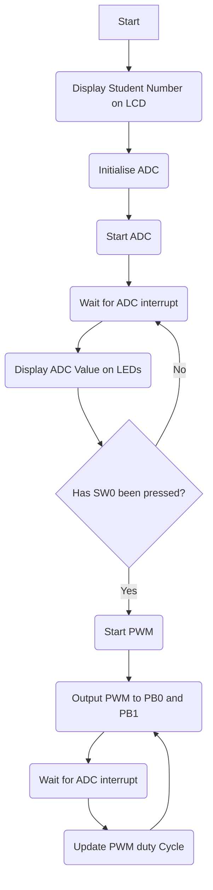

# Practical 6: Pulse Width Modulation (PWM)

In this practical we will extend your STM32 experience with the content you have learnt since the last practical and will test your ability to use the STM32FO51C6's ADC and general purpose timers. This practical will also show you how to use Git as a version control software. Some practical content will be unfamiliar to you if you are reading this practical page when it was released, this content will be presented in lectures later during this week.

This practical will also prepare you to write the C code needed to control a basic servomotor that you will design over the last two practicals. This practical is extensive as it covers some of the content missed due to the public holidays.

{:.important}
> Please use the [feedback form](https://forms.office.com/r/bMUfettP7m) to give us feedback on this practical and to report broken/faulty equipment.

Table of Contents
=================

* [Using Git and GitHub in This Practical](#using-git-and-github-in-this-practical)
   * [Installing Git](#installing-git)
      * [Windows](#windows)
      * [MacOS](#macos)
      * [Debian/Ubuntu](#debianubuntu)
   * [Create a GitHub Account](#create-a-github-account)
   * [Install GitHub CLI or Desktop](#install-github-cli-or-desktop)
   * [Creating A Local Repository](#creating-a-local-repository)
   * [Initial Commit](#initial-commit)
   * [Creating and Synchronising with A GitHub Remote Repository](#creating-and-synchronising-with-a-github-remote-repository)
   * [The Usual Git Workflow](#the-usual-git-workflow)
   * [Symbolic Linking](#symbolic-linking)
      * [Windows](#windows-1)
      * [MacOS](#macos-1)
      * [Linux](#linux)
   * [Submitting to Gradescope](#submitting-to-gradescope)
* [Programming Questions](#programming-questions)
   * [Question 1: Display Your Student Number on The LCD Display](#question-1-display-your-student-number-on-the-lcd-display)
   * [Question 2: Initialise ADC](#question-2-initialise-adc)
   * [Question 3: ADC Value on LEDs](#question-3-adc-value-on-leds)
   * [Question 4: Test if SW0 has Been Pressed](#question-4-test-if-sw0-has-been-pressed)
   * [Question 5: If SW0 has Been Pressed](#question-5-if-sw0-has-been-pressed)
* [Written Questions](#written-questions)
   * [Question 1: ADCs](#question-1-adcs)
   * [Question 2: Calibration](#question-2-calibration)
   * [Question 3: Memory](#question-3-memory)
   * [Question 4: Priority](#question-4-priority)
   * [Question 5: Timing](#question-5-timing)
   * [Question 6: Memory Part 2](#question-6-memory-part-2)
* [Demonstration and Submission](#demonstration-and-submission)
* [Marksheet](#marksheet)

## Using Git and GitHub in This Practical

{:.important}
> ***Read the following guide before you start this practical.*** If you have used Git and GitHub before, you can skip ahead to [Creating A Local Repository](#creating-a-local-repository) to see the repository and file naming convention, followed by [Symbolic Linking](#symbolic-linking) and finally [Submitting to Gradescope](#submitting-to-gradescope).

Git is a powerful, open-source, distributed version control system that tracks the version history of files. It is considered a de facto standard version control system in many institutions. It was originally written in 2005 by Linus Torvalds. Since Git is a distributed version control system, the entire repository is maintained on a local computer and all version tracking occurs on the same local computer. Git also allows for the synchronising of the local repository with a remote repository to allow developers to work collaboratively - this is where GitHub comes in.

GitHub is a proprietary developer platform that allows programmers to store and manage their code, and uses Git for distributed version control. It should not to be confused with Git - it is just a cloud storage solution for Git, and not the app itself. GitHub allows users to track bugs, provide access, manage tasks, create feature requests and create wikis for a project.

This practical will use Git and GitHub to introduce you to version control and to manage your submissions to Gradescope.

{:.note2}
> There are several softwares that can be used to manage a Git repository and each software has their own flavour of operation (see [the official git website](https://git-scm.com/downloads/guis) for a list of GUI clients). For simplicity, the following guide will use git and the GitHub Command Line Interface (CLI) commands to show basic usage of Git and how to set up a remote repository. You can also use GitHub desktop if you prefer, though this GUI adds a level of abstraction to the Git workflow.

{:.note2}
> If the text above seems complicated, here is a more basic explanation: 
> * Git is like a save system for your code — it lets you track changes, go back to old versions, and work on different features without messing things up.
> * GitHub is a website where you can store your Git projects online and collaborate with others.
> That’s it! Git = version control. GitHub = online hosting + teamwork.

### Installing Git
Use the following guide to install Git if you do not have it already:

#### Windows
The standalone Windows 64-bit executable can be downloaded [here](https://GitHub.com/git-for-windows/git/releases/download/v2.49.0.windows.1/Git-2.49.0-64-bit.exe), the 32-bit executable can be downloaded [here](https://GitHub.com/git-for-windows/git/releases/download/v2.48.1.windows.1/Git-2.48.1-32-bit.exe). Download the executable and run it as an administrator to install Git.

#### MacOS
Git can be installed on MacOS by using homebrew:
```
$ brew install git
```
or with MacPorts:
```
$ sudo port install git
```

#### Debian/Ubuntu
Git can be installed on a Debian or Ubuntu OS using apt:
```bash
$ sudo apt-get install git
```

### Create a GitHub Account
Use your student email address to create a [GitHub account](https://GitHub.com/), follow the instructions provided by GitHub and verify your email address.

### Install GitHub CLI or Desktop
GitHub offers two methods to manage your remote repository on your local machine. The first is the [GitHub Desktop Application](https://desktop.GitHub.com/download/), which is a GUI application that is best suited for Windows and Mac. The second method is the [GitHub CLI](https://cli.GitHub.com/), which is a command line application that allows you to manage your remote repositories and workflows.

This practical will make use of the CLI to demonstrate the command line usage of Git (the GUI hides Git commands with a layer of abstraction). Follow the [installation instructions](https://GitHub.com/cli/cli#installation) provided by GitHub for your OS (hint: for Windows, use `winget` or download the MSI file). Once you have installed the CLI, you will need to authenticate your device with GitHub. To complete this run the following command to start an interactive session to authenticate your device:

```bash
$ gh auth login
```

(This is a much better way of logging in than the alternative: *personal access tokens* are a mess)

### Creating A Local Repository
With the above complete, you can create a local repository on your computer. In a location of your choice, create a directory with the name `SMTJHN001_MEC4126F_Practical_6` (change SMTJHN001 to your student number). The following directory tree shows the repository setup:

```
SMTJHN001_MEC4126F_Practical_6
        ├── .git                       # Hidden directory used by Git
        ├── SMTJHN001_main.c           # Your main.c file used for this practical
        └── SMTJHN001_answers.asciidoc # Your answers for written questions
```

You can download the template for `SMTJHN001_main.c` from the [IES website repository](./Resources/Prac6.c) and the template for `SMTJHN001_answers.asciidoc` from the [IES website repository](./Resources/Prac6.asciidoc). Once you have downloaded the templates and renamed them, you can tell git to make that directory a Git repository by running `git init` (***make sure that your current working directory is ../SMTJHN001_MEC4126F_Practical_6/***). In summary, you should complete the following:

* Make a new directory called `SMTJHN001_MEC4126F_Practical_6`
* Download the `Prac6.c` file and the `Prac6.asciidoc` template from [here](./Resources/Prac6.c) and [here](./Resources/Prac6.asciidoc) and rename them with the given file convention.
* Initialize a new git repository in your directory using `git init`.

An example of how to do this in the Linux terminal is shown below (similar commands can be used in Windows Powershell).

```bash
$ mkdir ./SMTJHN001_MEC4126F_Practical_6 # make the directory
$ cd ./SMTJHN001_MEC4126F_Practical_6 # change your working directory
$ git init # start git
$ wget https://GitHub.com/MechatronicSystems-Group/STM32-Programming-Template/blob/main/Core/Src/main.c # download main.c template to your repository
$ mv prac6.c SMTJHN001_main.c # rename main.c
$ wget https://GitHub.com/MechatronicSystems-Group/STM32-Programming-Template/blob/main/Core/Src/main.c # download prac6.asciidoc template to your repository
$ mv prac6.asciidoc SMTJHN001_answers.asciidoc # rename prac7.asciidoc 
```

## Initial Commit
With git initialised and the two template files copied into the local repository, we can now commit these changes to the local repository. You can think of this like saving a version of the folder you just created. This version can then be reverted to later if you made a mistake somewhere! To see the status of the local repository you can run `git status`:

```bash
$ git status
On branch master

No commits yet

Untracked files:
  (use "git add <file>..." to include in what will be committed)
        SMTJHN001_answers.asciidoc
        SMTJHN001_main.c

nothing added to commit but untracked files present (use "git add" to track)
```
From `git status` we can see that both repository files are not being tracked by git. Since we see that there are only two files that need to be tracked (i.e. no unwanted files to be tracked) we can tell git to track all the files within the local repository with `git add --all`. This will stage all files in the local repository to be committed to the local repository. If you run `git status` you should have the following output:

```bash
$ git status
On branch master

No commits yet

Changes to be committed:
  (use "git rm --cached <file>..." to unstage)
        new file:   SMTJHN001_answers.asciidoc
        new file:   SMTJHN001_main.c

```

This means git is ready to save the files into a new isolated version (committed). The two local files can now be committed to the local repository with `git commit`, an example is as follows:

```bash
$ git commit -m "Initial Commit" 
[master (root-commit) 3bb2f03] Initial Commit
 2 files changed, 2005 insertions(+)
 create mode 100644 SMTJHN001_answers.asciidoc
 create mode 100644 SMTJHN001_main.c
```

If you now run `git status`, you should have an output like:

```bash
$ git status
On branch master
nothing to commit, working tree clean
```

This means that everything is saved, and you have made no changes since the last commit. In summary, when you want to commit changes to a file to the local repository, use the following recipe:

```bash
$ git status # check for untracked changes
$ git add --all # command git to track untracked files
$ git commit -m "Descriptive message" # commit changes to your local repository with a message describing what you changed
```

### Creating and Synchronising with A GitHub Remote Repository
A remote repository can now be created on GitHub. This will be a copy of your repository stored online, so you could work on your code on multiple computers, or share it with a colleague (however do not share your MEC4126F code with your friends). To do this we will use the GitHub CLI command `gh repo create`. This will launch an interactive CLI session that will help you create your remote repository, follow the onscreen prompts to create the remote repository. An example is as follows:

```bash
$ gh repo create
? What would you like to do? Push an existing local repository to GitHub
? Path to local repository .
? Repository name SMTJHN001_MEC4126F_Practical_6
? Repository owner TDR-Thomahawk
? Description "Practical 6"
? Visibility Private
✓ Created repository TDR-Thomahawk/SMTJHN001_MEC4126F_Practical_6 on GitHub
  https://GitHub.com/TDR-Thomahawk/SMTJHN001_MEC4126F_Practical_6
? Add a remote? Yes
? What should the new remote be called? origin
✓ Added remote https://GitHub.com/TDR-Thomahawk/SMTJHN001_MEC4126F_Practical_6.git
? Would you like to push commits from the current branch to "origin"? Yes
Enumerating objects: 4, done.
Counting objects: 100% (4/4), done.
Delta compression using up to 12 threads
Compressing objects: 100% (3/3), done.
Writing objects: 100% (4/4), 44.15 KiB | 8.83 MiB/s, done.
Total 4 (delta 0), reused 0 (delta 0), pack-reused 0
To https://GitHub.com/TDR-Thomahawk/SMTJHN001_MEC4126F_Practical_6.git
 * [new branch]      HEAD -> master
branch 'master' set up to track 'origin/master'.
✓ Pushed commits to https://GitHub.com/TDR-Thomahawk/SMTJHN001_MEC4126F_Practical_6.git
```
A remote repository now exists on GitHub. To synchronise your local repository to the remote repository use `git push origin` and to synchronise your remote repository to your local repository you use `git pull origin`.

### The Usual Git Workflow
To summarize, the Git and GitHub workflow to save a version of your code that you want to stash online is as follows:

```bash
$ git add --all
$ git commit -m "Your unique message"
$ git push origin
```
You can also pull from the remote repository with:

```bash
$ git pull origin
```

You may also need to run `git fetch` before `git pull` if you have made changes on a different computer.

### Symbolic Linking
You may have noticed that we have not placed the git repository inside the C practical template. This was done to ensure that you don't accidentally push all the files within the practical template to your repository. We want the repository to contain **only** the `main.c` and `answer.asciidoc` files.

This causes a problem: we want the same file being in two locations at the same time - in your repository, and ALSO in the practical template so you can compile your code. 

To solve this issue we will use what is known as a symbolic link. A symbolic link is a string of text stored in a file that is interpreted by the OS as a path to another file (the target). We can use this to link the source code (`SMTJHN001_main.c`) to the file used by the STM32 Programming Template (`./Core/Src/main.c`). This operation depends on the OS you are using.

{:.note2}
> Usually, if the symbolic link does not work with the following recipes it is usually due to the fact that you have specified file paths that are not absolute, i.e. the file path does not start from the absolute start of your hard drive.

#### Windows
Windows offers support for symbolic links from Windows 10. To create a symbolic link you will need to run the ***Command Prompt*** command `mklink` (which has the syntax `mklink <link> <target>`) as an ***administrator***. Assuming that `SMTJHN001_MEC4126F_Practical_6` is our current working directory, the symbolic link command will look something like:
```bash
$ mklink ..\STM32-Programming-Template\Core\Src\main.c \SMTJHN001_main.c
```
Before linking make sure that the file `..\STM32-Programming-Template\Core\Src\main.c` does not exist. The two dots `..` should describe the absolute path to the programming template, for example: `C:\Users\dylan\Documents\STM32-Programming-Template\Core\Src\main.c`.

#### MacOS
The MacOS command to create a symbolic link is the same the Linux command, the symbolic link command will look like:
```bash
$ ln -s ~/SMTJHN001_MEC4126F_Practical_6/SMTJHN001_main.c ~/STM32-Programming-Template/Core/Src/main.c
```
Before linking make sure that the file `../STM32-Programming-Template/Core/Src/main.c` does not exist.

#### Linux
In Linux the standard command to symbolic link two files is `ln -s <path to the file/folder to be linked> <the path of the link to be created>`. The symbolic link command will look something like:
```bash
$ ln -s ~/SMTJHN001_MEC4126F_Practical_6/SMTJHN001_main.c ~/STM32-Programming-Template/Core/Src/main.c
```
Before linking make sure that the file `../STM32-Programming-Template/Core/Src/main.c` does not exist.

### Submitting to Gradescope
Use the following recipe to submit your code from GitHub to Gradescope:
1. Log in to Gradescope.
2. From your Dashboard, open the programming assignment. The **Submit** option will appear. 
3. Select GitHub as your Submission Method.
4. Link your GitHub account with Gradescope:
    1. Authorize Gradescope as a third party app in your GitHub account.
    2. Choose the Repository and Branch.
5. Select upload.

## Programming Questions
This practical will require you to convert the voltage of the pin `PA6` to an 8 bit integer and display this number on the LEDs connected to pins `PB0` to `PB7`, if the switch `SW0` has not been pressed. If the switch `SW0` has been pressed, then the converted value of the voltage of pin `PA6` will be used to control the duty cycle of a PWM signal outputted on pins `PB0` and `PB1`. The following questions will guide you in the creation of the C code needed to achieve the above and the desired operation of the STM32 dev board can be seen in the [attached video](https://uctcloud.sharepoint.com/:v:/s/MEC4126F2025/EV-0tcJIgkhCtDuaLEm4iNUBiqBjCglurMzg6VAKX6ZAFA?e=SmKiqy&nav=eyJyZWZlcnJhbEluZm8iOnsicmVmZXJyYWxBcHAiOiJTdHJlYW1XZWJBcHAiLCJyZWZlcnJhbFZpZXciOiJTaGFyZURpYWxvZy1MaW5rIiwicmVmZXJyYWxBcHBQbGF0Zm9ybSI6IldlYiIsInJlZmVycmFsTW9kZSI6InZpZXcifX0%3D) ***(Errata: The video states that the switch SW0 is PA1, it should state that the switch SW0 is PA0)***. The following flow chart summarises the requirements for this practical:

Each question is scored on tasks that are required to complete the question, see the [Marksheet](#marksheet) for further details of the grading of this practical. The mark scheme is intentionally vague: rather than giving a blow-by-blow for each question, you have to decide yourself what steps are necessary!

{:.caution}
> - Make sure that you use the [template file](./Resources/Prac6.c) to answer these questions. Failure to do so may result in the deduction of points and will make answering these questions more difficult.
> - Ensure that ***at least*** your student number is located within the file.

### Question 1: Display Your Student Number on The LCD Display
After starting your STM32 dev board, display your student number on the LCD display with the function `void init_student(void)`. Your student number should stay on the LCD screen for the entire operation of your code.

*Points available = 1.*

### Question 2: Initialise ADC
Initialise your ADC so that it has the following configuration:
- Convert values from the `PA6` Potentiometer
- 8 bit conversion
- Wait Mode
- Left Aligned
- Interrupt on end of conversion (EOC)

Place the code needed to initialise the ADC and GPIO in the function `void init_ADC(void)`, make sure that you enable the ADC interrupt function on the NVIC here as well.

*Points available = 8, with an additional 1.5 bonus marks available.*

### Question 3: ADC Value on LEDs
When an ADC EOC interrupt is raised, read the value of the data register and adjust the data as necessary such that the bit representation of the converted value can be displayed on the LEDs `PB0` to `PB7`. You will need to initialise `GPIOB` with a function `void init_GPIOB(void)`. Make sure that the function `void init_GPIOB(void)` only contains the code necessary for this question. The reading and displaying of the converted value must occur in the interrupt handler function, i.e. `void ADC1_COMP_IRQHandler(void)`.

*Points available = 3, with an additional 1.5 bonus marks available.*

### Question 4: Test if SW0 has Been Pressed
Each time `void ADC1_COMP_IRQHandler(void)` is called, test whether the button `SW0` has been pressed. If `SW0` has been pressed, change the value of the global variable `SW0_PRESSED` from its initial value of `False` to `True` (do not use `stdbool.h`, rather use `#define` to replace `True` with `1` and `False` with`0`). 

The button should only ever be pressed once in each invocation of your program. This means that once `SW0_PRESSED` has been set to `True` it should never set to `False` again, i.e. it has been latched. Use the function `void init_GPIOA(void)` to initialise `GPIOA` for this task and `void ADC1_COMP_IRQHandler(void)` to test whether the button has been pressed.

*Points available = 3, with an additional 0.5 bonus marks available.*

### Question 5: If SW0 has Been Pressed
If `SW0_PRESSED` is True, then clear the `ODR` of GPIOB and set the mode GPIO pins from `PB7` to `PB2` to their reset state. Then call the function `void init_TIM3(void)` to setup and start the general purpose timer 3 to output a 10 kHz anti-phase PWM signal on `PB0` and `PB1` (i.e. when `PB0` is high, `PB1` is low). The duty cycle of the PWM signal will be set by the current converted ADC value, i.e. the value 255 relates to a 100% duty cycle and the value 0 relates to a 0% duty cycle.

Make sure that you still use `void ADC1_COMP_IRQHandler(void)` to update the PWM duty cycle with the current position of the potentiometer.

*Points available = 13.*

## Written Questions
Answer the following questions in the `SMTJHN001_answers.asciidoc` file. Some of this is not covered in the notes or lectures - read the programming manual or use Google to find good answers! 

### Question 1: ADCs
What type of ADC does the STM32F051x6 have? How does it operate, i.e. how does it convert an integer value from an analog voltage?

*Maximum Score = 3*

### Question 2: Calibration
Write down two lines of code that are used to calibrate the ADC?

*Maximum Score = 2*

### Question 3: Memory
What is the endianness of a word stored in the memory of an STM32F0x1 microcontroller? What does this mean?

*Maximum Score = 2*

### Question 4: Priority
The NVIC has priorities for all the possible interrupts on the SMT32Fx1. Which of the following has the greater priority: `EXTI0_1` or `TIM_2`?

*Maximum Score = 1*

### Question 5: Timing
What is a racing condition and why are they undesirable?

*Maximum Score = 2*

### Question 6: Memory Part 2 
What is DMA and why is it useful?

*Maximum Score = 1*

## Demonstration and Submission

{:.caution}
> By demonstrating and submitting this practical you agree that:
> -  You know that plagiarism is a serious form of academic dishonesty.
> -  You have read the document about avoiding plagiarism, are familiar with its contents and have avoided all forms of plagiarism mentioned there.
> - Where you have used the words of others, you have indicated this by the use of quotation marks.
> - You have referenced all quotations and other ideas borrowed from others.
> - You have not and shall not allow others to plagiarise your work.

Before your demonstration, upload your answers to Gradescope using the guide provided in the section title [Submitting to Gradescope](#submitting-to-gradescope).

{:.caution}
> - The time at which you demonstrate will be the time taken for submission. If you do not demonstrate before ***17:00 on Monday (05/05/2025)***, your mark will be capped to 50% as dictated by the course outline.
> - No demonstration will result in no mark.

When you are ready to demonstrate, call over tutor. You will then be asked to run ***your C code*** on a UCT STM32 Dev board. The tutor will then assign a demonstration mark as described by the [marksheet](#marksheet). The tutor will then ask a series of questions based on your submitted C code and ask to see your Git commit history on Github.

## Marksheet
This practical has a maximum mark of 44 and has 3.5 bonus marks up for grabs. The marks for each question can be seen in the question. This scheme is intentionally vague: rather than giving a blow-by-blow for each question, you have to decide yourself what steps are necessary!

As for demonstrating, the following marks are up for grabs:
- [ ] The ADC Value is displayed on LEDs(**+1 marks**)
- [ ] The code does test and latch if SW0 is pressed(**+1 marks**)
- [ ] There is an anti-phase PWM output on PB0 and PB1 (**+1 marks**)
- [ ] Student showed git history on GitHub(**+1 marks**)

During your demonstration, your tutor will ask you a series of questions about your submitted code. For each wrong answer you give or you can not explain what a line means a mark will be deducted from your score.
