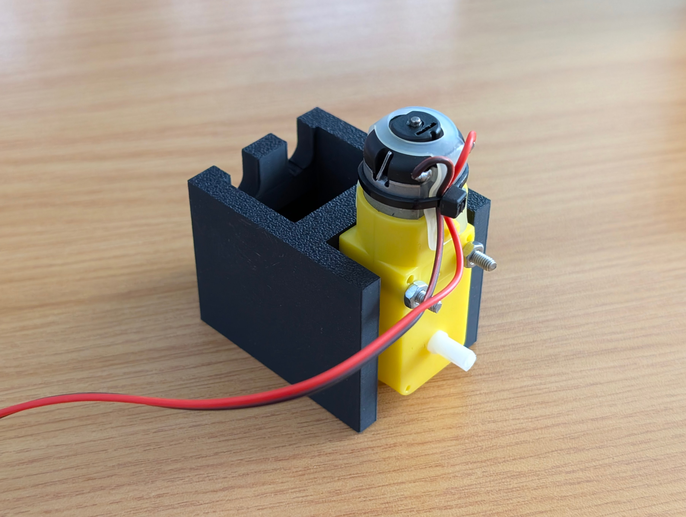

# Practical 7: Servomotor Control

In this practical we will use the knowledge you have gained from the previous practicals to build and control a servomotor from constituent parts. You will use a brushed DC motor and a feedback potentiometer as the elements of the servomotor. These will need to be driven with a appropriate H-Bridge and level adjusting circuitry. A position command signal will be generated using an onboard potentiometer from your UCT STM32 dev board. You will also be required to implement an already designed PI controller to control the position of the servomotor.

This practical is extensive and will require you to complete a number of tasks, building several circuits and writing a significant amount of code. Accordingly, this practical will run over the course of two weeks. During the first in-lab session you will be given a motor rig which contains the brushed DC motor coupled to a feedback potentiometer. This will need to be returned once you are ready to demonstrate your circuit during the second week.

{:.important}
> Please use the [feedback form](https://forms.office.com/r/bMUfettP7m) to give us feedback on this practical and to report broken/faulty equipment.

{:.important}
> For this assessment, you are not permitted to submit code that has been generated by an AI language model.

Table of Contents
=================

* [The block diagram](#the-block-diagram)
* [The motor rig](#the-motor-rig)
* [Interface electronics](#interface-electronics)
* [Programming the STM32](#programming-the-stm32)
* [Submitting to Gradescope](#submitting-to-gradescope)
* [Marksheet](#marksheet)

## The block diagram

The hardware setup for this practical is shown in the following hardware block diagram:

This figure shows the main components of the system:

* The STM32 microcontroller
* The comparator-based level-shifting circuit
* The H-Bridge
* The brushed DC motor
* The feedback potentiometer
* The position command potentiometer

The brushed DC motor is driven by the H-Bridge circuit which is controlled by the STM32 microcontroller and level shifting circuitry. The position command signal is generated using the position command potentiometer. The feedback potentiometer is used to feedback the position of the motor to the STM32 microcontroller. This diagram also shows the power supply levels required for the various components in the system, and the number of and type of connections required between the components.

The STM32 microcontroller will be programmed using the standard STM32 programming template, and will need to perform the tasks shown in the diagram below:

At a functional level, during the operation of the system, the STM32 needs to:

* Calculate the error between the position command signal and the feedback signal.
* Perform the PI control calculation.
* Output a control signal used to drive the H-Bridge and the motor.

## The motor rig

Each person will be given a motor rig during the first practical session. This rig is shown in the following figures:

## Interface electronics

The interface electronics for this system should be designed to meet the following requirements:

* The STM32 microcontroller will generate a single PWM signal to drive the motor on PB4.
* The PWM signal should be converted into two anti-phase PWM signals to drive the H-Bridge and be of a voltage level compatible with the H-Bridge.
* A maximum voltage of 7 V may be applied across the motor terminals. This should be generated by the H-Bridge circuit which must take the form of an emmitter-follower type H-Bridge.
* The feedback potentiometer is connected to PA5. (Ensure that the potentiometer is appropriately labelled on your circuit diagram.)
* The position command potentiometer is connected to PA6. (Ensure that the potentiometer is appropriately labelled on your circuit diagram. Check the schemati for the UCT board if necessary.)

> #### **Question 1 [6 marks]**
> Draw a circuit diagram, based on the block diagram and the requirements above, of the interface electronics for the motor rig. Ensure that your circuit diagram includes all the components needed to build the drive electronics and that the circuit is compatible with the STM32 microcontroller. Ensure all supply voltages are appropriate for the components and functional requirements.

> #### **Question 2 [3 marks]**
> Using a table populated with parameters measured from your circuitry, demonstrate that your comparator-based level-shifting circuit works correctly.

> #### **Question 3 [3 marks]**
> Using a table populated with parameters measured from your circuitry, demonstrate that your H-Bridge circuit works correctly.

## Programming the STM32

Using this [template file](https://github.com/MechatronicSystems-Group/Integrated-Embedded-Systems/blob/main/practicals/practical_7/Resources/main.c), write the code needed to implement the measurement and control of the motor rig. Your code should implement the following functionality and be tracked in a git repository hosted on GitHub:

* Initialise the ADC to read the position command potentiometer on PA6 and feedback signal on PA5. The resolution of the ADC should be chosen such that a precision of 1 degree is achieved.
* Initialise the appropriate timer to generate a PWM signal to drive the motor from PB4. This signal should have a frequency of 20 kHz and an appropriate initial duty cycle. The configuration of the timer should be such that the result of the ADC conversions are matched in scale to the duty cycle control of the PWM signal.
* Implement a PI controller to control the motor. The controller should take the form of an ideal PI controller with the following form:

   $$
   \frac{O(s)}{E(s)} = K_p \left(\frac{s+I}{s}\right)
   $$

   where $K_p$ is the proportional gain and $I$ is the integral time constant. When converted to a discrete time domain implementation, the controller becomes:

   $$
   \frac{O(z)}{E(z)} = K_p \left(\frac{(2+IT_s)z + (IT_s-2)}{2z - 2}\right)
   $$

   where $T_s$ is the sample time of the controller. Ensure that the controller is executed at a frequency of 1 kHz. Further, set `K_p = 50` and `I = 1`. Implement the controller as a difference equation in a function called `PI_control()`. You will need to choose an appropriate architecture for this function in terms of arguments and return values.

   If you are certain that your code and circuit work correctly but your system is unstable, you can try to tune the controller parameters to improve the system performance by lowering the proportional gain and/or the integral gain.

> #### **Question 4 [14 marks]**
> Plan and describe your code structure to implement the requirements above using a flowchart.

> #### **Question 5 [6 marks]**
> What effects do the proportional and integral gains have on the system? What effect does the sample time have on the system?

> #### **Question 6 [10 marks]**
> If your system is now operational and stable, commit your code with a commit message, "Q4 implemented". 
>
> a) Now, using the LM358 datasheet, and introducing a new specification that the signal level change time on the drive signals of the H-Bridge must be less than 1% of the period of the PWM signal, determine the maximum frequency of the PWM signal that can be used. Calculate a new PSC value to implement this. Ensure you state the signal level change time and the period and frequency of the PWM signal in your answer.
>
> b) Update your program to implement this new specification and commit your code with a commit message, "Q5 implemented" once complete. What do you observe about the system performance? Measure the signal level change time and the period and frequency of the PWM signal in your answer. Do they match the calculated values?

## Demonstration and Submission

{:.caution}
> By demonstrating and submitting this practical you agree that:
> - You know that plagiarism is a serious form of academic dishonesty.
> - You have read the document about avoiding plagiarism, are familiar with its contents and have avoided all forms of plagiarism mentioned there.
> - Where you have used the words of others, you have indicated this by the use of quotation marks.
> - You have referenced all quotations and other ideas borrowed from others.
> - You have not and shall not allow others to plagiarise your work.
> - You have not used an AI language model to generate the code submitted.

{:.important}
> Before your demonstration, upload your code and answers to Gradescope. Your answers to the **six** questions above should be contained within a single PDF file added to the route directory of your GitHub repository. 

### Submitting to Gradescope

Use the following recipe to submit your code from GitHub to Gradescope:
1. Log in to Gradescope.
2. From your Dashboard, open the programming assignment. The **Submit** option will appear. 
3. Select GitHub as your Submission Method.
4. Link your GitHub account with Gradescope:
    1. Authorize Gradescope as a third party app in your GitHub account.
    2. Choose the Repository and Branch.
5. Select upload.

{:.caution}
> - Make sure that you use the code template file provided.
> - Ensure that ***at least*** your student number is located within the file.

{:.caution}
> - The time at which you demonstrate will be the time taken for submission. If you do not demonstrate before ***17:00 on Tuesday (20/05/2025)***, you will receive no mark due to the extension that was granted.
> - No demonstration will result in no mark.

When you are ready to demonstrate, call over tutor. You will then be asked to run ***your C code*** on a UCT STM32 Dev board. The tutor will then assign a demonstration mark as described by the [marksheet](#marksheet). The tutor will then ask a series of questions based on your submitted C code and ask to see your Git commit history on Github.

## Marksheet
This practical has a maximum of 51 marks available. The marks for each question can be seen in the question. This scheme is intentionally vague: rather than giving a blow-by-blow for each question, you have to decide yourself what steps are necessary!

As for demonstrating, the following marks are up for grabs:
- [ ] That the comparator circuit works correctly [**3 marks**]
- [ ] That the H-Bridge circuit works correctly [**3 marks**]
- [ ] That the PI controller works correctly [**3 marks**]

During your demonstration, your tutor will ask you a series of questions about your submitted code. For each wrong answer you give or you can not explain what a line means a mark will be deducted from your score.
